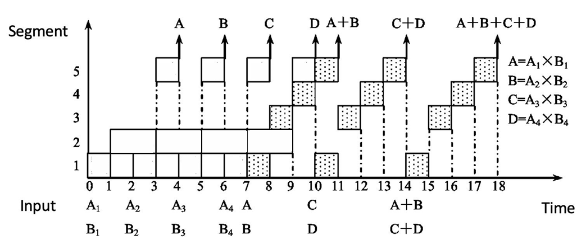
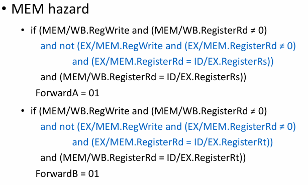

## Intro

### 评分

平时分 60% + 考试分 40%

平时分 = 实验分(80) + 课程分(20-30) <= 100

课程分包括小测，问题，讨论

```txt
Lab = Lab1 (3weeks, 15pt)
    + Lab2 (3weeks, 15pt)
    + Lab3 (1weeks, 5pt)
    + Lab4 (2weeks, 10pt)
    + Lab5 (2weeks, 10pt)
    + Lab6 (5weeks, 25pt)
```

## 量化设计和分析基础

### 计算机的分类

5 个主流计算机类别为：

#### 个人移动设备 PMD

一类带多媒体用户界面的无线设备，如手机、平板电脑。它的成本低，缺少冷却风扇，限制了总功耗。能耗和尺寸要求则决定了使用闪存而非磁盘来存储。

PMD 上的应用往往是多媒体应用程序(基于 Web，面向媒体)。响应性能和可预测性能是多媒体应用程序的关键特性。

> **实时性能需求**指应用程序的一个程序段有确定的最大执行时间。
>
> PWD 应用程序还需要将存储器占用减到最少，因此存储器优化非常重要。

#### 桌面计算机

经典的台式机等。系统性能主要以计算性能和图形性能来衡量。

> Web 应用越来越多，为性能评估带来了新的挑战(众所周知，我们的桌面计算机是浏览器存放器)

#### 服务器

提供更大规模、更可靠的文件和计算服务。

- 对于服务器，**可用性**至关重要。服务器的宕机往往造成很大损失。
- 服务器系统经常需要拓展，因此可拓展性也很重要。
- 整体性能毫无疑问是最重要的，服务器需要有很强的吞吐能力。

#### 集群/仓库级计算机

集群即一组桌面计算机/服务器通过局域网连接，像一个更大型的计算机工作，每个节点运行自己的操作系统，节点之间通过网络协议通信。

最大规模的集群被称为仓库级计算机 WSC。

它们往往非常昂贵，且看重性价比、功效、可用性。

#### 嵌入式计算机

嵌入式计算机无法运行第三方软件，它们只需要执行特定任务，主要目标是以最低价格满足性能需要。

### 并行度和并行体系结构的分类

应用程序的并行：

- 数据级并行 DLP：同时操作多个数据项
- 任务级并行 TLP：用并行方式执行多个工作任务

计算机硬件的并行：

- 指令级并行，如处理器操作流水线化
- 向量体系结构和图形处理器 GPU 将单条指令并行应用于一个数据集，以开发数据级并行
- 线程级并行，基于多核，大任务分解成多个线程同时运行
- 请求级并行，常出现在服务器/分布式系统中，指同时处理多个独立请求

根据多处理器的并行级别，计算机被分成 4 类：

1. 单指令流、单数据流 SISD：单处理器，可以使用指令级并行
2. 单指令流、多数据流 SIMD：多处理器，允许数据级并行
3. ~~多指令流、单数据流 MISD：一般没有这种计算机。~~
4. 多指令流、多数据流 MIMD：每个处理器提取自己的指令，操作自己的数据，针对任务级并行，允许线程级并行。

许多并行处理器是 SISD、SIMD 和 MIMD 的混合类型。

### 计算机体系结构的定义

计算机体系结构涵盖了计算机设计的所有三个方面：

1. 指令集体系结构
2. 组成或微体系结构
3. 硬件

## 流水线 pipeline

### What is pipelining

流水线体现在将指令拆分成各个阶段 stage/segment，然后尽可能利用硬件资源，将不同阶段的各个指令执行**并行化**。它没有减小单条指令的执行时间，但是缩短了整段程序的执行时间。

> 英汉词典：一条指令还在执行时，下一条指令已经开始执行。
>
> 阶段的数量被称为流水线的深度(the depth of pipelining)

在单核处理器的时期，流水线大大加快了多条指令的执行速度。

如果每个阶段的指令执行时间不相同，就会因为需要等待执行时间较长的阶段结束而浪费硬件资源。

当然，流水线也不是只有好处。它会使处理逻辑复杂化，并且需要更多的硬件资源。

### 流水线的分类

根据并行阶段的数量，流水线被分成

- Single funtion pipelining(单阶段并行)
- Multi function pipelining(多阶段并行)。

根据并行的灵活性，流水线被分为

- 静态流水线 Static pipelining: 只有输入的一系列任务都是相同操作时，才能并行执行。否则，等待当前任务执行完成，然后再执行另一种任务。
- 动态流水线 Dynamic pipelining: 可以并行执行不同操作的任务。


根据硬件级别。流水线被分为

- 组件级流水线 Component level pipelining：将处理器中的算术与逻辑运算部件划分为多个部分，这样便可以通过流水线方式执行多种类型的操作。

- 处理器级流水线 Processor level pipelining：通过流水线实现指令的译码与执行。指令的执行过程被分解为多个子过程，每个子过程在独立的功能单元中执行。

- 处理器间流水线 Inter processor pipelining：将两个或多个处理器串联起来，共同处理相同的数据流，每个处理器完成整体任务中的一部分。

根据是否存在反馈回路 feedback loop，流水线被分为

- 线性流水线 Linear pipelining：流水线中的每个分段都是串行连接且无反馈回路，当数据经过流水线的各个分段时，每个分段最多只处理一次数据。
- 非线性流水线 Nonlinear pipelining：在串行连接的基础上，还存在反馈回路。


根据输入和输出的顺序，流水线被分为

- 有序流水线 Ordered pipelining：任务的输入顺序和输出顺序相同。
- 无序流水线 Disordered pipelining：任务的输入顺序和输出顺序可以不同，如最后一个任务不是最后一个完成。

根据数据类型的不同，处理器(?)有如下分类

- 标量处理器 Scalar processor：只通过流水线处理标量数据。
- 向量处理器 Vector processor：具备向量数据表示和处理向量指令能力的处理器，是向量数据表示与流水线技术的结合。

### 流水线的性能评估

#### 吞吐量 Throughput/TP

$$
TP=\frac{n(\text{指令数})}{T_k(\text{总执行时间})}<TP_{\text{max}}=\frac{1}{\Delta t_0(\text{单阶段最长耗时})}
$$

实际情况中
$$
T_k=(m(\text{单指令阶段数})+n-1)\Delta t_0
$$

最长的阶段被称为瓶颈阶段 bottleneck segemnt。它决定 $\Delta t_0$，从而影响吞吐量。

常见的解决瓶颈的方法有

- 分段 Subdivision：把瓶颈阶段再划分成多个更小的子阶段。
- 重复 Repetition：用多个相同功能的处理单元并行处理瓶颈阶段。

> 流水线阶段过多并不好，那会让我们需要考虑更多的前后依赖关系，Control logic 也会很多，过高并发处理上也不是很方便。
>
> 另外，为了保证流水线的正常进行，每个阶段之间要有一个锁存器，这些锁存器也是多阶段的代价。


上图使用了重复的方法，利用三个 $S_2$ 阶段的处理单元并行处理 $S_2$。

#### 提速比例 Speedup/Sp

$$
Sp=\frac{nm\Delta t_0(\text{单周期执行时间})}{(m+n-1)\Delta t_0(\text{流水线执行时间})}=\frac{nm}{m+n-1}<m
$$

#### 效率 Efficiency/η

$$
\eta = \frac{nm\Delta t_0}{m(m+n-1)\Delta t_0}<1
$$

上下两项可以看成单周期和流水线的空间与时间乘积。

#### 案例

静态流水线
> 
>
> 由于使用静态流水线，我们可以把执行大致分成三块：
>
> 1. $a_1b_1,a_2b_2,a_3b_3,a_4b_4$
> 2. $a_1b_1+a_2b_2,a_3b_3+a_4b_4$
> 3. $(a_1b_1+a_2b_2)+(a_3b_3+a_4b_4)$
>
> 
>
> 于是有
> $$
> \begin{align*}
>     TP&=\frac{7}{[(3-1+4)+(4-1+2)+4]\Delta t_0}=\frac{7}{15}\\
>     Sp&=\frac{4\times 3+3\times 4}{15}=1.6\\
>     \eta&=\frac{4\times 3+3\times 4}{5\times 15}=32\%
> \end{align*}
> $$
动态流水线
> 
>
> 这题较为复杂，我们要考虑加法在什么时候可以插入乘法计算中。
>
> 
>
> 在 $a_1b_1,a_2b_2$ 计算完成时，就可以考虑插入 $a_1b_1+a_2b_2$ 了。考虑到乘法之间本来就因为阶段二用时更长的原因需要停顿一次，就插到两个除法中间。
>
> 于是有
> $$
> \begin{align*}
>     TP&=\frac{7}{18\Delta t_0}\\
>     Sp&=\frac{4\times 7}{18}\approx 1.56\\
>     \eta&=\frac{4\times 7}{5\times 18}\approx 31\%
> \end{align*}
> $$

### 竞争 Hazard

在流水线中，可能出现一些情形，使得下一个指令难以继续执行，这些情形就叫做竞争。

#### 结构竞争 structure hazard

对应的资源正在使用。比如说，在一个指令和数据存储不分离的结构下，load/store 指令需要访问 memory，此时如果你想要执行 IF，就会发现 memory 已经被占用，无法执行下去。因此，流水线的数据通路需要指令与数据存储分离。


#### 数据竞争 Data hazard

新的指令需要的数据依赖先前的指令完成数据读写。

对于 R 型指令，数据竞争被分为三种：

- Read after write/RAW：前一条指令写，后一条指令读。如果读的时候写未完成，则发生错误。
- Write after read/WAR：前一条指令读，后一条指令写。如果还没读就写好了，就发生错误。
- Write after write/WAW：前一条指令写，后一条指令也写，如果后一条指令先写好了，就发生错误。

解决这些竞争的经典方法是前传 Forwarding/Bypassing。当计算结束时，不要等待它被重新存储回寄存器，而是通过在数据通路上建立额外的连接，把它传递给需要使用它的指令。

load 指令也会引发数据冲突。在 MEM 阶段，数据从 data memory 中取出。如果下一条指令需要读取这个数据，那么单单的前传是不够的。我们需要再加一个 bubble 周期，才能保证数据被成功传输。

通过组织代码的执行顺序，可以尽可能避免上述冲突的发生。


#### 控制竞争 Control hazard

需要依据上一条指令的结果来判断接下来执行什么指令。

对于控制竞争，我们有分支预测的方法：

- 静态分支预测 Static branch prediction：采用固定的策略对所有分支进行预测，比如“永远不跳”（predict not taken）、“永远跳转”（predict taken）或者基于编译器提供的提示进行预测。由于不依赖运行时信息，其实现简单，但在某些情况下预测精度较低。
- 动态分支预测 Dynamic branch prediction：通过硬件记录分支历史信息，在运行时动态调整预测策略。常见的方法如记录分支历史并预测保持历史趋势。动态预测机制能够根据程序的实际执行情况不断自我优化，通常比静态预测具有更高的准确率。

### 数据竞争的检测

1. `EX/MEM` 或 `MEM/WB` 中的目标寄存器与 `ID/EX` 中的源寄存器相同
2. `EX/MEM` 或 `MEM/WB` 中的 `RegWrite` 为 `1`
3. `EX/MEM` 或 `MEM/WB` 中的目标寄存器不为 `x0`
4. 当 `EX/MEM` 与 `MEM/WB` 的数据都需要前传时，优先前传 `EX/MEM` 中的数据。




对于 Load-Use 竞争的情形，则检测

1. `ID/EX` 中的 `MemRead` 为 `1`
2. `ID/EX` 的目标寄存器和 `IF/ID` 的某个源寄存器相同

如果检测到了，则阻塞 stall 流水线。

阻塞方法为：

1. **清零控制信号**
   把处于 `ID/EX` 阶段的控制信号全部清零，使该阶段执行一个 “nop”（无操作指令），从而防止错误的数据传递到后续的 EX、MEM 和 WB 阶段。

2. **冻结 PC 和 IF/ID 寄存器**
   阻止程序计数器 (PC) 和 `IF/ID` 的更新，即暂停 IF 和 ID 阶段，让当前指令在这两个阶段停留，从而插入一个 stall 周期，等待前方数据就绪后再恢复流水线运行。

还有几种冲突，这里不细讲：

- load 完后，使用 load 出来的数据参与计算 store 地址，这类似于 load-use，需要一个 stall
- load 完后，把 load 出来的数据 store 回去，这时是把 `MEM/WB` 的数据前传给 `EX/MEM`，不需要 stall
- store 完后 load 刚存的数据(~~真的有人这么干吗~~)，也是把 `MEM/WB` 的数据前传给 `EX/MEM`，不需要 stall

### 控制竞争的处理

为了减小控制竞争带来的性能下降，我们额外添加硬件，使得判断是否跳转的操作放在 ID 阶段执行。这样，我们可以把 bubble 的数量减小到 1.

> 由于把判断放到了 ID 阶段，在 branch 前的 R 型指令带来的冲突需要一个 bubble，load 则需要两个 bubble。


当然，我们还有预测策略。

一种简单的想法是，在跳转指令之后，继续执行预测分支。如果预测失败了，就丢弃错误分支中已经加载的指令，重新加载正确分支的指令，再消耗一个周期。这个时间也就是所谓的 branch penalty。

延迟分支设计 Delayed Branching 则是一种流水线优化技术，它通过将无论是否跳转都要执行的指令放到跳转指令后的方式，减少因等待分支决策产生的空闲时间。

对于深度更高、支持向量数据的流水线， branch penalty 更高了，这时降低预测失败率的需求更高，于是使用动态预测。

一种常见的思路是用预测器 predictor 记录上次跳转历史，预测结果保持历史趋势。


有时，一次预测失败就修改预测可能不够稳定，于是可以引入状态机的思路，当连续多次预测失败时，才修改预测。一个需要连续两次预测失败才修改预测的方案如下：


预测器即使预测成功，也需要一个周期的时间来计算目标地址。为了更快实现重复的跳转，可以使用一种用于加速分支指令处理的专用高速缓存，即 Branch-target buffer（BTB）：

1. **储存分支信息**
   BTB 保存分支指令的地址和对应的目标地址。当一个分支指令第一次被执行时，其目标地址会被记录在 BTB 中。

2. **提前预测分支目标**
   当 CPU 在取指阶段（IF）遇到可能的分支指令时，会查找当前指令地址是否存在于 BTB 中。如果存在，BTB 会提供预测的分支目标地址，CPU 就可以直接从这个地址开始取指，从而减少等待分支判断的延迟（branch penalty）。

3. **更新和校正**
   当分支指令执行时（在执行或写回阶段），处理器会确认实际的分支决策。如果预测正确，则 BTB 保持不变；如果预测错误，BTB 条目将被更新为正确的分支目标地址，以便下一次能准确地预测。

4. **与分支历史协同**
   BTB 经常与分支历史表（BHT）、饱和计数器等动态预测机制协同工作，从而在同时预测分支是否采取和预测目标地址两个方面提升分支预测的准确率。

现代的取指单元则同时集成了取指功能和分支预测功能。

### 非线性流水线的调度

在非线性流水线中，我们不能简单地以每一个周期都取一条新的指令来处理。由于存在同一资源的再次使用，如果不合理调度，就会发生结构冲突。

具体怎么做，让我们看一个实例。

我们把对非线性流水线做一个抽象，左侧的 $k$ 表示功能单元，上方的 $n$ 表示单条指令执行时经历的时钟周期，√ 则表示该功能单元在这个时钟周期被占用。


对于每个单元，我们都可以做分析：

- $k=1$：如果下一个指令在 $8$ 个周期后执行，则引发冲突
- $k=2$：如果下一个指令在 $1,5,6$ 个周期后执行，则引发冲突
- $k=3$：不会引发冲突
- $k=4$：如果下一个指令在 $1$ 个周期后执行，则引发冲突
- $k=5$：如果下一个指令在 $1$ 个周期后执行，则引发冲突

综上，我们可以用一个八位向量 $10110001$ 来表示冲突的情况，每一位表示一个周期，如果该位为 $1$，则说明当下一个指令在该周期后执行时，可能引发冲突。这个向量就叫做**冲突向量**吧。

另外，每当前进了 $m$ 个周期，就可以将向量右移 $m$ 位，因为前几位代表的周期已经过去了。

那么，现在我们可以对 $m=2,3,4,7$ 来进一步分析。我们以 $m=2$ 为例：

新的指令对应的冲突向量为 $10110001$，老的指令们对应的冲突向量为 $00101100$，只要对它们按位取或，就能得到现在所有指令对应的冲突向量，即 $10111101$。

现在，我们可以使用的 $m=2,7$，不妨再取一次 $m=2$，则有：
$$
\begin{align*}
    10111101 \gg 2&=00101111\\
    00101111 | 10110001 &=10111111
\end{align*}
$$

现在可以的选择只有 $m=7$ 了：
$$
\begin{align*}
    10111111\gg 7&=00000001\\
    00000001 | 10110001 &= 10110001
\end{align*}
$$

此时，冲突向量又变回了 $10110001$，这说明我们获得了一个循环 $2-2-7$。那么，这就是一个调度方案。

不难看出，对于一开始的 $m=2,3,4,7$，我们都可以以类似的方法计算下去，尝试求得一个循环。当循环出现，就说明有了一个可行的调度方案。

由于冲突向量的变化只与它的值和 $m$ 的取值有关，我们可以构造出一个状态图


图上全部的回路，也就是全部的调度方案。


## 存储结构 Memory Hierarchy

### Introduction


这是我们熟知的存储结构。我们的目标，其实就是让用户享受到 Cache 的速度和 Storage 的容量。

这门课主要关注缓存 Cache。

> Cache：小而快的存储，用于提升对存储的平均访问速度。在计算机体系结构中，几乎所有层次都是另一个层次的 cache。

- Cache 是离 CPU 最近的地方
- Cache 的访问单元是 block
- Cache 拥有时间局部性 Temporal locality 和空间局部性 Spatial locality。

### 技术潮流

由于 CPU 的发展远快于 Memory，我们需要 Cache 来平衡。

不同类型的计算机关注存储的不同指标。

- 对于桌面电脑，更注意延迟 latency
- 对于服务器，更关注带宽 bandwidth
- 对于嵌入式计算机，更关注功率和电池寿命

> 缓存未命中所需时间取决于：
>
> - **延迟**：获得数据块中第一个字（word）所需的时间。
> - **带宽**：获得该数据块其余部分所需的时间。

### 缓存设计的四大问题

四大问题基本都在计算机组成课中学习过，这里只做简单回顾。

- **Block placement**: 怎么在缓存里放主存里的数据？
  - 完全相联、组相联、直接映射

>相连度越高，cache 空间的利用率越高，块冲突率越低。大多数缓存的相连度 $n\le 4$。

- **Block identification**: 怎么在缓存里找数据？
  - 使用标签/块标记

> Index 决定第几组 set，tag 决定是组内的哪一个块。全相联就没有 index，因为它的组就是一整个缓存
> 
>
> 

- **Block replacement**: 怎么通过缓存替换主存里的数据？
  - 随机、最近最少使用（LRU）、先进先出（FIFO）

> - 随机替换 Random replacement：硬件实现容易
> - 最近最少使用 LRU：假设更近使用的块更可能被再次使用。它的实现需要在缓存中添加额外的位来记录块的使用情况。一种实现方法是维护一个允许任意位置删除操作的栈(如双向链表)。
>   - 如果访问块不存在于栈中，且缓存未满，就压栈；
>   - 如果访问块不存在于栈中，且缓存已满，先删除栈底，然后压栈；
>   - 如果访问块已存在于栈中，就先把块从栈中删除，然后再压栈。
>
>   另一种实现方法是，我们只是为每一对块使用一个触发器(共 $C_n^2$ 个)，利用触发器的状态展示两个块中谁更近被访问。然后，我们就可以通过逻辑表达式综合所有的触发器，确定哪一个块是最后被访问的。
>
> - 先进先出 FIFO：替换最先进入缓存的块
>
> 对于 LRU，提升缓存块数量总能提升命中率。

- **Write strategy**: 怎么通过缓存向下一级存储写数据？
  - 写回 Write Back 或写穿 Write Through

- 写穿策略：数据被写到主存。仅需要 valid bit。
- 写回策略：数据被写到缓存，不写到主存。只有当这个数据要从缓存中移除时，把它写到主存。需要 valid bit 和 dirty bit。

在写穿策略中，可能出现 write stall，即 CPU 需要等待写穿完成的时间。为了缓解这个现象，写穿策略中会使用 write buffer，数据先被写到这个缓冲区，然后通过缓冲区写到主存。

对于写回策略，如果出现了对同一块数据进行多次写的操作，那么它们都会在缓存而非主存进行，这有效减小了主存的带宽消耗。

对于写失效 write miss，也有两种策略

- 写分配 write allocate(常用于写回策略)：先把数据块载入到缓存，然后再做别的事情。
- 写围绕 write around(常用于写穿策略)：直接把数据块写入主存，不存到缓存。


### 存储系统的表现评估

#### CPU (Execution) time

$$
\text{CPU time}=(\text{CPU clock cycles}+\text{Memory stall cycles})\times \text{Clock cycle time}
$$
其中
$$
\text{Memory stall cycles}=\text{IC}\times \text{MemAccess refs per instructions}\times \text{Miss Rate}\times\text{Miss Penalty}
$$

其实也就是正常执行的时间加上 miss penalty。

直接用总的时钟周期算似乎比较奇怪。如果用 CPI 来计算，则有：
$$
\text{CPU time}=\text{IC}\times (\text{CPI}_{\text{Execution}}+\text{MemAccess Rate}\times \text{Miss Rate}\times\text{Miss Penalty})\times \text{Clock cycle time}
$$

#### Average Memory Access Time

$$
\begin{align*}
\text{Average Memory Access Time}&=\frac{\text{Whole accesses time}}{\text{All memory accesses in program}}\\
&=\text{Hit time}+(\text{MissRate}\times\text{Miss Penalty})
\end{align*}
$$

> 我们把 cache 分为 Instruction cache 和 data cache。这相较于使用一个 unified cache 需要更多的硬件，但是性能更好。
>
> 如果 data memory 和 instruction memory 的 miss rate 或 miss penalty 不同，那么后式应该写成它们的加权和。

这样，CPU time 也可以写成
$$
\text{CPU time}=\text{IC}\times \left(\text{ALUOps Rate}\times \text{CPI}_{\text{ALUOps}}+\text{MemAccess Rate}\times \text{AMAT}\right)\times \text{Cycle Time}
$$

另一个好的思路则是先计算正常工作时的时间，然后再加上 miss 造成的损失时间。

#### Improve Methods

通过 AMAT 的表达式，我们可以找到四个提升性能的切入点：

- 减少 miss penalty：利用多级缓存，合并写操作到写缓冲区
- 减少 miss rate：用更大的 block size，更大的 cache，更高的 associativity，进行分支预测和编译阶段优化
- 减少 hit time：用小而简单的缓存，减少地址转译时间
- 通过并行减少 miss penalty 和 miss rate

### Virtual Memory

在书写程序时，为了方便，我们常常把存储看成连续的。如果需要实现这一点，就需要更大的物理内存。虚拟内存机制通过建立一个虚拟地址到物理地址的映射，允许把编程中连续的内存地址变成实际的非连续的内存地址，从而提高了内存使用率，也减小了对内存大小的需求。

同时，虚拟内存的机制也将程序使用的实际内存隔离起来，从而提高了安全性。

虚拟内存有两种主要实现方式，分别是

- 分页虚拟内存(paged virtual memory)
- 分段虚拟内存(segmented virtual memory)。

主要的区别在于，paged virtual memory 将虚拟地址空间划分成固定大小的块 page，而 segmented virtual memory 将虚拟地址空间划分成允许不同大小的段。

| 特性 | 分页虚拟内存 (Paged Virtual Memory) | 分段虚拟内存 (Segmented Virtual Memory) |
| --- | --- | --- |
| 每个地址的单词数 | 一个 | 两个（段号和偏移量） |
| 程序员可见性 | 对应用程序程序员不可见 | 可能对应用程序程序员可见 |
| 替换块的难度 | 简单（所有块大小相同） | 困难（必须找到连续的、可变大小的内存块） |
| 内存使用效率 | 内部碎片（页内未使用部分） | 外部碎片（未使用的内存片段） |
| 磁盘访问高效 | 是（调整页大小以平衡访问时间和传输时间） | 不一定（小段可能只传输几个字节） |

接下来，我们考虑虚拟内存的四大问题。

#### Where can a block be placed in main memory

访问磁盘的效率太低，导致 miss penalty 非常巨大，因此我们尽可能地减小 miss rate，采用全相联的策略。

#### How is a block found if it is in main memory

以 paged virtual memory 为例，维护一个页表(page table)


我们把虚拟地址 virtual address 分成 virtual page number 和 page offset。通过 virtual page number 在 page table 中索引出 physical address，然后结合 page offset 在主存中找到需要的数据。

> page table 也储存在主存中

使用 page table 后，每当我们需要访问一个物理地址，我们就首先需要从 page table 中获得物理地址，然后再访问它。这样比直接访问多了一次操作，会导致效率下降。因此，我们在这里也引入 cache，以提升效率。

**Translation lookaside buffer(TLB)** 是一个特殊的缓存，用于加快地址转译。

TLB 并不一定采用完全组相联的策略。它接受 virtual page number 拆成 tag 位和 index 位，并把物理地址的一部分(总物理地址除去 page offset)作为 data。


#### Which block should be replaced on a virtual memory miss

替换最迟使用的 block(LRU 策略)。

我们可以使用一个 use/reference bit 来记录 page 是否被访问过。通过让操作系统定期清除这些位，可以知道一段时间内被访问过的 page。

#### What happens on a write

使用写回策略，因为硬盘太慢。

使用一个 dirty bit 来记录对 page 是否发生了写。

在页的大小上存在取舍，对比如下：

| 特性 | 大页的优点 | 小页的优点 |
| --- | --- | --- |
| 页表大小 | 页表更小，内存（或其他资源）用于内存映射的开销更少 | 节省存储空间，当虚拟内存的连续区域大小不是页大小的整数倍时，小页大小可以减少浪费的存储空间 |
| 缓存性能 | 更大的缓存，缓存命中更快 | - |
| 传输效率 | 将较大的页从辅助存储传输到主存比传输较小的页更高效 | - |
| TLB 未命中 | 映射更多内存，减少 TLB 未命中的次数 | - |

> 现代的微处理器支持多种页大小，主要是因为较大的页大小减少了 TLB 项的数量，从而减少了 TLB 未命中的次数。对于某些程序，TLB 未命中对 CPI 的影响与缓存未命中一样显著。

### 多任务处理（Multiprogramming）

- **多任务处理**
  使一台计算机能够被多个程序同时共享运行
  需要为各个程序提供相互之间的保护和共享机制

#### 进程（Process）

- **定义**：
  进程是一个正在运行的程序及其为继续运行所需保留的状态信息

- **分时系统**：
  分时系统能够同时与交互用户共享处理器和内存，从而给人一种每个用户都有独立计算机的错觉

- **进程/上下文切换**：
  指的是从一个进程切换到另一个进程的过程

#### 进程保护（Process Protection）

- **保证进程行为正确**
  - 硬件设计者必须确保能保存并恢复进程相关的处理器状态
  - 操作系统设计者则需保证各进程之间不能相互干扰

- **内存分区**
  将主内存划分，使得多个不同进程的状态能够同时驻留在内存中

#### 进程保护的关键技术

- **专有页表（Proprietary Page Tables）**
  不同进程各自拥有独立的页表，页表中各项指向不同的物理页，从而实现进程间的有效保护；并且必须防止用户程序修改自己的页表

- **保护环（Rings）**
  在处理器保护结构中引入多个保护环级别，扩展内存访问保护：
  - 权限最高的级别可以访问所有资源
  - 次高级别可以访问除最内层外的所有资源
  - 权限最低的级别（通常为普通程序）则拥有最有限的访问权限

- **密钥与锁（Keys and Locks）**
  程序只有持有相应的“密钥”才能解锁对数据的访问

  为使密钥/能力机制有效，硬件和操作系统必须能够在进程之间显式传递这些密钥，同时防止进程自行伪造

## 减小缓存 miss Penalty

### 减小 miss penalty

#### 多级缓存

- 一级缓存较小且足够快，可以匹配快速 CPU 的时钟周期，从而减少缓存命中时的访问时间。

- 二级缓存较大，能够捕获许多原本需要访问主存的内存请求。它通过减少访问主存的次数，降低了一级缓存未命中导致的后续惩罚。

在计算多级缓存的表现时，我们用次级缓存的 hit time 加上 miss rate * miss penalty 来计算本级缓存的 miss penalty。

此外，我们还有 local miss rate 和 global miss rate 的概念。

- local miss rate 指每级缓存本身的 miss rate
- global miss rate 指从一级缓存直到本级缓存所有的 miss rate 的乘积。

在拥有了这样的定义的情况下，以二级缓存为例，我们可以这样计算总的惩罚:

$$
\text{miss rate}_{\text{L1 global}}\times \text{Hit time}_{\text{L2}}+\text{miss rate}_{\text{L2 global}}\times \text{miss penalty}_{\text{L2}}
$$

#### 关键词优先(Critical Word First)和早启动(Early Restart)

在缓存未命中时，不必等待整个数据块加载完成后再让 CPU 继续执行，可以通过以下两种策略优化：

- **关键词优先（Critical Word First）**：优先从内存中请求丢失的关键字（missed word），并在关键字到达后立即发送给 CPU，让 CPU 继续执行，同时继续加载数据块的其余部分。这种方法也被称为 **wrapped fetch** 或 **requested word first**。

- **早启动（Early Restart）**：在数据块中请求的关键字到达后，立即将其发送给 CPU，让 CPU 继续执行，而不等待整个数据块加载完成。

这些策略通常在较大的数据块中更有用。由于空间局部性的存在，程序往往会访问数据块中的下一个连续字，因此早启动的收益可能不明显。

> 假设缓存块大小为 64 字节，CPU 每个时钟周期可以发送两个 load 指令，L2 缓存的访问特性如下：
>
> - 获取关键字（critical 8 bytes）需要 11 个时钟周期。
> - 获取剩余的每 8 字节需要额外的 2 个时钟周期。
>
> 1. **使用 Critical Word First 策略：**
>    - 获取关键字需要 11 个时钟周期。
>    - 剩余的 7 个 8 字节需要 $(8-1) \times 2 = 14$ 个时钟周期。
>    - 总时间为 $11 + 14 = 25$ 个时钟周期。
>
> 2. **不使用 Critical Word First 策略：**
>    - 加载整个缓存块需要 $11 + (8-1) \times 2 = 25$ 个时钟周期。
>    - 之后，CPU 需要额外的 $8 / 2 = 4$ 个时钟周期来发出加载指令。
>    - 总时间为 $25 + 4 = 29$ 个时钟周期。

#### Giving Priority to Read Misses over Writes

我们可以通过添加 write buffer 的方式延迟 write。

考虑我们发生了 read miss，且要替换的 block 是 dirty 的。未添加 write buffer 前，我们需要等待 write 结束，然后再执行 read。有了 write buffer 后，我们可以只是复制这部分数据到 write buffer，然后就执行 read，让 write buffer 处理写的事情。这可以减小等待的时间。

> 不过，在之后 read 的时候，我们需要检测 read 的数据是不是还在 write buffer 中。
>
> 考虑这样一个情形：
>
> 
>
> R3 把数据写到 cache 的 M[512] 中，随即 R1 读 M[1024] 发生 read miss，并且替换掉了 cache 中存放 M[512] 的 block。这时，会触发写操作，尝试通过 write buffer 把 M[512] 写到主存中。然而，紧接着又尝试把 M[512] 加载到 R2 中。如果 write buffer 的写操作还没有结束，就会发生 R3 和 R2 中数据不统一的问题，即发生一个 read-after-write date hazard。

#### Merging write buffer

为了加快 write buffer 的效率，我们使用 multiword write 来代替 one word write。我们为 buffer 添加多个 entry，每当需要 write 时，就把要写的地址分摊到每一个 entry，同时执行写入。


#### Victim Caches

Victim Cache 是一种小型的全相联缓存，通常用于存储主缓存中最近被替换的缓存块。

- 当主缓存发生未命中时，Victim Cache 会被检查，看是否包含所需的数据块。
- 如果找到所需数据块，则 Victim Cache 和主缓存中的块进行交换（swap）。
- 如果 Victim Cache 中找到所需数据块，则无需访问下一层存储（如主存），从而减少访问延迟。

这种技术和直接映射技术配合较好。直接映射技术的 hit time 是最少的，但是 miss rate 比较大。通过添加一个 victim cache，可以大大减小 miss penalty，从而提升表现。

### 减小 miss Rate

在考虑如何减小 miss rate 前，我们先考虑一下 miss 的来源。

- Compulsory：第一次访问一个 block 中的某些数据，它必然不在 cache 中，需要把整个 block 读过来，这被叫做 cold start miss 或者 first reference miss。
- Capacity：cache 的空间有限，新的 block 代替了老的 block，那样老的 block 再需要访问时就会有 miss，所谓 capacity miss。这其实就是在全相联缓存中大多数的 miss。
- Conflict：不同的 block 映射到同一个组并发生替换，被替换的 block 再被访问就会有 miss，这被叫做 collision miss 或 interference miss。这其实就是在直接映射和部分组相联缓存中大多数的 miss。

#### 提升 block size

根据空间局部性，提升 block size 有利于将接下来可能要访问的数据也一次性加载到 cache 中，从而减少 cold start miss。不过，这么做会加大 miss penalty，且当 block size 过大时，entry 的数量过少，collision miss 会增加。

#### 用更大的 cache

简单地使用更大的 cache 可以降低 miss rate，但是会提升 hit time，并引入更大的硬件开销。

#### 提高组相联度

组相联度越高，collision miss rate 越低。但是，提升组相联度会提升 hit time(miss penalty 无影响)，从而提升 clock cycle time。

#### Way Prediction and Pseudo-Associative Cache

Way Prediction 和 Pseudo-Associative Cache 是相对组相联缓存的另一种缓存策略。

Way Prediction Cache 中同样有多个 way，但是在寻找目标块时并不会同时检查所有的路径。它通过保留一个预测位的方式，预测下一次访问时目标块所在的 way。因此，如果预测正确， hit time 就和直接映射缓存相同。预测错误时，则尝试访问其它路径，并更新预测位。

Pseudo-Associative Cache 中也有多个 way。同样地，它在寻找目标块时也不会同时检查所有的路径。它采用一种分时访问的方式，先访问某个路径，然后访问其它路径。如果第一次访问就能命中的情况较多，它就能保持住和直接映射缓存相近的 hit time。

因此，这两种策略在保有与直接映射相近的 hit time 的前提下，通过类似提高组相连度的方式减少了 collision miss，从而降低 miss rate。

#### 编译器优化 Compiler optimizations

编译器优化是一种通过重新组织代码来减少缓存未命中率的技术。这些优化不需要硬件更改，完全依赖于编译器对指令和数据的重新排序。以下是一些常见的优化技术：

##### **指令优化**

1. **重新排列过程（Reorder Procedures in Memory）**：
   - 将程序中的过程或函数重新排列在内存中，以减少冲突未命中（Conflict Misses）。
   - 通过分析程序的访问模式，将经常一起使用的代码放在相邻的内存位置。

2. **使用分析工具（Profiling for Conflicts）**：
   - 使用性能分析工具检测缓存冲突。
   - 根据分析结果调整代码布局，减少冲突。

##### **数据优化**

1. **合并数组（Merging Arrays）**：
   - 将多个独立的数组合并为一个复合元素的数组。
   - 通过减少访问不同数组时的跨度，改善空间局部性（Spatial Locality）。
   - **示例**：

     ```c
     // 原始代码
     int x[100], y[100];
     for (int i = 0; i < 100; i++) {
         process(x[i], y[i]);
     }

     // 优化后
     struct { int x, y; } data[100];
     for (int i = 0; i < 100; i++) {
         process(data[i].x, data[i].y);
     }
     ```

2. **循环交换（Loop Interchange）**：
   - 改变嵌套循环的顺序，使数据按存储顺序访问，从而改善空间局部性。
   - **示例**：

     ```c
     // 原始代码
     for (int i = 0; i < N; i++) {
         for (int j = 0; j < M; j++) {
             process(A[j][i]);
         }
     }

     // 优化后
     for (int j = 0; j < M; j++) {
         for (int i = 0; i < N; i++) {
             process(A[j][i]);
         }
     }
     ```

3. **循环融合（Loop Fusion）**：
   - 将两个独立的循环合并为一个循环，以减少循环开销并改善局部性。
   - **示例**：

     ```c
     // 原始代码
     for (int i = 0; i < N; i++) {
         process1(A[i]);
     }
     for (int i = 0; i < N; i++) {
         process2(A[i]);
     }

     // 优化后
     for (int i = 0; i < N; i++) {
         process1(A[i]);
         process2(A[i]);
     }
     ```

4. **分块（Blocking）**：
   - 将数据划分为较小的块，并在每个块内重复访问数据，从而改善时间局部性（Temporal Locality）。
   - **示例**：

     ```c
     // 原始代码
     for (int i = 0; i < N; i++) {
         for (int j = 0; j < M; j++) {
             process(A[i][j]);
         }
     }

     // 优化后
     for (int ii = 0; ii < N; ii += B) {
         for (int jj = 0; jj < M; jj += B) {
             for (int i = ii; i < ii + B; i++) {
                 for (int j = jj; j < jj + B; j++) {
                     process(A[i][j]);
                 }
             }
         }
     }
     ```

    这里的 B 称之为 blocking factor。

### 通过并行

#### 非阻塞缓存 Nonblocking Cache

非阻塞缓存允许在出现 read miss 的情况下继续处理别的命中的请求，通过将命中和非命中处理并行化的方式减小了 miss penalty。

更复杂的非阻塞缓存允许同时处理多个未命中请求，进一步降低 miss penalty

#### 硬件预取 Hardware Prefetching of Instructions and data

硬件预取器会根据程序的访问模式预测未来可能需要的数据或指令，并将其从内存加载到缓存中。

当 CPU 需要这些数据时，它们已经在缓存中，从而避免了 cold start miss。

为了避免预取的数据覆盖缓存中已有的有用数据，许多缓存会将预取的数据存储在一个特殊的缓冲区中，直到它们被实际需要。

#### Compiler-controlled prefetch

通过编译器优化，将一些预取指令插入程序中，使得一些数据可以在实际被需要前先被准备好。

##### 预取的两种类型

1. **绑定预取（Binding Prefetch）**：
   - 直接将数据加载到寄存器中。
   - 必须确保地址和寄存器是正确的。
   - 如果地址或寄存器错误，可能会导致程序行为异常。

2. **非绑定预取（Non-Binding Prefetch）**：
   - 将数据加载到缓存中，而不是直接加载到寄存器。
   - 允许地址预测错误，错误的预取不会影响程序的正确性。
   - 可能会导致缓存污染（覆盖有用的数据块）。

##### 预取的成本与收益

- **成本**：
  - 发出预取指令需要时间。
  - 如果预取的数据未被使用，可能浪费内存带宽和缓存空间。
  - 绑定预取需要更高的准确性，增加了硬件复杂性。

- **收益**：
  - 减少缓存未命中（Misses），尤其是强制未命中（Compulsory Misses）。
  - 提高程序性能，特别是在具有良好访问模式的程序中。

> 这里附一道例题
>
> 1. **缓存配置**：
>    - 缓存大小：8 KB
>    - 块大小：16 字节
   >
   > - 缓存策略：直接映射（Direct-Mapped Cache），写回（Write-Back），写分配（Write-Allocate）
>
> 2. **数组信息**：
   >
   > - 数组 `a`：3 行 100 列，每个元素 8 字节，总大小为 `3 × 100 × 8 = 2400` 字节。
   > - 数组 `b`：101 行 3 列，每个元素 8 字节，总大小为 `101 × 3 × 8 = 2424` 字节。
>   - 两个数组在程序开始时都不在缓存中。
>
> 3. **代码片段**：
>
>    ```c
>    for (i = 0; i < 3; i++) {
>        for (j = 0; j < 100; j++) {
>            a[i][j] = b[j][0] × b[j+1][0];
>        }
>    }
>    ```
>
> 尝试计算 cache miss 的数量。
>
> `a` 并没有重复访问的情况。每一个 block 16B，可以放两个元素，因此偶数索引时 miss，奇数索引时 hit。于是， `a[i][j]` 共有 $150$ 次 miss。
>
> 对于 `b`，它享受不到空间局部性，每一个访问都需要一次 miss，因此共 $101$ 次 miss。
>
> 综上，共 251 次 miss。
>
> 一种预取方案如下：
>
> ```c
> for (j = 0; j < 100; j += 1) {
>     prefetch(b[j+7][0]);  // 提前预取 b[j+7][0]
>     prefetch(a[0][j+7]);  // 提前预取 a[0][j+7]
>     a[0][j] = b[j][0] * b[j+1][0];
> }
>
> for (i = 1; i < 3; i += 1) {
>     for (j = 0; j < 100; j += 1) {
>         prefetch(a[i][j+7]);  // 提前预取 a[i][j+7]
>         a[i][j] = b[j][0] * b[j+1][0];
>     }
> }
> ```
>
> 这里 `a` 的 miss 降到 12 次， `b` 的 miss 降到 7 次，一共 19 次。
>
> 假设原来的代码中，每个 loop 不发生 miss 的情况下需要 7 个 clock cycle，使用 prefetch 后，第一个循环每个 loop 需要 9 个 clock cycle，第二个循环每个 loop 需要 8 个 clock cycle。每次 miss 则需要 100 个 clock cycle。做一个非常不严谨的假设：所有预取在需要使用它们的时候就已经完成了。
>
> 则原来需要  $3\times 100\times 7 + 251 \times 100 = 27200$ 个 cycle，现在需要 $100\times 9+200\times 8 + 19\times 100=4400$ 个 cycle。

### 减小 hit time

#### 用小而简单的缓存

- 使用小的、采用直接映射策略的缓存
- 硬件要求越少，通路越短，hit time 越短
- 在 CPU 和 缓存间做适配也可以减少 hit time

#### 减少地址转译开销

在现代计算机中，CPU 使用虚拟地址（Virtual Address）来访问内存，而实际的物理地址（Physical Address）需要通过地址转换（Address Translation）来获得。地址转换通常由页表（Page Table）和 TLB（Translation Lookaside Buffer）完成。

然而，地址转换可能会增加缓存访问的延迟，特别是在缓存命中时。如果缓存能够直接使用虚拟地址进行索引，可以避免地址转换，从而减少命中时间（Hit Time）。

##### 虚拟缓存（Virtual Cache）与物理缓存（Physical Cache）

1. **虚拟缓存（Virtual Cache）**：
   - 使用虚拟地址进行索引。
   - 在缓存命中时，不需要进行虚拟地址到物理地址的转换。
   - **优点**：
     - 减少命中时间（Hit Time），因为省去了地址转换的步骤。
   - **缺点**：
     - 可能会出现别名问题（Alias Problem），即多个虚拟地址映射到同一个物理地址。

2. **物理缓存（Physical Cache）**：
   - 使用物理地址进行索引。
   - 在缓存访问前，必须完成地址转换。
   - **优点**：
     - 避免了别名问题。
   - **缺点**：
     - 地址转换增加了命中时间。

##### **并行地址转换与缓存访问**

为了减少地址转换带来的延迟，可以将地址转换与缓存访问并行化：

1. 在缓存访问的同时，进行虚拟地址到物理地址的转换。
2. 如果缓存命中且索引正确，则无需等待地址转换完成。
3. 如果缓存未命中或索引错误，则需要等待地址转换完成后再进行下一步操作。

##### **避免地址转换的优化**

1. **直接使用虚拟地址索引缓存**：
   - 在缓存设计中，直接使用虚拟地址进行索引，避免地址转换。
   - 适用于虚拟缓存（Virtual Cache）。

2. **减少地址转换的开销**：
   - 使用更快的 TLB（Translation Lookaside Buffer）来加速地址转换。
   - 合并 TLB 和缓存的功能，减少访问延迟。

#### 让 cache access 流水线化

#### Trace Cache

Trace Cache 是一种特殊的缓存设计，通过存储动态执行的指令序列（包括分支指令）来优化指令获取。与传统缓存不同，它利用程序的动态执行路径，而非静态的指令块。

1. **动态指令序列**：
   - 存储 CPU 动态执行的指令序列，而非内存中的静态指令块。
   - 包括分支指令及其预测结果。

2. **分支预测集成**：
   - 将分支预测结果直接存储在缓存中。
   - 在指令获取时验证分支预测的正确性。

3. **提高指令获取效率**：
   - 减少分支跳转带来的性能损失。
   - 避免因分支跳转导致的缓存未命中。

##### **工作原理**

1. **动态跟踪指令**：
   - 记录指令的动态执行路径，包括分支跳转。
   - 存储为 Trace Cache 的缓存块。

2. **指令获取**：
   - 从 Trace Cache 加载动态指令序列。
   - 如果未命中，则从内存加载。

3. **分支验证**：
   - 验证分支预测结果是否正确。
   - 若预测错误，丢弃错误序列并重新加载。

##### **优点**

1. 减少分支跳转的开销。
2. 提高指令获取带宽。
3. 更好适应程序的动态执行路径。

##### **缺点**

1. 硬件复杂性增加。
2. 存储效率较低，可能包含重复指令。
3. 依赖分支预测的准确性。

## 指令级并行 ILP

### 动态调度 Dynamic Scheduling

众所周知的，在静态流水线中，我们会在 `ID` 阶段检查冒险。如果有冒险，就不会发射，直接一直等着，直到没有冒险.

在动态流水线中，我们把 `ID` 阶段分成 `IS` (Issue) 阶段和 `RO` (Read Operands) 阶段。

- `IS` 阶段进行指令译码，并检查结构冒险。
- `RO` 阶段读取操作数，且只有在没有数据冒险时才会执行。

我们可以看到， `IS` 阶段是顺序执行的，即 in-order issue；而 `RO` 阶段是乱序执行的，即 out-of-order execution。

看一个具体的例子：

```risv
div   f0 , f2 , f4         //浮点除法
add  f10 , f0 , f8         //浮点加法
sub  f12 , f8 , f14        //浮点减法
```

这里的  `add` 由于对 `div` 有数据依赖，因此在静态流水线中会阻塞。然而， `sub` 其实不依赖 `div` 和 `add`。在动态调度后，我们就可以实现让 `sub` 先行执行了。

我们介绍两种实现动态调度的算法：

#### Scoreboard algorithm

#### Tormasulo's Approach
