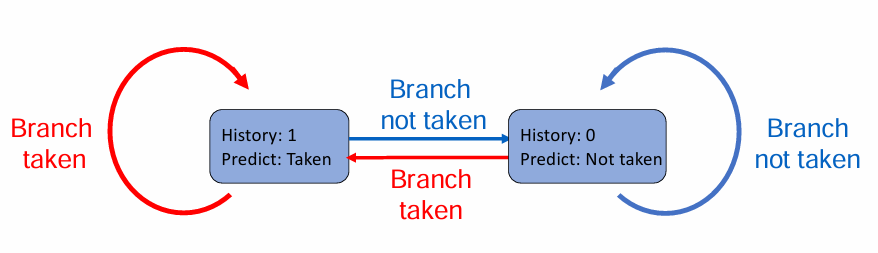

## Intro

### 评分

平时分 60% + 考试分 40%

平时分 = 实验分(80) + 课程分(20-30) <= 100

课程分包括小测，问题，讨论

```txt
Lab = Lab1 (3weeks, 15pt)
    + Lab2 (3weeks, 15pt)
    + Lab3 (1weeks, 5pt)
    + Lab4 (2weeks, 10pt)
    + Lab5 (2weeks, 10pt)
    + Lab6 (5weeks, 25pt)
```

## 量化设计和分析基础

### 计算机的分类

5 个主流计算机类别为：

#### 个人移动设备 PMD

一类带多媒体用户界面的无线设备，如手机、平板电脑。它的成本低，缺少冷却风扇，限制了总功耗。能耗和尺寸要求则决定了使用闪存而非磁盘来存储。

PMD 上的应用往往是多媒体应用程序(基于 Web，面向媒体)。响应性能和可预测性能是多媒体应用程序的关键特性。

> **实时性能需求**指应用程序的一个程序段有确定的最大执行时间。
>
> PWD 应用程序还需要将存储器占用减到最少，因此存储器优化非常重要。

#### 桌面计算机

经典的台式机等。系统性能主要以计算性能和图形性能来衡量。

> Web 应用越来越多，为性能评估带来了新的挑战(众所周知，我们的桌面计算机是浏览器存放器)

#### 服务器

提供更大规模、更可靠的文件和计算服务。

- 对于服务器，**可用性**至关重要。服务器的宕机往往造成很大损失。
- 服务器系统经常需要拓展，因此可拓展性也很重要。
- 整体性能毫无疑问是最重要的，服务器需要有很强的吞吐能力。

#### 集群/仓库级计算机

集群即一组桌面计算机/服务器通过局域网连接，像一个更大型的计算机工作，每个节点运行自己的操作系统，节点之间通过网络协议通信。

最大规模的集群被称为仓库级计算机 WSC。

它们往往非常昂贵，且看重性价比、功效、可用性。

#### 嵌入式计算机

嵌入式计算机无法运行第三方软件，它们只需要执行特定任务，主要目标是以最低价格满足性能需要。

### 并行度和并行体系结构的分类

应用程序的并行：

- 数据级并行 DLP：同时操作多个数据项
- 任务级并行 TLP：用并行方式执行多个工作任务

计算机硬件的并行：

- 指令级并行，如处理器操作流水线化
- 向量体系结构和图形处理器 GPU 将单条指令并行应用于一个数据集，以开发数据级并行
- 线程级并行，基于多核，大任务分解成多个线程同时运行
- 请求级并行，常出现在服务器/分布式系统中，指同时处理多个独立请求

根据多处理器的并行级别，计算机被分成 4 类：

1. 单指令流、单数据流 SISD：单处理器，可以使用指令级并行
2. 单指令流、多数据流 SIMD：多处理器，允许数据级并行
3. ~~多指令流、单数据流 MISD：一般没有这种计算机。~~
4. 多指令流、多数据流 MIMD：每个处理器提取自己的指令，操作自己的数据，针对任务级并行，允许线程级并行。

许多并行处理器是 SISD、SIMD 和 MIMD 的混合类型。

### 计算机体系结构的定义

计算机体系结构涵盖了计算机设计的所有三个方面：

1. 指令集体系结构
2. 组成或微体系结构
3. 硬件

## 流水线 pipeline

### What is pipelining

流水线体现在将指令拆分成各个阶段 stage/segment，然后尽可能利用硬件资源，将不同阶段的各个指令执行**并行化**。它没有减小单条指令的执行时间，但是缩短了整段程序的执行时间。

> 英汉词典：一条指令还在执行时，下一条指令已经开始执行。
>
> 阶段的数量被称为流水线的深度(the depth of pipelining)

在单核处理器的时期，流水线大大加快了多条指令的执行速度。

如果每个阶段的指令执行时间不相同，就会因为需要等待执行时间较长的阶段结束而浪费硬件资源。

当然，流水线也不是只有好处。它会使处理逻辑复杂化，并且需要更多的硬件资源。

### 流水线的分类

根据并行阶段的数量，流水线被分成

- Single funtion pipelining(单阶段并行)
- Multi function pipelining(多阶段并行)。

根据并行的灵活性，流水线被分为

- 静态流水线 Static pipelining: 只有输入的一系列任务都是相同操作时，才能并行执行。否则，等待当前任务执行完成，然后再执行另一种任务。
- 动态流水线 Dynamic pipelining: 可以并行执行不同操作的任务。


根据硬件级别。流水线被分为

- 组件级流水线 Component level pipelining：将处理器中的算术与逻辑运算部件划分为多个部分，这样便可以通过流水线方式执行多种类型的操作。

- 处理器级流水线 Processor level pipelining：通过流水线实现指令的译码与执行。指令的执行过程被分解为多个子过程，每个子过程在独立的功能单元中执行。

- 处理器间流水线 Inter processor pipelining：将两个或多个处理器串联起来，共同处理相同的数据流，每个处理器完成整体任务中的一部分。

根据是否存在反馈回路 feedback loop，流水线被分为

- 线性流水线 Linear pipelining：流水线中的每个分段都是串行连接且无反馈回路，当数据经过流水线的各个分段时，每个分段最多只处理一次数据。
- 非线性流水线 Nonlinear pipelining：在串行连接的基础上，还存在反馈回路。


根据输入和输出的顺序，流水线被分为

- 有序流水线 Ordered pipelining：任务的输入顺序和输出顺序相同。
- 无序流水线 Disordered pipelining：任务的输入顺序和输出顺序可以不同，如最后一个任务不是最后一个完成。

根据数据类型的不同，处理器(?)有如下分类

- 标量处理器 Scalar processor：只通过流水线处理标量数据。
- 向量处理器 Vector processor：具备向量数据表示和处理向量指令能力的处理器，是向量数据表示与流水线技术的结合。

### 流水线的性能评估

#### 吞吐量 Throughput/TP

$$
TP=\frac{n(\text{指令数})}{T_k(\text{总执行时间})}<TP_{\text{max}}=\frac{1}{\Delta t_0(\text{单阶段最长耗时})}
$$

实际情况中
$$
T_k=(m(\text{单指令阶段数})+n-1)\Delta t_0
$$

最长的阶段被称为瓶颈阶段 bottleneck segemnt。它决定 $\Delta t_0$，从而影响吞吐量。

常见的解决瓶颈的方法有

- 分段 Subdivision：把瓶颈阶段再划分成多个更小的子阶段。
- 重复 Repetition：用多个相同功能的处理单元并行处理瓶颈阶段。

> 流水线阶段过多并不好，那会让我们需要考虑更多的前后依赖关系，Control logic 也会很多，过高并发处理上也不是很方便。
>
> 另外，为了保证流水线的正常进行，每个阶段之间要有一个锁存器，这些锁存器也是多阶段的代价。


上图使用了重复的方法，利用三个 $S_2$ 阶段的处理单元并行处理 $S_2$。

#### 提速比例 Speedup/Sp

$$
Sp=\frac{nm\Delta t_0(\text{单周期执行时间})}{(m+n-1)\Delta t_0(\text{流水线执行时间})}=\frac{nm}{m+n-1}<m
$$

#### 效率 Efficiency/η

$$
\eta = \frac{nm\Delta t_0}{m(m+n-1)\Delta t_0}<1
$$

上下两项可以看成单周期和流水线的空间与时间乘积。

#### 案例

静态流水线
> 
>
> 由于使用静态流水线，我们可以把执行大致分成三块：
>
> 1. $a_1b_1,a_2b_2,a_3b_3,a_4b_4$
> 2. $a_1b_1+a_2b_2,a_3b_3+a_4b_4$
> 3. $(a_1b_1+a_2b_2)+(a_3b_3+a_4b_4)$
>
> 
>
> 于是有
> $$
> \begin{align*}
>     TP&=\frac{7}{[(3-1+4)+(4-1+2)+4]\Delta t_0}=\frac{7}{15}\\
>     Sp&=\frac{4\times 3+3\times 4}{15}=1.6\\
>     \eta&=\frac{4\times 3+3\times 4}{5\times 15}=32\%
> \end{align*}
> $$
动态流水线
> 
>
> 这题较为复杂，我们要考虑加法在什么时候可以插入乘法计算中。
>
> 
>
> 在 $a_1b_1,a_2b_2$ 计算完成时，就可以考虑插入 $a_1b_1+a_2b_2$ 了。考虑到乘法之间本来就因为阶段二用时更长的原因需要停顿一次，就插到两个除法中间。
>
> 于是有
> $$
> \begin{align*}
>     TP&=\frac{7}{18\Delta t_0}\\
>     Sp&=\frac{4\times 7}{18}\approx 1.56\\
>     \eta&=\frac{4\times 7}{5\times 18}\approx 31\%
> \end{align*}
> $$

### 竞争 Hazard

在流水线中，可能出现一些情形，使得下一个指令难以继续执行，这些情形就叫做竞争。

#### 结构竞争 structure hazard

对应的资源正在使用。比如说，在一个指令和数据存储不分离的结构下，load/store 指令需要访问 memory，此时如果你想要执行 IF，就会发现 memory 已经被占用，无法执行下去。因此，流水线的数据通路需要指令与数据存储分离。


#### 数据竞争 Data hazard

新的指令需要的数据依赖先前的指令完成数据读写。

对于 R 型指令，数据竞争被分为三种：

- Read after write/RAW：前一条指令写，后一条指令读。如果读的时候写未完成，则发生错误。
- Write after read/WAR：前一条指令读，后一条指令写。如果还没读就写好了，就发生错误。
- Write after write/WAW：前一条指令写，后一条指令也写，如果后一条指令先写好了，就发生错误。

解决这些竞争的经典方法是前传 Forwarding/Bypassing。当计算结束时，不要等待它被重新存储回寄存器，而是通过在数据通路上建立额外的连接，把它传递给需要使用它的指令。

load 指令也会引发数据冲突。在 MEM 阶段，数据从 data memory 中取出。如果下一条指令需要读取这个数据，那么单单的前传是不够的。我们需要再加一个 bubble 周期，才能保证数据被成功传输。

通过组织代码的执行顺序，可以尽可能避免上述冲突的发生。


#### 控制竞争 Control hazard

需要依据上一条指令的结果来判断接下来执行什么指令。

对于控制竞争，我们有分支预测的方法：

- 静态分支预测 Static branch prediction：采用固定的策略对所有分支进行预测，比如“永远不跳”（predict not taken）、“永远跳转”（predict taken）或者基于编译器提供的提示进行预测。由于不依赖运行时信息，其实现简单，但在某些情况下预测精度较低。
- 动态分支预测 Dynamic branch prediction：通过硬件记录分支历史信息，在运行时动态调整预测策略。常见的方法如记录分支历史并预测保持历史趋势。动态预测机制能够根据程序的实际执行情况不断自我优化，通常比静态预测具有更高的准确率。

### 数据竞争的检测

1. `EX/MEM` 或 `MEM/WB` 中的目标寄存器与 `ID/EX` 中的源寄存器相同
2. `EX/MEM` 或 `MEM/WB` 中的 `RegWrite` 为 `1`
3. `EX/MEM` 或 `MEM/WB` 中的目标寄存器不为 `x0`
4. 当 `EX/MEM` 与 `MEM/WB` 的数据都需要前传时，优先前传 `EX/MEM` 中的数据。


对于 Load-Use 竞争的情形，则检测

1. `ID/EX` 中的 `MemRead` 为 `1`
2. `ID/EX` 的目标寄存器和 `IF/ID` 的某个源寄存器相同

如果检测到了，则阻塞 stall 流水线。

阻塞方法为：

1. **清零控制信号**
   把处于 `ID/EX` 阶段的控制信号全部清零，使该阶段执行一个 “nop”（无操作指令），从而防止错误的数据传递到后续的 EX、MEM 和 WB 阶段。

2. **冻结 PC 和 IF/ID 寄存器**
   阻止程序计数器 (PC) 和 `IF/ID` 的更新，即暂停 IF 和 ID 阶段，让当前指令在这两个阶段停留，从而插入一个 stall 周期，等待前方数据就绪后再恢复流水线运行。

还有几种冲突，这里不细讲：

- load 完后，使用 load 出来的数据参与计算 store 地址，这类似于 load-use，需要一个 stall
- load 完后，把 load 出来的数据 store 回去，这时是把 `MEM/WB` 的数据前传给 `EX/MEM`，不需要 stall
- store 完后 load 刚存的数据(~~真的有人这么干吗~~)，也是把 `MEM/WB` 的数据前传给 `EX/MEM`，不需要 stall

### 控制竞争的处理

为了减小控制竞争带来的性能下降，我们额外添加硬件，使得判断是否跳转的操作放在 ID 阶段执行。这样，我们可以把 bubble 的数量减小到 1.

> 由于把判断放到了 ID 阶段，在 branch 前的 R 型指令带来的冲突需要一个 bubble，load 则需要两个 bubble。


当然，我们还有预测策略。

一种简单的想法是，在跳转指令之后，继续执行预测分支。如果预测失败了，就丢弃错误分支中已经加载的指令，重新加载正确分支的指令，再消耗一个周期。这个时间也就是所谓的 branch penalty。

延迟分支设计 Delayed Branching 则是一种流水线优化技术，它通过将无论是否跳转都要执行的指令放到跳转指令后的方式，减少因等待分支决策产生的空闲时间。

对于深度更高、支持向量数据的流水线， branch penalty 更高了，这时降低预测失败率的需求更高，于是使用动态预测。

一种常见的思路是用预测器 predictor 记录上次跳转历史，预测结果保持历史趋势。



有时，一次预测失败就修改预测可能不够稳定，于是可以引入状态机的思路，当连续多次预测失败时，才修改预测。一个需要连续两次预测失败才修改预测的方案如下：


预测器即使预测成功，也需要一个周期的时间来计算目标地址。为了更快实现重复的跳转，可以使用一种用于加速分支指令处理的专用高速缓存，即 Branch-target buffer（BTB）：

1. **储存分支信息**
   BTB 保存分支指令的地址和对应的目标地址。当一个分支指令第一次被执行时，其目标地址会被记录在 BTB 中。

2. **提前预测分支目标**
   当 CPU 在取指阶段（IF）遇到可能的分支指令时，会查找当前指令地址是否存在于 BTB 中。如果存在，BTB 会提供预测的分支目标地址，CPU 就可以直接从这个地址开始取指，从而减少等待分支判断的延迟（branch penalty）。

3. **更新和校正**
   当分支指令执行时（在执行或写回阶段），处理器会确认实际的分支决策。如果预测正确，则 BTB 保持不变；如果预测错误，BTB 条目将被更新为正确的分支目标地址，以便下一次能准确地预测。

4. **与分支历史协同**
   BTB 经常与分支历史表（BHT）、饱和计数器等动态预测机制协同工作，从而在同时预测分支是否采取和预测目标地址两个方面提升分支预测的准确率。

现代的取指单元则同时集成了取指功能和分支预测功能。

### 非线性流水线的调度

在非线性流水线中，我们不能简单地以每一个周期都取一条新的指令来处理。由于存在同一资源的再次使用，如果不合理调度，就会发生结构冲突。

具体怎么做，让我们看一个实例。

我们把对非线性流水线做一个抽象，左侧的 $k$ 表示功能单元，上方的 $n$ 表示单条指令执行时经历的时钟周期，√ 则表示该功能单元在这个时钟周期被占用。


对于每个单元，我们都可以做分析：

- $k=1$：如果下一个指令在 $8$ 个周期后执行，则引发冲突
- $k=2$：如果下一个指令在 $1,5,6$ 个周期后执行，则引发冲突
- $k=3$：不会引发冲突
- $k=4$：如果下一个指令在 $1$ 个周期后执行，则引发冲突
- $k=5$：如果下一个指令在 $1$ 个周期后执行，则引发冲突

综上，我们可以用一个八位向量 $10110001$ 来表示冲突的情况，每一位表示一个周期，如果该位为 $1$，则说明当下一个指令在该周期后执行时，可能引发冲突。这个向量就叫做**冲突向量**吧。

另外，每当前进了 $m$ 个周期，就可以将向量右移 $m$ 位，因为前几位代表的周期已经过去了。

那么，现在我们可以对 $m=2,3,4,7$ 来进一步分析。我们以 $m=2$ 为例：

新的指令对应的冲突向量为 $10110001$，老的指令们对应的冲突向量为 $00101100$，只要对它们按位取或，就能得到现在所有指令对应的冲突向量，即 $10111101$。

现在，我们可以使用的 $m=2,7$，不妨再取一次 $m=2$，则有：
$$
\begin{align*}
    10111101 \gg 2&=00101111\\
    00101111 | 10110001 &=10111111
\end{align*}
$$

现在可以的选择只有 $m=7$ 了：
$$
\begin{align*}
    10111111\gg 7&=00000001\\
    00000001 | 10110001 &= 10110001
\end{align*}
$$

此时，冲突向量又变回了 $10110001$，这说明我们获得了一个循环 $2-2-7$。那么，这就是一个调度方案。

不难看出，对于一开始的 $m=2,3,4,7$，我们都可以以类似的方法计算下去，尝试求得一个循环。当循环出现，就说明有了一个可行的调度方案。

由于冲突向量的变化只与它的值和 $m$ 的取值有关，我们可以构造出一个状态图


图上全部的回路，也就是全部的调度方案。


## 存储结构 Memory Hierarchy

### Introduction


这是我们熟知的存储结构。我们的目标，其实就是让用户享受到 Cache 的速度和 Storage 的容量。

这门课主要关注缓存 Cache。

> Cache：小而快的存储，用于提升对存储的平均访问速度。在计算机体系结构中，几乎所有层次都是另一个层次的 cache。

- Cache 是离 CPU 最近的地方
- Cache 的访问单元是 block
- Cache 拥有时间局部性 Temporal locality 和空间局部性 Spatial locality。

### 技术潮流

由于 CPU 的发展远快于 Memory，我们需要 Cache 来平衡。

不同类型的计算机关注存储的不同指标。

- 对于桌面电脑，更注意延迟 latency
- 对于服务器，更关注带宽 bandwidth
- 对于嵌入式计算机，更关注功率和电池寿命

> 缓存未命中所需时间取决于：
>
> - **延迟**：获得数据块中第一个字（word）所需的时间。
> - **带宽**：获得该数据块其余部分所需的时间。

### 缓存设计的四大问题

四大问题基本都在计算机组成课中学习过，这里只做简单回顾。

- **Block placement**: 怎么在缓存里放主存里的数据？
  - 完全相联、组相联、直接映射

>相连度越高，cache 空间的利用率越高，块冲突率越低。大多数缓存的相连度 $n\le 4$。

- **Block identification**: 怎么在缓存里找数据？
  - 使用标签/块标记

> Index 决定第几组 set，tag 决定是组内的哪一个块。全相联就没有 index，因为它的组就是一整个缓存
> 
>
> 

- **Block replacement**: 怎么通过缓存替换主存里的数据？
  - 随机、最近最少使用（LRU）、先进先出（FIFO）

> - 随机替换 Random replacement：硬件实现容易
> - 最近最少使用 LRU：假设更近使用的块更可能被再次使用。它的实现需要在缓存中添加额外的位来记录块的使用情况。一种实现方法是维护一个允许任意位置删除操作的栈(如双向链表)。
>   - 如果访问块不存在于栈中，且缓存未满，就压栈；
>   - 如果访问块不存在于栈中，且缓存已满，先删除栈底，然后压栈；
>   - 如果访问块已存在于栈中，就先把块从栈中删除，然后再压栈。
>
>   另一种实现方法是，我们只是为每一对块使用一个触发器(共 $C_n^2$ 个)，利用触发器的状态展示两个块中谁更近被访问。然后，我们就可以通过逻辑表达式综合所有的触发器，确定哪一个块是最后被访问的。
>
> - 先进先出 FIFO：替换最先进入缓存的块
>
> 对于 LRU，提升缓存块数量总能提升命中率。

- **Write strategy**: 怎么通过缓存向下一级存储写数据？
  - 写回 Write Back 或写穿 Write Through

- 写穿策略：数据被写到主存。仅需要 valid bit。
- 写回策略：数据被写到缓存，不写到主存。只有当这个数据要从缓存中移除时，把它写到主存。需要 valid bit 和 dirty bit。

在写穿策略中，可能出现 write stall，即 CPU 需要等待写穿完成的时间。为了缓解这个现象，写穿策略中会使用 write buffer，数据先被写到这个缓冲区，然后通过缓冲区写到主存。

对于写回策略，如果出现了对同一块数据进行多次写的操作，那么它们都会在缓存而非主存进行，这有效减小了主存的带宽消耗。

对于写失效 write miss，也有两种策略

- 写分配 write allocate(常用于写回策略)：先把数据块载入到缓存，然后再做别的事情。
- 写围绕 write around(常用于写穿策略)：直接把数据块写入主存，不存到缓存。


