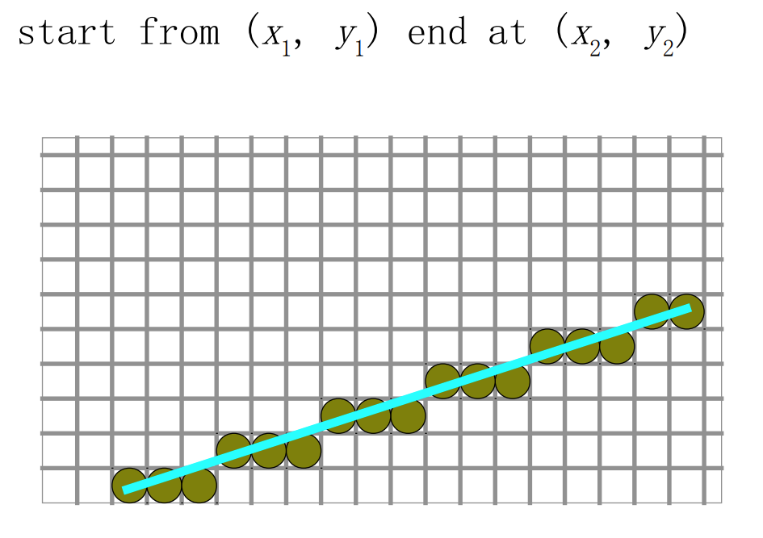
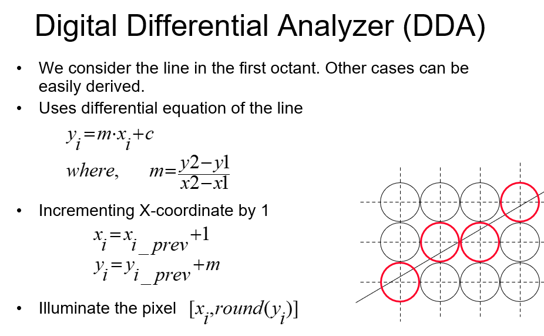

## 概论

### 评分

- Lab: 30%
- Project: 40%
- 小测，作业，课堂问答 30%

### 定义

- 用像素来表示真实世界的科学技术?
- 在计算机中建模，处理和显示物体的科学技术。

### 基本任务

- 为世界建模
- 仿真现实世界中物体的行为
- 显示世界
图形与物理学是实现这些任务的传统工具。

### 为世界建模

对世界的数字表达有很多：
- Digital Images 数字图像
- 3D Geometric Objects 3D 几何图形
- Symbolic Descriptions 符号表达

> Digital Images 数字图像
> - 优点：直观，容易获取(如拍照)，适合表现复杂细节
> - 缺点：数据量大，不易编辑，分辨率受限，视角固定
>
> 3D Geometric Objects 3D 几何图形
> - 优点：数据量小，易于编辑和变换，可从任意视角观察
> - 缺点：难以表现复杂纹理和细节，建模复杂
>
> Symbolic Descriptions 符号表达
> - 优点：数据量最小，完全参数化，精确控制
> - 缺点：表达能力有限，不直观，仅适用于特定场景

我们注重 Graphics Representation。

```c
Point3D {
  double x;
  double y;
  double z;
};
Line {
  Point3D a;
  Point3D b;
};
Cuboid {
  LCS3D local;  // 局部坐标系，其实就是一个点
  double x;
  double y;
  double z;
};
```

对于复杂的物体，我们往往使用很多的面片来表示它。

Three very important and rather complex attributes:
- complex shape
- visual look or appearance due to lighting effects
- dynamic behaviour due to interaction with other elements of the world -- movement, sound, elastic effects...

### 仿真现实世界中物体的行为

略

### 显示世界

将三维对象转换成图像（Display,rendering）。

### 应用

- CAD（Computer-Aided Design，计算机辅助设计）：利用计算机进行产品、建筑、机械等的设计、绘图和建模，提高设计效率和精度，常用于工程、建筑、制造等领域。
- GIS（Geographic Information System，地理信息系统）：用于采集、存储、管理、分析和展示地理空间数据的系统，广泛应用于地图制作、城市规划、资源管理、环境监测等领域。
- 影视
- 游戏
- 科学可视化
- 虚拟现实
- UI

## 2D 图形算法

### Rasterization 光栅化

绘制一个对象到屏幕上可以归结成两步：
- 确定屏幕上要画哪些像素点
- 确定每一个像素点要画成什么颜色

其中的第一个步骤被称为 Rasterization 或 scan conversion。

譬如说，将一条线转化成像素点：



选择的像素点要尽可能靠近理想直线，同时这个操作性能要好。

#### DDA 算法



DDA 算法在上一步的基础上计算下一步，从而减小开销。当然，这里要注意，当 `m<1` 时，我们应该改为 `y+=1, x+=1/m`。

> 这种在上一步的基础上计算下一步的加速方法被称为增量算法 Incremental Algorithm。在使用增量算法时，我们应该注意误差的累加问题。

#### BLD 算法 Bresenham's Line Drawing Algorithm

Bresenham 算法是一种高效的整数增量算法，用于在像素网格上绘制直线。下面详细解释每个变量的含义和算法的推导过程。

##### 变量含义

- $(x_0, y_0)$：直线起点坐标
- $(x_1, y_1)$：直线终点坐标
- $\Delta x = x_1 - x_0$：横向步长
- $\Delta y = y_1 - y_0$：纵向步长
- $d$：决策变量（误差项），用于判断下一个像素点是选右边还是右上方
- $x, y$：当前像素点坐标

##### 推导过程（以 $0 \leq m \leq 1$ 为例）

1. **目标**
   在像素网格上，从 $(x_0, y_0)$ 到 $(x_1, y_1)$，每次 $x$ 增加 1，决定 $y$ 是否增加 1，使得选中的像素点尽量靠近理想直线 $y = mx + b$。

2. **误差定义**
   假设当前像素为 $(x_k, y_k)$，理想直线在 $x_{k+1}$ 处的 $y$ 值为 $y_{real} = y_k + m$。
   但像素只能取整数，所以我们要决定下一个点是 $(x_{k+1}, y_k)$ 还是 $(x_{k+1}, y_k+1)$。

3. **决策变量 $d$ 的推导**
   - 设 $d_k$ 表示当前点到理想直线的“误差”。
   - 初始时，$d_0 = 2\Delta y - \Delta x$。
   - 每次 $x$ 增加 1：
     - 如果 $d_k < 0$，说明理想直线更靠近 $(x_{k+1}, y_k)$，$y$ 不变，$d_{k+1} = d_k + 2\Delta y$。
     - 如果 $d_k \geq 0$，说明理想直线更靠近 $(x_{k+1}, y_k+1)$，$y$ 增加 1，$d_{k+1} = d_k + 2(\Delta y - \Delta x)$。

4. **算法流程**
   ```pseudo
   x = x0
   y = y0
   d = 2*Δy - Δx
   while x <= x1:
       plot(x, y)
       if d < 0:
           d = d + 2*Δy
       else:
           y = y + 1
           d = d + 2*(Δy - Δx)
       x = x + 1
   ```

##### 总结

- $d$ 决定了下一个像素点的选择，是误差的两倍化简后的整数形式。
- 只用加法和比较，避免了浮点运算，效率高。
- 该算法可推广到任意斜率（$|m|>1$ 时交换 $x$ 和 $y$ 的角色）。

Bresenham 算法的核心思想就是用一个决策变量跟踪理想直线与像素点的偏差，逐步逼近理想直线。

### Polygon Filling

- 给定一个多边形，找到多边形内部全部的点
- 任给一个点，判断点是否在多边形内部