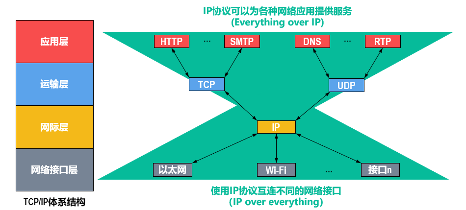
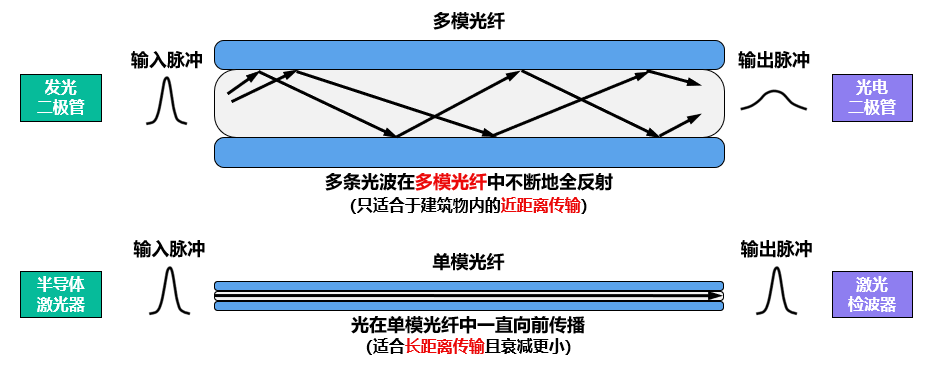

## 评分

- 课程作业 20%
- 实验 20%
- 小测 5%
- 出勤 5%
- 期末闭卷 50%

## 概述

### 网络、互联网与因特网

- 网络 Network 是由若干节点 Node 和连接这些节点的链路 Link 组成的。节点可以是各种设备，链路可以是有线的，也可以是无线的。

- 互联网 internet 是由若干网络和连接这些网络的路由器组成的，即网络的网络。

- 因特网 Internet 是世界上最大的互联网。

> internet 泛指由多个计算机网络互连而成的网络，这些网络之间可以使用任意的通信协议作为通信规则。
>
> Internet 专指世界上最大的互联网，这些网络之间必须使用 TCP/IP 协议族作为通信规则。

因特网已发展成为基于因特网服务提供者 ISP 的多层次结构的互联网络。任何用户都可以通过 ISP 接入因特网。

制定因特网标准的过程为“因特网草案”->“建议标准”->“因特网标准”。任何一个建议标准在成为因特网标准之前，都以 RFC(Request For Comments)的形式在因特网上发表。

在功能上，因特网可以简单地划分成核心部分和边缘部分。

互联网的核心部分由大量异构型网络和连接这些网络的路由器构成，为边缘部分提供连通性和数据交换等服务。

### 电路交换、分组交换和报文交换

路由器 Router 对收到的分组进行存储转发来实现分组交换。

#### 电路交换 Circuit Switching

电路交换的三个步骤：

- 建立连接。从主叫方到被叫方（中间可能有多层中继）建立一条专用的物理通路，简称为连接。
- 通话：主叫方和被叫方通话，始终占用连接。
- 释放连接：通话完毕，交换机释放通信资源。

计算机之间的数据传送并不适合使用电路交换的方式。因为计算机在线的大部分时间其实并没有进行数据传输，大部分通信资源都会被浪费。

#### 分组交换

分组交换：源主机将待发送的整块数据构造成若干分组发送出去，中途各交换节点（路由器）对分组进行存储转发，目的主机收到这些分组后将它们组合还原成原始数据块。

待发送的整块数据被成为报文 Message。报文被划分成多个数据段进行传输，每隔数据段前面添加一些必要的控制信息（如源地址，目的地址）组成的首部 Header，这就形成了一个个分组 Packet。分组是分组交换网上数据传送的单元。

源主机将分组发送到分组交换网中，分组交换网中的分组交换机收到一个分组后，先将其缓存，然后从其首部提取目的地址，并根据地址查找自己的转发表，找到相应转发接口后转发出去，把分组交给下一个分组交换机。

值得注意的是，与电路交换占用一整条连接不同，分组交换只会占据分组所在的一小段线路，而不会占有整条线路，这提高了通信线路的利用率。

不过，分组交换也带来一些问题：
- 分组首部的额外传输开销
- 路由器存储转发造成一定时延
- 分组可能出现失序与丢失问题

#### 报文交换

报文交换是分组交换的前身。报文交换没有分组操作，报文直接被整个发送，这导致交换节点把报文整体接收完成后才能查找转发表，提升了转发时延。同时，对交换节点的缓存空间要求也更高。

如果传送大量数据，且数据传送时间远长于建立连接的时间，电路交换效率较高。而处理突发数据时，分组交换更灵活。

### 计算机网络的定义和分类

#### 定义

计算机网络没有精确和统一的定义，不同阶段有不同定义。

一个较好的定义是：计算机网络主要是由一些通用的、可编程的硬件互连而成的。这些硬件能够用来传送多种不同类型的数据，并能支持广泛的和日益增长的应用。

#### 分类

**按网络的覆盖范围分类**

- 广域网 Wide Area Network, WAN：覆盖几十到几千公里，是因特网的核心部分，为因特网核心路由器提供远距离高速连接。
- 城域网 Metropolitan Area Network, MAN：覆盖 5-50km，通常作为城市骨干网。
- 局域网 Local Area Network, LAN：覆盖 1km，如校园网。
- 个域网 Personal Area Network, PAN，覆盖 10m，如蓝牙。

**按使用者分类**

- 公用网 Public Network
- 专用网 Private Network

### 计算机网络的性能指标

#### 速率

速率指数据的传送速率，也称为数据率 Data Rate 或比特率 Bit Rate，基本单位为 bit/s。

需要注意的是，数据量的计算是基于 2 进制的，但是速率的单位却是基于 10 进制的。如：

- 1KB=$2^{10}$ B
- 1kb/s=$10^3$ b/s

#### 带宽 Bandwidth

带宽表示单位时间内从网络中的某一点到另一点所能通过的最高数据率。因此，带宽的单位与速率单位相同。

线路的带宽越宽，其所传输的数据的最高数据率就越高。应用中，设备的接口速率和线路带宽遵循木桶效应。

#### 吞吐量 throughput

吞吐量指单位时间内通过某个网络或接口的实际数据量。它常被用于对实际网络的测量。

吞吐量收到带宽的限制。

#### 时延 delay/latency

时延指数据（由多个分组组成）从网络的一段传送到另一端所耗费的时间，也称为延迟或迟延。网络中的时延由发送时延、传播时延、排队时延和处理时延这四部分组成。

如图，主机 A 发送一个分组到主机 B，经过了两个发送时延，两个传播时延，一个排队时延和一个处理时延。

**发送时延**

发送时延是主机或路由器发送分组所耗费的时间：

$$
\text{发送时延}=\frac{\text{分组长度}}{\text{发送速率}}
$$

**传播时延**

传播时延是电磁波在链路上传播一定的距离所耗费的时间：

$$
\text{传播时延}=\frac{\text{链路长度}}{\text{电磁波在链路上的传播速率}}
$$

电磁波在链路上的传播速率主要有如下三种：
- 自由空间：$3\times 10^8$ m/s
- 铜线电缆：$2.3\times 10^8$ m/s
- 光纤：$2\times 10^8$ m/s

**排队时延**

- 分组进入路由器后，会在路由器的输入队列中排队缓存并等待处理。
- 在路由器确定了分组的转发接口后，分组会在输出队列中排队缓存并等待转发。

分组在输入队列和输出队列中排队缓存所耗费的时间就是排队时延。

**处理时延**

路由器从自己的输入队列中取出分组后，会进行一系列处理工作，这些工作的耗费时间就是处理时延。

排队时延和处理时延往往难以计算。上图展示了不考虑排队时延和处理时延的情况下，网络时延的组成。此时，若源主机通过 $n$ 个路由器转发，给目的主机发送 $m$ 个分组，则总时延为

$$
m\cdot\text{主机发送单个分组的时延}+(n+1)\cdot\text{传送时延}+n\cdot\text{转发单个分组的时延}
$$

> 

发送时延和传播时延较容易计算，排队时延和处理时延则不容易计算。当发送数据块较大时，发送时延会成为主导；反之，当传送距离较长、信号传播速率较低时，传播时延会成为主导。

#### 时延带宽积

时延带宽积是传播时延和带宽的乘积：

$$
\text{时延带宽积}=\text{传播时延}\times\text{带宽}
$$

我们可以直观地把时延带宽积理解成链路可以容纳的比特数量。

> 如果发送端连续发送数据，那么在发送的第一个比特到达线路另一端时，发送端已经发送了时延带宽积个比特，且这些比特正在链路上跑。因此，链路的时延带宽积也被称为以**比特为单位的链路长度**。

#### 往返时间 Round-Trip Time

RTT 指从发送端发送数据分组开始，到发送端收到接收端发来的相应确认分组为止，总共耗费的时间。

`ping` 命令就是通过往返时间来反映网站的连通性的。

#### 利用率

- **链路利用率**是指某条链路有百分之几的时间是被利用的（即有数据通过）。
- **网络利用率**是指网络中所有链路的链路利用率的加权平均。

当链路空闲时，该链路引起的排队时延为 0，此时链路时延最小。当链路的利用率增大时，链路引起的时延就会迅速增加。

令 $D_0$ 表示网络空闲时的时延，$D$ 表示网络当前的时延，$U$ 表示网络利用率，那么在理想的假定条件下，有：

$$
D=\frac{D_0}{1-U}
$$

可见，网络利用率增加时，时延会急剧增大。因此，一些大型 ISP 往往会控制信道利用率不超过 50%。如果超过了就要进行扩容，增大线路的带宽。

#### 丢包率

丢包率是指在一定的时间范围内，传输过程中丢失的分组数量与总分组数量的比率。

分组丢失主要有以下两种情况：
- 分组在传输过程中出现误码，被传输路径中的节点交换机（例如路由器）或目的主机检测出误码而丢弃。
- 节点交换机根据丢弃策略主动丢弃分组。

丢包率可以反映网络的拥塞情况。丢包率越高，拥塞情况越严重。

### 计算机网络体系结构

#### 常见的三种计算机网络体系结构

OSI 标准由于协议实现过分复杂、运行效率低，部分功能在多个层次中重复出现，最终失败。

#### 计算机网络体系结构分层的必要性

计算机网络很复杂，分层可以把大问题转化成小问题。

在物理层，我们考虑：
- 用什么传输媒体
- 用什么物理接口
- 用什么信号表示比特 0 和 1

在数据链路层，我们考虑：
- 如何标识网络中各主机（主机编址，如 MAC 地址）
- 如何从比特流中区分出地址和数据（数据封装格式）
- 协调各主机争用总线（媒体接入控制）
- 以太网交换机的实现（自学习和转发帧）
- 检测数据是否误码（差错检测）
- 出现传输差错如何处理（可靠传输和不可靠传输）
- 接收方控制发送方注入网络的数据量（流量控制）

在网络层，我们考虑：
- 标识网络和网络中的各主机（网络和主机共同编址，例如 IP 地址）
- 路由器转发分组（路由选择协议、路由表和转发表）

在运输层，我们考虑：
- 进程之间基于网络的通信（进程的标识，例如端口号）
- 出现传输差错如何处理（可靠传输和不可靠传输）

在应用层，我们考虑：
- 通过应用进程间的交互来完成特定的网络应用
- 进行会话管理和数据表示

总结如下：
应用层|运输层|网络层|数据链路层|物理层
-|-|-|-|-
解决通过应用进程的交互来实现特定网络应用的问题|解决进程之间基于网络的通信问题|解决数据包在多个网络之间传输和路由的问题|解决数据包在一个网络或一段链路上传输的问题|解决使用何种信号来表示比特 0 和 1 的问题

#### 计算机网络体系结构分层思想举例

浏览器：

- 应用层：生成 http 请求报文，请求 Web 服务器执行相应操作
- 运输层：添加 TCP 报文段，区分应用进程，实现可靠传输
- 网络层：添加 IP 数据报，用于 IP 寻址和路由
- 链路层：在首尾包裹以太网帧，用于 MAC 寻址和帧校验
- 物理层：将上述内容转换成电信号

路由：

物理层：解析电信号
链路层：拆解以太网帧
网络层：根据 IP 数据包首部中的目的 IP 地址查表转发该 IP 数据报

然后路由又反序执行操作，将原电信号发向 Web 服务器。

Web 服务器类似逐层操作，获得浏览器所请求的内容。

#### 计算机网络体系结构中的专用术语

##### 实体

实体指任何可发送或接收信息的硬件或软件进程，对等实体则指通信双方相同层次中的实体。

##### 协议

协议是控制两个对等实体在“水平方向”进行“逻辑通信”的规则的集合。

协议的三要素：
- **语法**定义所交换信息的格式
- **语义**定义通信双方所要完成的操作
- **同步**定义通信双方的时序关系

##### 服务

如果说，协议是水平的，那么服务就是垂直的。在协议的控制下，两个对等实体在水平方向的逻辑通信使本层向上一层提供服务，从而允许上一层能够实现协议。

下层的协议对上层的实体是透明的。实体可以接受下层服务，但不知道实现这个服务的具体协议。

在同一系统中，相邻两层的实体交换信息的逻辑接口称为**服务访问点 SAP** Service Access Point。

> 如，帧的“类型”字段、IP 数据报的“协议”字段，TCP 报文段或 UDP 用户数据报的“端口号”字段都是 SAP。

上层要使用下层提供的服务，必须通过与下层交换一些命令，这些命令称为**服务原语**。

- 对等层次之间传送的数据包称为该层的协议数据单元（Protocol Data Unit，PDU）。
- 同一系统内层与层之间交换的数据包称为服务数据单元（Service Data Unit，SDU）。

## 物理层

物理层用于提供比特流传输服务。

### 传输媒体

物理层下面有传输媒体（传输媒体不属于物理层，从而不属于计算机网络体系结构）。传输媒体是计算机网络设备之间的物理通路，也称为传输介质或传输媒介。

传输媒体被分为导向型传输媒体和非导向型传输媒体。

#### 导向性传输媒体

> 同轴电缆
>
> 

> 双绞线
>
> 

> 光纤
>
> 
> 

#### 非导向型传输媒体