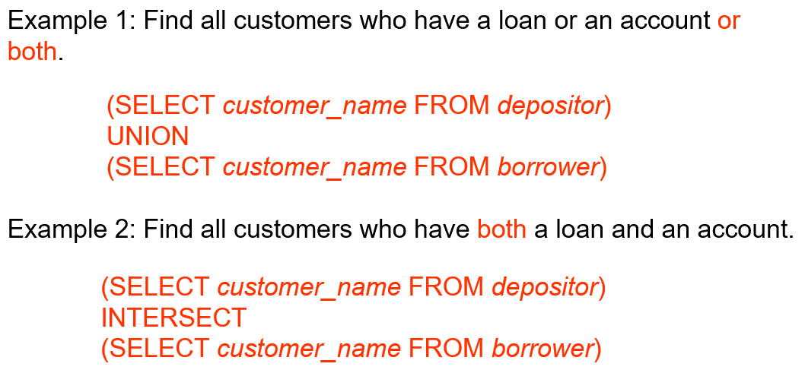
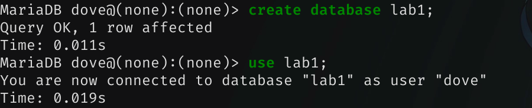
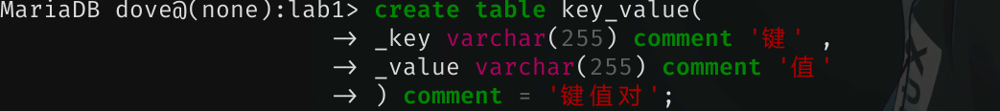
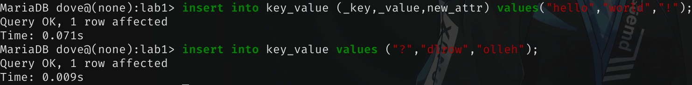
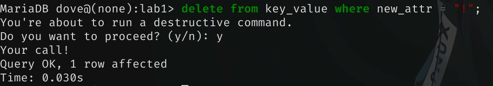
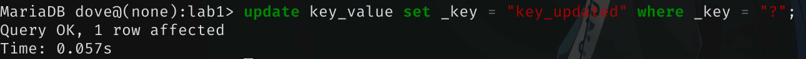
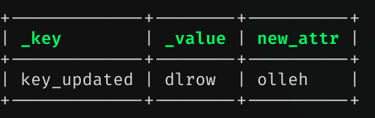
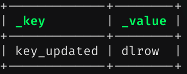
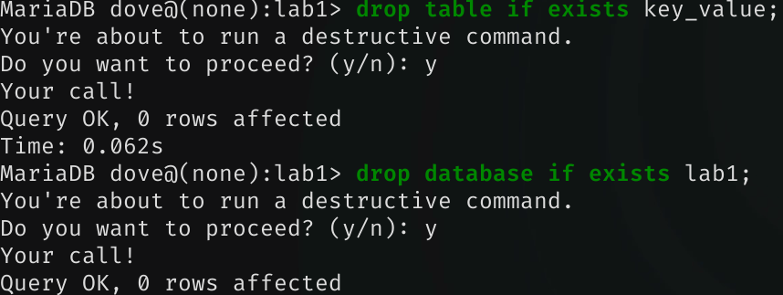

## 实验1 DBMS的安装和使用

### 实验目的

1. 通过安装某个数据库管理系统，初步了解DBMS的运行环境。

2. 了解DBMS交互界面、图形界面和系统管理工具的使用。

3. 搭建实验平台。

### 实验内容和要求

1. 根据某个DBMS的安装说明等文档，安装DBMS。

2. 了解DBMS的用户管理。

3. 熟悉交互界面的基本交互命令。

4. 熟悉图形界面的功能和操作。

5. 了解基本的DBMS管理功能和操作。

6. 完成实验报告。

### 我的实验平台

操作系统：ArchWsl2

DBMS：MySQL

### 安装 MySQL

在 archlinux 中，一般使用 MySQL 的一个分支 mariadb。

```bash
# 安装 mariadb
sudo pacman -S mariadb
# 初始化数据库
sudo mariadb-install-db --user=mysql --basedir=/usr --datadir=/var/lib/mysql
# 启动 mariadb 服务
sudo systemctl start mariadb
sudo systemctl enable mariadb
# 进行安全配置
sudo mysql_secure_installation
# 初次进入交互界面
sudo mariadb
# 创建新的用户
create user YourUsername identified by "YourPassword";
# 为新的用户提供除了用户管理之外的全部权限，便于后续练习
grant all privileges on *.* to 'YourUsername'@'%' identified by 'YourPassword' with grant option;
# 刷新设置
flush privileges;
# 检查权限是否正确设置
show grants for 'YourUsername'@'%';
# 退出
exit
```

如上操作完成了安装 MySQL，初始化数据库，启动 MySQL 服务，并创建新的用户、赋予用户操作权限的过程。之后，我们就可以使用命令

```bash
mariadb -uYourUsername -pYourPassword
```

来进入 MySQL 交互界面了。

It behaves like:

```txt
Welcome to the MariaDB monitor.  Commands end with ; or \g.
Your MariaDB connection id is 20
Server version: 11.7.2-MariaDB Arch Linux

Copyright (c) 2000, 2018, Oracle, MariaDB Corporation Ab and others.

Type 'help;' or '\h' for help. Type '\c' to clear the current input statement.

MariaDB [(none)]> show databases;
+--------------------+
| Database           |
+--------------------+
| information_schema |
+--------------------+
1 row in set (0.008 sec)
```

### 使用 mycli 优化交互体验

mariadb 看起来丑丑的，语法补全也不是很智能，我们可以运行以下命令来获得 mycli，这是一个基于 python 的 mysql 命令行客户端，支持更好的终端界面和语法补全。

```bash
# 尽管没有被列为依赖，但是如果缺少了 python-pyfzf，mycli 是有可能无法工作的
yay -S mycli python-pyfzf
```

现在可以使用`mycli -u YourUsername -p YourPassword`来打开交互界面啦。

看起来还是不错的。



### 起步练习
>
> 以下练习参考了[https://zhuanlan.zhihu.com/p/2872144103](https://zhuanlan.zhihu.com/p/2872144103)

首先，我们建立一个练习用的数据库并使用它



创建一个表（comment 表示注释）



为表添加一个新字段


插入数据，以下分别使用了指明字段和不不指明的方法



删除数据，使用 where 指明筛选条件。指明 primary key 可以保证删除唯一的数据。



更新数据，同样使用 where 指明筛选条件。



查询全部数据

```sql
select * from key_value;
```



查询特定数据

```sql
select _key,_value from key_value where new_attr = "olleh";
```



删除表和数据库


