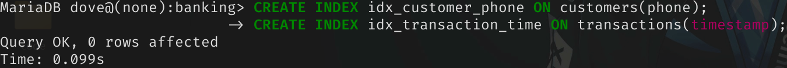
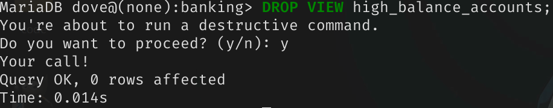
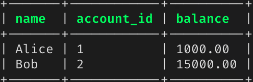
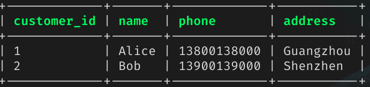
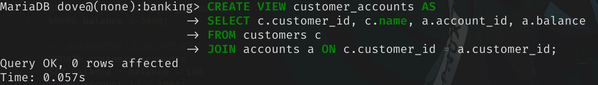
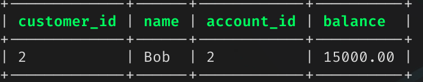
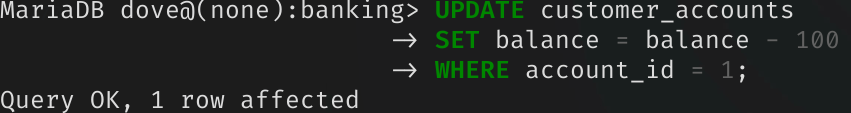
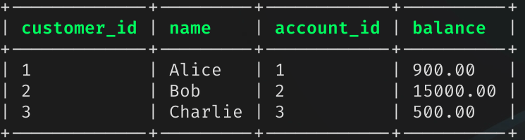

## 实验目的

1. 掌握关系数据库语言SQL的使用。

2. 面向某个应用场景定义数据模式和操作数据。

## 实验平台

1. 数据库管理系统（推荐使用）： SQL Server, MySQL, OpenGauss, PolarDB

## 实验内容和要求

1. 以某个应用场景（如Banking）为例，建立数据库。

2. 数据定义：表的建立、删除；索引的建立、删除；视图的建立、删除。

3. 数据更新：用insert/delete/update语句插入/删除/更新表数据。

4. 数据查询：单表查询、多表查询、嵌套子查询等。

5. 视图操作：通过视图进行数据查询和数据更新。

## 实验记录

### 建立数据库

```sql
-- 创建数据库
CREATE DATABASE banking;
USE banking;
```

### 数据定义

#### 创建与删除表格

创建表格。

```sql
-- 创建表
CREATE TABLE branches (
    branch_id INT PRIMARY KEY AUTO_INCREMENT,
    name VARCHAR(50) NOT NULL,
    location VARCHAR(100)
);

CREATE TABLE customers (
    customer_id INT PRIMARY KEY AUTO_INCREMENT,
    name VARCHAR(50) NOT NULL,
    phone CHAR(11) UNIQUE,
    address VARCHAR(100)
);

CREATE TABLE accounts (
    account_id INT PRIMARY KEY AUTO_INCREMENT,
    customer_id INT,
    branch_id INT,
    balance DECIMAL(15,2) DEFAULT 0.00,
    -- 限制 type 只能为 'Savings' 或 'Checking'
    type ENUM('Savings', 'Checking'),
    open_date DATE,
    FOREIGN KEY (customer_id) REFERENCES customers(customer_id),
    FOREIGN KEY (branch_id) REFERENCES branches(branch_id)
);

CREATE TABLE transactions (
    transaction_id INT PRIMARY KEY AUTO_INCREMENT,
    account_id INT,
    amount DECIMAL(15,2),
    type ENUM('Deposit', 'Withdrawal'),
    timestamp DATETIME DEFAULT CURRENT_TIMESTAMP,
    FOREIGN KEY (account_id) REFERENCES accounts(account_id)
);
```


数据表关系如下：

```txt
+------------------------+
|       branches         |
+------------------------+
| branch_id (PK) <-------+--+
| name                   |  |
| location               |  |
+------------------------+  |
                            |
                            |
                            |
+------------------------+  |
|       accounts         |  |
+------------------------+  |
| account_id (PK) <------+--+--------+
| customer_id (FK) ------+--+------+ |
| branch_id (FK) --------+--+      | |
| balance                |         | |
| type                   |         | |
| open_date              |         | |
+------------------------+         | |
                                   | |
                                   | |
                                   | |
+------------------------+         | |
|     transactions       |         | |
+------------------------+         | |
| transaction_id (PK)    |         | |
| account_id (FK)   -----+---------+-+
| amount                 |         |
| type                   |         |
| timestamp              |         |
+------------------------+         |
                                   |
+------------------------+         |
|      customers         |         |
+------------------------+         |
| customer_id (PK) <-----+---------+
| name                   |
| phone                  |
| address                |
+------------------------+
```

删除表格。

```sql
CREATE TABLE tmp(
    _key INT PRIMARY KEY,
    _value CHAR(255)
);
DROP TABLE tmp;
```


#### 创建与删除索引

```sql
-- 创建索引
CREATE INDEX idx_customer_phone ON customers(phone);
CREATE INDEX idx_transaction_time ON transactions(timestamp);
```



```sql
-- 删除索引
DROP INDEX idx_customer_phone ON customers;
```


#### 创建与删除视图

```sql
-- 创建视图
CREATE VIEW high_balance_accounts AS
SELECT account_id, name, balance
FROM accounts NATURAL INNER JOIN customers
WHERE balance > 10000;
```


```sql
DROP VIEW high_balance_accounts;
```



### 数据更新

#### 插入数据

```sql
INSERT INTO branches (name, location) VALUES
('Main Branch', 'Shanghai'),
('North Branch', 'Beijing');

INSERT INTO customers (name, phone, address) VALUES
('Alice', '13800138000', 'Guangzhou'),
('Bob',   '13900139000', 'Shenzhen'),
('Charlie', '18800188000', 'Hangzhou');

INSERT INTO accounts (customer_id, branch_id, balance, type, open_date) VALUES
(1, 1, 1000.00, 'Savings', '2025-03-01'),
(2, 1, 15000.00, 'Checking', '2025-03-02'),
(3, 2, 500.00, 'Savings', '2025-03-04');

INSERT INTO transactions (account_id, amount, type) VALUES
(1, 200.00, 'Deposit'),
(1, 100.00, 'Withdrawal'),
(3, 50.00, 'Deposit');
```


### 数据查询

```sql
-- 单表查询
SELECT * FROM customers
WHERE address LIKE '%angzh%';
```


```sql
-- 多表连接查询
SELECT c.name, a.account_id, a.balance
FROM customers c
JOIN accounts a ON c.customer_id = a.customer_id
JOIN branches b ON a.branch_id = b.branch_id
WHERE b.name = 'Main Branch';
```



```sql
-- 嵌套子查询
SELECT * FROM customers
WHERE customer_id IN (
    SELECT customer_id
    FROM accounts
    WHERE balance >= 1000
);
```



### 视图操作

为了能够继续，先创建一个新的视图。

```sql
-- 创建可更新视图
CREATE VIEW customer_accounts AS
SELECT c.customer_id, c.name, a.account_id, a.balance
FROM customers c
JOIN accounts a ON c.customer_id = a.customer_id;
```



```sql
-- 通过视图查询
SELECT * FROM customer_accounts
WHERE balance > 5000;
```



```sql
-- 通过视图更新（需满足可更新条件）
UPDATE customer_accounts
SET balance = balance - 100
WHERE account_id = 1;
```





## 讨论

通过本实验，对于课上提及的多数操作进行了实际练习。
