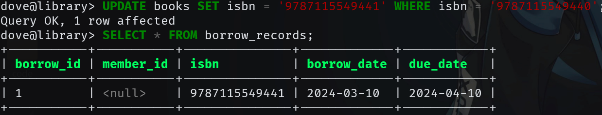
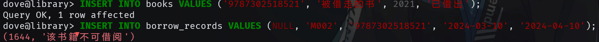

## 实验目的

熟悉通过SQL进行数据完整性控制的方法。

## 实验平台

数据库管理系统（推荐使用）：SQL Server、MySQL、OpenGauss、PolarDB

## 实验内容和要求

1. 定义若干表，其中包括 primary key, foreign key 和 check 的定义。

2. 表中插入数据，考察 primary key 如何控制实体完整性。

3. 删除被引用表中的行，考察 foreign key 中 on delete 子句如何控制参照完整性。

4. 修改被引用表中的行的 primary key，考察 foreign key 中 on update 子句如何控制参照完整性。

5. 修改或插入表中数据，考察 check 子句如何控制校验完整性。

6. 定义一个 trigger，并通过修改表中数据考察触发器如何起作用。

## 实验过程

### 创建数据库与表

```sql
CREATE DATABASE library;
USE library;
-- 创建会员表（主键 + CHECK）
CREATE TABLE members (
    member_id VARCHAR(10) PRIMARY KEY,
    name VARCHAR(50) NOT NULL,
    age INT CHECK (age >= 18),
    reg_date DATE NOT NULL
);

-- 创建书籍表（主键 + CHECK + 自增状态）
CREATE TABLE books (
    isbn CHAR(13) PRIMARY KEY,
    title VARCHAR(100) NOT NULL,
    publish_year YEAR CHECK (publish_year > 0),
    status ENUM('在库', '已借出', '维护中') DEFAULT '在库'
);

-- 创建借阅记录表（复合外键 + ON DELETE/UPDATE）
CREATE TABLE borrow_records (
    borrow_id INT AUTO_INCREMENT PRIMARY KEY,
    member_id VARCHAR(10),
    isbn CHAR(13),
    borrow_date DATE NOT NULL,
    due_date DATE NOT NULL,

    FOREIGN KEY (member_id)
        REFERENCES members(member_id)
        ON DELETE SET NULL
        ON UPDATE CASCADE,

    FOREIGN KEY (isbn)
        REFERENCES books(isbn)
        ON DELETE CASCADE
        ON UPDATE CASCADE,

    CHECK (due_date > borrow_date)
);
```


### 验证主键约束

```sql
-- 插入重复主键测试
INSERT INTO members VALUES ('M001', '张三', 20, '2023-01-01');
INSERT INTO members VALUES ('M001', '李四', 22, '2023-02-01'); -- 报错：Duplicate entry
```


确实无法插入重复的主键。

### 测试外键删除约束

```sql
-- 准备测试数据
INSERT INTO books VALUES ('9787115549440', '数据库系统', 2022, '在库');
INSERT INTO members VALUES ('M002', '王五', 25, '2023-03-01');
INSERT INTO borrow_records VALUES (NULL, 'M002', '9787115549440', '2024-03-10', '2024-04-10');
```


```sql
-- 删除被引用行（观察级联效果）
DELETE FROM members WHERE member_id = 'M002';  -- borrow_records.member_id设为NULL
SELECT * FROM borrow_records; -- 验证member_id变为NULL
```


`ON DELETE SET NULL` 确实生效了。

### 测试外键更新传播

> ps: 中途又配置了一下 mycli，所以 prompt 变了

```sql
-- 更新主键观察级联
UPDATE books SET isbn = '9787115549441' WHERE isbn = '9787115549440';
SELECT * FROM borrow_records; -- ISBN同步更新
```



`borrow_records` 中的 `isbn` 也得到了更新， `ON UPDATE CASCADE` 生效。

### 验证 CHECK 约束

```sql
-- 年龄约束测试
INSERT INTO members VALUES ('M003', '赵六', 17, '2023-04-01'); -- 报错：check约束失败

-- 出版年份测试
INSERT INTO books VALUES ('9787115549442', '死去之书', -2025, '在库'); -- 报错：年份小于 0

-- 日期逻辑校验
INSERT INTO borrow_records VALUES (NULL, 'M002', '9787115549441', '2024-03-10', '2024-03-09'); -- 报错：due_date早于borrow_date
```


三个 `CHECK` 约束均生效。

### 创建借阅状态触发器

```sql
-- mariadb 需要使用定界符来避免 ; 导致直接执行
DELIMITER $$

-- 借书时自动修改书籍状态
CREATE TRIGGER before_borrow
BEFORE INSERT ON borrow_records
FOR EACH ROW
BEGIN
    -- 声明一个变量存放状态
    DECLARE book_status VARCHAR(10);
    -- 用 SELECT 为 book_status 赋值
    SELECT status INTO book_status
    FROM books
    WHERE isbn = NEW.isbn;
    -- 标准 SQL 中，用 <> 表示不等
    IF book_status <> '在库' THEN
        -- 报错
        SIGNAL SQLSTATE '45000'
        SET MESSAGE_TEXT = '该书籍不可借阅';
    END IF;

    UPDATE books
    SET status = '已借出'
    WHERE isbn = NEW.isbn;
END$$

DELIMITER ;

DELIMITER $$

-- 还书触发器
CREATE TRIGGER after_return
AFTER DELETE ON borrow_records
FOR EACH ROW
BEGIN
    UPDATE books SET status = '在库' WHERE isbn = OLD.isbn;
END$$

DELIMITER ;
```

>
> mariadb 似乎不支持 referencing 呢
>


### 验证触发器工作

```sql
-- 尝试借阅不可用书籍
INSERT INTO books VALUES ('9787302518521', '被借走的书', 2021, '已借出');
INSERT INTO borrow_records VALUES (NULL, 'M002', '9787302518521', '2024-03-10', '2024-04-10'); -- 触发错误
```



```sql
-- 正常借阅流程验证
UPDATE books SET status = '在库' WHERE isbn = '9787302518521';
INSERT INTO borrow_records VALUES (NULL, 'M001', '9787302518521', NOW(), DATE_ADD(NOW(), INTERVAL 30 DAY));
SELECT status FROM books WHERE isbn = '9787302518521'; -- 状态变为'已借出'
```


借书后，原本的状态 '在库' 变成了 '已借出'。

```sql
-- 还书
DELETE FROM borrow_records
WHERE isbn = '9787302518521';
SELECT status FROM books WHERE isbn = '9787302518521';
```


还书之后，书本状态又从 '已借出' 变成了 '在库'。
