## 实验目的

1. 熟悉通过 SQL 进行安全性控制的方法。

## 实验平台

1. 数据库管理系统（推荐使用）：SQL Server、MySQL、OpenGauss、PolarDB

## 实验内容和要求

1. 建立表，考察表的生成者拥有该表的哪些权限。

2. 使用 SQL 的 grant 和 revoke 命令对其他用户进行授权和权力回收，考察相应的作用。

3. 建立视图，并把该视图的查询权限授予其他用户，考察通过视图进行权限控制的作用。

## 实验过程

### 1. 建立表，考察表的生成者拥有的权限

#### 步骤 1.1 创建数据库和表

首先，使用 MySQL 创建一个新的数据库和表。

```sql
-- 创建数据库
CREATE DATABASE PrivilegeControl;

-- 切换到新创建的数据库
USE PrivilegeControl;

-- 宿舍楼表
CREATE TABLE buildings (
    building_id INT PRIMARY KEY,
    name VARCHAR(20) NOT NULL,
    total_rooms INT
);

-- 学生表
CREATE TABLE students (
    student_id VARCHAR(12) PRIMARY KEY,
    name VARCHAR(20) NOT NULL,
    room_id INT,
    is_leader BOOLEAN DEFAULT 0
);

-- 宿舍表
CREATE TABLE rooms (
    room_id INT PRIMARY KEY,
    building_id INT,
    current_members INT,
    hygiene_score DECIMAL(3,1)
);
```

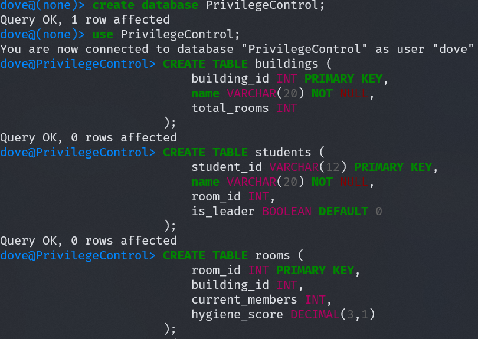

#### 步骤 1.2 查看表的权限

创建表后，表的生成者（通常为当前登录的用户）会拥有该表的所有权限。可以通过以下命令查看权限：

```sql
SHOW GRANTS FOR 'dove'@'%';
```

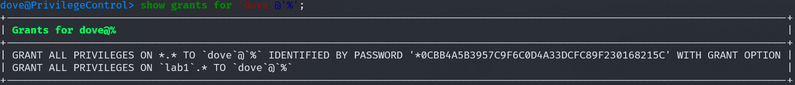

### 2. 使用 GRANT 和 REVOKE 命令对其他用户进行授权和权限回收

#### 步骤 2.1 创建用户

创建一个新用户，并为他们设置密码。

```sql
-- 宿管阿姨
CREATE USER 'dorm_manager'@'%' IDENTIFIED BY 'DormAdmin123';

-- 舍长
CREATE USER 'room_leader_411'@'%' IDENTIFIED BY 'Room411!';

-- 普通室友
CREATE USER 'ggg'@'%' IDENTIFIED BY 'ggg';
```

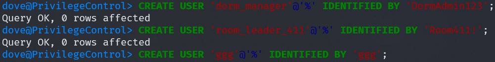

#### 步骤 2.2 授予权限

使用 GRANT 命令授予不同用户不同权限。

```sql
GRANT ALL PRIVILEGES
ON PrivilegeControl.*
TO 'dorm_manager'@'%';

GRANT SELECT
ON rooms
to 'room_leader_411'@'%';
```

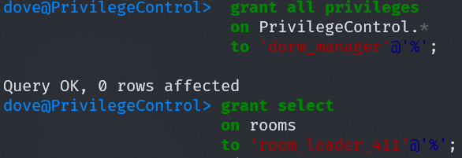

#### 步骤 2.3 测试权限

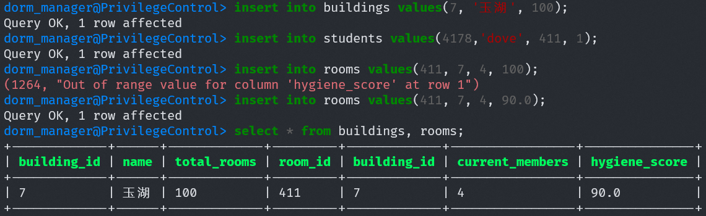
切换到 dorm_manager 用户，尝试执行以下操作：

```sql
insert into buildings values(7, '玉湖', 100);
insert into students values(4178,'dove', 411, 1);
insert into rooms values(411, 7, 4, 90.0);
select * from buildings, rooms;
```

操作正常执行，说明有 `insert` 和 `select` 权限。

```sql
insert into students values(6666,'ggg',411,0);
insert into students values(0000,'who',412,0);
delete from students where name='who';
```

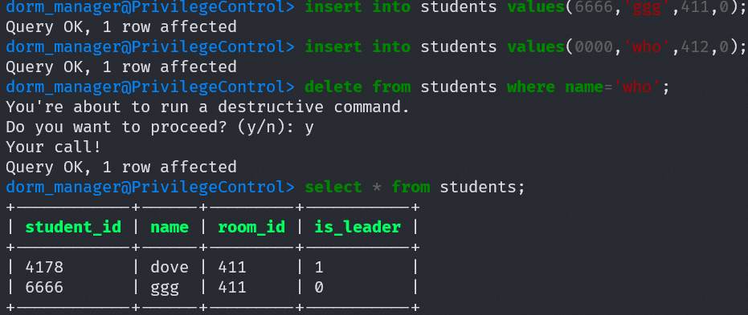

操作正常执行，说明有 `delete` 权限。

之后，切换到 room_leader_411 用户。

```sql
insert into students values(0000,'who',412,0);
select * from rooms;
delete from students where name='who';
```

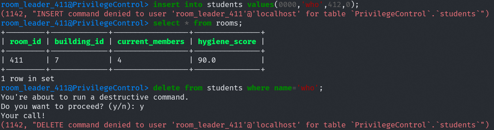

只有对 `room` 的 `select` 成功，其余操作均失败，与赋予的权限一致。

#### 步骤 2.4 回收权限

回收宿管阿姨的 `insert` 权限和舍长的 `select` 权限。

```sql
revoke select on rooms from 'room_leader_411'@'%';
revoke insert on PrivilegeControl.* from 'dorm_manager'@'%';
```

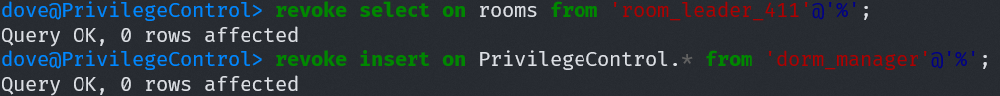

分别登录，检查权限是否被收回

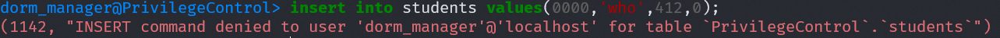

宿管阿姨无法 `insert`

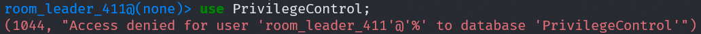

舍长因为没有了全部的权限，都没法使用数据库

### 3. 建立视图并授予查询权限

#### 步骤 3.1 创建视图

创建视图  `student_view`。

```sql
create view student_view as
select name, is_leader
from students;
```


#### 步骤 3.2 授予视图权限

把访问 `student_view` 的权限授予舍长。

```sql
grant select on student_view to 'room_leader_411'@'%';
```

#### 步骤 3.3 测试视图权限

切换宿管阿姨查询视图

```sql
select * from student_view;
```

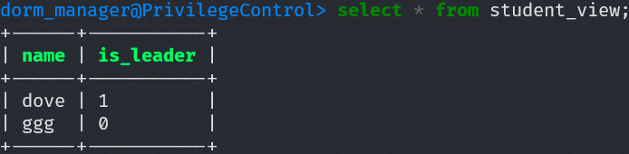

可见宿管阿姨继承了查询视图的权限。

切换舍长查询视图

```sql
select * from student_view;
select * from students;
```

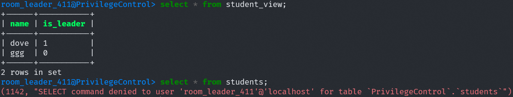

舍长拥有了查询 `student_view` 的权限，但是并不会因此获得对原表格的访问权限。

## 实验总结

通过本实验，我们完成了以下任务：

1. 创建表并验证表生成者的默认权限。
2. 使用 GRANT 和 REVOKE 命令对其他用户进行授权和权限回收，验证权限控制的效果。
3. 通过视图的方式限制数据访问范围，并授予查询权限，比较账号对原表格和视图的权限差异，验证视图在权限控制中的作用。
