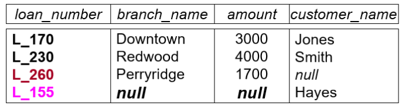

## Introduction

### 测试与评分

- 作业 10%
- 小测 10%
- 实验 30%
- 期末考 50%

期末考允许带一张 A4 纸。

### 传统数据库生态的四种角色

- DBMS 开发者：高水平计算机专家，开发标准化、产品化的数据库管理系统
- 系统集成商：普通编程人员，基于 DBMS 开发各类信息化应用系统
- 数据库管理员 DBA：运维人员，使用运维工具维护数据库管理系统
- 最终用户：业务专家，在各类业务场景中使用系统。

### 模型

- 对数据语义的抽象产生了关系数据模型
- 对业务逻辑的抽象产生了事务处理模型

数据库的三大成就是：关系模型、事务处理、查询优化。

### 什么是数据库系统

*数据库*是长期存储在计算机内的、大规模的、相互联系的、可共享的数据集合。

*数据库管理系统*(DBMS) 是数据库 + 用于管理数据库的程序。

> 有时我们会直接把数据库管理系统说成数据库。

### 学习什么

- 数据库的建模和设计——从现实中抽象
- 编程——使用数据库，学会 SQL 语言
- 实现 DBMS —— DBMS 如何工作、设计

### DBMS 的特征

- 数据管理的效率和可拓展性(scalability)
- 减小开发时间
- 数据独立性
- 数据完整性(integrity)与安全性
- 并发访问(concurrent access)和鲁棒性(robustness)

> 鲁棒性：稳健性、健壮性

### 文件系统的问题

在数据库系统出现之前，已经有了文件系统。然而，文件系统具有如下问题：

- 数据冗余(redundancy)和不一致(inconsistency)——文件格式非常多
- 访问数据困难——需要用新的程序来执行新的任务
- 数据隔离(isolation)——不同文件和不同格式，难以检索(retrieve)和分享
- 完整性约束还需要程序来完成，难以添加和修改约束
- 更新没有原子性(atomicity)
- 不容易被多个用户并发访问
- 安全问题

> 原子性：一个事务中的所有操作要么全部成功，要么全部失败回滚，不会结束在中间某个环节

这些问题可以借助数据库来解决。

### 数据的抽象等级

不同对数据库的使用方法需要不同等级的抽象。

- Physical Level: 描述一个 record 如何被存储
- Logical Level: 描述存储在数据库中的数据以及这些数据之间更高级的关系
- VIEW Level: 通过应用程序来显示某些数据的细节（可能隐藏一些细节）

#### 物理层的独立性

物理层实现的改变，不影响上层对它的使用。

> DBMS 最重要的优势之一

#### 逻辑层的独立性

数据库的逻辑结构发生变化时，应用程序无需修改。

> 这个较难实现

### DB 语言

- 数据定义语言(DDL)：指明结构
- **数据操纵语言(DML)**：增删改查。

> M: Manipulation

- 数据控制语言(DCL)：安全性相关。

SQL = DDL + DML + DCL

## 关系模型 Relational Model

### 六大基本操作

在关系代数中，有六个基本操作：

- 选择 SELECT，把表中符合某些条件的数据找出来，形成一个新的表。

> 记作 $\sigma_{p}(r)$，此处 $p$ 为筛选条件， $r$ 为表格。

- 投影 Project，它是一种纵向操作，提取一张表中的某些属性形成一个新的表，并合并其中重复的行。

> 记作 $\Pi_{array}(r)$，$array$ 是一个属性数组。

- 并 UNION，合并两张拥有相同属性名的表，并合并其中重复的行。

> 记作 $a \cup b$

- 集合差 SET Difference，在原表中去掉另一张表中已存在的行。

>记作 $a-b$

- 笛卡尔积 Cartesian product，对两个拥有不同属性的表操作，返回由各自的行的全部自由组合 collect 成的新表。

>记作 $a\times b$

- 重命名 Rename，重命名一张表里的属性名字。

>记作  $\rho_{R(A,B,\ldots)}(r)$，意为把表 $r$ 重命名为 $R$，并且把它的属性重命名为 $A,B,\ldots$

所有其它操作都可以表示成这六个基本操作的组合。

例如交操作，就可以表示成 $r∩s=r-(r-s)$，即用两次集合差实现。

### 四大常见操作

- 交 SET Intersection，提取两张表中相同的行。

> $$
> a\cap b=r-(r-s)
> $$

- 自然连接 Natural JOIN，连接两张表，保留其中公共属性相等的行。

> 例如， 对于表 $r(A,B),s(B,C)$，有
> $$
> r \JOIN s = \Pi_{A,B,C}\Bigl(\sigma_{r.B=s.B}(r \times s)\Bigr)
> $$
>
> theta 连接:先做笛卡尔积，然后做条件为 $\theta$ 的选择.

- 除 Division，首先舍弃除数表中所有被除数表不拥有的属性，然后返回一张最大的表，使得它与作为除数的表的笛卡尔积是被除的表的子集。

> 例如，对于表 $r(A,B),s(B)$，有
> $$
> r \div s = \{\, a \in \Pi_{A}(r) \mid \forall b \in s,\; (a,b) \in r \,\}
> $$

- 赋值 Assignment，把一个运算的结果赋给临时变量。

### 拓展操作

- 广义投影 Generalized Projection，允许把投影的属性数组替换成属性函数数组
- 聚合操作 Aggregate Functions AND Operations，实现取平均、最大值、最小值、求和、计数。

> 记作
> $$
> G_1,G_2,\ldots G_n\ {\Large g}_{f_1(R_1),f_2(R_2),\ldots f_n(R_n)}(r)
> $$
> 其中 $r$ 为表格，$f_1,f_2\ldots f_n$ 为聚合函数， $R_1, R_2,\ldots R_n$ 为 $r$ 的属性， $G_1,G_2,\ldots G_n$ 表示按照这些属性来聚合(可以为空)

### 数据库的修改

无非就是增删改的操作，我们用符号来表达它们。

- Deletion $A \leftarrow A-\sigma_{a=sth}(A)$
- Insertion $A \leftarrow A ∪ {(element_1,...element_n)}$
- UPDATE $A \leftarrow \Pi_{f(a_1),f(a_2),...f(a_n)}$

## SQL

### Data Definition Language

#### 建立表格

```sql
CREATE TABLE branch(
                    branch_name   char(15) NOT NULL,
                    branch_city    varchar(30),
                    assets    numeric(8, 2),
                    PRIMARY KEY (branch_name)
                );
```

支持使用 `super KEY`, `candidate KEY`, `PRIMARY KEY` 来指定键。

支持的数据类型：

- `char(n)`: 定长字符串。
- `varchar(n)`: 不定长字符串， `n` 为最大值。
- `int`: 整数，最大值视机器而定。
- `smallint`: 小整数。
- `numeric(p, d)`: 固定位数的数字，精度为 `p`，保留到 `d` 位十进制小数。
- `real, double precision`: 浮点数。
- `float(n)`: 至少 `n` 位精度的浮点数。
- `date`: 如 `2007-2-27`
- `Time`: 如 `11:18:16`
- `timestamp`: 如 `2011-3-17 11:18:16`

所有的数据类型都允许 `NULL`。

在建表时，我们可以添加完整性约束 Integrity Constraints，令一些属性必须满足一定的规则，如：

```sql
-- inside CREATE TABEL

-- 不可以是 NULL
branch_name   char(15) NOT NULL
-- 指定为主键
PRIMARY KEY (id)
-- 另一种方法
int id PRIMARY KEY
-- 添加检查条件
CHECK (age >= 0)
```

#### 删除表格

```sql
DROP TABLE some_table;
```

#### 编辑表格

添加一行

```sql
ALTER TABLE some_table ADD some_attribute some_domain;
ALTER TABLE some_table ADD (attribute_n domain_n, ... attributen_n domain_n);
```

添加一列

```sql
-- 所有的已有的行的新的 attribute 会被赋为 NULL
ALTER TABLE some_table ADD some_attribute some_domain_type;
```

删除一列

```sql
-- 有些数据库是不支持删除一个 attribute 的操作的
ALTER TABLE some_table DROP some_attribute;
```

修改列的定义

```sql
-- 修改了 branch_name 的数据类型，然后让 assets 不允许 NULL
ALTER TABLE branch MODIFY (branch_name char(30), assets NOT NULL);
```

建立索引。被建立索引后的字段查询效率可以提升。

```sql
CREATE INDEX some_index ON some_table (some_attribute);

-- 建立联合索引，提升同时涉及 attribute_1 和 attribute_2 的查询效率
CREATE INDEX somes_index ON some_table (attribute_1, attribute_2);

```

建立唯一索引。唯一索引保证了不出现重复值，实际上是指定了一个 `candidate KEY` 。

```sql
CREATE UNIQUE INDEX unique_index ON some_table (some_attribute);

```

删除索引

```sql
DROP INDEX some_index;
```

### 基础 Basic Structure

#### SELECT

```sql
SELECT a_1, a_2, ... a_n FROM r_1, r_2, ... r_n WHERE some_predication;
```

这和
$$
\Pi_{a_1,a_2,\ldots,a_n}(\sigma_{\text{SOME\_predication}}(r_1\times r_2\times\ldots\times r_m))
$$
等价。

sql 对大小写不敏感，但是不允许名称中使用 `-`。

sql 允许表中出现重复的 DOMAIN。因此，我们在 `SELECT` 的时候可以决定是否查询重复的 DOMAIN：

```sql
-- 查询全部的 DOMAIN，ALL 是默认的
SELECT ALL attr FROM rel;
-- 查询全部的 DOMAIN, 但是舍弃其中的重复部分
SELECT DISTINCT attr FROM rel;
```

可以使用通配符查询全部的属性

```sql
SELECT * FROM some_table
```

允许在选择子句中使用 `+,-,*,/`，这可以让返回的值为运算后的结果。

```sql
SELECT a_1, a_2, a_3*100 FROM some_table
```

`WHERE` 子句指明了筛选的条件：

```sql
SELECT loan_number
FROM loan
WHERE branch_name = 'Perryridge' AND amount > 1200;
```

`WHERE` 子句允许使用逻辑连接词 logical connectives `AND, OR, NOT`，同时提供了比较运算符 `BETWEEN` 来方便地表示范围

```sql
SELECT loan_number
FROM loan
WHERE amount BETWEEN 90000 AND 100000;
-- 等价于 WHERE amount >= 90000 AND amount <=100000
```

当我们从多张表中选择，且其中出现了同名属性时，有必要使用前缀来区分它们

```sql
-- loan(loan-number, branch-name, amount)
-- borrower(customer-name, loan-number)
SELECT customer_name, borrower.loan_number, amount
FROM borrower, loan
WHERE borrower.loan_number = loan.loan_number AND branch_name = 'Perryridge';

```

#### 重命名

sql 允许为关系和属性重命名。重命名方法为： `old_name AS new_name`。其中， `AS` 也可以用 `=` 替代。

```sql
SELECT some_attr AS new_name FROM some_table
```

 `AS` 子句也可以用来作为一个中间变量名，用来简化 `sql` 语句的书写

 ```sql
--  此处 AS 是允许省略的
SELECT customer_name, T.loan_number, S.amount
FROM borrower AS T, loan AS S
WHERE T.loan_number = S.loan_number;
 ```

通过重命名，我们还可以实现一张表中同一属性的自比较

```sql
SELECT DISTINCT T.branch_name
FROM branch AS T, branch AS S
WHERE T.assets > S.assets AND S.branch_city = 'Brooklyn';
```

#### 字符串匹配

`sql` 允许使用字符串匹配。它提供了以下符号

- `%` 匹配所有的子字符串
- `_` 匹配所有的字符

我们于是可以实现一些模糊查询：

```sql
SELECT customer_name
FROM customer
WHERE customer_name LIKE '%鸠%';
```

当需要匹配的字符中出现了 `%,_`，需要进行转义：

```sql
-- 指定转义字符为 '\'
LIKE 'Main\%' ESCAPE '\'
```

另外，还有如下操作：

- 字符串连接 `||`

```sql
SELECT '客户名=' || customer_name
FROM customer;
-- 获得的 DOMAIN 类似于
-- 客户名=张三
-- 客户名=李四
-- 客户名=王五
```

- 大小写转换 `lower(), upper()`
- 计算字符串长度和提取子字符串，不同的数据库语法可能不同

#### 对行排序

使用 `ORDER BY` 来排序。

```sql
SELECT DISTINCT customer_name
FROM borrower A, loan B
WHERE A.loan_number = B.loan_number AND branch_name = 'Perryridge'
ORDER BY customer_name;
-- 默认按升序排序
-- 如果需要降序，在后面加上 DESC
-- ORDER BY customer_name DESC
```

#### 重复 Duplicates

实际应用中，选择、投影和笛卡尔积操作是允许重复的行的。当不希望有重复时，使用关键词 `DISTINCT`。

下面举例说明重复的行为。对于
$$
\begin{align*}
    r_1(A,B)&={(1,a),(2,a)}\\
    r_2(C)&={(2),(3),(3)}
\END{align*}
$$
有
$$
\begin{align*}
\Pi_B(r_1)&={(a),(a)}\\
\Pi_B(r_1)\times r_2&={(a,2),(a,2),(a,3),(a,3),(a,3),(a,3)}
\END{align*}
$$

### 集合运算 SET Operations

在 `sql` 中，可以使用 `UNION`(并), `INTERSECT`(交), `EXCEPT`(减)来实现集合运算。

所有这些集合运算都会自动剔除重复部分。如果需要保留重复部分，需要在后面添加关键词 `ALL`。


这可以让我们很容易地处理多个表中的同一属性


对于这些命令的支持也视数据库不同而定。有些数据库，比如 `SQL Server 2000`，就不支持 `INTERSECT, EXCEPT`。

### 聚合函数 Aggregate Functions

聚合函数接受一个列，返回对应的值：

- `avg(col)`
- `min(col)`
- `max(col)`
- `sum(col)`
- `count(col)`

在使用聚合函数的时候，往往需要使用 `GROUP BY` 来指定根据什么聚合。

比如说，对于表格 `account(account_number, branch_name, balance)`，我想要找到每一个 `branch_name` 对应的平均 `balance`，就需要这么做：

```sql
-- 聚合函数后面的部分指定了新的属性名
SELECT branch_name, avg(balance) avg_bal
FROM account
GROUP BY branch_name;
```

可能的结果如：


借助 `HAVING` 子句，我们可以对有关聚合函数的结果进行二次筛选。

```sql
SELECT A.branch_name, avg(balance)
FROM account A, branch B
WHERE A.branch_name = B.branch_name AND branch_city ='Brooklyn'
GROUP BY A.branch_name
HAVING avg(balance) > 1200;
```

需要注意的是， `HAVING` 的筛选条件判断是在 `WHERE` 之后的，且聚合函数不可以直接在 `WHERE` 中使用。

至此，可以总结 `SELECT` 的结构了：

```sql
SELECT <[DISTINCT] c1, c2, …>
FROM <r1, …>
[WHERE <condition>]
[GROUP BY <c1, c2, …> [HAVING <cond2>]]
[ORDER BY <c1 [DESC] [, c2 [DESC|ASC], ...]>];

```

其执行顺序为

1. `FROM`
2. `WHERE`
3. `GROUP BY`
4. `HAVING`
5. `SELECT`
6. `DISTINCT`
7. `ORDER BY`

### NULL VALUES

 `NULL` 意味着一个未知或不存在的值。

- 任何 `NULL` 相关的算术运算都会返回 `NULL`。
- 任何 `NULL` 相关的比较运算都会返回 `unknown`。

下面是 `unknown` 参与逻辑运算的行为：


这可以简单地总结为 `true OR anything = true`, `false AND anything = false`。

当 `WHERE` 子句的计算结果为 `unknown` 时，它会被作为 `false` 处理。

我们使用 `IS NULL, IS NOT NULL` 来处理 `NULL`，而非使用 `=, !=`。

类似地，我们使用 `IS unknown` 来处理某个条件的结果为 `unknown` 的情况。

对于大多数聚合函数，它会忽略掉所有为 `NULL` 的值。如果所有的值都为 `NULL`，聚合函数也会返回 `NULL`。
> 需要注意的是，对于 `count()` 函数，它会对为 `NULL` 的行计数。
>
### 嵌套查询 Nested Subqueries

直接从实例出发吧。

#### IN

```sql
-- 使用嵌套
SELECT DISTINCT customer_name
FROM borrower
-- 反之为 NOT IN
WHERE customer_name IN (
    SELECT customer_name
    FROM depositor
);

-- 不使用嵌套
SELECT DISTINCT B.customer_name
FROM borrower B, depositor D
WHERE B.customer_name = D.customer_name
```

就结果而言，这两个操作是等价的，都是找到了既借钱又存钱的用户。然而，就过程而言，两者并不等价：

- 不使用嵌套时， `FROM borrower B, depositor D` 引入了一次昂贵的笛卡尔积操作。
- 使用嵌套时，先获得 `depositor` 中全部的 `customer_name`，然后再用它们过滤 `borrower` 表格。

>在同一 SQL 语句内，除非外层查询的元组变量引入内层查询，否则层查询只进行一次。

#### 比较

我们也可以通过嵌套来进行比较

```sql
SELECT account_number AN, balance
FROM account A
WHERE balance >=(
    SELECT max(balance)
    FROM account B
    WHERE A.branch_name = B.branch_name
);
```

这里可能比较令人费解。我们具体分析它如何工作：

1. 外部 `FROM`，定位 `account` 并重命名为 `A`
2. 外部 `WHERE`，对 `A` 遍历并判断其中的 `balance` 是否满足条件
3. 条件涉及了嵌套，于是进入内部。首先是内部 `SELECT`，再次定位 `account` 并重命名为 `B`
4. 内部 `WHERE`，对 `B` 遍历并判断其中的 `B.branch_name` 是否与外部待比较的 `balance` 所在行对应的 `A.branch_name` 相同
5. 内部 `SELECT`，收集内部 `WHERE` 中符合条件的行，并做 `max()` 聚合操作，结果与外部的 `balance` 作比较
6. 外部 `SELECT`，收集符合外部条件的行，提取其中的 `account_number` 作为 `AN` 列， `balance` 作为 `balance` 列。

实质上，就是取了 `account` 中每一个 `branch_name` 对应的 `max(balance)`，然后和对应的 `account_number` 合成一个新的表。这里较为复杂的原因是， `max()` 可以知道一组数据中最大的值是什么，但它却不会指出这个最大的值所在的行。因此，我们要先找出这些行，然后再做一次筛选。

#### SOME 和 ALL

 `SOME` 指将一个元素和一个集合中的每个元素进行比较，只要有一个为 `true`，那就为 `true`，否则为 `false`。


 `ALL` 指将一个元素和一个集合中的每个元素进行比较，只要有一个为 `false`，那就为 `false`，否则为 `true`。

 

```sql
SELECT branch_name
FROM branch
WHERE assets > ALL(
    SELECT assets
    FROM branch
    WHERE branch_city = 'Brooklyn'
);

-- 这也等价于
SELECT branch_name
FROM branch
WHERE assets >(
    SELECT max(assets)
    FROM branch
    WHERE branch_city = 'Brooklyn'
);
```

#### EXISTS

顾名思义， `EXISTS` 用于判断嵌套的 `SELECT` 结果是否不为空。它相反的操作即为 `NOT EXISTS`。

下面有一个较为复杂的例子，我们来分析一下：

假设已有表


我们尝试用 `sql` 语句实现数学表达式
$$
\begin{align*}
    &\Pi_{\text{customer\_name, branch\_name}}(\text{depositor}\bowtie\text{account})\\
    \div&\Pi_{\text{branch\_name}}(\sigma_{\text{branch\_city}='\text{Brooklyn}'}(\text{branch}))
\end{align*}
$$

首先，我们可以分别写出
$$
\Pi_{\text{customer\_name, branch\_name}}(\text{depositor}\bowtie\text{account})
$$
与
$$
\Pi_{\text{branch\_name}}(\sigma_{\text{branch\_city}='\text{Brooklyn}'}(\text{branch}))
$$
对应的 `sql` 表达式。

前者为

```sql
SELECT customer_name, branch_name
FROM depositor T, account R
WHERE T.account_number = R.account_number;
```

后者为

```sql
SELECT branch_name
FROM branch
WHERE branch_city = 'Brooklyn';
```

问题在于，这个除法怎么实现？

事实上，我们需要做的事情可以这样表达：

1. 对前者所有 `customer_name` 的可能值，检验包含它的所有行中的 `branch_name` 构成的集合 $A$，是否包含了后者(集合 $B$ )。
2. 收集第一步中所有成功通过检验的 `customer_name`。

这里有一个逻辑转换：检验集合 $A\supset B$ 似乎难以表达，但是它有一个等价的式子： $B-A=\emptyset$。而减法这个操作，恰恰可以用 `EXCEPT` 来表示。至于 $=\emptyset$ 的检验，则可以使用 `NOT EXISTS` 来完成。

我们首先表达这里的集合 $A$：

```sql
FROM depositor S
WHERE (
    SELECT DISTINCT R.branch_name
    FROM depositor T, account R
    WHERE T.account_number = R.account_number AND S.customer_name = T.customer_name
);
-- 这里 WHERE() 里面的 SELECT 语句的结果也就是关于 S.customer_name 的集合 A 了
```

然后就可以尝试表达减法：

```sql
FROM depositor S
WHERE(
    (
        SELECT branch_name
        FROM branch
        WHERE branch_city = 'Brooklyn'
    )
    EXCEPT
    (
        SELECT DISTINCT R.branch_name
        FROM depositor T, account R
        WHERE T.account_number = R.account_number AND S.customer_name = T.customer_name
    )
);
-- 这里 WHERE() 里面的结果也就是关于 S.customer_name 的 B - A 了
```

那么我们只要判断它是否为空，然后把为空的部分对应的 `customer_name` 收集起来就好了：

```sql
-- 收集 customer_name
SELECT DISTINCT S.customer_name
FROM depositor S
-- 判断是否为空
WHERE NOT EXISTS(
    (
        SELECT branch_name
        FROM branch
        WHERE branch_city = 'Brooklyn'
    )
    EXCEPT
    (
        SELECT DISTINCT R.branch_name
        FROM depositor T, account R
        WHERE T.account_number = R.account_number AND S.customer_name = T.customer_name
    )
);
```

#### UNIQUE

`UNIQUE` 关键词用于检验子查询中的行是否没有重复值。反之，则为 `NOT UNIQUE`。

比如说，我想要找到所有的在 Perryridge 这个 branch 中只有至多一个账号的顾客：

```sql
SELECT customer_name
FROM depositor T
WHERE UNIQUE(
    SELECT R.customer_name
    FROM account A, depositor R
    WHERE T.customer_name = R.customer_name AND R.account_number = A.account_number AND A.branch_name = 'Perryridge'
);
```

有些数据库不支持 `UNIQUE/NOT UNIQUE`，如 Oracle 8/SQL Server 7。

### 视图 Views

`VIEW` 提供了一种结构来隐藏一些数据，用于特定用户的查看。使用视图有利于保护数据的安全性，也更方便于用户的使用。

#### 建立视图

```sql
CREATE VIEW some_view AS(
    SELECT attr_1, attr_2, ... attr_n
    FROM some_table
);
-- 也可以重命名属性
CREATE VIEW some_view (new_attr_1, new_attr_2, ... new_attr_n) AS(
    SELECT attr_1, attr_2, ... attr_n
    FROM some_table
);
```

当然，这个括号里面也可以塞嵌套查询。

#### 删除视图

```sql
DROP VIEW some_view;
```

### 派生关系 Derived Relations

至此，我们没有在 `FROM` 中使用很复杂的结构。而事实上，它是可以接受一个表达式的：

```sql
SELECT TT.sno, sname, c_num
FROM (
    SELECT sno, count(cno) AS c_num
    FROM enroll
    GROUP BY sno
) AS TT, student S
WHERE TT.sno = S.sno AND c_num > 10;
```

> 不管是否被引用， `FROM` 中用表达式得到的导出表 derived TABLE 必须给出别名。

使用 `WITH` 关键字，我们可以把这个表达式单独移出去，以使结构更加清晰。

```sql
WITH TT(sno, c_num) AS
    SELECT sno, count(cno) AS c_num
    FROM enroll
    GROUP BY sno
SELECT TT.sno, sname, c_num
FROM TT, student S
WHERE TT.sno = S.sno AND c_num > 10;
```

需要注意的是， `WITH` 生成的 `VIEW` 是单独为了对应的 query 服务的，它并不能被全局使用。

### 修改数据库 Modification OF the Database

#### 删除行

```sql
DELETE FROM some_table_or_view
WHERE some_condition;
```

#### 插入行

直接插入

```sql
-- 如果少写几个属性，将会插入 NULL
INSERT INTO some_table_or_view(attr_1, attr_2, ..., attr_n)
VALUES(domain_1, domain_2, ..., domain_n);
```

使用 `SELECT` 语句的结果插入

```sql
INSERT INTO account
SELECT loan_number, branch_name, 200
FROM loan
WHERE branch_name = 'Perryridge';

```

> 在 `INSERT` 之前， `SELECT` 的结果就已经计算完毕。所以，诸如在同一个表中 `SELECT` 并插入它本身的代码是可以执行的。
>
#### 更新行

```sql
UPDATE some_table_or_view
SET attr_1 = domain_1, attr_2 = domain_2, ..., attr_n = domain_n
WHERE some_condition;
```

`CASE` 语句可以辅助 `SET` 赋值

```sql
UPDATE account
SET balance =(
    CASE
        WHEN balance <= 10000 THEN balance * 1.05
        ELSE   balance * 1.06
    END
);
```

> 值得注意的是， `VIEW` 是虚表，任何对 `VIEW` 的操作都将转化为对基表的操作。
>
> 因此， `VIEW` 的更新是受到严格限制的。只有**行列视图**，即建立在单个基本表上，且列能够对应的视图，才能够更新数据。
>
### Joined Relations

`JOIN` 接受两个表格，然后返回一个新的表格。

我们举例说明：


**JOIN condition** 定义了两个表格中的哪些行可以匹配。

- `NATURAL` 自然连接。比较所有同名属性，且在返回的表格中消去重名属性(见 **JOIN type** 配图)。
- `ON some_condition` 非自然连接。它容许不同名属性的比较，且返回的表格中不消去重名属性。

```sql
SELECT * FROM loan INNER JOIN borrower ON loan.loan_number = borrower.loan_number;
```


- `USING (common_attr_1, common_attr_2, ..., common_attr_n)` 类似于自然连接，只是仅以它列出的公共属性作为连接条件。

```sql
SELECT * FROM loan INNER JOIN borrower USING(loan_number);
```


**JOIN type** 定义了参与 `JOIN` 的表格中不与其它表格的任何行匹配的行会如何被处理。

- `INNER JOIN` 只输出匹配成功的行

```sql
SELECT * FROM loan NATURAL INNER JOIN borrower;
```


- `LEFT OUTER JOIN`

```sql
SELECT * FROM loan NATURAL LEFT OUTER JOIN borrower;
```


- `RIGHT OUTER JOIN`

```sql
SELECT * FROM loan NATURAL RIGHT OUTER JOIN borrower;
```


- `FULL OUTER JOIN`

```sql
SELECT * FROM loan NATURAL FULL OUTER JOIN borrower;
```



## SQL 进阶

### SQL Data Types AND Schemas

sql 允许自定义类型：

```sql
-- 创建类型
CREATE TYPE person_name AS varchar (20)
-- 删除类型
DROP type person_name
```

sql 也允许自定义域(可添加约束)

```sql
CREATE DOMAIN Dollars AS numeric(12, 2) NOT NULL;
```

另外，我们再介绍两种类型：Large-object types

- blob: binary large object
- clob: character large object

查询时，返回它们的指针而非它们本身。

```sql
CREATE TABLE students(
    sid char(10) PRIMARY KEY,
    name varchar(10),
    gender char(1),
    photo blob(20MB),
    cv clob(10KB)
);
```

### 完整性约束 Integrity Constraints

#### 域约束 DOMAIN Constraints

- `NOT NULL`
- `PRIMARY KEY`
- `UNIQUE`
- `CHECK(SOME condition)`

#### 参照完整性 Referential Integrity

~~一般来说~~，假设有表 $a,b$， $a$ 中的一个属性 $p$ 是 $b$ 中的主键，那么我们说 $p$ 是 $a$ 中的一个外键 FOREIGN KEY。此时， $a$ 被称为参照关系 REFERENCING relation， $b$ 被称为被参照关系 referenced relation。

参照关系中外键的值若不为 `NULL`，则必须在被参照关系中实际存在。

在建表时，我们这样说明参照

```sql
-- account_number 是关联 account 中 account_number 的外键
FOREIGN KEY (account_number) REFERENCES account
-- account_number1 是关联 account 中 account_number2 的外键
FOREIGN KEY (account_number_1) REFERENCES account (account_number_2)
```

参照关系会引入增删改查上的一些限制，所谓参照完整性。

继续以 $a,b$ 为例:

- 当我想要在 $a$ 中插入时，我一定要在 $b$ 中检查，确保插入的 $p$ 在 $b$ 中能够找到。
- 当我想要在 $b$ 中删除时，我一定要在 $a$ 中删除所有的包含被删除的 $p$ 的行。
- 当我想要更新 $a$ 时，我一定要检查新的 $p$ 的值在 $b$ 中能够找到。
- 当我想要更新 $b$ 时，如果修改了 $p$，要么拒绝这个更新，要么所有 $a$ 中包含原 $p$ 的行都要被更新。

为了保证上述完整性，我们可以使用 `SQL` 的级联操作 `Cascading actions`：

- `ON DELETE CASCADE`：被参照关系中的行被删除时，删除参照关系中所有引用改行的记录
- `ON UPDATE CASCADE`：被参照关系中的主键更新时，同步更新参照关系中引用该键的外键值
- `ON DELETE SET NULL`：被参照关系中的行被删除时，参照关系中对应外键变为 `NULL`
- `ON UPDATE SET NULL`：被参照关系中的主键更新时，参照关系中对应外键变为 `NULL`

> 一般来说，不建议使用 `NULL`，这容易导致参照完整性的语义更为复杂。

```sql
CREATE TABLE parent (
    id INT PRIMARY KEY
);

CREATE TABLE child (
    id INT PRIMARY KEY,
    parent_id INT,
    FOREIGN KEY (parent_id)
        REFERENCES parent(id)
        ON DELETE CASCADE
        ON UPDATE CASCADE
);
```

如果多个表之间存在级联外键依赖，且都设置了 `ON DELETE CASCADE`/`ON UPDATE CASCADE`，那么在链的一端执行删除或更新操作会自动传播到整个依赖链上。但如果这种级联操作中某一处导致了无法通过进一步级联解决的约束冲突，系统便会中止整个事务，所有因该事务及其级联操作所做的更改都会被回滚。

值得注意的是，参照完整性只在事务 transaction 的最后进行检查。这意味着，一些可能在中间破坏约束，但是在最后恢复约束的操作是被允许的。

#### 断言 ASSERTION

断言包含一个必须始终被满足的条件。

```sql
CREATE ASSERTION some_assertion_name
    CHECK some_condition;
```

在建立一个断言后，每一次可能与断言条件冲突的更新都会被检测。如果断言条件不符合，就会汇报错误。
> 这些检测有可能引入很高的开销，因此应慎用

比如说，我们希望约束每一个银行分行的总 loan 要小于它的总 balance，那么就可以有：

```sql
CREATE ASSERTION sum_constraint CHECK(
    NOT EXISTS(
        SELECT *
        FROM branch B
        WHERE(
            SELECT sum(amount)
            FROM loan
            WHERE loan.branch_name = B.branch_name
        ) > (
            SELECT sum(balance)
            FROM account
            WHERE account.branch_name = B.branch_name
        )
    )
);
```

这里使用了逻辑
$$
\forall xP(x)=(\lnot\exist x)(\lnot P(x))
$$

#### 触发器 TRIGGER

触发器是一段会在对数据库进行一定修改时自动触发的指令。我们需要明确触发器的触发条件和行为。

我们从一个实例出发：假设我们不允许一个负存款用户，而是希望把存款归零，然后把负数部分变成贷款。此时，触发器的触发条件就是某次更新使得存款变成负数。

```sql
-- loan(loan_number, branch_name, amount)
-- borrower(customer_name, loan_number)
-- account(account_number, branch_name, balance)
-- depositor(customer_name, account_numeber)

-- 创建一个叫做 overdraft_trigger 的触发器
CREATE TRIGGER overdraft_trigger
    -- 在对 account 更新后触发
    AFTER UPDATE ON account
    -- 命名被更新的行为 nrow
    REFERENCING NEW ROW AS nrow
    -- 指定每更新一行就触发一次
    FOR EACH ROW
    -- 指定只有更新的行的 balance < 0 才触发后续行为
    WHEN nrow.balance < 0
-- 标志触发器行为开始，atomic 表明触发器内部所有操作视为一个原子操作
BEGIN ATOMIC
    -- 将负余额的账户对应存款人信息插入到 borrower 表中
    INSERT INTO borrower (
        SELECT customer_name, account_number
        FROM depositor
        WHERE nrow.account_number = depositor.account_number
    );

    -- 将负余额变成贷款信息插入到 loan 表中，贷款金额为负余额的绝对值
    INSERT INTO loan
    VALUES (
        nrow.account_number,
        nrow.branch_name,
        -nrow.balance
    );

    -- 更新 account 表，将余额置零
    UPDATE account
    SET balance = 0
    WHERE account.account_number = nrow.account_number;
END;
```

在上面的代码中，引起触发器的事件为 `AFTER UPDATE ON account`。共有三种可用的触发事件:

- `INSERT`
- `DELETE`
- `UPDATE`

其中， `ON UPDATE` 这个触发事件可以被限制到特定属性的更新上，如上面就可以改成 `AFTER UPDATE OF balance ON account`。

对于行级别的触发器，参照有如下选择：

- 对于删除或更新，可使用 `REFERENCING OLD row AS some_name`
- 对于插入或更新，可使用 `REFERENCING NEW row AS some_name`

对于指令级别的触发器(`FOR EACH statement`)，参照则有如下选择：

- 对于删除或更新，可使用 `REFERENCING OLD TABLE AS some_name`
- 对于插入或更新，可使用 `REFERENCING NEW TABLE AS some_name`

上面的 `TABLE` 都只包含被改变的行。对于需要改变大量的行的操作，指令级别的触发器更有效率。

我们有时可能希望在一些操作发生时，可以调用数据库外部的一些命令。遗憾的是，触发器只对数据库内部生效，无法直接调用外部命令。

一个 workaround 是，我们在需要调用外部命令时，就在一张特定的表格中添加一行，代表一些操作。然后，作为通讯方式，让一个独立的外部进程轮询这个表格。一旦发现有待执行的操作，就执行它。执行完对应操作后，再把记录删除。

### 授权 Authorization

数据库安全性主要是防止恶意攻击者窃取或更改数据。它有以下层面：

- 数据库系统级别: **认证 (Authentication)** 和 **授权 (Authorization)**

  数据库通过验证用户身份（认证）和限制用户的权限（授权），确保只有被允许的用户才能访问或修改特定数据。

- 操作系统级别: 数据库依赖操作系统提供的安全机制

  只有拥有操作系统超级用户权限的用户才能对数据库数据进行任意操作，因此必须保证操作系统安全，防止超级用户滥用权限。

- 网络级别: 防止数据窃听和身份冒充

  使用加密技术保护网络传输的数据，防止未授权用户窃取信息（窃听）或冒充授权用户（伪装）。

- 物理级别: 保护数据库服务器的物理安全

  防止未经授权的物理访问，比如通过锁门、监控、防火措施以及防灾方案（如防水、防火、灾备恢复等）保护数据。

- 人员级别: 用户管理和安全意识培训

  严格筛选有权限访问数据库的用户，并对他们进行密码选择和保密方面的培训，防止内部用户失误或成为攻击目标。

**授权**是保护数据库安全的重要方式。以下列举了授权的一些形式：

#### 针对数据库部分内容的授权

- **读取授权 (Read authorization)**
  允许用户读取数据库中的数据，但不允许对数据进行修改。

- **插入授权 (Insert authorization)**
  允许用户向数据库中插入新数据，但不允许修改已经存在的数据。

- **更新授权 (Update authorization)**
  允许用户修改已有数据，但不允许删除数据。

- **删除授权 (Delete authorization)**
  允许用户删除数据库中的数据。

#### 针对数据库模式修改的授权

- **索引授权 (Index authorization)**
  允许用户创建和删除数据库中的索引，提高查询效率。

- **资源授权 (Resources authorization)**
  允许用户创建新的关系（表格），扩展数据库资源。

- **更改授权 (Alteration authorization)**
  允许用户添加或修改现有关系中的属性（字段）。

- **删除关系授权 (Drop authorization)**
  允许用户删除整个关系（表格），从而修改数据库的结构。

可以只赋予用户视图权限，而不对构成视图定义的底层关系进行授权。也就是说，视图可以充当一个安全层，屏蔽底层表中的敏感数据。

视图通过隐藏没必要展示给用户的数据，既简化了系统的使用，也增强了安全性。

举个例子，银行职员只需要知道银行的用户名，不需要知道银行具体的存款信息，那么就可以建立一个只包含 `customer_name` 的视图 `cust_loan`。

在查询视图时，查询处理器 query processor 首先检查查询者对视图的访问权限。然后，视图根据其定义被展开成对原表的查询操作。

- 视图不创建实际数据，因此创建视图不需要资源授权。
- 视图的创建者只继承他对构成视图的基础表上已有的权限。

