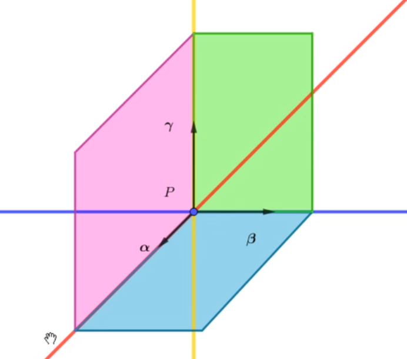

这个笔记完全是自学所记，主要记录一些关键知识和自己的理解。

## 曲率和 Frenet 标架

### 曲率的定义

设曲线 $\mathbf{r}=\mathbf{r}(s)$ ($s$ 为弧长参数) 存在二阶导数，则称 $\left|\mathbf{r}''(s)\right|$ 为曲线在 $P(s)$ 处的曲率，记作 $\kappa (s)$。

$\mathbf{r}'(s)$ 的长度永远为 1，所以它实际上就是曲线在 $\mathbf{r}$ 在 $P(s)$ 处的单位切向量，那么曲率也就体现了曲线的切向的变化率。在几何直观上，它描述了曲线的弯曲程度。

- 曲线为直线当且仅当其曲率永远为 0。
- 圆的曲率恒为一个非零常数。

通过把圆放到一个合适的坐标系里，使得圆的方程为

$$
\mathbf{r}(s)=\left(R\cos\left(\frac{s}{R}\right),
R\sin\left(\frac{s}{R}\right), 0\right)
$$

那么就有

$$
\left\{
  \begin{align*}
    \mathbf{r}'(s)&=\left( -\sin\left(\frac{s}{R}\right),
    \cos\left(\frac{s}{R}\right), 0 \right)\\
    \mathbf{r}''(s)&= \frac{1}{R}\left(
    -\cos\left(\frac{s}{R}\right), -\sin\left(\frac{s}{R}\right),0 \right)
  \end{align*}
  \right.
$$

于是圆的曲率恒为 $\frac{1}{R}$。

### Frenet 标架

设曲线 $\mathbf{r}(s)$ 在每一点的曲率都不等于 0，则称

$$
\left\{
  \begin{align*}
    \mathbf{\alpha }(s)&=\mathbf{r}'(s)\\
    \mathbf{\beta }(s)&=\frac{\mathbf{r}''(s)}{\left|\mathbf{r}''(s)\right|}\\
    \mathbf{\gamma }(s)&=\frac{\mathbf{r}'(s)\times
    \mathbf{r}''(s)}{\left|\mathbf{r}'(s)\times \mathbf{r}''(s)\right|}
  \end{align*}
  \right.
$$

分别为曲线在 $P(s)$ 处的单位切向量、主法向量和副法向量。这三个向量都是单位向量。

当一个向量函数在每一点的值模长始终为 1 时，它的导函数在每一点和它都垂直。所以，我们就得出 $\mathbf{\beta }(s)$ 和 $\mathbf{\alpha }(s)$ 垂直。因此，上面的三个向量就两两垂直。

于是，我们称

$$
\left\{ P(s);\mathbf{\alpha }(s),\mathbf{\beta }(s),\mathbf{\gamma }(s) \right\}
$$

为曲线 $\mathbf{r}(s)$ 在点 $P(s)$ 处的 Frenet 标架，三个向量统称为基本向量。

### 基本向量和曲率的一般参数表示

$$
\left\{
  \begin{align*}
    \mathbf{\alpha}&=\frac{\mathbf{r}'(t)}{\left|\mathbf{r}'(t)\right|}\\
    \mathbf{\gamma }&=\frac{\mathbf{r}'(t)\times
    \mathbf{r}''(t)}{\left|\mathbf{r}'(t)\times \mathbf{r}''(t)\right|}\\
    \mathbf{\beta }&=\mathbf{\gamma }\times \mathbf{\alpha }
  \end{align*}
  \right.
$$

证明略。主要思路即通过复合函数求导法则推导。注意几何含义：$\frac{\mathrm{d}s}{\mathrm{d}t}=|\mathbf{r}'(t)|$。

在推导过程中，我们会得到

$$
\mathbf{r}'(t)\times \mathbf{r}''(t) = \left|\mathbf{r}'(t)\right|^3
\left( \mathbf{r}'(s) \times \mathbf{r}''(s) \right)
$$

于是就有

$$
\kappa =
\frac{\left|\mathbf{r}'(t)\times\mathbf{r}''(t)\right|}{\left|\mathbf{r}(t)'\right|^3}
$$

### 基本三棱形

- 过 $P$ 点，平行于 $\mathbf{\alpha }, \mathbf{\beta }, \mathbf{\gamma }$ 的直线分别称为曲线在点 $P$ 的切线、主法线和副法线。
- 过 $P$ 点，平行于 $\mathbf{\alpha }, \mathbf{\beta }, \mathbf{\gamma }$ 的平面分别称为曲线在点 $P$ 的法平面，从切平面和密切平面。
- 由 $P$ 点和 $P$ 点的三个基本向量，切线，主法线和副法线，法平面，从切平面和密切平面构成的图形称为曲线在 $P$ 点的基本三棱形。

它们的方程分别为：

$$
\left\{
  \begin{align*}
    \mathbf{\rho }-\mathbf{r}&=\lambda \mathbf{\alpha }\\
    \mathbf{\rho }-\mathbf{r}&=\lambda \mathbf{\beta }\\
    \mathbf{\rho }-\mathbf{r}&=\lambda \mathbf{\gamma }\\
    \left( \mathbf{\rho }-\mathbf{r} \right) \cdot \mathbf{\alpha }&=0\\
    \left( \mathbf{\rho }-\mathbf{r} \right) \cdot \mathbf{\beta  }&=0\\
    \left( \mathbf{\rho }-\mathbf{r} \right) \cdot \mathbf{\gamma  }&=0
  \end{align*}
  \right.
$$

空间曲线一点处的密切平面就是和曲线在该点最为贴近的一个平面。

## 挠率和 Frenet 公式

### 挠率

$\mathbf{\gamma }'(s) \parallel \mathbf{\beta }(s)$：
由

$$
\mathbf{\alpha }'(s)=\kappa (s)\mathbf{\beta }(s)
$$

和

$$
\mathbf{\gamma }'(s)=\mathbf{\alpha }'(s)\times \mathbf{\beta
}(s)+\mathbf{\alpha }(s)\times \mathbf{\beta }'(s)
$$

可得

$$
\mathbf{\gamma }'(s)=\mathbf{\alpha }(s)\times \mathbf{\beta }'(s)
$$

所以，$\mathbf{\gamma }'(s)$ 与 $\mathbf{\alpha }(s)$ 垂直，而 $\mathbf{\gamma} (s)$ 为单位长，于是可得 $\mathbf{\gamma }'(s)$ 垂直于 $\mathbf{\gamma }(s)$，因此 $\mathbf{\gamma }'(s) \parallel \mathbf{\beta }(s)$。

我们不妨设
$$
\mathbf{\gamma }'(s)=-\tau (s)\mathbf{\beta }(s)
$$

于是(这里用到了 $\mathbf{\beta }(s)$ 是单位向量的性质)
$$
\tau (s)=-\mathbf{\gamma }'(s)\cdot \mathbf{\beta }(s)
$$

我们称 $\tau (s)$ 为曲线的挠率。

### 挠率的表达式

$$
\begin{align*}
\tau (s)&=\frac{\left( \mathbf{r}'(s), \mathbf{r}''(s), \mathbf{r}'''(s) \right)}{\kappa ^2(s)}\\
\tau (t)&=\frac{\left( \mathbf{r}'(t), \mathbf{r}''(t), \mathbf{r}'''(t) \right)}{\left|\mathbf{r}'(t)\times \mathbf{r}''(t)\right|^2}
\end{align*}
$$

### Frenet 公式

$$
\left\{
\begin{align*}
\mathbf{\alpha }'(s)&=\kappa (s)\mathbf{\beta }(s)\\
\mathbf{\beta }'(s)&=-\kappa (s)\mathbf{\alpha }(s)+\tau (s)\gamma (s)\\
\mathbf{\gamma }'(s)&=-\tau (s)\beta (s)
\end{align*}
\right.
$$

此为曲线在点 $P(s)$ 处的 Frenet 公式。这意味着，三个基本向量的导数可以直接由曲率、挠率和三个基本向量的线性组合表示。

### 几何含义

> 曲率处处不为零的空间曲线为平面曲线，当且仅当其挠率为 0。

单向证明：

如果 $\mathbf{r}(s)$ 是一条平面曲线，那么设它所在的平面的法向量为 $\mathbf{n}$。于是单位切向量
$$
\mathbf{\alpha }\cdot \mathbf{n} = 0
$$

上式两端同时对 $s$ 求导即有
$$
\left\{
\begin{align*}
\mathbf{r}''(s)\cdot \mathbf{n}&=0\\
\mathbf{r}'''(s)\cdot \mathbf{n}&=0
\end{align*}
\right.
$$

于是就可以知道，这三个导数共面，根据挠率的表达式就得到挠率的值为 $0$。

这说明，挠率刻画了空间曲线在垂直于切平面方向上的弯曲程度。

> 所有密切平面过定点的正则曲线是平面曲线。

这和所有切线过定点的正则曲线是直线很类似！

## 空间曲线一点邻近的结构

