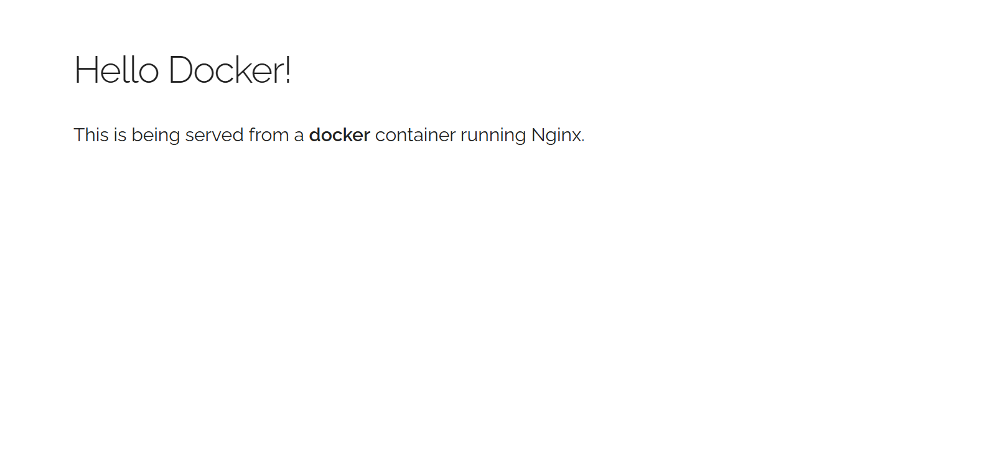
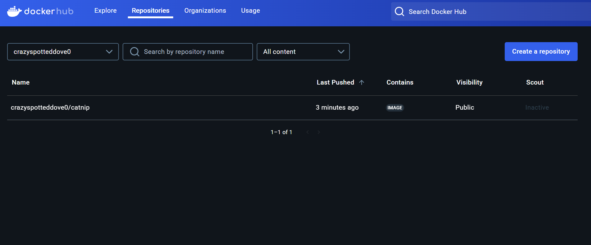
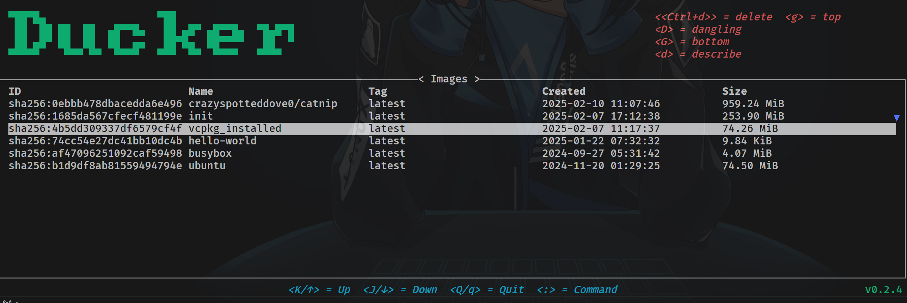

> Reference: [https://docker-curriculum.com/](https://docker-curriculum.com/)

## 基本概念

* image <=> 镜像：一个模板，包含了运行某个应用程序所需的一切，比如代码、运行时环境、库和配置等。
* container <=> 容器：镜像的可执行实例，利用镜像构建运行时环境，可以启动、停止、删除和交互。
* Docker Hub <=> Docker 仓库，存储着大量可用镜像。
* Docker daemon <=> docker 守护进程/引擎，它提供 Docker API 接口并管理容器。用户使用 docker 命令，然后 docker 命令会通过 Docker API 对守护进程发起请求，以执行对容器的相关操作。如果守护进程停止或者重启，所有的容器都会停止或重启。

## Docker 基本命令

### 拉取和检查 image

`docker pull`命令可以拉取可用的 image：

```bash
docker pull busybox
# stdout
Using default tag: latest
latest: Pulling from library/busybox
9c0abc9c5bd3: Pull complete
Digest: sha256:a5d0ce49aa801d475da48f8cb163c354ab95cab073cd3c138bd458fc8257fbf1
Status: Downloaded newer image for busybox:latest
docker.io/library/busybox:latest
```

可以使用`docker images`命令来查看本地有哪些 image

```bash
docker images
# example stdout
REPOSITORY        TAG          IMAGE ID       CREATED        SIZE
init              latest       1685da567cfe   29 hours ago   266MB
<none>            <none>       71b2386e14aa   35 hours ago   77.9MB
vcpkg_installed   latest       4b5dd309337d   35 hours ago   77.9MB
koa-demo          latest       3ef13caf5890   6 days ago     677MB
hello-world       latest       74cc54e27dc4   2 weeks ago    10.1kB
ubuntu            latest       b1d9df8ab815   2 months ago   78.1MB
busybox           latest       af4709625109   4 months ago   4.27MB
php               5.6-apache   24c791995c1e   6 years ago    355MB
```

### 从 image 运行 container

`docker run`会先检查本地是否已经有指定的 image(没有则尝试拉取)，然后从这个 image 创建一个 container

```bash
docker run busybox echo "hello from busybox"
# stdout
hello from busybox
```

如上的命令从本地的 busybox image 创建了 container，并让它执行了命令`echo "hello from busybox"`。

可以使用`docker ps`命令来查看当前正在运行的 container

```bash
docekr ps
# stdout
CONTAINER ID   IMAGE     COMMAND   CREATED   STATUS    PORTS     NAMES
```

可以发现什么在运行的容器都没有。这是因为之前建立的 container 在执行了`echo`命令后就光荣退役了。

我们可以再使用`docker ps -a`来查看所有的 container

```bash
docker ps -a
# example stdout
CONTAINER ID   IMAGE                    COMMAND                  CREATED              STATUS                          PORTS     NAMES
a7ce83fb76c1   busybox                  "echo 'hello from bu…"   About a minute ago   Exited (0) About a minute ago             nervous_taussig
56ca32f9766d   hello-world              "/hello"                 13 minutes ago       Exited (0) 13 minutes ago                 hungry_haibt
91236c261621   vcpkg_installed:latest   "bash"                   34 hours ago         Exited (0) 29 hours ago                   blissful_johnson
```

想要让容器不止执行一个命令？一个可能的想法是进入容器，然后在里面执行一些命令。这时，我们可以用

```bash
docekr run -it busybox sh
# 在镜像名后面指定需要使用的交互工具，常见的选择为 bash，此处为 sh
```

这时，你大概率会发现你的终端提示符不太一样了，这表明你进入了容器内部。一个通用的检查方法是：`ls`一下吧

```bash
# in the container
ls
# stdout
bin   dev   etc   home  proc  root  sys   tmp   usr   var
```

想要退出这个容器，只需要运行`exit`就可以了。

这时，如果你再一次`docker ps -a`，你会发现有了两个 busybox 容器。

```bash
docker ps -a
CONTAINER ID   IMAGE                    COMMAND                  CREATED          STATUS                      PORTS     NAMES
a12779762bd0   busybox                  "sh"                     8 minutes ago    Exited (0) 5 minutes ago              priceless_murdock
a7ce83fb76c1   busybox                  "echo 'hello from bu…"   17 minutes ago   Exited (0) 17 minutes ago             nervous_taussig
```

### 删除容器

为了在容器工作完成后立刻删除它，你可以在`docker run`时添加参数`--rm`，如`docker run busybox --rm`

你也可以通过指明待删除容器 id 的方式删除已有容器。如果删除成功，会返回被删除的容器 id。

```bash
docker rm a12779762bd0 a7ce83fb76c1
# stdout
a12779762bd0
a7ce83fb76c1
```

如果希望删除所有的不在工作的容器，可以使用`docker container prune`

```bash
docker container prune
# example stdout
WARNING! This will remove all stopped containers.
Are you sure you want to continue? [y/N] y
Deleted Containers:
56ca32f9766d03f4ed2142e535df07eee9bf5a9d5870bc7c8c3f4861501a118c
91236c261621a3d45375ad73b4f1d83633e553efc45ab9988dc06ca38a50ce7c

Total reclaimed space: 75B
```

### 删除镜像

使用`docker rmi`加指定 id 的方式可以删除镜像

```bash
# example
docker rmi 71b2386e14aa
Deleted: sha256:71b2386e14aab3e2711bee1f743ed6c5106886a40820ecee5ce528a0b5e5ff93
```

## 用 docker 运行静态网站

处于学习角度，我们先拉取一个带有静态网页的镜像

```bash
docker run --rm -it prakhar1989/static-site
# stdout
Unable to find image 'prakhar1989/static-site:latest' locally
latest: Pulling from prakhar1989/static-site
d4bce7fd68df: Pull complete
a3ed95caeb02: Pull complete
573113c4751a: Pull complete
31917632be33: Pull complete
77e66f18af1c: Pull complete
df3f108f3ade: Pull complete
d7a279eb19f5: Pull complete
e798589c05c5: Pull complete
78eeaf458ae0: Pull complete
Digest: sha256:bb6907c8db9ac4c6cadb25162a979e286575cd8b27727c08c7fbaf30988534db
Status: Downloaded newer image for prakhar1989/static-site:latest
Nginx is running...
```

你可以看到服务器已经在工作了。然而，我们的网站在哪里呢？它在哪个端口运行？

### 暴露端口

我们退出容器，重新使用下面的命令

```bash
docker run -d -P --name static-site prakhar1989/static-site
# exapmle stdout
24eabde8f23d1d10441890eabee703f5cb61e4c8b8e244f5c1ac8447a1c762e3
```

这里用到了多个 flag:

* -d 启用 detached 模式，使得容器在后台运行，不占用当前的终端
* --name 为容器指定了名称，这里是 static-site
* -P 会将容器内部的端口映射到宿主机上随机分配的端口。这样，我们就可以通过宿主机的端口来访问容器内的服务了

那么，究竟映射到了哪些端口呢？可以通过`docker port`命令来检查

```bash
docker port static-site
# example stdout
80/tcp -> 0.0.0.0:56904
80/tcp -> [::]:56904
443/tcp -> 0.0.0.0:56905
443/tcp -> [::]:56905
```

> 443 端口是容器中 Nginx 默认暴露出的 HTTPS 端口，可能需要在容器中配置 HTTPS 证书才能访问。方便起见，我们以 80 端口为例。
>
这时我们就可以访问`localhost:56904`，应当看到如下页面：



很简单不是吗？

### 停止容器

使用`docker stop`停止这个容器。

```bash
docker stop static-site
# stdout
static-site
```

### 在运行容器时指定端口

上面我们已经知道了，容器内部的端口为 80。于是，我们可以通过`-p`flag来指定内外端口映射关系

```bash
# 将容器的 80 端口映射到宿主机的 8888 端口
docker run -p 8888:80 prakhar1989/static-site
# stdout
Nginx is running...
```

现在，就可以访问`localhost:8888`，看到同样的页面了。

## 制作自己的 docker 镜像

### 镜像的种类

大多数情况下，我们都是先拉取以一个 docker 镜像作为出发点，在它的基础上制作。那么，了解镜像的种类就是必要的。

就依赖关系，镜像分为

* Base images：没有依赖的镜像，往往是系统镜像，比如一个 ubuntu 镜像
* Child images：依赖于其它镜像的镜像

就维护者，镜像分为

* Official images：由官方维护的镜像，典型的是`hello-world`镜像。
* User images：由不同的用户创建并维护的镜像。在命名上，它们比官方镜像多一个用户名前缀，即`<user>/<image-name>`。

### 搜索镜像

使用`docker search`命令可以搜索镜像

```bash
docker search ubuntu
# example stdout
NAME                             DESCRIPTION                                     STARS     OFFICIAL
ubuntu                           Ubuntu is a Debian-based Linux operating sys…   17472     [OK]
ubuntu/squid                     Squid is a caching proxy for the Web. Long-t…   105
ubuntu/nginx                     Nginx, a high-performance reverse proxy & we…   126
ubuntu/cortex                    Cortex provides storage for Prometheus. Long…   4
ubuntu/kafka                     Apache Kafka, a distributed event streaming …   53
ubuntu/apache2                   Apache, a secure & extensible open-source HT…   86
ubuntu/bind9                     BIND 9 is a very flexible, full-featured DNS…   101
ubuntu/prometheus                Prometheus is a systems and service monitori…   70
ubuntu/zookeeper                 ZooKeeper maintains configuration informatio…   13
ubuntu/mysql                     MySQL open source fast, stable, multi-thread…   67
ubuntu/postgres                  PostgreSQL is an open source object-relation…   40
ubuntu/redis                     Redis, an open source key-value store. Long-…   23
ubuntu/jre                       Distroless Java runtime based on Ubuntu. Lon…   19
ubuntu/dotnet-aspnet             Chiselled Ubuntu runtime image for ASP.NET a…   23
ubuntu/grafana                   Grafana, a feature rich metrics dashboard & …   12
ubuntu/cassandra                 Cassandra, an open source NoSQL distributed …   2
ubuntu/dotnet-deps               Chiselled Ubuntu for self-contained .NET & A…   16
ubuntu/memcached                 Memcached, in-memory keyvalue store for smal…   5
ubuntu/prometheus-alertmanager   Alertmanager handles client alerts from Prom…   9
ubuntu/dotnet-runtime            Chiselled Ubuntu runtime image for .NET apps…   20
ubuntu/python                    A chiselled Ubuntu rock with the Python runt…   20
ubuntu/mlflow                    MLFlow: for managing the machine learning li…   5
ubuntu/telegraf                  Telegraf collects, processes, aggregates & w…   4
ubuntu/loki                      Grafana Loki, a log aggregation system like …   2
ubuntu/chiselled-jre             [MOVED TO ubuntu/jre] Chiselled JRE: distrol…   3
```

### Dockerfile

在项目的构建中，为了保证环境统一，我们常常需要构建自己的 docker 镜像。我们可以把相关操作放在一个 Dockerfile 文件中，然后通过它生成镜像。

就让我们选择一个可以随机生成猫猫 gif 的 python 项目作为练习吧！

```bash
git clone https://github.com/prakhar1989/docker-curriculum.git
cd docker-curriculum/flask-app
```

因为 python 包的一些破坏性更新，这个项目不能直接使用，我们修改`flask-app`中的`requirement.txt`:

```txt
Flask==2.1.3
Werkzeug==2.3.7
```

在项目目录下，我们可以看见一个 Dockerfile 文件。它的内容如下：

```dockerfile
FROM python:3.8

# set a directory for the app
WORKDIR /usr/src/app

# copy all the files to the container
COPY . .

# install dependencies
RUN pip install --no-cache-dir -r requirements.txt

# tell the port number the container should expose
EXPOSE 5000

# run the command
CMD ["python", "./app.py"]
```

这里面涉及一些基本的 Dockerfile 命令，让我们一一讲解。

* `FROM python:3.8`指定了我们的镜像在 python:3.8 这个 base image 的基础上构建
* `WORKDIR /usr/src/app`指定了工作目录，之后所有命令都默认在此执行
* `COPY . .`把指定文件复制到镜像临时容器的指定位置中，这里是把所有文件复制到了工作目录
* `RUN pip install --no-cache-dir -r requirements.txt`即通过`RUN`来在镜像临时容器内执行命令
* `EXPOSE 5000`指定要将容器内部的哪一个网络端口暴露出来
* `CMD ["python", "./app.py"]`指定了构建好镜像后，我们使用`docker run`从它运行容器时默认执行的命令

### docker build

使用`docker build`命令可以从 Dcokerfile 创建一个新的镜像。

```bash
# docker build 接受一个参数，用于指明包含 Dockerfile 的目录
# 这里 docker build 还使用了一个 flag -t，用于为镜像赋予一个 tag
# tag 的前缀一般建议用你的用户名
docker build -t crazyspotteddove0/catnip .
# example stdout
[+] Building 6.1s (9/9) FINISHED                                                                                                                         docker:default
=> [internal] load build definition from Dockerfile                                                                                                                0.0s
=> => transferring dockerfile: 340B                                                                                                                                0.0s
=> [internal] load metadata for docker.io/library/python:3.8                                                                                                       1.5s
=> [internal] load .dockerignore                                                                                                                                   0.0s
=> => transferring context: 2B                                                                                                                                     0.0s
=> [1/4] FROM docker.io/library/python:3.8@sha256:d411270700143fa2683cc8264d9fa5d3279fd3b6afff62ae81ea2f9d070e390c                                                 0.0s
=> [internal] load build context                                                                                                                                   0.0s
=> => transferring context: 200B                                                                                                                                   0.0s
=> CACHED [2/4] WORKDIR /usr/src/app                                                                                                                               0.0s
=> CACHED [3/4] COPY . .                                                                                                                                           0.0s
=> [4/4] RUN pip install --no-cache-dir -r requirements.txt                                                                                                        4.2s
=> exporting to image                                                                                                                                              0.2s
=> => exporting layers                                                                                                                                             0.1s
=> => writing image sha256:e38fe3a6e779f9bdda810c8b9b1b643b346e12af8c16ef56e5ae49bc2039d2f1                                                                        0.0s
=> => naming to CrazySpottedDove/catnip                                                                                                                            0.0s
```

>由于网络问题，上面的命令可能会失败。你可以尝试首先确认宿主机代理正常，并改用命令`docker build -t <user_name>/catnip --network host .`，这会强制临时容器使用宿主机网络

现在，我们可以在`docker images`中看到新建立的镜像了：

```bash
REPOSITORY                TAG          IMAGE ID       CREATED         SIZE
crazyspotteddove0/catnip   latest       e38fe3a6e779   3 minutes ago   1.01GB
```

利用*使用 docker 运行静态网页*中提到的方法，验证一下镜像的可用性吧！

```bash
docker run -p 8888:5000 CrazySpottedDove/catnip --rm

```

你应当可以在`localhost:8888`中看到一张随机的猫猫！


## 上传自己的 docker 镜像

我们已经可以制作自己的 docker 镜像并创建出可用的容器实例了。这很好，但是，如果我想要把它方便地分发出去呢？

### 登录

如果还没有上传过自己的镜像， docker 会要求你先登录。建议使用的信息和 Docker Hub 账户相同。

```bash
docker login
```

### 发布镜像

```bash
# 通过 docker push 发布镜像
docker push user_name/image_name
# for example
docker push crazyspotteddove0/catnip
```

成功上传后，你应当能在 Docker Hub 账号中找到属于自己的镜像了：


现在，任何拥有 docker 的人想要使用这个应用，都可以直接使用

```bash
# for example
docker run -p 8888:5000 crazyspotteddove0/catnip
```

## 实例：构建项目并分发

我们从一个`Dockerfile`来看构建一个 C++ 项目并分发的步骤。该项目需要使用 vcpkg, clang-18, ninja, cmake。同时，项目脚手架使用私人仓库。

```dockerfile
# 构建的第一步，指定 ubuntu:22.04 为 builder，用于编译项目
FROM ubuntu:22.04 AS builder

# 指定工作目录为 /app，指定 vcpkg 的目录为 /app/vcpkg
WORKDIR /app
ENV VCPKG_ROOT=/app/vcpkg

# 预先下载需要的包
RUN apt-get update -y
RUN apt-get install -y git curl zip unzip tar pkg-config libxmu-dev libxi-dev libgl-dev libgl1-mesa-glx libglvnd-dev libxt-dev linux-libc-dev make lsb-release software-properties-common gnupg wget

# 下载 vcpkg 并初始化
RUN git clone https://github.com/microsoft/vcpkg.git ./vcpkg --depth=1 && \
./vcpkg/bootstrap-vcpkg.sh

# 利用 mount 来传递 ssh key，生成信任的 host
RUN --mount=type=ssh mkdir -p -m 0700 ~/.ssh && ssh-keyscan ryon.ren >> ~/.ssh/known_hosts

# 下载私人仓库
RUN --mount=type=ssh git clone git@ryon.ren:GroupCommon/vcpkg-registry.git $VCPKG_ROOT/registries/ryon.ren
RUN cp $VCPKG_ROOT/registries/ryon.ren/hack/vcpkg_from_git* $VCPKG_ROOT/scripts/cmake

# 复制当前文件夹到 /app 里
COPY . /app

# 下载 llvm 工具，指定使用 clang-18
RUN wget https://apt.llvm.org/llvm.sh -O llvm.sh \
    && chmod +x ./llvm.sh
RUN bash ./llvm.sh all
ENV CC=clang-18
ENV CXX=clang++-18

# 使用 vcpkg_install 脚本下载项目依赖
RUN --mount=type=ssh ./scripts/vcpkg_install.sh

# 添加工具 cmake 和 ninja 到环境变量
ENV PATH="$VCPKG_ROOT/downloads/tools/cmake-3.30.1-linux/cmake-3.30.1-linux-x86_64/bin:${PATH}"
ENV PATH="$VCPKG_ROOT/downloads/tools/ninja/1.12.1-linux:${PATH}"

# cmake 构建
RUN cmake -S . -B build --preset release && \
    cmake --build build

# 构建的第二步，使用 runtime 为运行时容器
FROM ubuntu:22.04 AS runtime
WORKDIR /app
# 复制构建出的二进制文件到 runtime 中
COPY --from=builder /app/build/apps/cli/trimesh_processing_cli /usr/local/bin/trimesh_processing_cli
# 指定运行命令
ENTRYPOINT ["/usr/local/bin/trimesh_processing_cli"]
```

这里使用了分部构建的技巧。这样做可以最小化镜像，避免带有不必要的构建工具。

然而，直接这么做显然也会引入一些问题，比如说，当构建出的二进制文件还依赖一些动态链接库的时候，仅仅复制构建出的二进制文件到`runtime`容器中是远远不够的。

我们可以进入构建容器中，使用`ldd`指令来查看这个二进制文件依赖哪些动态链接库：

```bash
ldd ./trimesh_processing_cli
# stdout
        linux-vdso.so.1 (0x00007ffdc4960000)
        libc++abi.so.1 => /lib/x86_64-linux-gnu/libc++abi.so.1 (0x00007f7c63400000)
        libexodus.so.2 => /app/vcpkg_installed/x64-linux-clang/lib/libexodus.so.2 (0x00007f7c627b7000)
        libm.so.6 => /lib/x86_64-linux-gnu/libm.so.6 (0x00007f7c626d0000)
        libGLX.so.0 => /lib/x86_64-linux-gnu/libGLX.so.0 (0x00007f7c6269c000)
        libOpenGL.so.0 => /lib/x86_64-linux-gnu/libOpenGL.so.0 (0x00007f7c62670000)
        libGL.so.1 => /lib/x86_64-linux-gnu/libGL.so.1 (0x00007f7c625e7000)
        libSM.so.6 => /lib/x86_64-linux-gnu/libSM.so.6 (0x00007f7c625dc000)
        libICE.so.6 => /lib/x86_64-linux-gnu/libICE.so.6 (0x00007f7c625bf000)
        libX11.so.6 => /lib/x86_64-linux-gnu/libX11.so.6 (0x00007f7c6247f000)
        libXext.so.6 => /lib/x86_64-linux-gnu/libXext.so.6 (0x00007f7c6246a000)
        libc++.so.1 => /lib/x86_64-linux-gnu/libc++.so.1 (0x00007f7c62370000)
        libunwind.so.1 => /lib/x86_64-linux-gnu/libunwind.so.1 (0x00007f7c62360000)
        libgcc_s.so.1 => /lib/x86_64-linux-gnu/libgcc_s.so.1 (0x00007f7c62340000)
        libc.so.6 => /lib/x86_64-linux-gnu/libc.so.6 (0x00007f7c62117000)
        /lib64/ld-linux-x86-64.so.2 (0x00007f7c63e85000)
        libGLdispatch.so.0 => /lib/x86_64-linux-gnu/libGLdispatch.so.0 (0x00007f7c6205f000)
        libuuid.so.1 => /lib/x86_64-linux-gnu/libuuid.so.1 (0x00007f7c62056000)
        libbsd.so.0 => /lib/x86_64-linux-gnu/libbsd.so.0 (0x00007f7c6203c000)
        libxcb.so.1 => /lib/x86_64-linux-gnu/libxcb.so.1 (0x00007f7c62012000)
        libmd.so.0 => /lib/x86_64-linux-gnu/libmd.so.0 (0x00007f7c62005000)
        libXau.so.6 => /lib/x86_64-linux-gnu/libXau.so.6 (0x00007f7c61fff000)
        libXdmcp.so.6 => /lib/x86_64-linux-gnu/libXdmcp.so.6 (0x00007f7c61ff7000)
```

对于其中的文件，如果是可以直接靠包管理器下载的，就直接用包管理器。如果不能，则可以直接用复制的方法转移到新的容器中

```dockerfile
# for example
COPY --from=builder /app/vcpkg_installed/x64-linux-clang/lib/libexodus.so.2 /usr/local/lib/

RUN apt-get update -y && apt-get install -y libc++abi1 libc++1 libglx-mesa0 libgl1-mesa-glx libsm6 libice6 libx11-6 libxext6 libunwind8 libopengl0
```

## 小玩具

如果你真的和我一样奇葩，日常用 wsl，wsl 还用的是 arch，而且还不愿意使用 Docker Desktop，那你可以试试这个叫 ducker 的小玩具

```bash
sudo pacman -S ducker
```

它可以帮你在命令行端做一些基本的 Docker 镜像与容器管理操作。


以下使用方法摘自[官方文档](https://github.com/robertpsoane/ducker)：

### Usage

Ducker is comprised of a set of **pages**, each of which display specific information about and/or allow interaction with the docker containers and images on the host system.

Top level **pages** can be navigated to with **commands**, input via the **prompt**.  **Pages** can be interacted with using **actions**; these are input via hotkey inputs.

A legend for common global hotkey inputs is displayed at the bottom of the screen; one for contextual (eg different on each page) hotkey inputs are displayed in the top right.

#### Commands

The following commands are supported:

| Command      | Aliases     | Description                          |
| ------------ | ----------- | ------------------------------------ |
| `images`     | `image`     | Open the `Images` top level page     |
| `containers` | `container` | Open the `Containers` top level page |
| `volumes`    | `volume`    | Open the `Volumes` top level page    |
| `networks`   | `network`   | Open the `Networks` top level page   |
| `quit`       | `q`         | Close the application                |

#### Actions

##### Global

The following global actions are available on all pages:

| Hotkey  | Action                                    |
| ------- | ----------------------------------------- |
| `k`/`↑` | Navigate up in a list/table               |
| `j`/`↓` | Navigate down in a list/table             |
| `Q`/`q` | Close the application                     |
| `:`     | Open the command prompt                   |
| `G`     | Navigate to the bottom of a list or table |
| `g`     | Navigate to the top of a list or table    |

##### Containers

The following actions are available on the Containers page:

| Hotkey   | Action                                                                |
| -------- | --------------------------------------------------------------------- |
| `Ctrl+d` | Delete the currently selected container                               |
| `a`      | Exec into the currently selected container (if container is running)* |
| `l`      | View the logs for the currently selected container                    |
| `r`      | Run the currently selected container                                  |
| `s`      | Stop the currently selected container                                 |

***NB**: exec currently only supports containers with bash installed.  The intention is that this will be updated to provide a user option.

##### Images

The following actions are available on the Images page:

| Hotkey   | Action                                                         |
| -------- | -------------------------------------------------------------- |
| `Ctrl+d` | Delete the currently selected image                            |
| `d`      | Describe the currently selected image                          |
| `D`      | Toggle whether or not to show dangling images (off by default) |

##### Volumes

The following actions are available on the Volumes page:

| Hotkey   | Action                                 |
| -------- | -------------------------------------- |
| `Ctrl+d` | Delete the currently selected volume   |
| `d`      | Describe the currently selected volume |

##### Networks

The following actions are available on the Networks page:

| Hotkey   | Action                                  |
| -------- | --------------------------------------- |
| `Ctrl+d` | Delete the currently selected network   |
| `d`      | Describe the currently selected network |

> :warning: **Network deletion isn't entirely complete**: A failed deletion currently results in a yes/no modal telling you that it couldn't be deleted.  There is no difference between the yes and no results.  This is due to the current modal story and a quick and dirty hack to get them set up.  Once a generic modal exists this will be patched up!

##### Logs

The following actions are available on the Logs page:

| Hotkey | Action                        |
| ------ | ----------------------------- |
| `Esc`  | Return to the containers page |

### Configuration

Ducker is configured via a yaml file found in the relevant config directory for host platform.  On linux this is `~/.config/ducker/config.yaml`.

The following table summarises the available config values:

| Key              | Default                       | Description                                                                                                                   |
| ---------------- | ----------------------------- | ----------------------------------------------------------------------------------------------------------------------------- |
| prompt           | 🦆                             | The default prompt to display in the command pane                                                                             |
| default_exec     | `/bin/bash`                   | The default prompt to display in the command pane. NB - currently uses this for all exec's; it is planned to offer a choice   |
| docker_path      | `unix:///var/run/docker.sock` | The location of the socket on which the docker daemon is exposed (defaults to `npipe:////./pipe/docker_engine` on windows)    |
| check_for_update | `true`                        | When true, checks whether there is a newer version on load.  If a newer version is found, indicates via note in bottom right. |
| theme            | [See below]                   | The colour theme configuration                                                                                                |

If a value is unset or if the config file is unfound, Ducker will use the default values.  If a value is malformed, Ducker will fail to run.

To create a fully populated default config, run ducker with the `-e/--export-default-config` flag; this will write the default config to the default location, overwriting any existing config.

#### Themes

By default, ducker uses the terminal emulator's preset colours.  However, it is possible to set a custom colour theme in config.  This is set in the `theme` section of the config file.  The following table describes the theme options.  The default theme provides the colours provided in the GIF in this README.

| Key                | Default   | Description                                                                                          |
| ------------------ | --------- | ---------------------------------------------------------------------------------------------------- |
| use_theme          | `false`   | When `true` uses the colour scheme defined in config, when `false` uses the default terminal colours |
| title              | `#96E072` | The colour used for the Ducker font in the header                                                    |
| help               | `#EE5D43` | The colour used in the help prompts in the header                                                    |
| background         | `#23262E` | The colour used in the background                                                                    |
| footer             | `#00E8C6` | The colour used for the text in the footer                                                           |
| success            | `#96E072` | The colour used for a successful result                                                              |
| error              | `#EE5D43` | The colour used for an error result                                                                  |
| positive_highlight | `#96E072` | The colour used for highlighting in a happy state                                                    |
| negative_highlight | `#FF00AA` | The colour used for highlighting in a sad state                                                      |

#### Tmux

Some characters in ducker use italics/boldface.  This doesn't work by default when running in tmux.  To fix this, add the following to your add to tmux.conf

```bash
set -g default-terminal "tmux-256color"
set -as terminal-overrides ',xterm*:sitm=\E[3m'
```
