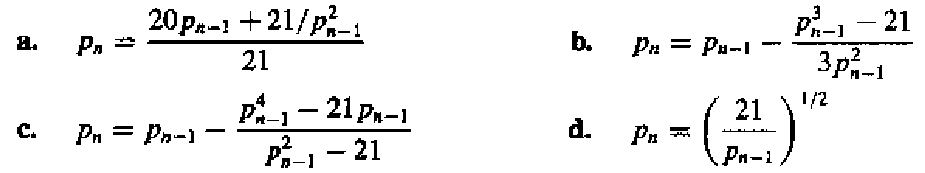

## Introduction

使用计算机计算和现实计算有一个显著差别：计算机计算的精度是有限制的。我们有不同的数据结构，带来不同的计算精度。数值分析这门课要求我们求出精度足够好的结果。它会告诉我们一些近似算法，同时也告诉我们，什么时候它们能用，什么时候又不能用。

我们轻而易举地就能想清楚加减乘除的原理。然而，我们可能没有注意 $\sin,\cos,\tan,\ln$ 是怎么实现的？数值分析这门课可以告诉我们背后的原理。

> 一个自然的想法：泰勒展开

## 数学上的准备

怎么求一个积分？简单的想法是把被积函数泰勒展开转化成多项式，然后利用其便于求积分的特性求解。然而，泰勒展开往往是无限的，这就需要我们规定一个提前结束的时机，这也引入了一个相当于泰勒余项(**Remainder**)的**误差**。这个误差就是我们需要注意的。

而且，一个棘手的点是：我们没有办法直接和真值进行比较！

另一个棘手的点是：每一个数值本身都与它自己的真值有误差，这也引入了新的误差！我们需要为每一个数据保留多少位，这也相应地成为了一个问题。

### 误差 Errors

* Truncation Error：与时间有关的一个误差。它代表近似数学引入的误差。

> 显式的操作，经典的就是一个`for`循环

* Roundoff Error：与空间有关的一个误差。它代表数字在计算机中的表达和数字本身的误差。

> 数据背后的误差

为了讨论方便，我们用十进制来表示数字。对于一个不嫩直接以有限数位表示的数字，有两种方式处理精度：

* 四舍五入(Rounding)
* 直接砍掉精度数位后面的位数(Chopping)
* 往上取

> 大学老师给分(不是)

误差也分为绝对误差(absolute error)和相对误差(relative error)

而有效数字(siginificant digits)应该是一个相对误差概念。可以注意到，对应数值的部分被移到了科学计数法中的指数部分。
> 有了有效数字的概念，我们应该把数字 0.123 看成 $0.123\pm\epsilon_1$
> 使用四舍五入的方法时，有效数字 0.1 的相对误差是 50%

那么，有一个现象，就是两个相近的数字相减之后，有效位数减小时，相对误差会显著增加。

将一个数除以一个很小的数，绝对误差会放大。这一点是符合直觉的。一个想法是把绝对误差看成两个数字的函数，然后取关于分母的导数，如果导数很大，那么就说明分母的轻微变化会带来较大的变化，也就是较大的误差。对于相对误差，也可以尝试以这样的方法进行分析。

计算的约化也要注意，计算机是每一个单元运算都会进行约化的，不能直接对最终结果进行约化。

也正是因此，虽然对单个数字而言，Rounding 会更精确，但是对于一个一连串的算式而言，未必。
> 我们此时也自然地想到，解不是确定值，也可能不是个区间，而应该是一个概率密度分布中的某个可能值。

也还是因此，对于同一个算式的不同表达，比如将一个算式通过一些方式结合，分配，也可以导致不同的误差。减少乘除的次数，有可能减少误差。减少单元计算的数量，也有可能减小误差。
> 数学上等价，不等于数值分析方法上等价！

我们可以手动求导来分析误差，也可以用一些自动求导的工具来分析计算式的误差。

### 算法和收敛 Algorithms and Convergence

当一个算法中，原始数据的较小变化只引起较小的终解的变化时，它是 stable 的；否则，它是 unstable 的。当它对于某些原始数据 stable 时，它是 conditionally stable 的。

设初始误差为 $E_1$，当做连续的 n 次操作时，如果误差 $E_n$ 约为 $E_1$ 的常数倍时，说误差的增长是 linear 的。如果 $E_n$ 约为 $E_1$ 的以常数为底的指数倍时，则说误差的增长是 exponent 的。

## 一元方程的求解

### 二分法

能使用二分法的前提是可排序。比如说，复数就很难使用二分，因为它没有既定的序。

二分法一定要除以二吗？不一定。只要区间收敛就好。

* 取中间位置时应该用`p=a+(b-a)/2`。
* 判断取左边界还是右边界时，需要用`sign()`，而非直接相乘看是否小于 0。
* 函数值需要考虑溢出问题。比如说，一个指数函数就容易出现溢出，即使它的横坐标是没溢出的。

如果二分法的区间取的过大，可能会忽略函数的根，如一个先增后减的区间，两侧都小于零，就会误认为中间没解了。

### 不动点迭代

把方程的根转化成一个等效的等式：$f(x)=0 \Leftrightarrow x=g(x)$。$g$ 的不动点是 $f$ 的根。

#### 不动点定理：Self

> 令 $g$ 是一个在 $[a,b]$ 连续的函数，且在其中 $g(x)\in[a,b]$。若对于它的导函数 $g'$，存在一个常数 $k\in(0,1)$ 使得开区间内任意的 $x$，有 $|g'(x)|\le k$，则对任意的 $p_0\in[a,b]$，序列 $p_n=g(p_{n-1})$ 收敛到唯一的不动点 $p\in[a,b]$。

* 利用中间值定理，证明存在不动点。
* 利用中值定理，证明不动点唯一。
* 利用值域被定义域包含的条件，保证迭代过程中，$g(x)$ 的结果始终在定义域中。
* 利用中值定理，证明迭代确实是收敛于那个存在且唯一的不动点。

这里的存在一个 $k\in(0,1)$ 很重要，这把 $g'(x)$ 和 1 隔开了，避免了极限为 1 的情况。

>看证明是有利于记忆定理的。在看证明的过程中，可以理解每一个条件为什么被需要。
>
>数值分析中有一个特点，给出的公式往往是充分的。顶层应用时，即使没有满足定理的条件，但我们还是有可能选择相信它。而在底层处理时，我们才会格外注意它的必要性。

#### 不动点定理：Corollary
>
>如果 $g$ 满足了不动点定理，那么迭代误差的范围为：
>$$
>|p_n-p|\le\frac{1}{1-k}|p_{n+1}-p_n|\quad,\quad |p_n-p|\le\frac{k^n}{1-k}|p_1-p_0|
>$$

### 牛顿法

牛顿法也属于一种不动点方法。它的思路是把一个非线性函数线性化。
$$
0=f(p)\approx f(p_0)+f'(p_0)(p-p_0)\quad,\quad p\approx p_0-\frac{f(p_0)}{f'(p_0)}
$$

#### 定理

>若 $f$ 在 $[a,b]$ 二阶连续，且存在 $p\in[a,b]$ 使得 $f(p)=0,f'(p)\ne 0$，那么就存在一个 $\delta > 0$，使得任意初值 $p_0\in[p-\delta,p+\delta]$ 都可以满足 $p_{n+1}=p_n-\frac{f(p_n)}{f'(p_n)}$ 收敛到 $p$。

* 由 $f'(p)\ne0$ 知 $g(x)=x-\frac{f(x)}{f'(x)}$ 在 $p$ 的邻域中连续。
* $g'(x)-1=\frac{f(x)f''(x)}{f'(x)^2}$ 在 $p$ 的邻域中趋于零，只要 $f''(x)$ 连续且有限。
* 利用不动点定理知存在一个邻域使得收敛。

### 作业

#### P54-T13
>
>找到一个迭代次数的范围，使得使用二分法解 $[1,2]$ 上的方程 $x^3 -x-1=0$ 时，解的精确度有 $10^{-4}$。同时，给出这个解。
>

此题主要考虑的是二分法的误差范围。当对 $[a,b]$ 进行二分时，第一次二分迭代的结果为 $a+\frac{b-a}{2}$，$\epsilon\le\frac{b-a}{2}$。易知，第 $n$ 次二分迭代的误差范围为 $\epsilon\le\frac{b-a}{2^n}$，此处只需取 $n=14$。具体求解过程略。

#### P54-T15

>令 $p_n=\sum^{n}_{k=1}\frac{1}{k}$，证明 $p_n$ 是发散 diverge 的，即使 $\lim_{n\rightarrow\infty}(p_n-p_{n-1})=0$。

这算是很经典的题目了，典型的方法有积分放缩。这里则采取证明连续多项的和拥有固定下界的方法：
$$
\frac{1}{k}+\frac{1}{k+1}\ldots+\frac{1}{2k-1}\gt k\cdot\frac{1}{2k}=\frac{1}{2}
$$

因此总能找到 $p_{2k-1}>p_{k}+\frac{1}{2}$，故 $p_n$ 是发散的。

#### P64-T3
>
>
> 它们被用于计算 $21^{\frac{1}{3}}$。根据收敛速度，将它们排序。假设 $p_0=1$。
>

a. 这是一个比较普通的不动点方法，直接对
$$
f(x)=\frac{20x}{21}+\frac{1}{x^2}
$$
求导，得
$$
f'(x)=\frac{20}{21}-\frac{2}{x^3}\in[-\frac{22}{21},\frac{6}{7})
$$
这看起来有些危险，我们不妨先迭代一次，得到 $p_1=\frac{41}{21}$，如果把这看成新的迭代起点，那么可以发现 $f'(x)$ 的范围被控制住了，且拥有明确的上下界。那么，根据不动点定理的推论，可以得出误差的范围为
$$
O(k^n) \ge O((f'(\frac{41}{21}))^n)\approx O((f'(2))^n)=O((\frac{59}{84})^n)
$$

b. 通过观察可以发现，这是牛顿法，原函数即为
$$
f(x)=x^3-21
$$

关于牛顿法，有这样一件事情：
>牛顿法的迭代公式为
>$$
>p_{n+1}=p_n-\frac{f(p_n)}{f'(p_n)}
>$$
>设迭代终点为 $r$，记 $\epsilon_n=p_n-r$，则根据泰勒展开式，我们有：
>$$
>\epsilon_{n+1}=\epsilon_n-\frac{f'(r)\epsilon_n+\frac{1}{2}f''(r)\epsilon_n^2+O(\epsilon_n^3)}{f'(r)+f''(r)\epsilon_n+O(\epsilon_n^2)}=\frac{f''(r)}{2f'(r)}\epsilon_n^2
>$$
>这也就是所谓的牛顿法具有**二次收敛**的性质，这个收敛速度已经很快了。
>
本选项就是一个二次收敛的样例。

c. 看起来很复杂，我们直接尝试代入，然后发现 $p_1=0,p_{k>1}=0$，可知压根收敛不到 $21^{\frac{1}{3}}$。

d. 可以设 $p_n=21^{k_n}$，则有
$$
21^{k_n}=21^{\frac{1-k_{n-1}}{2}}\Rightarrow k_n=\frac{1-k_{n-1}}{2}\Rightarrow k_n-\frac{1}{3}=-\frac{1}{2}(k_{n-1}-\frac{1}{3})
$$
可知 $k_n$ 的误差为 $O(\frac{1}{2}^n)$，那么
$$
p_n=21^{\frac{1}{3}+O(\frac{1}{2^n})}=21^{\frac{1}{3}}\cdot(21^{O(\frac{1}{2^n})})=21^{\frac{1}{3}}(1+\ln(21)\cdot 21^{O(\frac{1}{2^n})}\frac{1}{2^n}+O(\frac{1}{2^{2n}}))\approx21^{\frac{1}{3}}(1+\ln(21)\frac{1}{2^n})
$$
故误差为 $O(\frac{1}{2^n})$。

综上，排序为 $b>d>a>c$。

#### P65-T19
>
>****
>
>1. 利用不动点定理，证明当 $x_0\gt\sqrt{2}$时，
>
>$$
>x_n=\frac{1}{2}x_{n-1}+\frac{1}{x_{n-1}},\qquad \text{for } n\ge 1
>$$
>收敛到 $\sqrt{2}$，
>
>2. 利用“当 $x_0\ne\sqrt{2}$，$0\lt (x_0-\sqrt{2})^2 $”，证明：当 $0\le x_0\le\sqrt{2}$，有 $x_1\gt\sqrt{2}$。
>
>3. 利用 (1),(2) 的结果，证明 (a) 中的式子收敛到 $\sqrt{2}$，只要 $x_0\gt 0$。

1. 记 $f(x)=\frac{1}{2}x+\frac{1}{x}$，当 $\sqrt{2}<x\le x_0$ 时，有 $\sqrt{2}<\frac{1}{2}x+\frac{1}{x}<x_0$，即 $f(x)\in(\sqrt{2},x_0)$。函数连续性显然，再由 $f'(x)=\frac{1}{2}-\frac{1}{x^2}\in(0,\frac{1}{2})$ 知存在 $k\in(0,1)$。综上，已满足不动点定理。
2. 题意估计是要我们配方，不过基本不等式易得了。
3. 首先，利用 (2) 中结果，当 $x_0\in(0,\sqrt{2})$ 时，不妨先迭代一次，把迭代结果看成新的 $x_0>\sqrt{2}$。然后，由 (1) 易得收敛至 $\sqrt{2}$。
$x_0\in(\sqrt{2},\infty)$ 时亦然。
