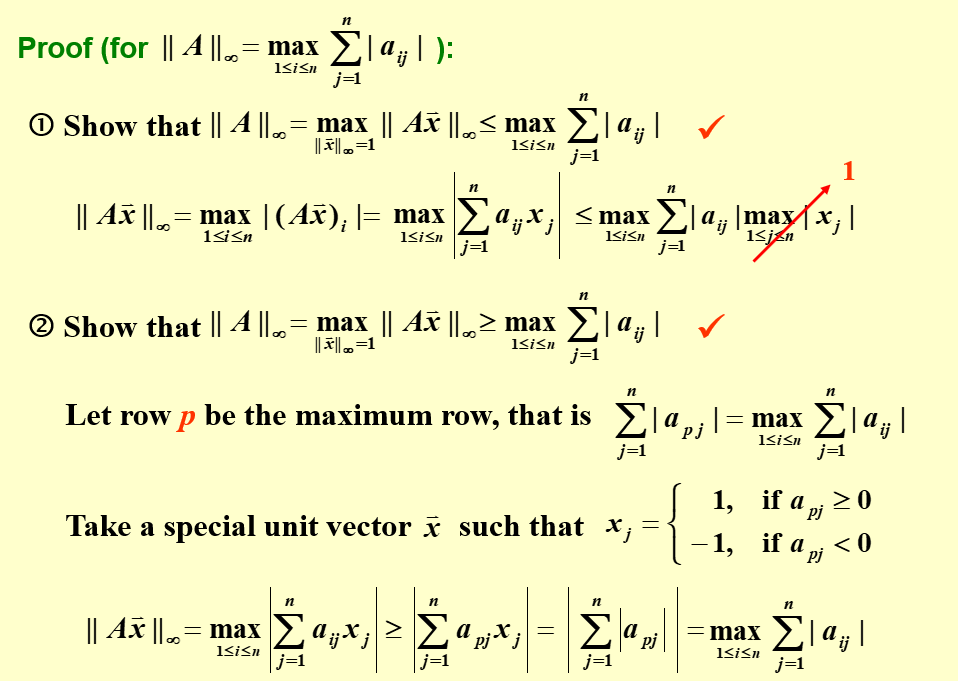

## Introduction

使用计算机计算和现实计算有一个显著差别：计算机计算的精度是有限制的。我们有不同的
数据结构，带来不同的计算精度。数值分析这门课要求我们求出精度足够好的结果。它会告
诉我们一些近似算法，同时也告诉我们，什么时候它们能用，什么时候又不能用。

我们轻而易举地就能想清楚加减乘除的原理。然而，我们可能没有注意
$\sin,\cos,\tan,\ln$ 是怎么实现的？数值分析这门课可以告诉我们背后的原理。

> 一个自然的想法：泰勒展开

## 数学上的准备

怎么求一个积分？简单的想法是把被积函数泰勒展开转化成多项式，然后利用其便于求积分
的特性求解。然而，泰勒展开往往是无限的，这就需要我们规定一个提前结束的时机，这也
引入了一个相当于泰勒余项(**Remainder**)的**误差**。这个误差就是我们需要注意的。

而且，一个棘手的点是：我们没有办法直接和真值进行比较！

另一个棘手的点是：每一个数值本身都与它自己的真值有误差，这也引入了新的误差！我们
需要为每一个数据保留多少位，这也相应地成为了一个问题。

### 误差 Errors

- Truncation Error：与时间有关的一个误差。它代表近似数学引入的误差。

> 显式的操作，经典的就是一个`for`循环

- Roundoff Error：与空间有关的一个误差。它代表数字在计算机中的表达和数字本身的
    误差。

> 数据背后的误差

为了讨论方便，我们用十进制来表示数字。对于一个不能直接以有限数位表示的数字，有两
种方式处理精度：

- 四舍五入(Rounding)
- 直接砍掉精度数位后面的位数(Chopping)
- 往上取

> 大学老师给分(不是)

误差也分为绝对误差(absolute error)和相对误差(relative error)

而有效数字(siginificant digits)应该是一个相对误差概念。可以注意到，对应数值的部
分被移到了科学计数法中的指数部分。

> 有了有效数字的概念，我们应该把数字 0.123 看成 $0.123\pm\epsilon_1$ 使用四舍五
> 入的方法时，有效数字 0.1 的相对误差是 50%

那么，有一个现象，就是两个相近的数字相减之后，有效位数减小时，相对误差会显著增
加。

将一个数除以一个很小的数，绝对误差会放大。这一点是符合直觉的。一个想法是把绝对误
差看成两个数字的函数，然后取关于分母的导数，如果导数很大，那么就说明分母的轻微变
化会带来较大的变化，也就是较大的误差。对于相对误差，也可以尝试以这样的方法进行分
析。

计算的约化也要注意，计算机是每一个单元运算都会进行约化的，不能直接对最终结果进行
约化。

也正是因此，虽然对单个数字而言，Rounding 会更精确，但是对于一个一连串的算式而
言，未必。

> 我们此时也自然地想到，解不是确定值，也可能不是个区间，而应该是一个概率密度分布
> 中的某个可能值。

也还是因此，对于同一个算式的不同表达，比如将一个算式通过一些方式结合，分配，也可
以导致不同的误差。减少乘除的次数，有可能减少误差。减少单元计算的数量，也有可能减
小误差。

> 数学上等价，不等于数值分析方法上等价！

我们可以手动求导来分析误差，也可以用一些自动求导的工具来分析计算式的误差。

### 算法和收敛 Algorithms and Convergence

当一个算法中，原始数据的较小变化只引起较小的终解的变化时，它是 stable 的；否则，
它是 unstable 的。当它对于某些原始数据 stable 时，它是 conditionally stable 的。

设初始误差为 $E_1$，当做连续的 n 次操作时，如果误差 $E_n$ 约为 $E_1$ 的常数倍
时，说误差的增长是 linear 的。如果 $E_n$ 约为 $E_1$ 的以常数为底的指数倍时，则说
误差的增长是 exponent 的。

## 一元方程的求解

### 二分法

能使用二分法的前提是可排序。比如说，复数就很难使用二分，因为它没有既定的序。

二分法一定要除以二吗？不一定。只要区间收敛就好。

- 取中间位置时应该用`p=a+(b-a)/2`。
- 判断取左边界还是右边界时，需要用`sign()`，而非直接相乘看是否小于 0。
- 函数值需要考虑溢出问题。比如说，一个指数函数就容易出现溢出，即使它的横坐标是
    没溢出的。

如果二分法的区间取的过大，可能会忽略函数的根，如一个先增后减的区间，两侧都小于
零，就会误认为中间没解了。

### 不动点迭代

把方程的根转化成一个等效的等式：$f(x)=0 \Leftrightarrow x=g(x)$。$g$ 的不动点是
$f$ 的根。

#### 不动点定理：Self

> 令 $g$ 是一个在 $[a,b]$ 连续的函数，且在其中 $g(x)\in[a,b]$。若对于它的导函数
> $g'$，存在一个常数 $k\in(0,1)$ 使得开区间内任意的 $x$，有 $|g'(x)|\le k$，则对
> 任意的 $p_0\in[a,b]$，序列 $p_n=g(p_{n-1})$ 收敛到唯一的不动点 $p\in[a,b]$。

- 利用中间值定理，证明存在不动点。
- 利用中值定理，证明不动点唯一。
- 利用值域被定义域包含的条件，保证迭代过程中，$g(x)$ 的结果始终在定义域中。
- 利用中值定理，证明迭代确实是收敛于那个存在且唯一的不动点。

这里的存在一个 $k\in(0,1)$ 很重要，这把 $g'(x)$ 和 1 隔开了，避免了极限为 1 的情
况。

> 看证明是有利于记忆定理的。在看证明的过程中，可以理解每一个条件为什么被需要。
>
> 数值分析中有一个特点，给出的公式往往是充分的。顶层应用时，即使没有满足定理的条
> 件，但我们还是有可能选择相信它。而在底层处理时，我们才会格外注意它的必要性。

#### 不动点定理：Corollary

> 如果 $g$ 满足了不动点定理，那么迭代误差的范围为：
>
> $$
> |p_n-p|\le\frac{1}{1-k}|p_{n+1}-p_n|\quad,\quad |p_n-p|\le\frac{k^n}{1-k}|p_1-p_0|
> $$

### 牛顿法

牛顿法也属于一种不动点方法。它的思路是把一个非线性函数线性化。

$$
0=f(p)\approx f(p_0)+f'(p_0)(p-p_0)\quad,\quad p\approx p_0-\frac{f(p_0)}{f'(p_0)}
$$

#### 定理

> 若 $f$ 在 $[a,b]$ 二阶连续，且存在 $p\in[a,b]$ 使得 $f(p)=0,f'(p)\ne 0$，那么
> 就存在一个 $\delta > 0$，使得任意初值 $p_0\in[p-\delta,p+\delta]$ 都可以满足
> $p_{n+1}=p_n-\frac{f(p_n)}{f'(p_n)}$ 收敛到 $p$。

- 由 $f'(p)\ne0$ 知 $g(x)=x-\frac{f(x)}{f'(x)}$ 在 $p$ 的邻域中连续。
- $g'(x)=\frac{f(x)f''(x)}{f'(x)^2}$ 在 $p$ 的邻域中趋于零，只要 $f''(x)$ 连续
    且有限。
- 利用不动点定理知存在一个邻域使得收敛。

### 作业-2

#### P54-T13

> 找到一个迭代次数的范围，使得使用二分法解 $[1,2]$ 上的方程 $x^3 -x-1=0$ 时，解
> 的精确度有 $10^{-4}$。同时，给出这个解。

此题主要考虑的是二分法的误差范围。当对 $[a,b]$ 进行二分时，第一次二分迭代的结果
为 $a+\frac{b-a}{2}$，$\epsilon\le\frac{b-a}{2}$。易知，第 $n$ 次二分迭代的误差
范围为 $\epsilon\le\frac{b-a}{2^n}$，此处只需取 $n=14$。具体求解过程略。

#### P54-T15

> 令 $p_n=\sum_{k=1}^{n}\frac{1}{k}$，证明 $p_n$ 是发散 diverge 的，即使
> $\lim_{n\rightarrow\infty}(p_n-p_{n-1})=0$。

这算是很经典的题目了，典型的方法有积分放缩。这里则采取证明连续多项的和拥有固定下界的方法：

$$
\frac{1}{k}+\frac{1}{k+1}\ldots+\frac{1}{2k-1}\gt k\cdot\frac{1}{2k}=\frac{1}{2}
$$

因此总能找到 $p_{2k-1}>p_{k}+\frac{1}{2}$，故 $p_n$ 是发散的。

#### P64-T3

>  它们被用于计
> 算 $21^{\frac{1}{3}}$。根据收敛速度，将它们排序。假设 $p_0=1$。

a. 这是一个比较普通的不动点方法，直接对

$$
f(x)=\frac{20x}{21}+\frac{1}{x^2}
$$

求导，得

$$
f'(x)=\frac{20}{21}-\frac{2}{x^3}\in[-\frac{22}{21},\frac{6}{7})
$$

这看起来有些危险，我们不妨先迭代一次，得到 $p_1=\frac{41}{21}$，如果把这看成新的
迭代起点，那么可以发现 $f'(x)$ 的范围被控制住了，且拥有明确的上下界。那么，根据
不动点定理的推论，可以得出误差的范围为

$$
O(k^n) \ge O((f'(\frac{41}{21}))^n)\approx O((f'(2))^n)=O((\frac{59}{84})^n)
$$

b. 通过观察可以发现，这是牛顿法，原函数即为

$$
f(x)=x^3-21
$$

关于牛顿法，有这样一件事情：

> 牛顿法的迭代公式为
>
> $$
> p_{n+1}=p_n-\frac{f(p_n)}{f'(p_n)}
> $$
>
> 设迭代终点为 $r$，记 $\epsilon_n=p_n-r$，则根据泰勒展开式，我们有：
>
> $$
> \epsilon_{n+1}=\epsilon_n-\frac{f'(r)\epsilon_n+\frac{1}{2}f''(r)\epsilon_n^2+O(\epsilon_n^3)}{f'(r)+f''(r)\epsilon_n+O(\epsilon_n^2)}=\frac{f''(r)}{2f'(r)}\epsilon_n^2
> $$
>
> 这也就是所谓的牛顿法具有**二次收敛**的性质，这个收敛速度已经很快了。
>
> 本选项就是一个二次收敛的样例。
>
> 需要注意的是，当出现重根， $f'(x)=0$，此时二次收敛不再成立。

c. 看起来很复杂，我们直接尝试代入，然后发现 $p_1=0,p_{k>1}=0$，可知压根收敛不到
$21^{\frac{1}{3}}$。

d. 可以设 $p_n=21^{k_n}$，则有

$$
21^{k_n}=21^{\frac{1-k_{n-1}}{2}}\Rightarrow k_n=\frac{1-k_{n-1}}{2}\Rightarrow k_n-\frac{1}{3}=-\frac{1}{2}(k_{n-1}-\frac{1}{3})
$$

可知 $k_n$ 的误差为 $O(\frac{1}{2}^n)$，那么

$$
p_n=21^{\frac{1}{3}+O(\frac{1}{2^n})}=21^{\frac{1}{3}}\cdot(21^{O(\frac{1}{2^n})})=21^{\frac{1}{3}}(1+\ln(21)\cdot 21^{O(\frac{1}{2^n})}\frac{1}{2^n}+O(\frac{1}{2^{2n}}))\approx21^{\frac{1}{3}}(1+\ln(21)\frac{1}{2^n})
$$

故误差为 $O(\frac{1}{2^n})$。

综上，排序为 $b>d>a>c$。

#### P65-T19

> ---
>
> 1. 利用不动点定理，证明当 $x_0\gt\sqrt{2}$时，
>
> $$
> x_n=\frac{1}{2}x_{n-1}+\frac{1}{x_{n-1}},\qquad \text{for } n\ge 1
> $$
>
> 收敛到 $\sqrt{2}$，
>
> 2. 利用“当 $x_0\ne\sqrt{2}$，$0< (x_0-\sqrt{2})^2$”，证明：当
>     $0\le x_0\le\sqrt{2}$，有 $x_1\gt\sqrt{2}$。
> 3. 利用 (1),(2) 的结果，证明 (a) 中的式子收敛到 $\sqrt{2}$，只要 $x_0\gt 0$。

1. 记 $f(x)=\frac{1}{2}x+\frac{1}{x}$，当 $\sqrt{2}<x\le x_0$ 时，有
   $\sqrt{2}<\frac{1}{2}x+\frac{1}{x}<x_0$，即 $f(x)\in(\sqrt{2},x_0)$。函数连续
   性显然，再由 $f'(x)=\frac{1}{2}-\frac{1}{x^2}\in(0,\frac{1}{2})$ 知存在
   $k\in(0,1)$。综上，已满足不动点定理。
2. 题意估计是要我们配方，不过基本不等式易得了。
3. 首先，利用 (2) 中结果，当 $x_0\in(0,\sqrt{2})$ 时，不妨先迭代一次，把迭代结果
   看成新的 $x_0>\sqrt{2}$。然后，由 (1) 易得收敛至 $\sqrt{2}$。
   $x_0\in(\sqrt{2},\infty)$ 时亦然。

### 对迭代方法的误差分析

> 假设 $\{p_n\}$ 是一个收敛到 $p$ 的序列，如果存在正常数 $\alpha$ 和 $\lambda$
> 使得
>
> $$
> \lim_{n\rightarrow \infty}\frac{|p_{n+1}-p|}{|p_n-p|^\alpha}=\lambda
> $$
>
> 则说 $\{p_n\}$ 对 $p$ 的收敛阶至少为 $\alpha$

比如说，牛顿法就是一个至少二阶收敛的方法(当不存在重根)。

下面是一个可以确定收敛阶阶数的定理：

> 设 $p$ 是 $g(x)$ 的一个不动点，若在 $p$ 的邻域内 $g(x)$ $\alpha \ge 2$ 阶连
> 续，且满足
>
> $$
> g'(p)=g^{(2)}(p)=\ldots g^{(\alpha-1)}(p)=0,g^{(\alpha)}\ne 0
> $$
>
> 则 $g(x)$ 的不动点迭代的收敛阶为 $\alpha$。

### 重根

对计算机来说，解 $x^2=0$ 远比 $x^2-4x+3=0$ 困难。这是因为，前者要考虑重根，而且
对于计算机来说，这实际上是在求 $x^2=\pm \epsilon$，当 $\epsilon<0$，会出现未定义
的情况。所以说，解方程有可能是不稳定的。这里的一种处理方法是，改而求解
$(x^2-0)^2=0$。

前面我们提到，对于牛顿法而言，重根的存在会导致它的收敛阶低于 $2$。不过，我们可以
做一个修正，也就是构造另一个函数，使得它的根和原函数的根相同，但是在原重根的邻域
内不存在重根。

$$
\begin{align*}
    u(x)&=\frac{f(x)}{f'(x)}\\
    x_{n+1}&=x_n-\frac{u(x_n)}{u'(x_n)}
\end{align*}

$$

> 关于邻域内不存在重根这一点，可以通过把函数 $f(x)$ 写成
>
> $$
> f(x)=(x-p)^k\phi(x)\quad,\quad\phi(p)\ne 0
> $$
>
> 来得出。

### Aitken's Δ² Method

> 对于一个一阶收敛的迭代序列，有
>
> $$
> \frac{p_{n+1}-p}{p_{n}-p}\approx \frac{p_{n+2}-p}{p_{n+1}-p}
> $$
>
> 据此，我们可以解出 $p$ 的一个近似解
>
> $$
> p\approx\frac{p_{n+2}p_n - p_{n+1}^2}{p_{n+2} - 2p_{n+1} + p_n}=p_n-\frac{(p_{n+1}-p_n)^2}{p_{n+2}-2p_{n+1}+p_n}
> $$
>
> 如果引入差分的话，就可以写成
>
> $$
> p\approx p_n-\frac{(\Delta p_n)^2}{\Delta^2 p_n}
> $$
>
> 于是，我们在使用一阶收敛的方法时，就可以使用 Aitken's Δ² Method 来加速收敛。

有人可能会考虑把 Aitken's Δ² Method 加速完的结果再作为新的迭代起点，然而这样破坏
了 linear convergence 的条件，是不可取的。

### 作业-3-1

#### P86-T11

> 不动点迭代方法
> $$
> p_{n+1}=g(p_{n})=p_n-\frac{f(p_n)}{f'(p_n)}-\frac{f''(p_n)}{2f'(p_n)}\left[\frac{f(p_n)}{f'(p_n)}\right]^2
> $$
> 拥有性质
> $$
> g'(p)=g''(p)=0
> $$
> 这会得到立方收敛的结果。比较一下平方收敛和立方收敛。

设另一个平方收敛的序列为 $\{q_n\}$，为了便于分析，我们设它们都收敛到 $0$(其实就是移动坐标轴)，且
$$
\frac{p_{n+1}}{p_{n}^3}\approx 0.5 \quad\text{and}\quad\frac{q_{n+1}}{q_n^2}\approx 0.5
$$
可以得出
$$
\begin{align*}
|q_n-0|&\approx (0.5)^{2^n-1}|q_0|^{2n}\\
|p_n-0|&\approx (0.5)^{\frac{3^n-1}{2}}|p_0|^{3n}

\end{align*}
$$

## 求解线性方程组 Linear Systems

### 高斯消元法

回忆在线性代数中我们的做法，使用高斯消元，把矩阵化成上三角的形式，然后一个一个解出解并回代。

我们可以用一个迭代的思路来理解：我们先把最左列除了第一行的元素清零，然后，根据高斯消元法，我们就不再会对第一行、第一列操作了。这时，我们可以忽略它们，这就相当于是再去解一个新的、阶数减一的线性方程组了。迭代进行到阶数为 $1$ 的时候，解就出来了。

> 消元阶段的乘除法的数量为
> $$
> \begin{align*}
>     &\sum_{k=1}^{n-1}(n-k)(n-k-2)\\
>     &=\frac{n^3}{3}+\frac{n^2}{2}-\frac{5n}{6}
> \end{align*}
> $$
> 进行第 $k$ 次迭代时，需要对 $n-k$ 行做消去操作，每一行需要操作的元素有 $n-k+2$ 个。进行 $n-1$ 次操作后，矩阵阶数变为 $1$。
>
> 回代阶段的乘除法数量为
> $$
> 1+\sum_{i=1}^{n-1}(i+1)=\frac{n^2}{2}+\frac{n}{2}
> $$
> 考虑第 $i$ 次回代需要 $1$ 次除法和 $i$ 次乘法即可。
>
### 作业-3-2

#### P357-T8
>
> 
> > Algorithm 6.1
> > 
> > 
> >

大致步骤一致，只是在 Step4 部分有所区别：我们需要对 $j=1,\ldots n,j\ne i$ 操作。然后，我们在 Step8 阶段就可以返回所有的解：
$$
x_i=a_{i,n+1}/a_{i,i},i=1,2,\ldots,n
$$

#### P358-T11
>
> 

根据上一题，我们可以得出，加减法的次数为
$$
\sum_{i=1}^{n}(n-k+1)(n-1)=\frac{n^3}{2}-\frac{n}{2}
$$
乘除法的次数为
$$
\sum_{i=1}^{n}(n-k+2)(n-1)+n=\frac{n^3}{2}+n^2-\frac{n}{2}
$$

为了便于计算，我们可以都只对乘除法的次数进行比较。高斯消元法需要的乘除法总数
$$
\frac{n^3}{3}+n^2-\frac{n}{3}
$$

故有

| n   | 高斯消元法 (GE) | 高斯–约当法 (GJ) |
|-----|----------------|-----------------|
| 3   | 17             | 21              |
| 10  | 430            | 595             |
| 50  | 44150          | 64975           |
| 100 | 343300         | 509950          |

### 主元法 Pivoting Strategies

#### Partial pivoting/maximal column pivoting

第 $i$ 次迭代时， 选择第 $i$ 列中最小的 $p\gt i$，使得 $|a_{pi}|$ 是最大的。然后把第 $p$ 行和第 $i$ 行交换。这样可以保证除的时候除以一个较大的数。

然而，这个方法有一个问题，即除数大无法保证伸缩系数小。

> 时间复杂度： $O(n^2)$

#### Scaled Partial Pivoting/scaled-column pivoting

不仅仅看 $|a_{pi}|$，也考虑本行中的表现。

我们定义一个 scale factor  $s_p=\max|a_{pj}|$。这表现了这一行中的伸缩系数分子中的最大值。

然后，我们寻找第 $i$ 列中最小的 $p\gt i$，使得 $|\frac{a_{pi}}{s_p}|$ 是最大(即最大的伸缩系数最小)的，然后交换。

但是，这么做也有个问题：每一次高斯消元的递归过程中，后面的每一行都发生了变化。如果我们每一行都这么做，会导致速度很慢。因此，注意 partial 这个词，我们的伸缩系数只在一开始计算，后面都不重新计算了。

> 时间复杂度： $O(n^2)$

#### Complete Pivoting/maximal pivoting

一个想法是，如果在 Scaled Partial Pivoting 中每次递归过程都重新计算 $s_p$，那么时间复杂度会到达立方。既然如此，不如也对列做交换。

对于 $n$ 阶的线性方程组，在第 $i$ 次递归时，会有一个 $n+1-i$ 阶子阵。在这个子阵中，找到最大的元素 $a_{pq}$，然后交换 $i$ 行与 $p$ 行，再交换 $i$ 列与 $q$ 列。

> 时间复杂度： $O(\frac{n^3}{3})$

### 矩阵分解 Matrix Factorization

让我们考虑每一次消元的等价操作：

令 $m_{i1}=\frac{a_{i1}}{a_{11}}(a_{11}\ne 0)$，则有第一次消元等价于将原系数矩阵左乘矩阵 $L_1$:

$$
L_1 =
\begin{pmatrix}
1      &        &        &        & \\
-m_{2,1} & 1      &        &        & \\
\vdots & \vdots & \ddots &        & \\
-m_{n,1} &        &        & 1      &
\end{pmatrix}
$$

依次类推，第 $i$ 次消元等价于左乘 $L_i$:
$$
L_i=
\begin{pmatrix}
1&&&&&\\
&\ddots&&&&\\
&&1&&&\\
&&-m_{i+1,i}&1&&\\
&&\vdots&&\ddots&\\
&&-m_{n,i}&&&1
\end{pmatrix}
$$

既然如此，我们可以把每一个消元操作对应的矩阵先相乘。这样，可以得到一个下三角矩阵。

$$
L=L_{n-1}L_{n-2}\ldots L_1
$$
> 单位下三角矩阵乘与取逆都有封闭性。

这个下三角矩阵只与系数矩阵有关。因此，当系数矩阵一定时，这个方法效率很高。

现在，让我们重新整理一下符号。忘掉上面的 $L$，改取
$$
L=L_1^{-1}L_2^{-2}\ldots L_{n-1}^{-1}
$$
则有
$$
A=LU,U\text{为高斯消元法后得到的系数矩阵}
$$
可以看到，我们把 $A$ 分解成了一个下三角矩阵 $L$ 和一个上三角矩阵 $U$ 的乘积。

如果我们在度量上做限制，让 $L$ 为一个单位下三角矩阵，那么这样的分解就是唯一的。

### 特殊矩阵 Special Types of Matrices

- 严格对角占优矩阵 Strictly Diagonally Dominant Matrix：每一行中，对角线元素绝对值大于本行其它元素的绝对值之和。严格对角占优矩阵是非奇异 nonsingular 的。且执行高斯消元法时不需要置换行或列，其解在舍入误差上是稳定的。

> 直觉上，严格对角占优矩阵类似于单位阵。因此，它会有比较好的性质。

- 正定矩阵 Positive Definite Matrix：对 $\forall x\ne \vec{0}, x^{-1}Ax>0$ 且 $A$ 是对称 symmetric 的.

  - 如果一个矩阵是正定的,那么它的逆也是正定的.
  - 正定矩阵的对角线元素严格大于 $0$.

当给了矩阵的特殊性质，我们就可以针对性质给出特定的优化算法。

#### 正定矩阵的优化算法

当 $A$ 是正定矩阵时，显然，它可以分解成 $B\Lambda B^T$ 的形式，其中 $B$ 为单位下三角矩阵， $\Lambda$ 为对角线元素均大于零的对角阵。另外，我们还有
$$
U=\Lambda\tilde{U}
$$
其中 $\Lambda$ 是以 $u_{ii}$ 为对角元素的对角阵，而 $\tilde{U}$ 则因此变成了一个单位上三角矩阵。注意到 $L$ 为一个单位下三角矩阵，则只能有 $L=\tilde{U}^{T}$

又因为 $\Lambda$ 对角线元素均大于零，因此它可以被分解为 $\Lambda^{\frac{1}{2}}\Lambda^{\frac{1}{2}}$。那么，我们进行再整理，则有
$$
A=\tilde{L}\tilde{L}^{T},\tilde{L}=L\Lambda^{\frac{1}{2}}
$$

使用 **Choleski's Method**，可以快速地计算出 $\tilde{L}$，从而完成线性方程组的求解。

#### 三对角矩阵的优化算法

Thomas 算法：

需要注意的是，一旦 $\exists\alpha_i =0$，则 Thomas 算法失效(但不意味着这个方程不可解)。

> 当 $A$ 是三对角矩阵，且它是 diagonally dominant 的(注意没有要求严格)，且
> $$
> |b_1| >|c_1| >0,|b_n| > |a_n| >0, a_i\ne 0, c_i \ne 0
> $$
> 则 $A$ 非奇异，此时方程可用 Thomas 算法求解。
>
> 当 $A$ 是三对角矩阵且严格对角占优时，方程一定可用 Thomas 算法求解。
>
> 上述两种情况下，Thomas 算法是稳定的，因为所有的中间值会受主对角线元素的约束。
>
> Thomas 算法的时间复杂度为 $O(n)$。
>
> 该算法的具体实现见作业题。

### Homework-1

#### P397-T7

> 

a)

我们采用一个递归的思路来解释 $LU$ 分解：

1. 在已知 $L$ 的前 $i-1$ 列， $U$ 的前 $i-1$ 行的情况下，求出 $U$ 的第 $i$ 行
2. 在已知 $L$ 的前 $i-1$ 列， $U$ 的前 $i$ 行的情况下，求出 $L$ 的第 $i$ 列

只要可以解决这两个递归，就能够完成 $LU$ 分解。

对于递归(1)，有(注意 $l_{ii}=1$ )：
$$
\sum_{j=1}^{i}l_{ij}u_{jk}=a_{ik}\quad\Rightarrow\quad  u_{ik}=a_{ik}-\sum_{j=1}^{i-1}l_{ij}u_{jk},\quad i\le k \le n
$$
这里引入了 $(i-1)(n+1-i)$ 次乘除法与 $(i-1)(n+1-i)$ 次加减法。

对于递归(2)，有：
$$
\sum_{j=1}^{i}l_{kj}u_{ji}=a_{ki}\quad\Rightarrow\quad l_{ki}=\frac{a_{ki}-\sum_{j=1}^{i-1}l_{kj}u_{ji}}{u_{ii}},\quad i< k\le n
$$
这里引入了 $i(n-i)$ 次乘除法与 $(i-1)(n-i)$ 次加减法。

从 $i=1$ 一直递归到 $i=n$，就可以完成 $LU$ 分解了。

乘除法数为
$$
\begin{align*}
    \sum_{i=1}^{n}(i-1)(n+1-i)+i(n-i)&=\sum_{i=1}^{n}-\frac{2}{3}\Delta (i^3)+(n+2)\Delta (i^2)-(2n+\frac{7}{3})\Delta (i)\\
    &=\frac{1}{3}n^3-\frac{1}{3}n
\end{align*}
$$

加减法数为
$$
\begin{align*}
    \sum_{i=1}^{n}(i-1)(2n+1-i)&=\sum_{i=1}^{n}(i-1)(n+1-i)+i(n-i)-\sum_{i=1}^{n}(n-i)\\
    &=\frac{1}{3}n^3-\frac{1}{2}n^2+\frac{1}{6}n
\end{align*}
$$

b)

考虑 $\vec{y}$ 的前 $i-1$ 位已被求解，欲求解第 $i$ 位，有
$$
\sum_{k=1}^{i}l_{ik}y_k=b_i\quad\Rightarrow\quad y_i=b_i-\sum_{k=1}^{i-1}l_{ik}y_k
$$
这里引入了 $i-1$ 次乘除法和 $i-1$ 次加减法。

于是乘除法与加减法数都为
$$
\sum_{i=1}^{n}(i-1)=\frac{n(n-1)}{2}
$$

c)

与 (b) 中相反， $U\vec{x}=\vec{y}$ 的求解是从下往上的，且因为 $u_{ii}$ 可能不为 $1$，导致每一次都需要多进行一次除法，因此会每次引入 $i$ 次乘除法和 $i-1$ 次加减法

于是乘法数为
$$
\frac{n(n+1)}{2}
$$
加减法数为
$$
\frac{n(n-1)}{2}
$$

通过求和，可以解得总共需要的乘除法数量为
$$
\frac{1}{3}n^3+n^2-\frac{1}{3}n
$$
加减法数量为
$$
\frac{1}{3}n^3+\frac{1}{2}n^2-\frac{5}{6}n
$$

这与高斯消元法需要的次数相同。

d)

乘除法总数为
$$
\frac{1}{3}n^3-\frac{1}{3}n+mn^2
$$

加减法总数为
$$
\frac{1}{3}n^3-\frac{1}{2}n^2+\frac{1}{6}n+mn^2-mn=\frac{1}{3}n^3+(m-\frac{1}{2})n^2+(\frac{1}{6}-m)n
$$

这个小题主要体现多次求解同个系数矩阵的线性方程组时 $LU$ 分解法的高效性。

> Thomas 算法具体实现：
>
> 套用上面的 $LU$ 分解方法(虽然不是 ppt 中的 Crout 分解)，可以发现 $LU$ 分解的递归公式变得相当简单：
> $$
> \begin{align*}
>     u_{ii}&=a_{ii}-l_{ii-1}a_{i-1i}\\
>     u_{ii+1}&=a_{ii+1}\\
>     l_{ii}&=1\\
>     l_{i+1i}&=\frac{a_{i+1i}}{u_{ii}}
> \end{align*}
> $$
>
> 之后，我们再分别求解 $\vec{y},\vec{x}$ 的递推式，有：
> $$
> \begin{align*}
>     y_{i+1}&=b_{i+1}-\frac{a_{i+1i}}{u_{ii}}y_i\\
>     x_{i-1}&=\frac{y_{i-1}-a_{i-1i}x_i}{u_{i-1i-1}}
> \end{align*}
> $$
>
> 注意到 $l$ 和 $u$ 的互相转换非常简单。因此，如果我们激进一些，完全可以只维护一个一维数组。我们记 $t_i=u_{ii}$，则有：
> $$
> \begin{align*}
> t_{i+1}&=a_{i+1i+1}-\frac{a_{i+1i}a_{ii+1}}{t_i}\\
> y_{i+1}&=b_{i+1}-\frac{a_{i+1i}}{t_i}y_i\\
> x_{i-1}&=\frac{y_{i-1}-a_{i-1i}x_i}{t_{i-1}}
> \end{align*}
> $$

#### Read the proofs on P401-402

> 

(i) 考虑 $A\vec{x}=0$，则有 $\vec{x}^{T}A\vec{x}=0$。根据正定性，有 $\vec{x}=\vec{0}$。因此，$A\vec{x}=0$ 只存在零解，故矩阵满秩，行列式不为零，是可逆的。

(ii) 这由正定性是显然的，我们只要取 $\vec{x_i}$ 的第 $i$ 位为 $1$，其它位为零，然后用 $\vec{x}^TA\vec{x}>0$ 的条件代入就可知， $A$ 的对角线元素必然严格大于零。

(iii) 我们同样采用构造的方法。我们任意取 $i,j$，使得 $x_i=1,x_j=-1$，且 $\vec{x}$ 的其它位为 $0$。那么，有(采用爱因斯坦求和约定)：
$$
\vec{x}^TA\vec{x}=x_pA_{pq}x_q=A_{ii}+A_{jj}-2A_{ij}
$$

不妨设 $A_{ii}\ge A_{jj}$，则有
$$
2A_{ii}-2A_{ij}\ge A_{ii}+A_{jj}-2A_{ij}>0\Rightarrow A_{ii}>A_{ij}
$$

同理，我们把 $x_j$ 改成 $1$，就能得到 $A_{ii}>-A_{ij}$。

综上，对于任意的 $j$，均存在 $i\ne j$ 使得 $A_{ii}>|A_{ij}|$，证毕。

(iv) 令 $x_i=t,x_j=1,i\ne j$，其余位为 $0$，则有
$$
A_{ii}t^2+2A_{ij}t+A_{jj}>0
$$

左式作为一个一元二次方程，它的 $\Delta$ 应当小于零，即
$$
4a_{ij}^2-4a_{ii}a_{jj}<0
$$
化简即为所求。

#### P412-T17

>

(a) 只要计算行列式为 $0$ 即可。
$$
|A|=-\alpha+2(2\alpha-\beta)=0\quad\Rightarrow \quad\forall 3\alpha = 2\beta\text{ 均可}
$$

(b)  $\forall\alpha >1,\beta < 2$ 即可

(c)  $\forall\alpha;\beta=1$

(d) 只需所有主子矩阵的行列式均为正。于是有：
$$
\begin{align*}
    \alpha >0\\
    2\alpha-\beta >0\\
    3\alpha-2\beta>0
\end{align*}
$$

得 $\beta < \frac{3}{2}\alpha \land \alpha>0$。

## 矩阵代数中的迭代方法 Iterative Techniques in Matrix Algebra

我们把 $A\vec{x}=\vec{b}$ 转换成迭代形式  $\vec{x}=T\vec{x}+\vec{c}$。为了能够迭代，我们先需要进行数学上的定义。

### 向量的范数

我们定义向量的范数 norm。范数需要满足:
$$
\begin{aligned}
\text{(1) 非负性 positive definite：} \quad & \|x\| \ge 0 \quad \text{且} \quad \|x\|=0 \iff x=\mathbf{0}, \\
\text{(2) 齐次性 homogeneous：} \quad & \|\alpha x\| = |\alpha| \, \|x\|, \quad \forall \alpha\in\mathbb{R}, \\
\text{(3) 三角不等式 triangle inequality：} \quad & \|x+y\| \le \|x\| + \|y\|, \quad \forall x,y.
\end{aligned}
$$

> - $k$ 阶范数的定义：
>
> $$
> \|\vec{x}\|_p=\left(\sum_{i=1}^n|x_i|^p\right)^{\frac{1}{p}}
> $$
>
> - 无穷阶范数的定义：
>
> $$
> \|\vec{x}\|_{\infty}=\max_{1\le i\le n}|x_i|
> $$
>
> 欧几里得范数就是二阶范数。

对于某一个范数定义,如果一个迭代序列 $\vec{x_k}$ 满足  $\|\vec{x_k}-\vec{x}\|$ 收敛于 $0$,则说 $\vec{x_k}$ 收敛到 $\vec{x}$.

在有限维实向量空间中，不同范数之间总是“等价”的。也就是说，对于任意两个范数 $\|\cdot\|_a$ 和 $\|\cdot\|_b$，存在正的常数 $c$ 和 $C$，使得对所有 $x$ 都有

$$
c \, \|x\|_a \le \|x\|_b \le C \, \|x\|_a.
$$

这说明：

- 如果一个迭代序列在范数 $\|\cdot\|_a$ 下收敛，那么在任意其他范数 $\|\cdot\|_b$ 下也收敛；
- 收敛的快慢（误差量级）在不同范数下最多相差一个常数因子，不影响“收敛阶”的讨论。

因此，在数值算法和迭代方法中，我们通常只选用一种范数来分析误差，而不必担心选哪一种范数会改变收敛性质。

### 矩阵的范数

一般而言，前面提到的性质对于范数已经足够了。然而，为了便于分析，我们往往要求矩阵的范数还满足如下条件：
$$
\text{一致性 consistent：}\|AB\|\le\|A\|\cdot\|B\|
$$
> 如果没有一致性，我们对简单的 $AB$ 的误差分析都会变得很复杂，因为没办法从 $\|A\Delta B\|$ 到 $\|A\|\|\Delta B\|$ 了。
>

下面也介绍常见的范数：

- Fronenius 范数：

$$
\|A\|_F=\sqrt{\sum_{i=1}^m\sum_{j=1}^n a_{ij}^2}
$$

- $p$ 阶自然范数：

$$
\|A\|_p=\max_{\vec{x}\ne \vec{0}}\frac{\|A\vec{x}\|_p}{\|\vec{x}\|_p}=\max_{\|\vec{x}\|=1}\|A\vec{x}\|_p
$$
这个依赖于向量的定义似乎有些奇怪，但其实它表现了空间各个方向上矩阵算子最强的拉伸能力。

常用的自然范数有：
$$
\begin{align*}
    \|A\|_{\infty}&=\max_{1\le i\le n}\sum_{j=1}^n|a_{ij}|\\
    \|A\|_{\infty}&=\max_{1\le j\le n}\sum_{i=1}^n|a_{ij}|\\
    \|A\|_2&=\sqrt{\lambda_{\text{max}}(A^TA)}(\text{谱范数})
\end{align*}
$$

> 无穷自然范数的证明：
>
> 
>

### 特征值与特征向量 Eigenvalues and Eigenvectors

#### 谱半径 Spectral Radius

对于矩阵 $A$ ，其特征值可能是复数。因此，我们利用复数的幅值来刻画它们，其中最大的幅值也就是谱半径 $\rho(A)$ 。

> 对于一个 $n$ 阶矩阵，对于任意的自然范数，有 $\rho (A)\le \left\|A\right\|$
>
> Prove:
> $$
> \forall\text{ eigenvalue }\lambda, |\lambda|\cdot \left\|\mathbf{x}\right\|=\left\|\lambda \mathbf{x}\right\|=\left\|A \mathbf{x}\right\|\le \left\|A\right\|\cdot \left\|\mathbf{x}\right\|
> $$

如果一个 $n$ 阶矩阵满足对于任何 $i,j=1,2,\ldots,n$，有 $\lim_{k\to\infty}(A^k)_{ij}=0$，则说这个矩阵是收敛的。

#### 雅可比迭代法 Jacobi Iterative Method

雅可比迭代法的思路是构造一个便于求解的迭代式(系数矩阵只是个对角阵)，以提高迭代效率。

我们把一个矩阵 $A$ 分成对角阵 $D$ 与上三角阵 $-U$ 和下三角阵 $-L$ 的和，则有
$$
A \mathbf{x}= \mathbf{b}\iff D \mathbf{x}=(L+U) \mathbf{x}+ \mathbf{b}
$$

这就出现了一个可迭代式(假设 $D$ 可逆)
$$
\mathbf{x}=D^{-1}(L+U) \mathbf{x}+ D^{-1}\mathbf{b}
$$

我们定义雅可比迭代法的系数 $T_j=D^{-1}(L+U),\mathbf{c_j}=D^{-1}b$，则有迭代式
$$
\mathbf{x}^{(k)}=T_j\mathbf{x}^{(k-1)}+\mathbf{c_j}
$$

> 具体算法：
>
> 首先，我们合适地交换行或列，使得对于 $i=1,\ldots,n$， $a_{ii}\ne 0$。
>
> 然后，根据迭代式，每一次迭代，我们从 $i=1$ 直到 $n$，计算
> $$
> x_i^{(k+1)}=\frac{b_i-\sum_{j\ne i \& j=1}^{n}a_{ij}x_j^{(k)}}{a_{ii}}
> $$
>
> 在这里，我们需要使用两个向量来维护 $\mathbf{x}^{(k)},\mathbf{x}^{(k+1)}$。当不使用并行优化时，这么做显得有些浪费。一个想法是，我们始终只维护一个向量 $\mathbf{x}$ ，此时，在计算 $x_i$ 时，是使用了新的 $1\ldots i-1$ 个分量和其它旧的分量。这也就引出了高斯-赛德尔迭代法。

#### 高斯-赛德尔迭代法 Gauss-Seidel Iterative Method

> 在直觉上，对于将 $A$ 分裂，然后一部分放到方程右边构造的迭代法，扔到方程右边的部分越多，收敛得就越快。
>
> 这通过极限思想容易想通，把 $A$ 拆成 $A$ 和 $0$ 后，一次迭代就收敛了。
>
> 当然，我们还需要保证迭代式易于求解的问题，因此一些拥有优良性质的矩阵就适合被留下来，把剩余部分扔到迭代右式里。

Gauss-Seidel Iterative Method 的思路就是解一个系数矩阵为下三角矩阵的迭代式。我们做如下拆分：
$$
(D-L)\mathbf{x}=U \mathbf{x}+\mathbf{b}\iff \mathbf{x}=(D-L)^{-1}U \mathbf{x}+(D-L)^{-1}\mathbf{b}
$$

类似地，我们定义 $T_g=(D-L)^{-1}U,\mathbf{c_g}=(D-L)^{-1}\mathbf{b}$，则有迭代式
$$
\mathbf{x}^{(k)}=T_g\mathbf{x}^{(k-1)}+\mathbf{c_g}
$$

在具体实现上，很巧的是，这恰恰是我们在尝试对雅可比迭代法的空间占用上做优化的结果。

对于不同的问题，Jacobi 和 Gauss-Seidel 迭代法有不同的表现。有时前者好用后者不好用，反之的情况也会存在。但至少让我们关注一下收敛性的问题吧。

### 迭代方法的收敛性

首先介绍如下定理：

> 对于矩阵 $A$，下面五个命题等价：
>
> 1. $A$ 是收敛的。
> 2. 对于某个自然范数，有 $\lim_{n\to\infty}\left\|A\right\|=0$
> 3. 对于任意自然范数，有 $\lim_{n\to\infty}\left\|A\right\|=0$
> 4. $\rho (A)<1$
> 5. 对于任意的 $\mathbf{x}$，有 $\lim_{n\to\infty}A^n \mathbf{x}=\mathbf{0}$

拥有如上定理之后，我们可以得出一个结论：

> 对于任意的迭代式
> $$
> \mathbf{x}^{(k)}=T\mathbf{x}^{(k-1)}+\mathbf{c}
> $$
> 只要满足 $\rho (T)<1$，迭代式就必然收敛到解
> $$
> \mathbf{x}=T \mathbf{x}+\mathbf{c}
> $$
> Proof:
>
> 我们将迭代式展开，则有
> $$
> \mathbf{x}^{(k)}=T^k \mathbf{x}^{(0)}+(T^{k-1}+\ldots+T+I)\mathbf{c}
> $$
> 由于 $\rho(T)<1$，有对于任意的 $\mathbf{x}$， $\lim_{n\to\infty}T^n \mathbf{x}=\mathbf{0}$。因此，当我们取 $k$ 无限大时，就有 $T^k \mathbf{x}^0\to \mathbf{0}$。
>
> 于是，我们有
> $$
> \lim_{k\to\infty}\mathbf{x}^{(k)}=(I-T)^{-1}\mathbf{c}
> $$
> 而这恰好就是 $\mathbf{x}=T \mathbf{x}+\mathbf{c}$ 的解。

回忆前文，我们知道，对于任意的自然范数 $\left\|\cdot\right\|$，有  $\rho (T)\le \left\|T\right\|$。这说明， $\left\|T\right\|<1$ 是比 $\rho (T)<1$ 更强的条件。当满足这个更强的条件时，有如下结论：

> 迭代式
> $$
> \mathbf{x}^{(k)}=T\mathbf{x}^{(k-1)}+\mathbf{c}\quad(\text{given }\forall \text{ natural norm}\left\|T\right\|<1)
> $$
> 收敛，且其中间解与收敛终点的误差控制在：
> $$
> \begin{align}
    > \left\|\mathbf{x}-\mathbf{x}^{(k)}\right\|&\le \left\|T\right\|^k \left\|\mathbf{x}-\mathbf{x}^{(0)}\right\|\\
    > \left\|\mathbf{x} -\mathbf{x}^{(k)}\right\|&\le \frac{\left\|T\right\|^k}{1-\left\|T\right\|}\left\|\mathbf{x}^{(1)}-\mathbf{x}^{(0)}\right\|
> \end{align}
> $$

对于一个严格对角占优的矩阵 $A$，不管迭代起点如何选取，Jacobi 和 Gauss-Seidel 法都会得到收敛到唯一解的迭代序列。

### Relaxation Methods

回忆第一个 research topic 中我最终对不动点迭代的方法，可以发现一个特殊的视角：

> 我们可以把不动点迭代写成
> $$
> \mathbf{x}^{(k+1)}=\mathbf{x}^{(k)}+ \mathbf{\Delta }^{(k+1)}
> $$
> 其中 $\mathbf{\Delta }^{(k+1)}$ 是一个有关于 $\mathbf{x}^{(k)}$ 的函数，且当 $\mathbf{x}^{(k)}$ 为不动点时取值为 $\mathbf{0}$。这个函数事实上表现了每一步迭代的步长。

接着这个视角，我们可以把 Gauss-Seidel 迭代法写成如下的形式：
$$
x_i^{(k+1)}=x_i^{(k)}+\frac{b_i-\sum_{j<i}a_{ij}x_j^{(k+1)}-\sum_{j\ge i}a_{ij}x_j^{(k)}}{a_{ii}}
$$
特殊地，我们记
$$
r_i^{(k+1)}=b_i-\sum_{j<i}a_{ij}x_j^{(k+1)}-\sum_{j\ge i}a_{ij}x_j^{(k)}
$$
并称之为残差 residual。

这样，就有
$$
x_i^{(k+1)}=x_i^{(k)}+\frac{r_i^{(k+1)}}{a_{ii}}
$$

回忆一下我们上面提到的视角，我们很容易想到一件事，这个迭代的步长也许可以加一些系数来调整。这也就是所谓的 relaxation method：
$$
x_i^{(k+1)}=x_i^{(k)}+\omega \frac{r_i^{(k+1)}}{a_{ii}}
$$

根据 $\omega$ 的范围不同，我们把 relaxation method 分为

- $0<\omega <1$ Under-Relaxation Methods
- $\omega =1$ Gauss-Seidel Methods
- $\omega >1$ Successive Over-Relaxation Methods

经过化简，我们可以得出 relaxation method 的一个不太简洁的矩阵表示：
$$
\begin{align*}
    \mathbf{x}^{(k+1)}&=(D-\omega L)^{-1}[(1-\omega )D+\omega U]\mathbf{x}^{(k)}+(D-\omega L)^{-1}\omega \mathbf{b}\\
    &=T_{\omega }\mathbf{x}^{(k)}+\mathbf{c}_\omega
\end{align*}
$$

下面不加证明地给出几个定理：

对于不同的方程，我们可以通过调整 $\omega $，使得谱半径达到最小，此时收敛速度最快。

### Homework

#### Read the proof of Theorem 7.7 on p.423

> 证明：对于任意 $\vec{x}\in R^n$，有
> $$
> \|x\|_{\infty}\le \|x\|_x\le\sqrt{n}\|x\|_{\infty}
> $$

不妨令 $x_t$ 是 $\vec{x}$ 的分量中绝对值最大的，则有
$$
\|x\|_{\infty}=|x_j|^2\le\sum_{i=1}^nx_i^2=\|x\|_2^2
$$
且也有
$$
\|x\|_2^2=\sum_{i=1}^nx_i^2\le nx_j^2
$$

综上开根即证。

#### P429-T5(a)
>
> 
$$
\begin{align*}
\mathbf{x}-\tilde{\mathbf{x}}&\approx 1\times 10^{-4}(8.57,-6.67)^T\\
\|\mathbf{x}-\tilde{\mathbf{x}}\|&=8.57\times 10^{-4}\\
A\tilde{\mathbf{x}}-\mathbf{b}&\approx (-0.00020,-0.00012)^T\\
\|A\tilde{\mathbf{x}}-\mathbf{b}\|&=2.0\times 10^{-4}
\end{align*}
$$

#### P429-T7
>
> Show by example that $\|\cdot\|$ defined by  $\|A\|=\max_{1\le i,j\le n}|a_{ij}|$ doesn't define a matrix norm.

其实这里非负性，齐次性和三角不等式都是满足的，只能考虑一致性了。

令 $A=\begin{pmatrix}
    1&1\\
    1&1
\end{pmatrix}$，则有 $A^2=\begin{pmatrix}
    2&2\\2&2
\end{pmatrix}$，不满足 $\|A^2\|\le\|A\|^2$。

#### P430-T13
>
> Prove that if $\|\cdot\|$ is a vector norm on  $\R^n$, then $\|A\|=\max_{\|\mathbf{x}\|=1}\|A\mathbf{x}\|$ is a matrix norm.

非负性和齐次性显然。

对于三角不等式，设 $\mathbf{x}=\mathbf{x_i}$ 令 $\|A\mathbf{x}\|$ 取最大， $\mathbf{x}=\mathbf{x_j}$ 令 $\|B\mathbf{x}\|$ 取最大， $\mathbf{x}=\mathbf{x_k}$ 令 $\|(A+B)\mathbf{x}\|$ 取最大，有
$$
\|A+B\|=\|(A+B)\mathbf{x_k}\|\le \|A\mathbf{x_k}\|+\|B\mathbf{x_k}\|\le\|A\mathbf{x_i}\|+\|B\mathbf{x_j}\|=\|A\|+\|B\|
$$

对于一致性，有
$$
\forall \|\mathbf{x}\|=1,\|AB\mathbf{x}\|=\|A(B\mathbf{x})\|\le\|A\|\|B\mathbf{x}\|\le\|A\|\|B\|
$$
即
$$
\|AB\|\le\|A\|\|B\|
$$

#### P436-T3

> $$
> \begin{align*}
>     a.&\begin{pmatrix}
> 2 & -1 \\
> -1 & 2
> \end{pmatrix}&b.&\begin{pmatrix}
> 0 & 1 \\
> 1 & 1
> \end{pmatrix}\\
> c.&\begin{pmatrix}
> 0 & \frac{1}{2} \\
> \frac{1}{2} & 0
> \end{pmatrix}&d.&\begin{pmatrix}
> 1 & 1 \\
> -2 & -2
> \end{pmatrix}\\
> e.&\begin{pmatrix}
> 2 & 1 & 0 \\
> 1 & 2 & 0 \\
> 0 & 0 & 3
> \end{pmatrix}&f.&\begin{pmatrix}
> -1 & 2 & 0 \\
> 0 & 3 & 4 \\
> 0 & 0 & 7
> \end{pmatrix}\\
> g.&\begin{pmatrix}
> 2 & 1 & 1 \\
> 2 & 3 & 2 \\
> 1 & 1 & 2
> \end{pmatrix}&h.&\begin{pmatrix}
> 3 & 2 & -1 \\
> 1 & -2 & 3 \\
> 2 & 0 & 4
> \end{pmatrix}
> \end{align*}
> $$
> 这些矩阵中，哪些是收敛的？

本题应该就是考察谱半径的求解，也就是特征值的求解。

只以 (d),(h) 为例。

(d):
$$
\det\begin{pmatrix}
    1-\lambda &1\\
    -2&-2-\lambda
\end{pmatrix}=\lambda ^2+\lambda =0
$$
解得 $\lambda _1=0,\lambda _2=-1$，故谱半径为 $1$，不收敛。

(h):
$$
\det\begin{pmatrix}
    3-\lambda &2&-1\\
    1&-2-\lambda &3\\
    2&0&4-\lambda
\end{pmatrix}=-\lambda ^3+5 \lambda ^2+2 \lambda -24=0
$$
解得 $\lambda _1=3,\lambda _2=4, \lambda _3=-2$，故谱半径为 $4$，不收敛。

#### p453-T13

> 证明 Kahan 定理：
>
> 如果 $a_{ii}\ne 0,i=1,2,\ldots,n$，则有 $\rho (T_\omega )\ge| \omega -1|$

Proof:
$$
T_\omega =(D-\omega L)^{-1}[(1-\omega )D+\omega U]
$$
首先，让我们回忆一下线性代数的内容：

对于 $n$ 阶矩阵 $A$，有它的特征多项式 $\det(\lambda E-A)$ 等于
$$
\lambda ^n+b_1 \lambda ^{n-1}+\ldots+b_{n-1} \lambda +b_n,\text{ where } b_k=(-1)^kS_k
$$
其中 $S_k$ 为 $A$ 的 $k$ 阶主子式。

由这个定理，可以得到两个重要推论：
$$
\begin{align*}
    \sum_{i=1}^{n}\lambda _i&=\sum_{i=1}^{n}a_{ii}\\
    \prod_{i=1}^n \lambda _i&=\det(A)
\end{align*}
$$
而我们需要使用的是第二个。

我们可以注意到， $(D-\omega L)^{-1}$ 是一个下三角矩阵， $[(1-\omega )D+\omega U]$ 是一个上三角矩阵，而它们的行列式是非常好计算的，即为对角线元素的乘积。

对于 $(D-\omega L)^{-1}$，其对角线元素为 $\frac{1}{a_{ii}}$；对于 $[(1-\omega )D+\omega U]$，其对角线元素为 $\frac{1-\omega }{a_{ii}}$。于是，我们有
$$
\det(T_\omega )=(1-\omega )^n
$$
根据平均原则，特征值最大的模至少要为 $|1-\omega|$，得证。

## Error Bounds and Iterative Refinement

### Condition Number 条件数

对于一个方程 $A(\mathbf{x}+\delta \mathbf{x})=\mathbf{b}+\delta \mathbf{b}$，有相对误差范围
$$
\frac{\left\|\delta \mathbf{x}\right\|}{\left\|\mathbf{x}\right\|}\le \left\|A\right\|\cdot \left\|A^{-1}\right\|\cdot \frac{\left\|\delta \mathbf{b}\right\|}{\left\|\mathbf{b}\right\|}
$$

$\left\|A\right\|\cdot \left\|A^{-1}\right\|$ 表现了相对误差的放大系数，被记为 $K(A)$，即条件数 condition number。可以看出，我们希望 $K(A)$ 越小越好。

> 考虑给矩阵 $A$ 乘以一个非零系数 $\lambda$，可以发现相对误差是不变的。这说明，如果一个方法解 $A\mathbf{x}=\mathbf{b}$ 正常，那么它解 $\lambda A \frac{\mathbf{x}}{\lambda }=\mathbf{b}$ 也是可行的，这体现了求解算法的不变性。
>
> 对于 $K(A)$，有如下结论成立：
>
> - 如果 $A$ 是对称的，那么 $K(A)_2=\frac{\max \left|\lambda \right|}{\min \left|\lambda \right|}$。在几何上理解，我们考虑一个三维空间，对称的 $A$ 把一个球映射成一个椭球， $K(A)_2$ 也就是最长轴与最短轴的比值。因此， $K(A)_2$ 刻画的是这个椭球的扁平程度。
> - 对于任意的自然范数 $\left\|\cdot\right\|_p$，有 $K(A)_p\ge 1$
> - $K(\lambda A)=K(A)$，考虑乘以一个缩放倍数不改变几何图形的形状。
> - 对于正交矩阵 $A(A^{-1}=A^T)$，有 $K(A)_2=1$。正交矩阵又名旋转矩阵，可以证明它具有保范性。因此，它对应的椭球就是一个正球，自然 $K(A)=1$。
> - 对于正交矩阵 $R$，有 $K(RA)_2=K(AR)_2=K(A)$，理由同上。

对于一样的方程，我们假设 $\mathbf{b}$ 是准确的，而 $A$ 拥有误差 $\delta A$，则有

$$
(A+\delta A)(\mathbf{x}+\delta \mathbf{x})=\mathbf{b}
$$
此时有结论
$$
\frac{\left\|\delta \mathbf{x}\right\|}{\left\|\mathbf{x}\right\|}\le \frac{K(A)\frac{\left\|\delta A\right\|}{\left\|A\right\|}}{1-K(A)\frac{\left\|\delta  A\right\|}{\left\|A\right\|}}
$$

更进一步地，当 $A$ 和 $\mathbf{b}$ 均存在误差时，如果我们限制  $\left\|\delta A\right\|<\frac{1}{\left\|A^{-1}\right\|}$，则有
$$
\frac{\left\|\delta \mathbf{x}\right\|}{\left\|\mathbf{x}\right\|}\le \frac{K(A)}{1-K(A)\frac{\left\|\delta A\right\|}{\left\|A\right\|}}\left( \frac{\left\|\delta A\right\|}{\left\|A\right\|}+\frac{\left\|\delta \mathbf{b}\right\|}{\left\|\mathbf{b}\right\|} \right)
$$

### 数值秩

在明确误差存在，且可以估计误差的基础上，我们可以引入方程**数值可解**的概念。

在数学上，我们可以通过行列式是否为 $0$ 来判断矩阵是否满秩。如果不满秩，说明矩阵是退化的，也就没有唯一解。

而在数值分析中，我们有数值秩的概念。当数值求解出行列式的绝对值小于某个范围时，我们就认为这个矩阵在数值秩意义上是不满秩的，因而是不可解的。这里的不可解体现在 $K(A)$ 非常大，因此误差极大，数值解不可信(考虑 $\left|A\right|=\lambda _1 \lambda _2\ldots \lambda _n$， $\left|A\right|\approx 0$ 时， $\lambda _{a\text{max}}$ 极有可能非常接近 $0$，从而导致 $K(A)$ 非常大)。

### Iterative Refinement

在线性方程组的迭代求解中，我们同样引入残差向量的概念：

对于迭代过程中的某个 $\mathbf{x}^{(k)}$，有其残差为
$$
\mathbf{r}^{(k)}=\mathbf{b}-A \mathbf{x}^{(k)}
$$

类似于 $\mathbf{b}$ 存在误差时对解的误差的估计，对于任意的自然范数，我们有
$$
\frac{\mathbf{x}-\mathbf{x}^{(k)}}{\left\|x\right\|}\le K(A)\frac{\left\|\mathbf{r}^{(k)}\right\|}{\left\|\mathbf{b}\right\|}
$$
这也等价于
$$
\left\|\mathbf{x}-\mathbf{x}^{(k)}\right\|\le \left\|\mathbf{r}^{(k)}\right\|\cdot \left\|A^{-1}\right\|
$$

据此，我们只需要控制 $\left\|\mathbf{r}^{(k)}\right\|\cdot \left\|A^{-1}\right\|$ 收敛即可。

设 $\mathbf{d}^{(k)}=A^{-1} \mathbf{r}^{(k)}$，由于矩阵求逆需要计算较多，因此我们使用求解线性方程组 $A \mathbf{d}^{(k)}=\mathbf{r}^{(k)}$ 的方式求解 $\mathbf{d}^{(k)}$。我们可以构造下面的迭代步骤：

- 求解 $A \mathbf{x}^{(k)}=\mathbf{b}$
- 计算 $\mathbf{r}^{(k)}=\mathbf{b}-A \mathbf{x}^{(k)}$
- 求解 $A \mathbf{d}^{(k)}=\mathbf{r}^{(k)}$ 得到 $\mathbf{d}^{(k)}$
- 取 $\mathbf{x}^{(k+1)}=\mathbf{x}^{(k)}$

然而，这个方法在实际实践中比较少使用，主要的原因是一些情况下它不会收敛。

### 补充

若对于某个自然范数，矩阵 $B$ 满足 $\left\|B\right\|<1$，则有 $I\pm B$ 非奇异，且

$$
\left\|(I\pm B)^{-1}\right\|\le \frac{1}{1-\left\|B\right\|}
$$

### Homework-week7-1

> 

首先，回忆二阶矩阵的求逆公式：

对于二阶矩阵 $A=\begin{pmatrix}
    a&b\\c&d
\end{pmatrix}$，其逆为
$$
A^{-1}=\frac{\begin{pmatrix}
    d&-b\\-c&a
\end{pmatrix}}{\left|A\right|}
$$

于是易解。

对于更高阶的矩阵，回想一下伴随矩阵 $A^*$，它满足 $a^*_{ij}$ 为 $a_{ji}$ 的代数余子式。另一种表达，则是伴随矩阵为原矩阵的代数余子式矩阵的转置。对于矩阵的逆，有
$$
A^{-1}=\frac{A^*}{\left|A\right|}
$$

> 

回忆希尔伯特矩阵 $H$ 的定义：

$$
h_{ij}=\frac{1}{i+j-1}
$$

因此，三阶希尔伯特矩阵为
$$
\begin{pmatrix}
    1&\frac{1}{2}&\frac{1}{3}\\[1ex]
    \frac{1}{2}&\frac{1}{3}&\frac{1}{4}\\[1ex]
    \frac{1}{3}&\frac{1}{4}&\frac{1}{5}
\end{pmatrix}
$$

后面易解。

这题的用意是比较两次取逆后的数值解和原本的希尔伯特矩阵之间的误差。希尔伯特矩阵的条件数是随着矩阵维度的增加迅速增大的，它是数值分析中一个典型的病态矩阵。

## Approximating Eigenvalues

在本章中，我们讨论如何求解一个矩阵的主特征值 dominant eigenvalue，即拥有最大绝对值的特征值。

### Power method

设 $A$ 为 $n\times n$ 的矩阵，且满足特征值 $\left|\lambda _1\right|>\left|\lambda _2\right|\ge \left|\lambda _3\right|\ldots\ge \left|\lambda _n\right|\ge 0$。此时，有 $n$ 个线性无关的特征向量 $\mathbf{x}_i,i=1\ldots n$ 。

我们考虑把任意的向量 $\mathbf{x}$ 用上述的特征向量分解，并不断地用 $A$ 去乘 $\mathbf{x}$。最终， $A^k\mathbf{x}$ 会趋向于 $\lambda _{1}^{k}\alpha \mathbf{x}_{1}$，其中 $\alpha \mathbf{x}_{1}$ 为 $\mathbf{x}$ 在 $\mathbf{x}_1$ 上的分量（考虑 $|\lambda _1|$ 严格大于 $|\lambda _2|$，因此其它分量会等比收敛）。

在有了 $A^k \mathbf{x}\to \lambda _1^k \alpha \mathbf{x}_1$ 的认识的基础上，我们也很容易想到，用
$$
\lambda _1\approx \frac{\left\|\mathbf{x}^{(k+1)}\right\|}{\left\|\mathbf{x^{(k)}}\right\|},\mathbf{x}^{(k)}=A^{(k)} \mathbf{x}
$$
的方式来估计 $\lambda _1$，并通过每次迭代中估计值的变化量来决定是否停止迭代。

当然，这样的方法存在问题，那就是你无法保证计算的稳定性。考虑 $\left|\lambda _1\right|<1$ 的情况，随着迭代的进行， $\|\mathbf{x}^{(k)}\|$ 会逐渐趋于零，导致计算误差增大。因此，一个朴素的想法是，让每一次迭代后都做一次标准化，保证 $\|\mathbf{x}^{(k)}\|$ 在一个合适的范围。

### Normalization

在每一次迭代过程中，我们保证 $\left\|\mathbf{x}^{(k)}\right\|=1$。我们只需这么操作：

- 令标准化后的 $\mathbf{u}^{(k)}$ 为 $\mathbf{x}^{(k)}$ 除以其无穷范数后的结果
- 令迭代式为 $\mathbf{x}^{(k+1)}=A \mathbf{u}^{(k)}$
- 记 dominant index $i^{(k)}$ 为  $\mathbf{x}^{(k)}$ 中决定无穷范数的分量对应的 index，则第 $k+1$ 次迭代时， $\lambda _1$ 的估计为 $\mathbf{x}^{(k+1)}$ 的第 $i^{(k)}$ 位。这是因为，在第 $k$ 次迭代中，我们把 $\mathbf{x}^{(k)}$ 的第 $i^{(k)}$ 个分量标准化为了 $1$，它在下一次迭代中的变化就体现了 $\lambda _1$ 的伸缩效果。

> - 在迭代过程中，需要注意 $\mathbf{x}^{(0)}$ 的选取。如果恰好选中了特征值 $0$ 的特征向量，那么就应该重新选取 $\mathbf{x}^{(0)}$
> - 该迭代法也适用于 $\lambda _1=\lambda _2\ldots=\lambda_i$ 的情况，但是不适用于 $\lambda _1=-\lambda _2$ 的情况。
> - 如果 $\mathbf{x}^{(0)}$ 完全没有 $\mathbf{x} _1$ 方向上的分量，那么求得的就不是 $\lambda _1$，而是对应的特征向量上分量不为零的、绝对值最大的特征值。
> - 该方法的收敛速度由 $\left|\frac{\lambda _2}{\lambda 1}\right|$ 决定，是线性收敛的，因此可以使用 Aitken's  $\Delta ^2$ Acceleration，其中的迭代序列需要取  $\mathbf{x}^{(k)}[i^{(k-1)}]$。

### Inverse Power Method

在 **Normalization** 的讨论中，我们提到， **Power Method** 的收敛速度由 $\left|\frac{\lambda _2}{\lambda _1}\right|$ 决定。那么，一个自然的想法，就是让这个比值尽可能的小。

如果我们考虑使用对 $\lambda _i$ 所在的一维坐标系平移来实现这一点，最大限度地提升 $\left|\frac{\lambda _1}{\lambda _2}\right|$ 的办法是，让新的坐标原点为旧系中的 $\frac{\lambda _2+\lambda _n}{2}$，即构造一个新的矩阵，使得所有的特征值都减去 $p=\frac{\lambda _2+\lambda _n}{2}$。

这种新的矩阵可以简单地通过 $B=A-pI$ 来构造。此时，有
$$
\left|\frac{\lambda _1-p}{\lambda _2-p}\right|>\left|\frac{\lambda _1}{\lambda _2}\right|
$$
即收敛加速。

这时，我们需要求解 $\lambda _n$。考虑对 $A^{-1}$ 做迭代，那么我们将解出其 dominant eigenvalue 为 $\frac{1}{\lambda _n}$。

需要注意的是，由于计算矩阵的逆较为麻烦，我们实际上在每一次迭代中用
$$
A \mathbf{x'}^{(k+1)}=\mathbf{x'}^{(k)}
$$
的方式解出 $\mathbf{x'}^{(k+1)}$。

> 你可能发现了，其实我们只要提升收敛速度就好， $p$ 的取值只要有道理就好了。因此，我们也可以选择求解一些虽然不能最大限度提升收敛速度，但是求解上比较方便的 $p$，并据此提升收敛速度。
>
> 另外，取 $p=\frac{\lambda _2+\lambda _n}{2}$ 时，迭代并不能无限地加速。随着迭代速度越来越快，可以发现，求解线性方程组时对应的条件数也越来越大，这两者存在着相互的制约。

## 插值与多项式近似 Interpolation and Polynomial Approximation

当一个函数非常难以计算，有一种方法是，用已知的点来估计未知的点。这样，就自然地出现了一个用采样点来求解未知点的函数。这样的函数就叫做插值函数(Interpolation function)。为了便于计算，最流行的插值函数是个多项式。

$$
P_n(x)=a_0+a_1x+\ldots+a_nx^n
$$

我们把采样点代入，要求这个函数满足采样点对应的函数关系。这就相当于一个待定系数法。

### 拉格朗日插值 Interpolation and the Lagrange Polynomial

拉格朗日插值 $P_n$ 是由多个拉格朗日基函数(basis function) $L_{n,i}$ 组合而成的。

对于 $n+1$ 个点(x_i,y_i)，有
$$
P_n(x)=\sum_{i=0}^{n}L_{n,i}(x)y_i
$$
而每一个基函数的表达式为
$$
L_{n,i}=\prod_{j\ne i,j=0}^{n}(x-x_j)\cdot \prod_{j\ne i}^{}\frac{1}{x_i-x_j}
$$

对于给定的点，拉格朗日插值是唯一的。

### Remainder

我们走进了近似函数这一步，自然也要有对函数近似的误差。对于一个函数 $f$ 和与之对应的插值函数 $P$，我们有误差函数
$$
R(x)=f(x)-P(x)
$$
如果 $f$ 在 $[a,b]$ 中有 $n+1$ 个根 $x_0\le x_1\ldots\le x_n$，且 $f(x)\in C^{n+1}[a,b]$，则有
$$
R_n(x)=f(x)-P_n(x)
$$

显然地， $R_n$ 拥有 $n+1$ 个根，于是我们一定能把它写成
$$
R_n(x)=K(x)\prod_{i=0}^{n}(x-x_i)
$$

问题是， $K(x)$ 是什么呢？我们总是希望能够确定 $K(x)$ 的范围，从而确定 $R_n(x)$ 的范围。

注意到，我们需要求的是 $K(x)$，而对于 $R_n(x)$，它在 $[a,b]$ 上有 $n+1$ 个根的性质是明朗的，而 $\prod_{i=0}^{n}(x-x_i)$ 的性质也是非常好的，只有欲求的 $K(x)$ 的性质是模糊的。如果我们希望利用这些仅有的性质来尝试着表达 $K(x)$ 可能的性质，一个好的思路就是把 $K(x)$ 和 $R_n(x), \prod_{i=0}^{n}(x-x_i)$ 拆分开来。

这里，我们采用换一个元的方式做拆分：

对于任意的 $x\ne x_i$，我们暂时先把它固定住，然后引入一个新的变量 $t$。当 $t=x$ 时，就会有
$$
R_n(t)=K(x)\prod_{i=0}^{n}(t-x_i)
$$
这时，我们不难发现，这个发生了变量替换之后产生的方程，总共拥有 $n+2$ 个解。换而言之，如果我们定义
$$
g(t)=R_n(t)-K(x)\prod_{i=0}^{n}(t-x_i)=f(t)-P_n(t)-K(x)\prod_{i=0}^{n}(t-x_i)
$$
那么 $g(t)$ 会拥有 $n+2$ 个根。

根据罗尔中值定理，我们可以在 $[a,b]$ 上找到某个点 $\xi$ ，使得 $g(\xi )^{(n+1)}=0$。此时，有
$$
f^{(n+1)}(\xi )-K(x)\cdot(n+1)! =0
$$
即得
$$
K(x)=\frac{f^{(n+1)}(\xi )}{(n+1)!}
$$
综上有
$$
R_n(x)=\frac{f^{(n+1)}(\xi )}{(n+1)!}\prod_{i=0}^{n}(x-x_i)
$$
在直观方面，我们取 $p(x)=\prod_{i=0}^{n}(x-x_i)$，这可以看成一个基础的单位插值多项式。

那么，我们就可以把 $R_n(x)$ 表示成
$$
R_n(x)=\frac{f^{(n+1)}(\xi )}{p^{(n+1)}(\xi )}p(x)
$$

这很好地显示了 $R_n(x)$ 的几何含义：我们把原函数的更高阶导数和单位插值多项式的更高阶导数做一个比值，这就衡量了误差的系数。然后，再乘以单位插值多项式来表示插值位置对应的误差。

自然地，对于一个多项式，只要插值次数足够，那么它就一定是准确的了。
