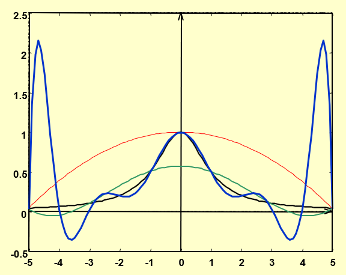

## Introduction

使用计算机计算和现实计算有一个显著差别：计算机计算的精度是有限制的。我们有不同的
数据结构，带来不同的计算精度。数值分析这门课要求我们求出精度足够好的结果。它会告
诉我们一些近似算法，同时也告诉我们，什么时候它们能用，什么时候又不能用。

我们轻而易举地就能想清楚加减乘除的原理。然而，我们可能没有注意
$\sin,\cos,\tan,\ln$ 是怎么实现的？数值分析这门课可以告诉我们背后的原理。

> 一个自然的想法：泰勒展开

## 数学上的准备

怎么求一个积分？简单的想法是把被积函数泰勒展开转化成多项式，然后利用其便于求积分
的特性求解。然而，泰勒展开往往是无限的，这就需要我们规定一个提前结束的时机，这也
引入了一个相当于泰勒余项(**Remainder**)的**误差**。这个误差就是我们需要注意的。

而且，一个棘手的点是：我们没有办法直接和真值进行比较！

另一个棘手的点是：每一个数值本身都与它自己的真值有误差，这也引入了新的误差！我们
需要为每一个数据保留多少位，这也相应地成为了一个问题。

### 误差 Errors

- Truncation Error：与时间有关的一个误差。它代表近似数学引入的误差。

> 显式的操作，经典的就是一个`for`循环

- Roundoff Error：与空间有关的一个误差。它代表数字在计算机中的表达和数字本身的
    误差。

> 数据背后的误差

为了讨论方便，我们用十进制来表示数字。对于一个不能直接以有限数位表示的数字，有两
种方式处理精度：

- 四舍五入(Rounding)
- 直接砍掉精度数位后面的位数(Chopping)
- 往上取

> 大学老师给分(不是)

误差也分为绝对误差(absolute error)和相对误差(relative error)

而有效数字(siginificant digits)应该是一个相对误差概念。可以注意到，对应数值的部
分被移到了科学计数法中的指数部分。

> 有了有效数字的概念，我们应该把数字 0.123 看成 $0.123\pm\epsilon_1$ 使用四舍五
> 入的方法时，有效数字 0.1 的相对误差是 50%

那么，有一个现象，就是两个相近的数字相减之后，有效位数减小时，相对误差会显著增
加。

将一个数除以一个很小的数，绝对误差会放大。这一点是符合直觉的。一个想法是把绝对误
差看成两个数字的函数，然后取关于分母的导数，如果导数很大，那么就说明分母的轻微变
化会带来较大的变化，也就是较大的误差。对于相对误差，也可以尝试以这样的方法进行分
析。

计算的约化也要注意，计算机是每一个单元运算都会进行约化的，不能直接对最终结果进行
约化。

也正是因此，虽然对单个数字而言，Rounding 会更精确，但是对于一个一连串的算式而
言，未必。

> 我们此时也自然地想到，解不是确定值，也可能不是个区间，而应该是一个概率密度分布
> 中的某个可能值。

也还是因此，对于同一个算式的不同表达，比如将一个算式通过一些方式结合，分配，也可
以导致不同的误差。减少乘除的次数，有可能减少误差。减少单元计算的数量，也有可能减
小误差。

> 数学上等价，不等于数值分析方法上等价！

我们可以手动求导来分析误差，也可以用一些自动求导的工具来分析计算式的误差。

### 算法和收敛 Algorithms and Convergence

当一个算法中，原始数据的较小变化只引起较小的终解的变化时，它是 stable 的；否则，
它是 unstable 的。当它对于某些原始数据 stable 时，它是 conditionally stable 的。

设初始误差为 $E_1$，当做连续的 n 次操作时，如果误差 $E_n$ 约为 $E_1$ 的常数倍
时，说误差的增长是 linear 的。如果 $E_n$ 约为 $E_1$ 的以常数为底的指数倍时，则说
误差的增长是 exponent 的。

## 一元方程的求解

### 二分法

能使用二分法的前提是可排序。比如说，复数就很难使用二分，因为它没有既定的序。

二分法一定要除以二吗？不一定。只要区间收敛就好。

- 取中间位置时应该用`p=a+(b-a)/2`。
- 判断取左边界还是右边界时，需要用`sign()`，而非直接相乘看是否小于 0。
- 函数值需要考虑溢出问题。比如说，一个指数函数就容易出现溢出，即使它的横坐标是
    没溢出的。

如果二分法的区间取的过大，可能会忽略函数的根，如一个先增后减的区间，两侧都小于
零，就会误认为中间没解了。

### 不动点迭代

把方程的根转化成一个等效的等式：$f(x)=0 \Leftrightarrow x=g(x)$。$g$ 的不动点是
$f$ 的根。

#### 不动点定理：Self

> 令 $g$ 是一个在 $[a,b]$ 连续的函数，且在其中 $g(x)\in[a,b]$。若对于它的导函数
> $g'$，存在一个常数 $k\in(0,1)$ 使得开区间内任意的 $x$，有 $|g'(x)|\le k$，则对
> 任意的 $p_0\in[a,b]$，序列 $p_n=g(p_{n-1})$ 收敛到唯一的不动点 $p\in[a,b]$。

- 利用中间值定理，证明存在不动点。
- 利用中值定理，证明不动点唯一。
- 利用值域被定义域包含的条件，保证迭代过程中，$g(x)$ 的结果始终在定义域中。
- 利用中值定理，证明迭代确实是收敛于那个存在且唯一的不动点。

这里的存在一个 $k\in(0,1)$ 很重要，这把 $g'(x)$ 和 1 隔开了，避免了极限为 1 的情
况。

> 看证明是有利于记忆定理的。在看证明的过程中，可以理解每一个条件为什么被需要。
>
> 数值分析中有一个特点，给出的公式往往是充分的。顶层应用时，即使没有满足定理的条
> 件，但我们还是有可能选择相信它。而在底层处理时，我们才会格外注意它的必要性。

#### 不动点定理：Corollary

> 如果 $g$ 满足了不动点定理，那么迭代误差的范围为：
>
> $$
> |p_n-p|\le\frac{1}{1-k}|p_{n+1}-p_n|\quad,\quad |p_n-p|\le\frac{k^n}{1-k}|p_1-p_0|
> $$

### 牛顿法

牛顿法也属于一种不动点方法。它的思路是把一个非线性函数线性化。

$$
0=f(p)\approx f(p_0)+f'(p_0)(p-p_0)\quad,\quad p\approx p_0-\frac{f(p_0)}{f'(p_0)}
$$

#### 定理

> 若 $f$ 在 $[a,b]$ 二阶连续，且存在 $p\in[a,b]$ 使得 $f(p)=0,f'(p)\ne 0$，那么
> 就存在一个 $\delta > 0$，使得任意初值 $p_0\in[p-\delta,p+\delta]$ 都可以满足
> $p_{n+1}=p_n-\frac{f(p_n)}{f'(p_n)}$ 收敛到 $p$。

- 由 $f'(p)\ne0$ 知 $g(x)=x-\frac{f(x)}{f'(x)}$ 在 $p$ 的邻域中连续。
- $g'(x)=\frac{f(x)f''(x)}{f'(x)^2}$ 在 $p$ 的邻域中趋于零，只要 $f''(x)$ 连续
    且有限。
- 利用不动点定理知存在一个邻域使得收敛。

### 作业-2

#### P54-T13

> 找到一个迭代次数的范围，使得使用二分法解 $[1,2]$ 上的方程 $x^3 -x-1=0$ 时，解
> 的精确度有 $10^{-4}$。同时，给出这个解。

此题主要考虑的是二分法的误差范围。当对 $[a,b]$ 进行二分时，第一次二分迭代的结果
为 $a+\frac{b-a}{2}$，$\epsilon\le\frac{b-a}{2}$。易知，第 $n$ 次二分迭代的误差
范围为 $\epsilon\le\frac{b-a}{2^n}$，此处只需取 $n=14$。具体求解过程略。

#### P54-T15

> 令 $p_n=\sum_{k=1}^{n}\frac{1}{k}$，证明 $p_n$ 是发散 diverge 的，即使
> $\lim_{n\rightarrow\infty}(p_n-p_{n-1})=0$。

这算是很经典的题目了，典型的方法有积分放缩。这里则采取证明连续多项的和拥有固定下界的方法：

$$
\frac{1}{k}+\frac{1}{k+1}\ldots+\frac{1}{2k-1}\gt k\cdot\frac{1}{2k}=\frac{1}{2}
$$

因此总能找到 $p_{2k-1}>p_{k}+\frac{1}{2}$，故 $p_n$ 是发散的。

#### P64-T3

>  它们被用于计
> 算 $21^{\frac{1}{3}}$。根据收敛速度，将它们排序。假设 $p_0=1$。

a. 这是一个比较普通的不动点方法，直接对

$$
f(x)=\frac{20x}{21}+\frac{1}{x^2}
$$

求导，得

$$
f'(x)=\frac{20}{21}-\frac{2}{x^3}\in[-\frac{22}{21},\frac{6}{7})
$$

这看起来有些危险，我们不妨先迭代一次，得到 $p_1=\frac{41}{21}$，如果把这看成新的
迭代起点，那么可以发现 $f'(x)$ 的范围被控制住了，且拥有明确的上下界。那么，根据
不动点定理的推论，可以得出误差的范围为

$$
O(k^n) \ge O((f'(\frac{41}{21}))^n)\approx O((f'(2))^n)=O((\frac{59}{84})^n)
$$

b. 通过观察可以发现，这是牛顿法，原函数即为

$$
f(x)=x^3-21
$$

关于牛顿法，有这样一件事情：

> 牛顿法的迭代公式为
>
> $$
> p_{n+1}=p_n-\frac{f(p_n)}{f'(p_n)}
> $$
>
> 设迭代终点为 $r$，记 $\epsilon_n=p_n-r$，则根据泰勒展开式，我们有：
>
> $$
> \epsilon_{n+1}=\epsilon_n-\frac{f'(r)\epsilon_n+\frac{1}{2}f''(r)\epsilon_n^2+O(\epsilon_n^3)}{f'(r)+f''(r)\epsilon_n+O(\epsilon_n^2)}=\frac{f''(r)}{2f'(r)}\epsilon_n^2
> $$
>
> 这也就是所谓的牛顿法具有**二次收敛**的性质，这个收敛速度已经很快了。
>
> 本选项就是一个二次收敛的样例。
>
> 需要注意的是，当出现重根， $f'(x)=0$，此时二次收敛不再成立。

c. 看起来很复杂，我们直接尝试代入，然后发现 $p_1=0,p_{k>1}=0$，可知压根收敛不到
$21^{\frac{1}{3}}$。

d. 可以设 $p_n=21^{k_n}$，则有

$$
21^{k_n}=21^{\frac{1-k_{n-1}}{2}}\Rightarrow k_n=\frac{1-k_{n-1}}{2}\Rightarrow k_n-\frac{1}{3}=-\frac{1}{2}(k_{n-1}-\frac{1}{3})
$$

可知 $k_n$ 的误差为 $O(\frac{1}{2}^n)$，那么

$$
p_n=21^{\frac{1}{3}+O(\frac{1}{2^n})}=21^{\frac{1}{3}}\cdot(21^{O(\frac{1}{2^n})})=21^{\frac{1}{3}}(1+\ln(21)\cdot 21^{O(\frac{1}{2^n})}\frac{1}{2^n}+O(\frac{1}{2^{2n}}))\approx21^{\frac{1}{3}}(1+\ln(21)\frac{1}{2^n})
$$

故误差为 $O(\frac{1}{2^n})$。

综上，排序为 $b>d>a>c$。

#### P65-T19

> ---
>
> 1. 利用不动点定理，证明当 $x_0\gt\sqrt{2}$时，
>
> $$
> x_n=\frac{1}{2}x_{n-1}+\frac{1}{x_{n-1}},\qquad \text{for } n\ge 1
> $$
>
> 收敛到 $\sqrt{2}$，
>
> 2. 利用“当 $x_0\ne\sqrt{2}$，$0< (x_0-\sqrt{2})^2$”，证明：当
>     $0\le x_0\le\sqrt{2}$，有 $x_1\gt\sqrt{2}$。
> 3. 利用 (1),(2) 的结果，证明 (a) 中的式子收敛到 $\sqrt{2}$，只要 $x_0\gt 0$。

1. 记 $f(x)=\frac{1}{2}x+\frac{1}{x}$，当 $\sqrt{2}<x\le x_0$ 时，有
   $\sqrt{2}<\frac{1}{2}x+\frac{1}{x}<x_0$，即 $f(x)\in(\sqrt{2},x_0)$。函数连续
   性显然，再由 $f'(x)=\frac{1}{2}-\frac{1}{x^2}\in(0,\frac{1}{2})$ 知存在
   $k\in(0,1)$。综上，已满足不动点定理。
2. 题意估计是要我们配方，不过基本不等式易得了。
3. 首先，利用 (2) 中结果，当 $x_0\in(0,\sqrt{2})$ 时，不妨先迭代一次，把迭代结果
   看成新的 $x_0>\sqrt{2}$。然后，由 (1) 易得收敛至 $\sqrt{2}$。
   $x_0\in(\sqrt{2},\infty)$ 时亦然。

### 对迭代方法的误差分析

> 假设 $\{p_n\}$ 是一个收敛到 $p$ 的序列，如果存在正常数 $\alpha$ 和 $\lambda$
> 使得
>
> $$
> \lim_{n\rightarrow \infty}\frac{|p_{n+1}-p|}{|p_n-p|^\alpha}=\lambda
> $$
>
> 则说 $\{p_n\}$ 对 $p$ 的收敛阶至少为 $\alpha$

比如说，牛顿法就是一个至少二阶收敛的方法(当不存在重根)。

下面是一个可以确定收敛阶阶数的定理：

> 设 $p$ 是 $g(x)$ 的一个不动点，若在 $p$ 的邻域内 $g(x)$ $\alpha \ge 2$ 阶连
> 续，且满足
>
> $$
> g'(p)=g^{(2)}(p)=\ldots g^{(\alpha-1)}(p)=0,g^{(\alpha)}\ne 0
> $$
>
> 则 $g(x)$ 的不动点迭代的收敛阶为 $\alpha$。

### 重根

对计算机来说，解 $x^2=0$ 远比 $x^2-4x+3=0$ 困难。这是因为，前者要考虑重根，而且
对于计算机来说，这实际上是在求 $x^2=\pm \epsilon$，当 $\epsilon<0$，会出现未定义
的情况。所以说，解方程有可能是不稳定的。这里的一种处理方法是，改而求解
$(x^2-0)^2=0$。

前面我们提到，对于牛顿法而言，重根的存在会导致它的收敛阶低于 $2$。不过，我们可以
做一个修正，也就是构造另一个函数，使得它的根和原函数的根相同，但是在原重根的邻域
内不存在重根。

$$
\begin{align*}
    u(x)&=\frac{f(x)}{f'(x)}\\
    x_{n+1}&=x_n-\frac{u(x_n)}{u'(x_n)}
\end{align*}

$$

> 关于邻域内不存在重根这一点，可以通过把函数 $f(x)$ 写成
>
> $$
> f(x)=(x-p)^k\phi(x)\quad,\quad\phi(p)\ne 0
> $$
>
> 来得出。

### Aitken's Δ² Method

> 对于一个一阶收敛的迭代序列，有
>
> $$
> \frac{p_{n+1}-p}{p_{n}-p}\approx \frac{p_{n+2}-p}{p_{n+1}-p}
> $$
>
> 据此，我们可以解出 $p$ 的一个近似解
>
> $$
> p\approx\frac{p_{n+2}p_n - p_{n+1}^2}{p_{n+2} - 2p_{n+1} + p_n}=p_n-\frac{(p_{n+1}-p_n)^2}{p_{n+2}-2p_{n+1}+p_n}
> $$
>
> 如果引入差分的话，就可以写成
>
> $$
> p\approx p_n-\frac{(\Delta p_n)^2}{\Delta^2 p_n}
> $$
>
> 于是，我们在使用一阶收敛的方法时，就可以使用 Aitken's Δ² Method 来加速收敛。

有人可能会考虑把 Aitken's Δ² Method 加速完的结果再作为新的迭代起点，然而这样破坏
了 linear convergence 的条件，是不可取的。

### 作业-3-1

#### P86-T11

> 不动点迭代方法
> $$
> p_{n+1}=g(p_{n})=p_n-\frac{f(p_n)}{f'(p_n)}-\frac{f''(p_n)}{2f'(p_n)}\left[\frac{f(p_n)}{f'(p_n)}\right]^2
> $$
> 拥有性质
> $$
> g'(p)=g''(p)=0
> $$
> 这会得到立方收敛的结果。比较一下平方收敛和立方收敛。

设另一个平方收敛的序列为 $\{q_n\}$，为了便于分析，我们设它们都收敛到 $0$(其实就是移动坐标轴)，且
$$
\frac{p_{n+1}}{p_{n}^3}\approx 0.5 \quad\text{and}\quad\frac{q_{n+1}}{q_n^2}\approx 0.5
$$
可以得出
$$
\begin{align*}
|q_n-0|&\approx (0.5)^{2^n-1}|q_0|^{2n}\\
|p_n-0|&\approx (0.5)^{\frac{3^n-1}{2}}|p_0|^{3n}

\end{align*}
$$

## 求解线性方程组 Linear Systems

### 高斯消元法

回忆在线性代数中我们的做法，使用高斯消元，把矩阵化成上三角的形式，然后一个一个解出解并回代。

我们可以用一个迭代的思路来理解：我们先把最左列除了第一行的元素清零，然后，根据高斯消元法，我们就不再会对第一行、第一列操作了。这时，我们可以忽略它们，这就相当于是再去解一个新的、阶数减一的线性方程组了。迭代进行到阶数为 $1$ 的时候，解就出来了。

> 消元阶段的乘除法的数量为
> $$
> \begin{align*}
>     &\sum_{k=1}^{n-1}(n-k)(n-k-2)\\
>     &=\frac{n^3}{3}+\frac{n^2}{2}-\frac{5n}{6}
> \end{align*}
> $$
> 进行第 $k$ 次迭代时，需要对 $n-k$ 行做消去操作，每一行需要操作的元素有 $n-k+2$ 个。进行 $n-1$ 次操作后，矩阵阶数变为 $1$。
>
> 回代阶段的乘除法数量为
> $$
> 1+\sum_{i=1}^{n-1}(i+1)=\frac{n^2}{2}+\frac{n}{2}
> $$
> 考虑第 $i$ 次回代需要 $1$ 次除法和 $i$ 次乘法即可。
>
### 作业-3-2

#### P357-T8
>
> 
> > Algorithm 6.1
> > 
> > 
> >

大致步骤一致，只是在 Step4 部分有所区别：我们需要对 $j=1,\ldots n,j\ne i$ 操作。然后，我们在 Step8 阶段就可以返回所有的解：
$$
x_i=a_{i,n+1}/a_{i,i},i=1,2,\ldots,n
$$

#### P358-T11
>
> 

根据上一题，我们可以得出，加减法的次数为
$$
\sum_{i=1}^{n}(n-k+1)(n-1)=\frac{n^3}{2}-\frac{n}{2}
$$
乘除法的次数为
$$
\sum_{i=1}^{n}(n-k+2)(n-1)+n=\frac{n^3}{2}+n^2-\frac{n}{2}
$$

为了便于计算，我们可以都只对乘除法的次数进行比较。高斯消元法需要的乘除法总数
$$
\frac{n^3}{3}+n^2-\frac{n}{3}
$$

故有

| n   | 高斯消元法 (GE) | 高斯–约当法 (GJ) |
|-----|----------------|-----------------|
| 3   | 17             | 21              |
| 10  | 430            | 595             |
| 50  | 44150          | 64975           |
| 100 | 343300         | 509950          |

### 主元法 Pivoting Strategies

#### Partial pivoting/maximal column pivoting

第 $i$ 次迭代时， 选择第 $i$ 列中最小的 $p\gt i$，使得 $|a_{pi}|$ 是最大的。然后把第 $p$ 行和第 $i$ 行交换。这样可以保证除的时候除以一个较大的数。

然而，这个方法有一个问题，即除数大无法保证伸缩系数小。

> 时间复杂度： $O(n^2)$

#### Scaled Partial Pivoting/scaled-column pivoting

不仅仅看 $|a_{pi}|$，也考虑本行中的表现。

我们定义一个 scale factor  $s_p=\max|a_{pj}|$。这表现了这一行中的伸缩系数分子中的最大值。

然后，我们寻找第 $i$ 列中最小的 $p\gt i$，使得 $|\frac{a_{pi}}{s_p}|$ 是最大(即最大的伸缩系数最小)的，然后交换。

但是，这么做也有个问题：每一次高斯消元的递归过程中，后面的每一行都发生了变化。如果我们每一行都这么做，会导致速度很慢。因此，注意 partial 这个词，我们的伸缩系数只在一开始计算，后面都不重新计算了。

> 时间复杂度： $O(n^2)$

#### Complete Pivoting/maximal pivoting

一个想法是，如果在 Scaled Partial Pivoting 中每次递归过程都重新计算 $s_p$，那么时间复杂度会到达立方。既然如此，不如也对列做交换。

对于 $n$ 阶的线性方程组，在第 $i$ 次递归时，会有一个 $n+1-i$ 阶子阵。在这个子阵中，找到最大的元素 $a_{pq}$，然后交换 $i$ 行与 $p$ 行，再交换 $i$ 列与 $q$ 列。

> 时间复杂度： $O(\frac{n^3}{3})$

### 矩阵分解 Matrix Factorization

让我们考虑每一次消元的等价操作：

令 $m_{i1}=\frac{a_{i1}}{a_{11}}(a_{11}\ne 0)$，则有第一次消元等价于将原系数矩阵左乘矩阵 $L_1$:

$$
L_1 =
\begin{pmatrix}
1      &        &        &        & \\
-m_{2,1} & 1      &        &        & \\
\vdots & \vdots & \ddots &        & \\
-m_{n,1} &        &        & 1      &
\end{pmatrix}
$$

依次类推，第 $i$ 次消元等价于左乘 $L_i$:
$$
L_i=
\begin{pmatrix}
1&&&&&\\
&\ddots&&&&\\
&&1&&&\\
&&-m_{i+1,i}&1&&\\
&&\vdots&&\ddots&\\
&&-m_{n,i}&&&1
\end{pmatrix}
$$

既然如此，我们可以把每一个消元操作对应的矩阵先相乘。这样，可以得到一个下三角矩阵。

$$
L=L_{n-1}L_{n-2}\ldots L_1
$$
> 单位下三角矩阵乘与取逆都有封闭性。

这个下三角矩阵只与系数矩阵有关。因此，当系数矩阵一定时，这个方法效率很高。

现在，让我们重新整理一下符号。忘掉上面的 $L$，改取
$$
L=L_1^{-1}L_2^{-2}\ldots L_{n-1}^{-1}
$$
则有
$$
A=LU,U\text{为高斯消元法后得到的系数矩阵}
$$
可以看到，我们把 $A$ 分解成了一个下三角矩阵 $L$ 和一个上三角矩阵 $U$ 的乘积。

如果我们在度量上做限制，让 $L$ 为一个单位下三角矩阵，那么这样的分解就是唯一的。

### 特殊矩阵 Special Types of Matrices

- 严格对角占优矩阵 Strictly Diagonally Dominant Matrix：每一行中，对角线元素绝对值大于本行其它元素的绝对值之和。严格对角占优矩阵是非奇异 nonsingular 的。且执行高斯消元法时不需要置换行或列，其解在舍入误差上是稳定的。

> 直觉上，严格对角占优矩阵类似于单位阵。因此，它会有比较好的性质。

- 正定矩阵 Positive Definite Matrix：对 $\forall x\ne \vec{0}, x^{-1}Ax>0$ 且 $A$ 是对称 symmetric 的.

  - 如果一个矩阵是正定的,那么它的逆也是正定的.
  - 正定矩阵的对角线元素严格大于 $0$.

当给了矩阵的特殊性质，我们就可以针对性质给出特定的优化算法。

#### 正定矩阵的优化算法

当 $A$ 是正定矩阵时，显然，它可以分解成 $B\Lambda B^T$ 的形式，其中 $B$ 为单位下三角矩阵， $\Lambda$ 为对角线元素均大于零的对角阵。另外，我们还有
$$
U=\Lambda\tilde{U}
$$
其中 $\Lambda$ 是以 $u_{ii}$ 为对角元素的对角阵，而 $\tilde{U}$ 则因此变成了一个单位上三角矩阵。注意到 $L$ 为一个单位下三角矩阵，则只能有 $L=\tilde{U}^{T}$

又因为 $\Lambda$ 对角线元素均大于零，因此它可以被分解为 $\Lambda^{\frac{1}{2}}\Lambda^{\frac{1}{2}}$。那么，我们进行再整理，则有
$$
A=\tilde{L}\tilde{L}^{T},\tilde{L}=L\Lambda^{\frac{1}{2}}
$$

使用 **Choleski's Method**，可以快速地计算出 $\tilde{L}$，从而完成线性方程组的求解。

#### 三对角矩阵的优化算法

Thomas 算法：

需要注意的是，一旦 $\exists\alpha_i =0$，则 Thomas 算法失效(但不意味着这个方程不可解)。

> 当 $A$ 是三对角矩阵，且它是 diagonally dominant 的(注意没有要求严格)，且
> $$
> |b_1| >|c_1| >0,|b_n| > |a_n| >0, a_i\ne 0, c_i \ne 0
> $$
> 则 $A$ 非奇异，此时方程可用 Thomas 算法求解。
>
> 当 $A$ 是三对角矩阵且严格对角占优时，方程一定可用 Thomas 算法求解。
>
> 上述两种情况下，Thomas 算法是稳定的，因为所有的中间值会受主对角线元素的约束。
>
> Thomas 算法的时间复杂度为 $O(n)$。
>
> 该算法的具体实现见作业题。

### Homework-1

#### P397-T7

> 

a)

我们采用一个递归的思路来解释 $LU$ 分解：

1. 在已知 $L$ 的前 $i-1$ 列， $U$ 的前 $i-1$ 行的情况下，求出 $U$ 的第 $i$ 行
2. 在已知 $L$ 的前 $i-1$ 列， $U$ 的前 $i$ 行的情况下，求出 $L$ 的第 $i$ 列

只要可以解决这两个递归，就能够完成 $LU$ 分解。

对于递归(1)，有(注意 $l_{ii}=1$ )：
$$
\sum_{j=1}^{i}l_{ij}u_{jk}=a_{ik}\quad\Rightarrow\quad  u_{ik}=a_{ik}-\sum_{j=1}^{i-1}l_{ij}u_{jk},\quad i\le k \le n
$$
这里引入了 $(i-1)(n+1-i)$ 次乘除法与 $(i-1)(n+1-i)$ 次加减法。

对于递归(2)，有：
$$
\sum_{j=1}^{i}l_{kj}u_{ji}=a_{ki}\quad\Rightarrow\quad l_{ki}=\frac{a_{ki}-\sum_{j=1}^{i-1}l_{kj}u_{ji}}{u_{ii}},\quad i< k\le n
$$
这里引入了 $i(n-i)$ 次乘除法与 $(i-1)(n-i)$ 次加减法。

从 $i=1$ 一直递归到 $i=n$，就可以完成 $LU$ 分解了。

乘除法数为
$$
\begin{align*}
    \sum_{i=1}^{n}(i-1)(n+1-i)+i(n-i)&=\sum_{i=1}^{n}-\frac{2}{3}\Delta (i^3)+(n+2)\Delta (i^2)-(2n+\frac{7}{3})\Delta (i)\\
    &=\frac{1}{3}n^3-\frac{1}{3}n
\end{align*}
$$

加减法数为
$$
\begin{align*}
    \sum_{i=1}^{n}(i-1)(2n+1-i)&=\sum_{i=1}^{n}(i-1)(n+1-i)+i(n-i)-\sum_{i=1}^{n}(n-i)\\
    &=\frac{1}{3}n^3-\frac{1}{2}n^2+\frac{1}{6}n
\end{align*}
$$

b)

考虑 $\vec{y}$ 的前 $i-1$ 位已被求解，欲求解第 $i$ 位，有
$$
\sum_{k=1}^{i}l_{ik}y_k=b_i\quad\Rightarrow\quad y_i=b_i-\sum_{k=1}^{i-1}l_{ik}y_k
$$
这里引入了 $i-1$ 次乘除法和 $i-1$ 次加减法。

于是乘除法与加减法数都为
$$
\sum_{i=1}^{n}(i-1)=\frac{n(n-1)}{2}
$$

c)

与 (b) 中相反， $U\vec{x}=\vec{y}$ 的求解是从下往上的，且因为 $u_{ii}$ 可能不为 $1$，导致每一次都需要多进行一次除法，因此会每次引入 $i$ 次乘除法和 $i-1$ 次加减法

于是乘法数为
$$
\frac{n(n+1)}{2}
$$
加减法数为
$$
\frac{n(n-1)}{2}
$$

通过求和，可以解得总共需要的乘除法数量为
$$
\frac{1}{3}n^3+n^2-\frac{1}{3}n
$$
加减法数量为
$$
\frac{1}{3}n^3+\frac{1}{2}n^2-\frac{5}{6}n
$$

这与高斯消元法需要的次数相同。

d)

乘除法总数为
$$
\frac{1}{3}n^3-\frac{1}{3}n+mn^2
$$

加减法总数为
$$
\frac{1}{3}n^3-\frac{1}{2}n^2+\frac{1}{6}n+mn^2-mn=\frac{1}{3}n^3+(m-\frac{1}{2})n^2+(\frac{1}{6}-m)n
$$

这个小题主要体现多次求解同个系数矩阵的线性方程组时 $LU$ 分解法的高效性。

> Thomas 算法具体实现：
>
> 套用上面的 $LU$ 分解方法(虽然不是 ppt 中的 Crout 分解)，可以发现 $LU$ 分解的递归公式变得相当简单：
> $$
> \begin{align*}
>     u_{ii}&=a_{ii}-l_{ii-1}a_{i-1i}\\
>     u_{ii+1}&=a_{ii+1}\\
>     l_{ii}&=1\\
>     l_{i+1i}&=\frac{a_{i+1i}}{u_{ii}}
> \end{align*}
> $$
>
> 之后，我们再分别求解 $\vec{y},\vec{x}$ 的递推式，有：
> $$
> \begin{align*}
>     y_{i+1}&=b_{i+1}-\frac{a_{i+1i}}{u_{ii}}y_i\\
>     x_{i-1}&=\frac{y_{i-1}-a_{i-1i}x_i}{u_{i-1i-1}}
> \end{align*}
> $$
>
> 注意到 $l$ 和 $u$ 的互相转换非常简单。因此，如果我们激进一些，完全可以只维护一个一维数组。我们记 $t_i=u_{ii}$，则有：
> $$
> \begin{align*}
> t_{i+1}&=a_{i+1i+1}-\frac{a_{i+1i}a_{ii+1}}{t_i}\\
> y_{i+1}&=b_{i+1}-\frac{a_{i+1i}}{t_i}y_i\\
> x_{i-1}&=\frac{y_{i-1}-a_{i-1i}x_i}{t_{i-1}}
> \end{align*}
> $$

#### Read the proofs on P401-402

> 

(i) 考虑 $A\vec{x}=0$，则有 $\vec{x}^{T}A\vec{x}=0$。根据正定性，有 $\vec{x}=\vec{0}$。因此，$A\vec{x}=0$ 只存在零解，故矩阵满秩，行列式不为零，是可逆的。

(ii) 这由正定性是显然的，我们只要取 $\vec{x_i}$ 的第 $i$ 位为 $1$，其它位为零，然后用 $\vec{x}^TA\vec{x}>0$ 的条件代入就可知， $A$ 的对角线元素必然严格大于零。

(iii) 我们同样采用构造的方法。我们任意取 $i,j$，使得 $x_i=1,x_j=-1$，且 $\vec{x}$ 的其它位为 $0$。那么，有(采用爱因斯坦求和约定)：
$$
\vec{x}^TA\vec{x}=x_pA_{pq}x_q=A_{ii}+A_{jj}-2A_{ij}
$$

不妨设 $A_{ii}\ge A_{jj}$，则有
$$
2A_{ii}-2A_{ij}\ge A_{ii}+A_{jj}-2A_{ij}>0\Rightarrow A_{ii}>A_{ij}
$$

同理，我们把 $x_j$ 改成 $1$，就能得到 $A_{ii}>-A_{ij}$。

综上，对于任意的 $j$，均存在 $i\ne j$ 使得 $A_{ii}>|A_{ij}|$，证毕。

(iv) 令 $x_i=t,x_j=1,i\ne j$，其余位为 $0$，则有
$$
A_{ii}t^2+2A_{ij}t+A_{jj}>0
$$

左式作为一个一元二次方程，它的 $\Delta$ 应当小于零，即
$$
4a_{ij}^2-4a_{ii}a_{jj}<0
$$
化简即为所求。

#### P412-T17

>

(a) 只要计算行列式为 $0$ 即可。
$$
|A|=-\alpha+2(2\alpha-\beta)=0\quad\Rightarrow \quad\forall 3\alpha = 2\beta\text{ 均可}
$$

(b)  $\forall\alpha >1,\beta < 2$ 即可

(c)  $\forall\alpha;\beta=1$

(d) 只需所有主子矩阵的行列式均为正。于是有：
$$
\begin{align*}
    \alpha >0\\
    2\alpha-\beta >0\\
    3\alpha-2\beta>0
\end{align*}
$$

得 $\beta < \frac{3}{2}\alpha \land \alpha>0$。

## 矩阵代数中的迭代方法 Iterative Techniques in Matrix Algebra

我们把 $A\vec{x}=\vec{b}$ 转换成迭代形式  $\vec{x}=T\vec{x}+\vec{c}$。为了能够迭代，我们先需要进行数学上的定义。

### 向量的范数

我们定义向量的范数 norm。范数需要满足:
$$
\begin{aligned}
\text{(1) 非负性 positive definite：} \quad & \|x\| \ge 0 \quad \text{且} \quad \|x\|=0 \iff x=\mathbf{0}, \\
\text{(2) 齐次性 homogeneous：} \quad & \|\alpha x\| = |\alpha| \, \|x\|, \quad \forall \alpha\in\mathbb{R}, \\
\text{(3) 三角不等式 triangle inequality：} \quad & \|x+y\| \le \|x\| + \|y\|, \quad \forall x,y.
\end{aligned}
$$

> - $k$ 阶范数的定义：
>
> $$
> \|\vec{x}\|_p=\left(\sum_{i=1}^n|x_i|^p\right)^{\frac{1}{p}}
> $$
>
> - 无穷阶范数的定义：
>
> $$
> \|\vec{x}\|_{\infty}=\max_{1\le i\le n}|x_i|
> $$
>
> 欧几里得范数就是二阶范数。

对于某一个范数定义,如果一个迭代序列 $\vec{x_k}$ 满足  $\|\vec{x_k}-\vec{x}\|$ 收敛于 $0$,则说 $\vec{x_k}$ 收敛到 $\vec{x}$.

在有限维实向量空间中，不同范数之间总是“等价”的。也就是说，对于任意两个范数 $\|\cdot\|_a$ 和 $\|\cdot\|_b$，存在正的常数 $c$ 和 $C$，使得对所有 $x$ 都有

$$
c \, \|x\|_a \le \|x\|_b \le C \, \|x\|_a.
$$

这说明：

- 如果一个迭代序列在范数 $\|\cdot\|_a$ 下收敛，那么在任意其他范数 $\|\cdot\|_b$ 下也收敛；
- 收敛的快慢（误差量级）在不同范数下最多相差一个常数因子，不影响“收敛阶”的讨论。

因此，在数值算法和迭代方法中，我们通常只选用一种范数来分析误差，而不必担心选哪一种范数会改变收敛性质。

### 矩阵的范数

一般而言，前面提到的性质对于范数已经足够了。然而，为了便于分析，我们往往要求矩阵的范数还满足如下条件：
$$
\text{一致性 consistent：}\|AB\|\le\|A\|\cdot\|B\|
$$
> 如果没有一致性，我们对简单的 $AB$ 的误差分析都会变得很复杂，因为没办法从 $\|A\Delta B\|$ 到 $\|A\|\|\Delta B\|$ 了。
>

下面也介绍常见的范数：

- Fronenius 范数：

$$
\|A\|_F=\sqrt{\sum_{i=1}^m\sum_{j=1}^n a_{ij}^2}
$$

- $p$ 阶自然范数：

$$
\|A\|_p=\max_{\vec{x}\ne \vec{0}}\frac{\|A\vec{x}\|_p}{\|\vec{x}\|_p}=\max_{\|\vec{x}\|=1}\|A\vec{x}\|_p
$$
这个依赖于向量的定义似乎有些奇怪，但其实它表现了空间各个方向上矩阵算子最强的拉伸能力。

常用的自然范数有：
$$
\begin{align*}
    \|A\|_{\infty}&=\max_{1\le i\le n}\sum_{j=1}^n|a_{ij}|\\
    \|A\|_{\infty}&=\max_{1\le j\le n}\sum_{i=1}^n|a_{ij}|\\
    \|A\|_2&=\sqrt{\lambda_{\text{max}}(A^TA)}(\text{谱范数})
\end{align*}
$$

> 无穷自然范数的证明：
>
> 
>

### 特征值与特征向量 Eigenvalues and Eigenvectors

#### 谱半径 Spectral Radius

对于矩阵 $A$ ，其特征值可能是复数。因此，我们利用复数的幅值来刻画它们，其中最大的幅值也就是谱半径 $\rho(A)$ 。

> 对于一个 $n$ 阶矩阵，对于任意的自然范数，有 $\rho (A)\le \left\|A\right\|$
>
> Prove:
> $$
> \forall\text{ eigenvalue }\lambda, |\lambda|\cdot \left\|\mathbf{x}\right\|=\left\|\lambda \mathbf{x}\right\|=\left\|A \mathbf{x}\right\|\le \left\|A\right\|\cdot \left\|\mathbf{x}\right\|
> $$

如果一个 $n$ 阶矩阵满足对于任何 $i,j=1,2,\ldots,n$，有 $\lim_{k\to\infty}(A^k)_{ij}=0$，则说这个矩阵是收敛的。

#### 雅可比迭代法 Jacobi Iterative Method

雅可比迭代法的思路是构造一个便于求解的迭代式(系数矩阵只是个对角阵)，以提高迭代效率。

我们把一个矩阵 $A$ 分成对角阵 $D$ 与上三角阵 $-U$ 和下三角阵 $-L$ 的和，则有
$$
A \mathbf{x}= \mathbf{b}\iff D \mathbf{x}=(L+U) \mathbf{x}+ \mathbf{b}
$$

这就出现了一个可迭代式(假设 $D$ 可逆)
$$
\mathbf{x}=D^{-1}(L+U) \mathbf{x}+ D^{-1}\mathbf{b}
$$

我们定义雅可比迭代法的系数 $T_j=D^{-1}(L+U),\mathbf{c_j}=D^{-1}b$，则有迭代式
$$
\mathbf{x}^{(k)}=T_j\mathbf{x}^{(k-1)}+\mathbf{c_j}
$$

> 具体算法：
>
> 首先，我们合适地交换行或列，使得对于 $i=1,\ldots,n$， $a_{ii}\ne 0$。
>
> 然后，根据迭代式，每一次迭代，我们从 $i=1$ 直到 $n$，计算
> $$
> x_i^{(k+1)}=\frac{b_i-\sum_{j\ne i \& j=1}^{n}a_{ij}x_j^{(k)}}{a_{ii}}
> $$
>
> 在这里，我们需要使用两个向量来维护 $\mathbf{x}^{(k)},\mathbf{x}^{(k+1)}$。当不使用并行优化时，这么做显得有些浪费。一个想法是，我们始终只维护一个向量 $\mathbf{x}$ ，此时，在计算 $x_i$ 时，是使用了新的 $1\ldots i-1$ 个分量和其它旧的分量。这也就引出了高斯-赛德尔迭代法。

#### 高斯-赛德尔迭代法 Gauss-Seidel Iterative Method

> 在直觉上，对于将 $A$ 分裂，然后一部分放到方程右边构造的迭代法，扔到方程右边的部分越多，收敛得就越快。
>
> 这通过极限思想容易想通，把 $A$ 拆成 $A$ 和 $0$ 后，一次迭代就收敛了。
>
> 当然，我们还需要保证迭代式易于求解的问题，因此一些拥有优良性质的矩阵就适合被留下来，把剩余部分扔到迭代右式里。

Gauss-Seidel Iterative Method 的思路就是解一个系数矩阵为下三角矩阵的迭代式。我们做如下拆分：
$$
(D-L)\mathbf{x}=U \mathbf{x}+\mathbf{b}\iff \mathbf{x}=(D-L)^{-1}U \mathbf{x}+(D-L)^{-1}\mathbf{b}
$$

类似地，我们定义 $T_g=(D-L)^{-1}U,\mathbf{c_g}=(D-L)^{-1}\mathbf{b}$，则有迭代式
$$
\mathbf{x}^{(k)}=T_g\mathbf{x}^{(k-1)}+\mathbf{c_g}
$$

在具体实现上，很巧的是，这恰恰是我们在尝试对雅可比迭代法的空间占用上做优化的结果。

对于不同的问题，Jacobi 和 Gauss-Seidel 迭代法有不同的表现。有时前者好用后者不好用，反之的情况也会存在。但至少让我们关注一下收敛性的问题吧。

### 迭代方法的收敛性

首先介绍如下定理：

> 对于矩阵 $A$，下面五个命题等价：
>
> 1. $A$ 是收敛的。
> 2. 对于某个自然范数，有 $\lim_{n\to\infty}\left\|A\right\|=0$
> 3. 对于任意自然范数，有 $\lim_{n\to\infty}\left\|A\right\|=0$
> 4. $\rho (A)<1$
> 5. 对于任意的 $\mathbf{x}$，有 $\lim_{n\to\infty}A^n \mathbf{x}=\mathbf{0}$

拥有如上定理之后，我们可以得出一个结论：

> 对于任意的迭代式
> $$
> \mathbf{x}^{(k)}=T\mathbf{x}^{(k-1)}+\mathbf{c}
> $$
> 只要满足 $\rho (T)<1$，迭代式就必然收敛到解
> $$
> \mathbf{x}=T \mathbf{x}+\mathbf{c}
> $$
> Proof:
>
> 我们将迭代式展开，则有
> $$
> \mathbf{x}^{(k)}=T^k \mathbf{x}^{(0)}+(T^{k-1}+\ldots+T+I)\mathbf{c}
> $$
> 由于 $\rho(T)<1$，有对于任意的 $\mathbf{x}$， $\lim_{n\to\infty}T^n \mathbf{x}=\mathbf{0}$。因此，当我们取 $k$ 无限大时，就有 $T^k \mathbf{x}^0\to \mathbf{0}$。
>
> 于是，我们有
> $$
> \lim_{k\to\infty}\mathbf{x}^{(k)}=(I-T)^{-1}\mathbf{c}
> $$
> 而这恰好就是 $\mathbf{x}=T \mathbf{x}+\mathbf{c}$ 的解。

回忆前文，我们知道，对于任意的自然范数 $\left\|\cdot\right\|$，有  $\rho (T)\le \left\|T\right\|$。这说明， $\left\|T\right\|<1$ 是比 $\rho (T)<1$ 更强的条件。当满足这个更强的条件时，有如下结论：

> 迭代式
> $$
> \mathbf{x}^{(k)}=T\mathbf{x}^{(k-1)}+\mathbf{c}\quad(\text{given }\forall \text{ natural norm}\left\|T\right\|<1)
> $$
> 收敛，且其中间解与收敛终点的误差控制在：
> $$
> \begin{align}
    > \left\|\mathbf{x}-\mathbf{x}^{(k)}\right\|&\le \left\|T\right\|^k \left\|\mathbf{x}-\mathbf{x}^{(0)}\right\|\\
    > \left\|\mathbf{x} -\mathbf{x}^{(k)}\right\|&\le \frac{\left\|T\right\|^k}{1-\left\|T\right\|}\left\|\mathbf{x}^{(1)}-\mathbf{x}^{(0)}\right\|
> \end{align}
> $$

对于一个严格对角占优的矩阵 $A$，不管迭代起点如何选取，Jacobi 和 Gauss-Seidel 法都会得到收敛到唯一解的迭代序列。

### Relaxation Methods

回忆第一个 research topic 中我最终对不动点迭代的方法，可以发现一个特殊的视角：

> 我们可以把不动点迭代写成
> $$
> \mathbf{x}^{(k+1)}=\mathbf{x}^{(k)}+ \mathbf{\Delta }^{(k+1)}
> $$
> 其中 $\mathbf{\Delta }^{(k+1)}$ 是一个有关于 $\mathbf{x}^{(k)}$ 的函数，且当 $\mathbf{x}^{(k)}$ 为不动点时取值为 $\mathbf{0}$。这个函数事实上表现了每一步迭代的步长。

接着这个视角，我们可以把 Gauss-Seidel 迭代法写成如下的形式：
$$
x_i^{(k+1)}=x_i^{(k)}+\frac{b_i-\sum_{j<i}a_{ij}x_j^{(k+1)}-\sum_{j\ge i}a_{ij}x_j^{(k)}}{a_{ii}}
$$
特殊地，我们记
$$
r_i^{(k+1)}=b_i-\sum_{j<i}a_{ij}x_j^{(k+1)}-\sum_{j\ge i}a_{ij}x_j^{(k)}
$$
并称之为残差 residual。

这样，就有
$$
x_i^{(k+1)}=x_i^{(k)}+\frac{r_i^{(k+1)}}{a_{ii}}
$$

回忆一下我们上面提到的视角，我们很容易想到一件事，这个迭代的步长也许可以加一些系数来调整。这也就是所谓的 relaxation method：
$$
x_i^{(k+1)}=x_i^{(k)}+\omega \frac{r_i^{(k+1)}}{a_{ii}}
$$

根据 $\omega$ 的范围不同，我们把 relaxation method 分为

- $0<\omega <1$ Under-Relaxation Methods
- $\omega =1$ Gauss-Seidel Methods
- $\omega >1$ Successive Over-Relaxation Methods

经过化简，我们可以得出 relaxation method 的一个不太简洁的矩阵表示：
$$
\begin{align*}
    \mathbf{x}^{(k+1)}&=(D-\omega L)^{-1}[(1-\omega )D+\omega U]\mathbf{x}^{(k)}+(D-\omega L)^{-1}\omega \mathbf{b}\\
    &=T_{\omega }\mathbf{x}^{(k)}+\mathbf{c}_\omega
\end{align*}
$$

下面不加证明地给出几个定理：

对于不同的方程，我们可以通过调整 $\omega $，使得谱半径达到最小，此时收敛速度最快。

### Homework

#### Read the proof of Theorem 7.7 on p.423

> 证明：对于任意 $\vec{x}\in R^n$，有
> $$
> \|x\|_{\infty}\le \|x\|_x\le\sqrt{n}\|x\|_{\infty}
> $$

不妨令 $x_t$ 是 $\vec{x}$ 的分量中绝对值最大的，则有
$$
\|x\|_{\infty}=|x_j|^2\le\sum_{i=1}^nx_i^2=\|x\|_2^2
$$
且也有
$$
\|x\|_2^2=\sum_{i=1}^nx_i^2\le nx_j^2
$$

综上开根即证。

#### P429-T5(a)
>
> 
$$
\begin{align*}
\mathbf{x}-\tilde{\mathbf{x}}&\approx 1\times 10^{-4}(8.57,-6.67)^T\\
\|\mathbf{x}-\tilde{\mathbf{x}}\|&=8.57\times 10^{-4}\\
A\tilde{\mathbf{x}}-\mathbf{b}&\approx (-0.00020,-0.00012)^T\\
\|A\tilde{\mathbf{x}}-\mathbf{b}\|&=2.0\times 10^{-4}
\end{align*}
$$

#### P429-T7
>
> Show by example that $\|\cdot\|$ defined by  $\|A\|=\max_{1\le i,j\le n}|a_{ij}|$ doesn't define a matrix norm.

其实这里非负性，齐次性和三角不等式都是满足的，只能考虑一致性了。

令 $A=\begin{pmatrix}
    1&1\\
    1&1
\end{pmatrix}$，则有 $A^2=\begin{pmatrix}
    2&2\\2&2
\end{pmatrix}$，不满足 $\|A^2\|\le\|A\|^2$。

#### P430-T13
>
> Prove that if $\|\cdot\|$ is a vector norm on  $\R^n$, then $\|A\|=\max_{\|\mathbf{x}\|=1}\|A\mathbf{x}\|$ is a matrix norm.

非负性和齐次性显然。

对于三角不等式，设 $\mathbf{x}=\mathbf{x_i}$ 令 $\|A\mathbf{x}\|$ 取最大， $\mathbf{x}=\mathbf{x_j}$ 令 $\|B\mathbf{x}\|$ 取最大， $\mathbf{x}=\mathbf{x_k}$ 令 $\|(A+B)\mathbf{x}\|$ 取最大，有
$$
\|A+B\|=\|(A+B)\mathbf{x_k}\|\le \|A\mathbf{x_k}\|+\|B\mathbf{x_k}\|\le\|A\mathbf{x_i}\|+\|B\mathbf{x_j}\|=\|A\|+\|B\|
$$

对于一致性，有
$$
\forall \|\mathbf{x}\|=1,\|AB\mathbf{x}\|=\|A(B\mathbf{x})\|\le\|A\|\|B\mathbf{x}\|\le\|A\|\|B\|
$$
即
$$
\|AB\|\le\|A\|\|B\|
$$

#### P436-T3

> $$
> \begin{align*}
>     a.&\begin{pmatrix}
> 2 & -1 \\
> -1 & 2
> \end{pmatrix}&b.&\begin{pmatrix}
> 0 & 1 \\
> 1 & 1
> \end{pmatrix}\\
> c.&\begin{pmatrix}
> 0 & \frac{1}{2} \\
> \frac{1}{2} & 0
> \end{pmatrix}&d.&\begin{pmatrix}
> 1 & 1 \\
> -2 & -2
> \end{pmatrix}\\
> e.&\begin{pmatrix}
> 2 & 1 & 0 \\
> 1 & 2 & 0 \\
> 0 & 0 & 3
> \end{pmatrix}&f.&\begin{pmatrix}
> -1 & 2 & 0 \\
> 0 & 3 & 4 \\
> 0 & 0 & 7
> \end{pmatrix}\\
> g.&\begin{pmatrix}
> 2 & 1 & 1 \\
> 2 & 3 & 2 \\
> 1 & 1 & 2
> \end{pmatrix}&h.&\begin{pmatrix}
> 3 & 2 & -1 \\
> 1 & -2 & 3 \\
> 2 & 0 & 4
> \end{pmatrix}
> \end{align*}
> $$
> 这些矩阵中，哪些是收敛的？

本题应该就是考察谱半径的求解，也就是特征值的求解。

只以 (d),(h) 为例。

(d):
$$
\det\begin{pmatrix}
    1-\lambda &1\\
    -2&-2-\lambda
\end{pmatrix}=\lambda ^2+\lambda =0
$$
解得 $\lambda _1=0,\lambda _2=-1$，故谱半径为 $1$，不收敛。

(h):
$$
\det\begin{pmatrix}
    3-\lambda &2&-1\\
    1&-2-\lambda &3\\
    2&0&4-\lambda
\end{pmatrix}=-\lambda ^3+5 \lambda ^2+2 \lambda -24=0
$$
解得 $\lambda _1=3,\lambda _2=4, \lambda _3=-2$，故谱半径为 $4$，不收敛。

#### p453-T13

> 证明 Kahan 定理：
>
> 如果 $a_{ii}\ne 0,i=1,2,\ldots,n$，则有 $\rho (T_\omega )\ge| \omega -1|$

Proof:
$$
T_\omega =(D-\omega L)^{-1}[(1-\omega )D+\omega U]
$$
首先，让我们回忆一下线性代数的内容：

对于 $n$ 阶矩阵 $A$，有它的特征多项式 $\det(\lambda E-A)$ 等于
$$
\lambda ^n+b_1 \lambda ^{n-1}+\ldots+b_{n-1} \lambda +b_n,\text{ where } b_k=(-1)^kS_k
$$
其中 $S_k$ 为 $A$ 的 $k$ 阶主子式。

由这个定理，可以得到两个重要推论：
$$
\begin{align*}
    \sum_{i=1}^{n}\lambda _i&=\sum_{i=1}^{n}a_{ii}\\
    \prod_{i=1}^n \lambda _i&=\det(A)
\end{align*}
$$
而我们需要使用的是第二个。

我们可以注意到， $(D-\omega L)^{-1}$ 是一个下三角矩阵， $[(1-\omega )D+\omega U]$ 是一个上三角矩阵，而它们的行列式是非常好计算的，即为对角线元素的乘积。

对于 $(D-\omega L)^{-1}$，其对角线元素为 $\frac{1}{a_{ii}}$；对于 $[(1-\omega )D+\omega U]$，其对角线元素为 $\frac{1-\omega }{a_{ii}}$。于是，我们有
$$
\det(T_\omega )=(1-\omega )^n
$$
根据平均原则，特征值最大的模至少要为 $|1-\omega|$，得证。

## Error Bounds and Iterative Refinement

### Condition Number 条件数

对于一个方程 $A(\mathbf{x}+\delta \mathbf{x})=\mathbf{b}+\delta \mathbf{b}$，有相对误差范围
$$
\frac{\left\|\delta \mathbf{x}\right\|}{\left\|\mathbf{x}\right\|}\le \left\|A\right\|\cdot \left\|A^{-1}\right\|\cdot \frac{\left\|\delta \mathbf{b}\right\|}{\left\|\mathbf{b}\right\|}
$$

$\left\|A\right\|\cdot \left\|A^{-1}\right\|$ 表现了相对误差的放大系数，被记为 $K(A)$，即条件数 condition number。可以看出，我们希望 $K(A)$ 越小越好。

> 考虑给矩阵 $A$ 乘以一个非零系数 $\lambda$，可以发现相对误差是不变的。这说明，如果一个方法解 $A\mathbf{x}=\mathbf{b}$ 正常，那么它解 $\lambda A \frac{\mathbf{x}}{\lambda }=\mathbf{b}$ 也是可行的，这体现了求解算法的不变性。
>
> 对于 $K(A)$，有如下结论成立：
>
> - 如果 $A$ 是对称的，那么 $K(A)_2=\frac{\max \left|\lambda \right|}{\min \left|\lambda \right|}$。在几何上理解，我们考虑一个三维空间，对称的 $A$ 把一个球映射成一个椭球， $K(A)_2$ 也就是最长轴与最短轴的比值。因此， $K(A)_2$ 刻画的是这个椭球的扁平程度。
> - 对于任意的自然范数 $\left\|\cdot\right\|_p$，有 $K(A)_p\ge 1$
> - $K(\lambda A)=K(A)$，考虑乘以一个缩放倍数不改变几何图形的形状。
> - 对于正交矩阵 $A(A^{-1}=A^T)$，有 $K(A)_2=1$。正交矩阵又名旋转矩阵，可以证明它具有保范性。因此，它对应的椭球就是一个正球，自然 $K(A)=1$。
> - 对于正交矩阵 $R$，有 $K(RA)_2=K(AR)_2=K(A)$，理由同上。

对于一样的方程，我们假设 $\mathbf{b}$ 是准确的，而 $A$ 拥有误差 $\delta A$，则有

$$
(A+\delta A)(\mathbf{x}+\delta \mathbf{x})=\mathbf{b}
$$
此时有结论
$$
\frac{\left\|\delta \mathbf{x}\right\|}{\left\|\mathbf{x}\right\|}\le \frac{K(A)\frac{\left\|\delta A\right\|}{\left\|A\right\|}}{1-K(A)\frac{\left\|\delta  A\right\|}{\left\|A\right\|}}
$$

更进一步地，当 $A$ 和 $\mathbf{b}$ 均存在误差时，如果我们限制  $\left\|\delta A\right\|<\frac{1}{\left\|A^{-1}\right\|}$，则有
$$
\frac{\left\|\delta \mathbf{x}\right\|}{\left\|\mathbf{x}\right\|}\le \frac{K(A)}{1-K(A)\frac{\left\|\delta A\right\|}{\left\|A\right\|}}\left( \frac{\left\|\delta A\right\|}{\left\|A\right\|}+\frac{\left\|\delta \mathbf{b}\right\|}{\left\|\mathbf{b}\right\|} \right)
$$

### 数值秩

在明确误差存在，且可以估计误差的基础上，我们可以引入方程**数值可解**的概念。

在数学上，我们可以通过行列式是否为 $0$ 来判断矩阵是否满秩。如果不满秩，说明矩阵是退化的，也就没有唯一解。

而在数值分析中，我们有数值秩的概念。当数值求解出行列式的绝对值小于某个范围时，我们就认为这个矩阵在数值秩意义上是不满秩的，因而是不可解的。这里的不可解体现在 $K(A)$ 非常大，因此误差极大，数值解不可信(考虑 $\left|A\right|=\lambda _1 \lambda _2\ldots \lambda _n$， $\left|A\right|\approx 0$ 时， $\lambda _{a\text{max}}$ 极有可能非常接近 $0$，从而导致 $K(A)$ 非常大)。

### Iterative Refinement

在线性方程组的迭代求解中，我们同样引入残差向量的概念：

对于迭代过程中的某个 $\mathbf{x}^{(k)}$，有其残差为
$$
\mathbf{r}^{(k)}=\mathbf{b}-A \mathbf{x}^{(k)}
$$

类似于 $\mathbf{b}$ 存在误差时对解的误差的估计，对于任意的自然范数，我们有
$$
\frac{\mathbf{x}-\mathbf{x}^{(k)}}{\left\|x\right\|}\le K(A)\frac{\left\|\mathbf{r}^{(k)}\right\|}{\left\|\mathbf{b}\right\|}
$$
这也等价于
$$
\left\|\mathbf{x}-\mathbf{x}^{(k)}\right\|\le \left\|\mathbf{r}^{(k)}\right\|\cdot \left\|A^{-1}\right\|
$$

据此，我们只需要控制 $\left\|\mathbf{r}^{(k)}\right\|\cdot \left\|A^{-1}\right\|$ 收敛即可。

设 $\mathbf{d}^{(k)}=A^{-1} \mathbf{r}^{(k)}$，由于矩阵求逆需要计算较多，因此我们使用求解线性方程组 $A \mathbf{d}^{(k)}=\mathbf{r}^{(k)}$ 的方式求解 $\mathbf{d}^{(k)}$。我们可以构造下面的迭代步骤：

- 求解 $A \mathbf{x}^{(k)}=\mathbf{b}$
- 计算 $\mathbf{r}^{(k)}=\mathbf{b}-A \mathbf{x}^{(k)}$
- 求解 $A \mathbf{d}^{(k)}=\mathbf{r}^{(k)}$ 得到 $\mathbf{d}^{(k)}$
- 取 $\mathbf{x}^{(k+1)}=\mathbf{x}^{(k)}$

然而，这个方法在实际实践中比较少使用，主要的原因是一些情况下它不会收敛。

### 补充

若对于某个自然范数，矩阵 $B$ 满足 $\left\|B\right\|<1$，则有 $I\pm B$ 非奇异，且

$$
\left\|(I\pm B)^{-1}\right\|\le \frac{1}{1-\left\|B\right\|}
$$

### Homework-week7-1

> 

首先，回忆二阶矩阵的求逆公式：

对于二阶矩阵 $A=\begin{pmatrix}
    a&b\\c&d
\end{pmatrix}$，其逆为
$$
A^{-1}=\frac{\begin{pmatrix}
    d&-b\\-c&a
\end{pmatrix}}{\left|A\right|}
$$

于是易解。

对于更高阶的矩阵，回想一下伴随矩阵 $A^*$，它满足 $a^*_{ij}$ 为 $a_{ji}$ 的代数余子式。另一种表达，则是伴随矩阵为原矩阵的代数余子式矩阵的转置。对于矩阵的逆，有
$$
A^{-1}=\frac{A^*}{\left|A\right|}
$$

> 

回忆希尔伯特矩阵 $H$ 的定义：

$$
h_{ij}=\frac{1}{i+j-1}
$$

因此，三阶希尔伯特矩阵为
$$
\begin{pmatrix}
    1&\frac{1}{2}&\frac{1}{3}\\[1ex]
    \frac{1}{2}&\frac{1}{3}&\frac{1}{4}\\[1ex]
    \frac{1}{3}&\frac{1}{4}&\frac{1}{5}
\end{pmatrix}
$$

后面易解。

这题的用意是比较两次取逆后的数值解和原本的希尔伯特矩阵之间的误差。希尔伯特矩阵的条件数是随着矩阵维度的增加迅速增大的，它是数值分析中一个典型的病态矩阵。

## Approximating Eigenvalues

在本章中，我们讨论如何求解一个矩阵的主特征值 dominant eigenvalue，即拥有最大绝对值的特征值。

### Power method

设 $A$ 为 $n\times n$ 的矩阵，且满足特征值 $\left|\lambda _1\right|>\left|\lambda _2\right|\ge \left|\lambda _3\right|\ldots\ge \left|\lambda _n\right|\ge 0$。此时，有 $n$ 个线性无关的特征向量 $\mathbf{x}_i,i=1\ldots n$ 。

我们考虑把任意的向量 $\mathbf{x}$ 用上述的特征向量分解，并不断地用 $A$ 去乘 $\mathbf{x}$。最终， $A^k\mathbf{x}$ 会趋向于 $\lambda _{1}^{k}\alpha \mathbf{x}_{1}$，其中 $\alpha \mathbf{x}_{1}$ 为 $\mathbf{x}$ 在 $\mathbf{x}_1$ 上的分量（考虑 $|\lambda _1|$ 严格大于 $|\lambda _2|$，因此其它分量会等比收敛）。

在有了 $A^k \mathbf{x}\to \lambda _1^k \alpha \mathbf{x}_1$ 的认识的基础上，我们也很容易想到，用
$$
\lambda _1\approx \frac{\left\|\mathbf{x}^{(k+1)}\right\|}{\left\|\mathbf{x^{(k)}}\right\|},\mathbf{x}^{(k)}=A^{(k)} \mathbf{x}
$$
的方式来估计 $\lambda _1$，并通过每次迭代中估计值的变化量来决定是否停止迭代。

当然，这样的方法存在问题，那就是你无法保证计算的稳定性。考虑 $\left|\lambda _1\right|<1$ 的情况，随着迭代的进行， $\|\mathbf{x}^{(k)}\|$ 会逐渐趋于零，导致计算误差增大。因此，一个朴素的想法是，让每一次迭代后都做一次标准化，保证 $\|\mathbf{x}^{(k)}\|$ 在一个合适的范围。

### Normalization

在每一次迭代过程中，我们保证 $\left\|\mathbf{x}^{(k)}\right\|=1$。我们只需这么操作：

- 令标准化后的 $\mathbf{u}^{(k)}$ 为 $\mathbf{x}^{(k)}$ 除以其无穷范数后的结果
- 令迭代式为 $\mathbf{x}^{(k+1)}=A \mathbf{u}^{(k)}$
- 记 dominant index $i^{(k)}$ 为  $\mathbf{x}^{(k)}$ 中决定无穷范数的分量对应的 index，则第 $k+1$ 次迭代时， $\lambda _1$ 的估计为 $\mathbf{x}^{(k+1)}$ 的第 $i^{(k)}$ 位。这是因为，在第 $k$ 次迭代中，我们把 $\mathbf{x}^{(k)}$ 的第 $i^{(k)}$ 个分量标准化为了 $1$，它在下一次迭代中的变化就体现了 $\lambda _1$ 的伸缩效果。

> - 在迭代过程中，需要注意 $\mathbf{x}^{(0)}$ 的选取。如果恰好选中了特征值 $0$ 的特征向量，那么就应该重新选取 $\mathbf{x}^{(0)}$
> - 该迭代法也适用于 $\lambda _1=\lambda _2\ldots=\lambda_i$ 的情况，但是不适用于 $\lambda _1=-\lambda _2$ 的情况。
> - 如果 $\mathbf{x}^{(0)}$ 完全没有 $\mathbf{x} _1$ 方向上的分量，那么求得的就不是 $\lambda _1$，而是对应的特征向量上分量不为零的、绝对值最大的特征值。
> - 该方法的收敛速度由 $\left|\frac{\lambda _2}{\lambda 1}\right|$ 决定，是线性收敛的，因此可以使用 Aitken's  $\Delta ^2$ Acceleration，其中的迭代序列需要取  $\mathbf{x}^{(k)}[i^{(k-1)}]$。

### Inverse Power Method

在 **Normalization** 的讨论中，我们提到， **Power Method** 的收敛速度由 $\left|\frac{\lambda _2}{\lambda _1}\right|$ 决定。那么，一个自然的想法，就是让这个比值尽可能的小。

如果我们考虑使用对 $\lambda _i$ 所在的一维坐标系平移来实现这一点，最大限度地提升 $\left|\frac{\lambda _1}{\lambda _2}\right|$ 的办法是，让新的坐标原点为旧系中的 $\frac{\lambda _2+\lambda _n}{2}$，即构造一个新的矩阵，使得所有的特征值都减去 $p=\frac{\lambda _2+\lambda _n}{2}$。

这种新的矩阵可以简单地通过 $B=A-pI$ 来构造。此时，有
$$
\left|\frac{\lambda _1-p}{\lambda _2-p}\right|>\left|\frac{\lambda _1}{\lambda _2}\right|
$$
即收敛加速。

这时，我们需要求解 $\lambda _n$。考虑对 $A^{-1}$ 做迭代，那么我们将解出其 dominant eigenvalue 为 $\frac{1}{\lambda _n}$。

需要注意的是，由于计算矩阵的逆较为麻烦，我们实际上在每一次迭代中用
$$
A \mathbf{x'}^{(k+1)}=\mathbf{x'}^{(k)}
$$
的方式解出 $\mathbf{x'}^{(k+1)}$。

> 你可能发现了，其实我们只要提升收敛速度就好， $p$ 的取值只要有道理就好了。因此，我们也可以选择求解一些虽然不能最大限度提升收敛速度，但是求解上比较方便的 $p$，并据此提升收敛速度。
>
> 另外，取 $p=\frac{\lambda _2+\lambda _n}{2}$ 时，迭代并不能无限地加速。随着迭代速度越来越快，可以发现，求解线性方程组时对应的条件数也越来越大，这两者存在着相互的制约。

## 插值与多项式近似 Interpolation and Polynomial Approximation

当一个函数非常难以计算，有一种方法是，用已知的点来估计未知的点。这样，就自然地出现了一个用采样点来求解未知点的函数。这样的函数就叫做插值函数(Interpolation function)。为了便于计算，最流行的插值函数是个多项式。

$$
P_n(x)=a_0+a_1x+\ldots+a_nx^n
$$

我们把采样点代入，要求这个函数满足采样点对应的函数关系。这就相当于一个待定系数法。

### 拉格朗日插值 Interpolation and the Lagrange Polynomial

拉格朗日插值 $P_n$ 是由多个拉格朗日基函数(basis function) $L_{n,i}$ 组合而成的。

对于 $n+1$ 个点 $(x_i,y_i)$，有
$$
P_n(x)=\sum_{i=0}^{n}L_{n,i}(x)y_i
$$
而每一个基函数的表达式为
$$
L_{n,i}=\prod_{j\ne i,j=0}^{n}(x-x_j)\cdot \prod_{j\ne i}^{}\frac{1}{x_i-x_j}
$$

对于给定的点，拉格朗日插值是唯一的。

### Remainder

我们走进了近似函数这一步，自然也要有对函数近似的误差。对于一个函数 $f$ 和与之对应的插值函数 $P$，我们有误差函数
$$
R(x)=f(x)-P(x)
$$
如果我们对 $f$ 在 $[a,b]$ 中的 $n+1$ 个 $x_0\le x_1\ldots\le x_n$ 取拉格朗日插值 $P_n$ ，且 $f(x)\in C^{n+1}[a,b]$，则有
$$
R_n(x)=f(x)-P_n(x)
$$

显然地， $R_n$ 拥有 $n+1$ 个根，于是我们一定能把它写成
$$
R_n(x)=K(x)\prod_{i=0}^{n}(x-x_i)
$$

问题是， $K(x)$ 是什么呢？我们总是希望能够确定 $K(x)$ 的范围，从而确定 $R_n(x)$ 的范围。

注意到，我们需要求的是 $K(x)$，而对于 $R_n(x)$，它在 $[a,b]$ 上有 $n+1$ 个根的性质是明朗的，而 $\prod_{i=0}^{n}(x-x_i)$ 的性质也是非常好的，只有欲求的 $K(x)$ 的性质是模糊的。如果我们希望利用这些仅有的性质来尝试着表达 $K(x)$ 可能的性质，一个好的思路就是把 $K(x)$ 和 $R_n(x), \prod_{i=0}^{n}(x-x_i)$ 拆分开来。

这里，我们采用换一个元的方式做拆分：

对于任意的 $x\ne x_i$，我们暂时先把它固定住，然后引入一个新的变量 $t$。当 $t=x$ 时，就会有
$$
R_n(t)=K(x)\prod_{i=0}^{n}(t-x_i)
$$
这时，我们不难发现，这个发生了变量替换之后产生的方程，总共拥有 $n+2$ 个解。换而言之，如果我们定义
$$
g(t)=R_n(t)-K(x)\prod_{i=0}^{n}(t-x_i)=f(t)-P_n(t)-K(x)\prod_{i=0}^{n}(t-x_i)
$$
那么 $g(t)$ 会拥有 $n+2$ 个根。

根据罗尔中值定理，我们可以在 $[a,b]$ 上找到某个点 $\xi$ ，使得 $g(\xi )^{(n+1)}=0$。此时，有
$$
f^{(n+1)}(\xi )-K(x)\cdot(n+1)! =0
$$
即得
$$
K(x)=\frac{f^{(n+1)}(\xi )}{(n+1)!}
$$
综上有
$$
R_n(x)=\frac{f^{(n+1)}(\xi )}{(n+1)!}\prod_{i=0}^{n}(x-x_i)
$$
在直观方面，我们取 $p(x)=\prod_{i=0}^{n}(x-x_i)$，这可以看成一个基础的单位插值多项式。

那么，我们就可以把 $R_n(x)$ 表示成
$$
R_n(x)=\frac{f^{(n+1)}(\xi )}{p^{(n+1)}(\xi )}p(x)
$$

这很好地显示了 $R_n(x)$ 的几何含义：我们把原函数的更高阶导数和单位插值多项式的更高阶导数做一个比值，这就衡量了误差的系数。然后，再乘以单位插值多项式来表示插值位置对应的误差。

自然地，对于一个多项式，只要插值次数足够，那么它就一定是准确的了。

### Neville's Method

$k$ 阶的拉格朗日插值多项式之间存在着递推的关系，这表现为：

> 设一个函数 $f$ 有解 $x_0,x_1\ldots x_k$，则它的 $k$ 阶拉格朗日插值多项式可以用两个 $k-1$ 阶插值多项式来表示：
> $$
> P(x)=\frac{(x-x_j)P_{0,1,\ldots,j-1,j+1,\ldots k}(x)-(x-x_i)P_{0,1,\ldots,i-1,i+1,\ldots k}(x)}{x_i-x_j}
> $$
> 或者表达成这种形式：
> $$
> P(x)=\frac{x-x_j}{x_i-x_j}P_{0,1,\ldots,j-1,j+1,\ldots k}(x)+\frac{x_i-x}{x_i-x_j}P_{0,1,\ldots,i-1,i+1,\ldots k}(x)
> $$
> 其中要求 $i\ne j$。

第二种形式自然地对应了加权和的理解。对于缺少了 $x_j$ 的插值，它在 $x_j$ 处的误差在直觉上较大，因此，我们不希望它影响更高一阶的插值。于是，我们就把 $x_i-x_j$ 中的 $x_i$ 替换成 $x$，使得这个插值在 $x_j$ 处的权重为 $0$。另一个插值也是同理。

Neville's Method 就是一个利用这种递推关系来求解高阶拉格朗日插值多项式的方法。

我们不妨简记 $P_{0,1,\ldots,k}(x)=N_{0,k}$，那么就能发现这样一件事情：
$$
N_{i,j+1}=\frac{x-x_{j+1}}{x_i-x_{j+1}} N_{i,j}+ \frac{x_i-x}{x_i-x_{j+1}} N_{i+1,j+1}
$$
这足以让我们建立一个合适的递推方法。

我们不妨用一个二维坐标来描述求解 $N_{0,k}$ 的思路。把 $N_{i,j}$ 映射为坐标 $(i,j)$，则有：

- 初值为线段 $y=x$ 上的点 $(0,0),(1,1),\ldots,(k,k)$
- 将 $y=x$ 上相邻的点做递推，可以得到 $(0,1),(1,2),\ldots,(k-1,k)$，也即线段 $y=x+1$
- 如此一直递推，我们可以得到 $y=x+2,\ldots,y=x+k$
- 线段 $y=x+k$ 其实就是 $(0,k)$，也就是 $N_{0,k}$，求解完毕。

所以，如果在几何直观上思考，Neville's Method 表现为一个 $45°$ 线段不断平移缩短，最后变成一个点的过程。

让我们以具体题目为例：

> Use Neville's method to approximate  $\sqrt{3}$ with the function  $f(x)=3^x$ and the values  $(x_0,x_1,x_2,x_3,x_4)=(-2,-1,0,1,2)$

第一轮迭代： $\frac{1}{9},\frac{1}{3},1,3,9$

第二轮迭代： $\frac{2}{3},\frac{4}{3},2,0$

第三轮迭代： $\frac{3}{2},\frac{11}{6},\frac{3}{2}$

第四轮迭代： $\frac{16}{9},\frac{5}{3}$

第五轮迭代： $\frac{41}{24}\approx 1.7083$

迭代过程还是比较麻烦的，建议的算法是：

- 把每一轮都写成一行，明确上下迭代关系
- 不要求解 $x$ 的表达式，而是直接代入 $x=\frac{1}{2}$
- 优先根据 $\frac{x-x_j}{x_i-x_j}+\frac{x_i-x}{x_i-x_j}=1$ 的关系，把每一轮迭代需要乘的系数先列出来

### Newton Interpolation

牛顿插值法旨在每新增一个样本点，前面的基函数不发生改变。

对于单个取样点 $x_0$，牛顿插值为 $f_0$。

再加一个取样点 $x_1$，我们希望保持前面的插值不变，因此新加的基函数 $N^{(1)}=(x-x_0)$。于是，牛顿插值为
$$
f_0+(x-x_0)\frac{f_1-f_0}{x_1-x_0}
$$

依次类推，第 $i+1$ 个基函数也就是
$$
N^{(i)}=\prod_{j=0}^{j<i}(x-x_j)
$$
我们再把对应的系数记为 $\alpha ^{(i)}$，那么，我们求解牛顿插值的过程，其实也就是求解一个线性方程组：
$$
\begin{pmatrix}
1 & 0 & 0 & \cdots & 0 \\
1 & (x_1 - x_0) & 0 & \cdots & 0 \\
1 & (x_2 - x_0) & (x_2 - x_0)(x_2 - x_1) & \cdots & 0 \\
\vdots & \vdots & \vdots & \ddots & \vdots \\
1 & (x_n - x_0) & (x_n - x_0)(x_n - x_1) & \cdots & \prod_{j=0}^{n-1}(x_n - x_j)
\end{pmatrix}
\begin{pmatrix}
\alpha^{(0)} \\
\alpha^{(1)} \\
\alpha^{(2)} \\
\vdots \\
\alpha^{(n)}
\end{pmatrix}
=
\begin{pmatrix}
f(x_0) \\
f(x_1) \\
f(x_2) \\
\vdots \\
f(x_n)
\end{pmatrix}
$$

这时出现的是一个下三角矩阵。如果我们考虑拉格朗日插值，会发现矩阵为单位矩阵。

从另一个角度思考，其实一个多项式是它对应的线性空间中的一个点。我们选择一个插值方法，其实也就是以它定义的基函数为基，求解对应的空间坐标（系数）。拉格朗日插值中，基的选取较为复杂，但是使得方程的求解更加简单；牛顿插值中，基的选取非常自然，而方程求解则复杂一些。

当这个矩阵满秩时，事实上，对 $n+1$ 个取样点求解的 $n$ 阶多项式是唯一的(即通过每个取样点建立的基函数集能够构成这个 $n+1$ 维多项式线性空间的一组基)。于是，牛顿插值和拉格朗日插值的结果本质上是等价的，误差 $R(x)$ 也是等价的。

#### 差分 Divied Differences

我们介绍差分作为表述牛顿插值的一种形式。

函数的一阶差分如下表示：
$$
f[x_i,x_j]=\frac{f(x_i)-f(x_j)}{x_i-x_j}(i\ne j ,x_i\ne x_j)
$$

且函数差分之间存在如下的递推关系：
$$
f[x_0,\ldots,x_{k+1}]=\frac{f[x_0,x_1,\ldots,x_k]-f[x_1,\ldots,x_k,x_{k+1}]}{x_0-x_{k+1}}
$$

经过推导，我们可以得到
$$
f[x_0,\ldots,x_k]=\sum_{i=0}^{k}\frac{f(x_i)}{\prod_{j=0,j\ne i}^{k}(x_i-x_j)}
$$

这事实上在说明一件事情，也就是 $f[x_0,\ldots,x_k]$ 的取值与 $x_0,\ldots,x_k$ 的顺序是没有关系的。也正因此，上面的递推式中，其实取任意两个点之间的差都是可以的。

那么，我们就可以写出这样一个式子：
$$
f[x,x_0,\ldots,x_{k+1}]=\frac{f[x,x_0,\ldots,x_k]-f[x_0,\ldots,x_{k+1}]}{x-x_{k+1}}
$$

通过整理，可以得到
$$
f[x,x_0,\ldots,x_k]=f[x_0,\ldots,x_{k+1}]+f[x,x_0,\ldots,x_{k+1}](x-x_{k+1})
$$

把左侧看成一个函数，右边就可以看成添加一个取样点 $x_{k+1}$ 后对它的重新表示。这让我们联想到牛顿插值中不断添加取样点的过程。

于是，对于一个函数 $f(x)$，我们总是可以把它表示成
$$
\begin{align*}
    f(x)&=f(x_0)+f[x_0,x_1](x-x_0)+\ldots+f[x_0,\ldots,x_n](x-x_0)\ldots(x-x_{n-1})\\&+f[x,x_0,\ldots,x_n](x-x_0)\ldots(x-x_n)
\end{align*}
$$

其中第一行也就是牛顿插值，第二行则是牛顿插值的残差。

如果我们简记差分 $f[x_i,\ldots,x_j]$ 为 $D_{i,j}$，同样可以发现有已知 $D_{i,j},D_{i+1,j+1}$ 可求解 $D_{i,j+1}$ 的递推关系。因此，它的递推思路和 Neville's method 是一样的。

### Hermite Interpolation

在过去的插值中，我们只是要求每一个取样点的函数值相同，而没有关注它们的导数。如果我们考虑让它们的 $n$ 阶导数也相同，那么就能够获得更多的条件，从而也获得一些插值。

Hermite 插值就是这样的插值中的一种特例——它要求一阶导也相同。

对于取样点 $x_0,\ldots,x_n$，我们要求 Hermite 插值 $H_{2n+1}(x)$ 满足 $H_{2n+1}(x_i)=y_i$
和  $H'_{2n+1}(x_i)=y_i'$。

我们将 Hermite 插值记作
$$
H_{2n+1}(x)=\sum_{i=1}^{n}y_ih_i(x)+\sum_{i=0}^{n}y_i'\hat{h}_i(x)
$$

因为系数解已经取了 $y_i$ 和 $y_i'$， 对于 $h_i(x)$，除了 $x_i$ 都是它的重根（因为那里的导数也要取零）。于是，有
$$
h_i(x)=(A_ix+B_i)L_{n,i}^2(x)
$$

通过代入条件 $h_i(x_i)=1,h_i'(x_i)=0$，可以解得
$$
h_i(x)=[1-2L_{n,i}'(x_i)(x-x_i)]L_{n,i}^2(x)
$$

通过类似的思路，可以解得
$$
\hat{h}_i(x)=(x-x_i)L_{n,i}^2(x)
$$

Hermite 插值对应的残差为
$$
R_n(x)=\frac{f^{2n+2}(\xi )}{(2n+2)!}\left[\prod_{i=0}^{n}(x-x_i)\right]^2
$$

这个形式也确实和拉格朗日插值的相似。

### 立方样条插值 Cubic Spline Interpolation

提升插值多项式的次数并不一定能保证得到一个更好的结果，因为高阶多项式存在着振荡的现象。

为了减小振荡，我们可以选择分段插值，即把定义域分成数个区间，在每一个区间内用单独的插值函数来插值。只要区间分得够细，那么这么多个插值组合起来的插值函数就越接近原函数。

然而，这么做可能有个问题：如果我们随意地取分段插值函数，那么每一个分段的点上，总的插值函数可能是不连续的。

为了保证连续这一点，一个自然的思路是使相邻的两个分段插值函数在分界点上的导数相同。

在现实世界中，往往需要一阶导的连续是不够的。考虑开火车，我们不仅希望速度（一阶导）是连续的，还希望加速度（二阶导）是连续的，否则力就会发生突变，那样就比较糟糕。因此，我们还要求分界点的二阶导同样相同。为了使这一点有意义，每一个分段插值都至少应该是个三阶多项式。

#### Method of Bending Moment

Method of Bending Moment 是用于求解 Cubic Spline Interpoloation 的一种方法。

我们记以 $x_0,x_1,\ldots,x_n$ 为采样点的立方样条插值为 $S(x)$，且在 $[x_{j-1},x_j]$ 上的分段插值为 $S_j(x)$，区间长度 $x_j-x_{j-1}$ 为 $h_j$。然后，我们简记
$$
M_{j-1}=S_j''(x_{j-1}),M_j=S_j''(x_j)
$$
根据立方样条插值的条件，我们有
$$
S_j''(X_{j-1})'=S_{j-1}''(x_{j-1})
$$
可以发现左右两侧都会被简记成 $M_{j-1}$。因此，这个记法是合理的。

在每一个分段 $[x_{j-1},x_j]$ 中，我们首先考虑 $S_j''(x)$，它对应着由 $(x_{j-1},M_{j-1})$ 与 $(x_j,M_j)$ 决定的线性插值。于是有
$$
S_j''(x)=M_{j-1}\frac{x_j-x}{h_j}+M_j \frac{x-x_{j-1}}{h_j}
$$

通过把它积分两次，我们可以得到两个含待定系数的方程：
$$
\begin{align*}
    S_j'(x)&=-M_{j-1}\frac{(x_j-x)^2}{2h_j}+M_{j-1}\frac{(x-x_{j-1})^2}{2h_j}+A_j\\
    S_j(x)&=M_{j-1}\frac{(x_j-x)^3}{6h_j}+M_j \frac{(x-x_{j-1})^3}{6h_j}+A_jx+B_j
\end{align*}
$$

如果我们希望通过 $M_j,M_{j-1}$ 表示出 $A_j,B_j$，那么结合
$$
\begin{align*}
    S_j(x_{j-1})&=y_{j-1}\\
    S_j(x_j)&=y_j
\end{align*}
$$
两个条件，我们可以构造出二元一次方程组，并求解出
$$
\begin{align*}
    A_j&=\frac{y_j-y_{j-1}}{h_j}-\frac{M_j-M_{j-1}}{6}h_j=f[x_{j-1},x_j]-\frac{M_j-M_{j-1}}{6}h_j\\
    A_jx+B_j&=\left( y_{j-1}-\frac{M_{j-1}}{6}h_j^2 \right)\frac{x_j-x}{h_j}+\left(y_j-\frac{M_j}{6}h_j^2\right)\frac{x-x_{j-1}}{h_j}
\end{align*}
$$
然后，根据 $S'(x)$ 在 $x_j$ 处连续，我们有
$$
\begin{align*}
    S_j'(x)&=-M_{j-1}\frac{(x_j-x)^2}{2h_j}+M_{j-1}\frac{(x-x_{j-1})^2}{2h_j}+f[x_{j-1},x_j]-\frac{M_j-M_{j-1}}{6}h_j\\
    S_{j+1}'(x)&=-M_{j}\frac{(x_{j+1}-x)^2}{2h_{j+1}}+M_{j}\frac{(x-x_{j})^2}{2h_{j+1}}+f[x_{j},x_{j+1}]-\frac{M_{j+1}-M_{j}}{6}h_{j+1}
\end{align*}
$$
且 $S_j'(x_j)=S_{j+1}'(x_j)$

于是，我们可以构造出含三个未知数 $M_{j-1},M_j,M_{j+1}$ 的方程
$$
\mu _jM_{j-1}+2M_j+\lambda _jM_{j+1}=g_j
$$
其中
$$
\begin{align*}
    \lambda _j&=\frac{h_{j+1}}{h_j+h_{j+1}}\\
    \mu _j&=1-\lambda _j\\
    g_j&=\frac{6}{h_j+h_{j+1}}\left( f[x_j,x_{j+1}]-f[x_{j-1},x_j] \right)
\end{align*}
$$
且 $1\le j \le n-1$

现在，我们有 $n+1$ 个未知数 $M_0,\ldots,M_n$，同时有 $n-1$ 个方程。我们还需要加上两个方程才能够求解这个线性方程组。这两个方程对应着 $x_0,x_n$ 上特殊的边界条件。

#### Clamped boundary

Clamped boundary 分别提供了两个边界的导数值 $y_0',y_n'$，并要求 $S_1'(x_0),S_n'(x_n)$ 对应相等。此时，我们定义一个无限接近于 $x_0$ 的取样点 $x_{-1}$，那么就有

$$
\begin{align*}
    \lambda _0&=\frac{h_1}{h_0+h_1}=\frac{h_1}{h_1}=1\\
    \mu _0&=1-1=0\\
    g_0&=\frac{6}{h_0+h_1}\left( f[x_0,x_1]-f[x_{-1},x_0] \right)=\frac{6}{h_1}\left( f[x_0,x_1]-y_0' \right)
\end{align*}
$$

于是有
$$
2M_0+M_1=g_0
$$
同理，我们也可以构造出
$$
\begin{align*}
    \lambda _n&=0\\
    \mu _n&=1\\
    g_n&=\frac{6}{h_n}(y_n'-f[x_{n-1},x_n])\\
    M_{n-1}+2M_n&=g_n
\end{align*}
$$

#### Free boundary/Natural Spline

我们也可以不对边界的导数值作约束，而是对边界的二阶导做约束。我们提供两个边界的二阶导 $y_0'',y_n''$，并要求 $S_1''(x_0),S_n''(x_n)$ 对应相等。

这时，我们就直接多了两个方程
$$
\begin{align*}
    M_0&=y_0''\\
    M_n&=y_n''
\end{align*}
$$

于是方程组也可解了。

特殊地，当 $y_0''=y_n''=0$ 时，我们称这样的边界为 Free boundary，对应的插值为 Natural Spline。

---

上述的两种边界条件都对应着统一的形式

$$
\begin{pmatrix}
2 & \lambda _0 & 0 & \cdots & 0 & 0 \\
\mu_1 & 2 & \lambda_1 & \cdots & 0 & 0 \\
0 & \mu_2 & 2 & \cdots & 0 & 0 \\
\vdots & \vdots & \vdots & \ddots & \vdots & \vdots \\
0 & 0 & 0 & \cdots & 2 & \lambda_{n-1} \\
0 & 0 & 0 & \cdots & \mu _n & 2
\end{pmatrix}
\begin{pmatrix}
M_0 \\
M_1 \\
M_2 \\
\vdots \\
M_{n-1} \\
M_n
\end{pmatrix}
=
\begin{pmatrix}
g_0 \\
g_1 \\
g_2 \\
\vdots \\
g_{n-1} \\
g_n
\end{pmatrix}
$$

其中，对于 Clamped boundary，有
$$
\begin{align*}
    \lambda _0&=1\\
    \mu _n&=1\\
    g_0&=\frac{6}{h_1}\left( f[x_0,x_1]-y_0' \right)\\
    g_n&=\frac{6}{h_n}(y_n'-f[x_{n-1},x_n])
\end{align*}
$$

对于约束二阶导的情况，有
$$
\begin{align*}
    \lambda _0&=\mu _n=0\\
    g_0&=2y_0''\\
    g_n&=2y_n''
\end{align*}
$$
或者可以直接解低两阶的方程组。

## 近似理论 Approximation Theory

给定 $x_1,\ldots, x_m$ 和  $y_1,\ldots, y_m$，我们希望找到一个更简单的函数 $P(x)$，使得 $P(x)\approx f(x)$。

> 这个问题让人感觉很复杂，因为有两个问题：
>
> - 怎样算约等？
> - 怎样算更简单？
>
> 我们应当把约等看成一种衡量条件，而简单则对应函数的某种形式，哪怕它直觉上并不是简单的。

一般情况下， $m$ 是一个非常大的数，并且 $y_i$ 和 $f(x_i)$ 之间存在着误差。

一种可能的衡量约等的方法是，取残差 $r_i=y_i-P(x_i)$，所有的残差构成残差向量。我们通过它的某个范数来衡量约等的程度。

### Discreate Least Squares Approximation

在本节的开始，为了讨论方便，我们先限定 $P$ 的形式为一个多项式
$$
P(x)=a_0+a_1x+\ldots+a_nx^n
$$
并要求残差向量的二范数最小。为了计算方便，我们定义误差指标为
$$
E_2=\sum_{i=1}^{m}\left( P(x_i)-y_i \right)^2
$$

可以看到， $E_2$ 是一个以 $\left\{ a_i \right\}$ 为自变量的多元函数。如果我们希望 $E_2$ 取到最小值，我们至少需要它对于 $a_i$ 的导数都为 $0$。

为了方便起见，我们用矩阵的语言描述这个问题。

记
$$
\mathbf{a}=\begin{pmatrix}
    a_0\\ a_1\\ \vdots \\ a_n
\end{pmatrix},
\mathbf{x}=\begin{pmatrix}
    1&\ldots &1\\
    x_1&\ldots & x_m\\
    \vdots&\vdots &\vdots \\
    x_1^n&\ldots&x_m^n
\end{pmatrix}
$$
那么，我们就有
$$
\mathbf{x}\mathbf{a}=\mathbf{p}=\begin{pmatrix}
    P(x_1)\\ \vdots \\ P(x_m)
\end{pmatrix}
$$

如果我们再记
$$
\mathbf{y}=\begin{pmatrix}
    y_1\\ \vdots\\y_m
\end{pmatrix}
$$
则有
$$
\begin{align*}
    E_2&=\left\|\mathbf{x}\mathbf{a}-\mathbf{y}\right\|_2^2\\
    &=\left( \mathbf{a}^T \mathbf{x}^T - \mathbf{y}^T \right)\left( \mathbf{x}\mathbf{a}-\mathbf{y} \right)\\
    &=\mathbf{a}^T \mathbf{x}^T \mathbf{x}\mathbf{a}-2 \mathbf{a}^T \mathbf{x}^T \mathbf{y}+\mathbf{y}^T \mathbf{y}
\end{align*}
$$
那么求导即有
$$
E_2'=2 \mathbf{x}^T \mathbf{x} \mathbf{a} - 2 \mathbf{x}^T \mathbf{y}
$$

因此，这个条件可以整理为
$$
\left( \mathbf{x}^T \mathbf{x} \right) \mathbf{a}=\mathbf{x}^T \mathbf{y}
$$

以上讨论中，我们要求用户指定的 $n\le m-1$，否则可能出现过拟合的现象。当恰好 $n=m-1$ 时， $P_n(x)$ 就是原函数的插值多项式， $E_2=0$。

而实际上， $P(x)$ 的形式可以不是一个多项式。

比如说，我们希望 $P(x)$ 的形式为 $P(x)=a e^{ax}$。此时，我们可以这么处理（简记 $P(x)=p$ ）：
$$
\begin{align*}
    p&=be^{ax}\\
    \Rightarrow \ln p &= \ln b + ax\\
\end{align*}
$$
我们记
$$
P=\ln p, X=x, a_1=a, a_0 = \ln b
$$
那么上面就被化成了
$$
P=a_0+a_1 X
$$
的形式，就可以用之前的做法来解决了。

> 然而，这么做实际上有一个问题：沿用之前的做法的话，意味着我们认为 residual 为
> $$
> \sum_{i=1}^{m}\left( x_i+a+\ln b-\ln y_i \right)^2
> $$
> 可在变换前，这个 residual 应当为
> $$
> \sum_{i=1}^{m}\left( be^{ax_i}-y_i \right)
> $$
> 这两者并不等价。当前者取最小时，并不意味着后者取到最小。

### Orthogonal Polynomials and Least Squares Approximation

过去，我们强调多项式的形式为
$$
P(x)=a_0+a_1x^1+\ldots a_nx^n
$$
而现在，我们强调多项式作为一个线性空间中的一个向量的属性，并借此来定义广义多项式。

首先，我们定义多项式中线性无关的概念：

对于一组函数 $\left\{ \phi _0(x), \phi _1(x),\ldots, \phi _n(x) \right\}$，如果在区间 $\left[a,b\right]$ 上，对于任意的 $x$，总有
$$
a_0\phi _0(x)+a_1 \phi _1(x)+\ldots+a_n \phi _n(x)=0\Leftrightarrow a_0=a_1=\ldots a_n=0
$$
则说这组函数是线性无关的。

显然地，如果 $\phi _i(x)$ 是一个 $i$ 阶多项式，那么  $\left\{ \phi _0(x), \phi _1(x),\ldots, \phi _n(x) \right\}$ 是线性无关的。

对于任意一组线性无关的函数，我们可以认为它们构成了某个线性空间的一组基。而这些线性无关函数的线性组合，也就被定义为**广义多项式**。

另外，关于之前的残差，我们也进行广义化。我们为残差的每一项添加权重 $\omega _i$，即
$$
E=\sum_{i=1}^{m} \omega _i\left(P(x_i)-y_i\right)^2
$$

如果我们突破采样点的限制，使用连续的形式，则可以使用权函数来定义残差。
$$
E=\int_{a}^{b}\omega (x) \left( P(x)-f(x) \right)^2
$$

回顾之前用线性代数语言描述的残差，我们会发现，在离散情况下考虑多项式近似时，若令
$$
\mathbf{\omega }=\begin{pmatrix}
    \sqrt{\omega _1}&&&\\
    &\sqrt{\omega _2}&&\\
    &&\ddots&\\
    &&& \sqrt{\omega _m}
\end{pmatrix}
$$
则有
$$
E=\left\|\mathbf{\omega }\mathbf{x}\mathbf{a}-\mathbf{\omega }\mathbf{y}\right\|_2^2
$$
既然已经出现了范数和线性空间的表述，我们为何不定义点积？
$$
(f,g)=\left\{\begin{align*}
    &\sum_{i=1}^{m} \omega _i f(x_i)g(x_i)\\
    &\int_{a}^{b} \omega (x)f(x)g(x)\mathrm{d}x
\end{align*}\right.
$$
自然地，当 $(f,g)=0$ 时，我们说 $f,g$ 正交。

那么， $E=(P-y,P-y)$，我们想找的也就是使得这个内积最小的 $P$。

现在，我们再考虑 $\omega_i =1$ 时广义多项式的近似。令 $P(x)=a_0 \phi _0(x)+a_1 \phi _1(x)+\ldots+a_n \phi _n(x)$，且对 $f$ 近似，则原先关于 $\left\{ a_i \right\}$ 导数为 $0$ 的条件转化为
$$
\begin{pmatrix}
&&\\
&b_{ij}=(\phi _i,\phi _j)&\\
&&
\end{pmatrix}
\begin{pmatrix}
    a_0\\
    \vdots\\
    a_n
\end{pmatrix}
=\begin{pmatrix}
    (\phi _0,f)\\
    \vdots\\
    (\phi_n,f)
\end{pmatrix}
$$
这看起来是个线性方程组。所谓最好的解线性方程组的方法就是不要解这个线性方程组，注意力惊人的我们注意到，当 $\left\{ \phi _i \right\}$ 是一个单位正交基时，我们可以直接得到
$$
\begin{pmatrix}
    a_0\\
    \vdots\\
    a_n
\end{pmatrix}
=\begin{pmatrix}
    (\phi _0,f)\\
    \vdots\\
    (\phi_n,f)
\end{pmatrix}
$$

不过，有时为了获得单位的性质，我们获取基的过程可能会引入过多的计算。因此，我们可以退而求其次，取正交基，此时相当于解一个系数矩阵为对角阵的线性方程组。

于是，求解合适的广义多项式近似的过程，也就变成了寻找合适的正交基的过程。而对于这个过程，我们有施密特正交化做指导。

根据施密特正交化，我们可以导出这样一个结论：

对于满足形式
$$
\phi _0(x)\equiv 1,\phi _1(x)=x-B_1
$$
的基，有递推关系
$$
\phi _k(x)=(x-B_k)\phi _{k-1}(x)-C_k \phi _{k-2}(x)
$$
其中
$$
B_k=\frac{(x \phi _{k-1},\phi _{k-1})}{(\phi _{k-1},\phi _{k-1})},C_k=\frac{(x \phi _{k-1},\phi _{k-2})}{( \phi _{k-2},\phi _{k-2})}
$$

注意点积隐含了 $\omega _i$。这里，我们通过上述过程获得了一组互相正交的基 $\phi_i$，而对应的系数 $a_i$ 也就是
$$
a_i=\frac{(\phi _i,y)}{(\phi _i,\phi _i)}
$$

在编程上，算法为

可以注意到，我们并没有每次重新计算误差，而是每一次减去一个 $a_i(\phi _i, y)$ 的项。这得益于这组基的正交性。

### Chebyshev Polynomials and Economization of Power Series

#### 切比雪夫多项式

在之前，我们希望残差向量的二范数最小。现在，我们希望它的无穷范数最小。

>这一考虑是很合理的。假设我们需要仿真一个结构的物理强度，我们当然不只是希望它的残差向量的二范数最小，因为平均会掩盖局部的问题——我们希望确定仿真误差的一个上界，因此会选择最小化无穷范数。

考虑一个多项式 $P$ 和待近似的函数 $f$，如果在某个点 $x_0$，有 $P(x_0)-f(x_0)=\pm \left\|P-f\right\|_\infty$，则称 $x_0$ 是偏移点 deviation point。

有这样一个结论：如果 $f\in C[a,b]$，且 $f$ 不是 $n$ 阶多项式，那么就存在一个唯一的多项式 $P_n$，使得 $\left\|P_n-f\right\|_\infty$ 取到最小。根据几何直觉，此时，必然同时有正的和负的偏移点。

Chevyshev Theorem 告诉我们，**$P_n$ 满足 $\left\|P_n-f\right\|_\infty$ 最小**，等价于 **$P_n$ 相对于 $f$ 有至少 $n+2$ 个正负交替的偏移点**。这 $n+2$ 个偏移点的横坐标构成的序列被称为 Chebyshev alternating sequence。

此时， $P_n$ 与 $f$ 必然有 $n+1$ 个交点。确定了这些交点，就能通过插值确定 $P_n$。既然我们并不需要保持增加点后多项式形式的连续性，拉格朗日插值就是一个好的选择。

那么，应该怎么取点呢？

审视一下我们面对的问题。我们可以轻松地写出拉格朗日插值的残差为
$$
\left|P_n(x)-f(x)\right|= \left|R_n(x)\right| = \left|\frac{f^{(n+1)}(\xi)}{(n+1)!}\prod_{i=0}^{n}(x-x_i)\right|
$$
我们希望取合适的点 $x_0,\ldots,x_n$，使得这个残差的值尽可能的小。虽然 $\xi$ 是和 $x$ 相关的量，但是我们没法描述其中的关系，因此，我们退而求其次，尝试最小化
$$
\left|\prod_{i=0}^{n}(x-x_i)\right|
$$

>在这里，可以发现，我们实际上做的近似并没有真的使得 $\left\|P_n-f\right\|_\infty$ 取到最小。我们只是尝试着最小化了它的上界。

根据切比雪夫定理，我们需要 $\prod_{i=0}^{n}(x-x_i)$ 拥有上下振荡，且绝对值相同的 $n+2$ 个极值点。在几何直觉上，这让我们联想到三角函数。

不妨取一个余弦函数 $\cos \left( n\theta \right)$，我们会发现，它在 $\theta\in[0,\pi]$ 中有 $n+1$ 个极值点
$$
\frac{0\pi}{n},\frac{\pi}{n},\frac{2\pi}{n},\ldots,\frac{n\pi}{n}
$$

此时，我们做一次换元，令 $x=\cos\theta$，那么就会有 $x\in[-1,1]$，且原函数转化为
$$
T_n(x)=\cos \left( n\arccos x \right)
$$
这就是所谓的切比雪夫多项式。利用三角函数的递推关系，我们可以得到一个较为方便的递推式
$$
\begin{align*}
    T_0(x)&=1\\
    T_1(x)&=x\\
    T_{n+1}(x)&=2xT_n(x)-T_{n-1}(x)
\end{align*}
$$

然而，你可能发现了， $n+1$ 和 $n+2$ 数量对不上。不过，这倒也好说，我们只要改用 $T_{n+1}$ 就可以了。再通过一些换元，我们就可以把 $x$ 的范围限制在 $[-1,1]$，从而利用切比雪夫多项式来获得一个残差向量的无穷范数上界最小化的近似。注意观察切比雪夫多项式 $T_{n+1}$ 的最高次项系数为 $2^{n}$，所以对
$$
\left|\prod_{i=0}^{n}(x-x_i)\right|
$$
最小化的结果是取 $T_{n+1}$ 的 $n+1$ 个根，此时为
$$
\left|\frac{T_{n+1}(x)}{2^n}\right|
$$

> 以此为例：尝试找到 $[0,1]$ 上关于 $f(x)=e^x$ 的最佳近似多项式，使得绝对误差不超过 $5\times 10^{-5}$。
>
> 首先，我们希望把自变量的范围变成 $[-1,1]$，因此做一个换元 $x=\frac{t+1}{2}$，此时有考虑残差的上界表达式为
> $$
> g(t)=f(x)=e^{\frac{t+1}{2}}
> $$
> $$
> \left|\frac{g^{(n+1)}(t)_{max}}{(n+1)!2^n}\right|=\left|\frac{e^{\frac{t+1}{2}}{}_{max}}{(n+1)!2^{2n+1}}\right|=\frac{e}{(n+1)!2^{2n+1}}
> $$
> 当 $n=4$ 时，已经符合条件。此时，有 $T_5(t)$ 的根为
> $$
> \cos\left(\frac{\pi }{10}\right),\cos\left(\frac{3\pi}{10}\right),\cos\left(\frac{5\pi}{10}\right),\cos\left(\frac{7\pi}{10}\right),\cos\left(\frac{9\pi}{10}\right)
> $$
> 将它们转化成对应的 $x$，然后用这些 $x$ 作为插值点来计算 $L_4(x)$ 即可。

可以发现，我们成功找到了一种方法，来保证了误差在某个确定的范围内，且每升一阶，确定减小范围为原来的 $\frac{1}{2}$，这是一件很棒的事情。

> 在过去，我们讨论的插值总是默认了用户会提供一些采样点。然而，在切比雪夫多项式的使用中，我们发现，使用的采样点是自己决定的。事实上，大多数优秀的插值方法，它的采样点都不依赖用户输入，而是自己选取。合适的采样点选取对于提高精度、减少计算非常重要。

来点题外话。不知道你有没有注意到一件有趣的事情：拉格朗日插值的余项
$$
\frac{f^{(n+1)}(\xi)}{(n+1)!}\prod_{i=0}^{n}(x-x_i)
$$
和泰勒展开的余项
$$
\frac{f^{(n+1)}(\xi)}{(n+1)!}(x-x_0)^{n+1}
$$
在形式上惊人的接近。事实上，当区间足够小时，两者是等价的。在几何直觉上，我们不妨把拉格朗日插值看成泰勒展开延拓到区间上的结果。

#### 幂级数的经济化

幂级数的经济化（Economization of Power Series）指的是对于近似 $P_n(x)\approx f(x)$，降低 $P$ 的阶数，且保证精度下降的最小。

对于一个近似 $P_n$，我们可以通过让它减去一个多项式 $Q_n$ 的方式，使得它变成低一阶的多项式 $P_{n-1}$。显然，一个非常好的思路就是让它减去一个切比雪夫多项式。

> 以此为例：对于 $f(x)=e^x,x\in[-1,1]$ 的近似
> $$
> P_4=1+x+\frac{x^2}{2}+\frac{x^3}{6}+\frac{x^4}{24}
> $$
> 尝试通过经济化的方式把它的次数降到 $2$。
>
> 首先，有
> $$
> T_4=8x^4-8x^2+1
> $$
> 于是我们消去 $\frac{1}{24}\times \frac{1}{8}T_4(x)$，得到
> $$
> P_3=\frac{191}{192}+x+\frac{13}{24}x^2+\frac{1}{6}x^3
> $$
> 再取
> $$
> T_3=4x^3-3x
> $$
> 消去 $\frac{1}{6}\times \frac{1}{4}T_3$，就得到了
> $$
> P_2=\frac{13}{24}x^2+\frac{9}{8}x+\frac{191}{192}
> $$
<!-- 切比雪夫和泰勒展开的关系 -->

## 数值微积分

### 数值微分 Numerical Differentiation

一个很自然的想法是直接用
$$
f'(x_0)=\lim_{h\to 0}\frac{f(x_0+h)-f(x_0)}{h}
$$

当 $h$ 为正，就说这是一个 forward 的微分，相反，则为 backward 的微分。

另一种想法是，首先使用插值多项式来逼近这个函数，然后用这个插值多项式的导数作为函数的导数。

如果我们选择用 $x_0,x_0+h$ 两个点来做拉格朗日插值，可以得到
$$
f(x)=\frac{f(x_0)(x_0+h-x)+f(x_0+h)(x-x_0)}{h}+\frac{(x-x_0)(x-x_0-h)}{2}f''(\xi)
$$
对它求导，可以得到
$$
f'(x)=\frac{f(x_0+h)-f(x_0)}{h}-\frac{h}{2}f''(\xi)
$$
这样，我们就得到了一个关于误差的估计，它是 $O(h)$ 的。

如果我们尝试再多添加一个采样点，那么情况会好很多：
$$
\begin{align*}
    f(x_0+h)&=f(x_0)+f'(x_0)h+\frac{1}{2}f''(x_0)h^2+\frac{1}{6}f'''(x_0)h^3+\frac{1}{24}f^{(4)}(\xi _1)h^4\\
    f(x_0-h)&=f(x_0)-f'(x_0)h+\frac{1}{2}f''(x_0)h^2-\frac{1}{6}f'''(x_0)h^3+\frac{1}{24}f^{(4)}(\xi _2)h^4
\end{align*}
$$
两式相减(这时余项取三阶)，可以得到
$$
\begin{align*}
    f'(x_0)&=\frac{f(x_0+h)-f(x_0-h)}{2h}-\frac{1}{12}\left(f'''(\xi _1)+f'''(\xi _2) \right) h^2\\
            &=\frac{f(x_0+h)-f(x_0-h)}{2h}-\frac{1}{6}f'''(\xi)h^2
\end{align*}
$$
两式相加，同理可以得到
$$
f''(x_0)=\frac{f(x_0-h)+f(x_0+h)-2f(x_0)}{h^2}-\frac{1}{12}f^{(4)}(\xi)h^2
$$
可以看到，我们只是添加了一个取样点，就成功地把误差从 $O(h)$ 降低到了 $O(h^2)$。

数值微分是不稳定的。尽管我们希望通过增加取样点的方式来提升近似精度，但是这样做的同时，会导致舍入误差也增大。

### 数值积分 Numerical Integration

一个简单的思路是选一些点，然后做一个拉格朗日插值，再做一个积分。

在数值积分中，我们有一个精确度 precision 的概念。当一个离散的积分表达式(quadrature formula)给定，且它对于 $x^k,k=0,1,\ldots,n$ 是完全精确的，我们就说它的精确度为 $n$，或者说它是 $n$ 阶精确的。

显然，对于一个 $n$ 阶的拉格朗日插值导出的积分表达式，它的精确度为 $n$。

$$
\int_{a}^{b}f(x)\mathrm{d}x = \int_{a}^{b}\sum_{k=0}^{n}f(x_k)L_k(x)\mathrm{d}x+\int_{a}^{b}\prod_{i=0}^{n}\frac{f^{(n+1)}(\xi(x))}{(n+1)!}\mathrm{d}x
$$

这一个表达式同时展示了数值积分的计算值和误差范围。在计算部分，我们把积分的操作提前，这样，我们就可以提前计算每一个 $f(x_k)$ 对应的系数
$$
a_k=\int_{a}^{b}L_k(x)\mathrm{d}x
$$
于是有
$$
\int_{a}^{b}f(x)\mathrm{d}x \approx \sum_{k=0}^{n}a_kf(x_k)
$$

在讨论泛化的积分表达式前，让我们先分别关注一下通过一阶和二阶拉格朗日多项式得到的特例。

#### Trapezoidal Rule

我们记 $x_0=a,x_1=b,h=b-a$。此时，根据一阶拉格朗日多项式，我们可以得到
$$
\int_{a}^{b}f(x)\mathrm{d}x=\frac{h}{2}\left( f(x_0)+f(x_1) \right)-\frac{h^3}{12}f''(\xi )
$$

> 其中，误差项的转变应用了积分中值定理。
> $$
> \int_{x_0}^{x_1}f''(\xi (x))(x-x_0)(x-x_1)\mathrm{d}x = f''(\xi )\int_{x_0}^{x_1}(x-x_0)(x-x_1)\mathrm{d}x \text{ for some } \xi \in (x_0, x_1)
> $$

由于误差项是二阶导，它的精确度为 1。

#### Simpson's Rule

考虑 $x_0=a,x_1=a+h,x_2=b,h=\frac{b-a}{2}$，根据二阶拉格朗日多项式，可推导得到

$$
\int_{x_0}^{x_2}f(x)\mathrm{d}x=\frac{h}{3}\left( f(x_0)+4f(x_1)+f(x_2) \right)-\frac{h^5}{90}f^{(4)}(\xi )
$$

你可能会惊讶于它的精确度居然为 3。这是由于均匀取点而产生的特殊现象。在误差累积的过程中，奇数次项的积分被消去，因此，最终的误差阶数总是奇数阶的。

#### 一般形式

当 $n$ 为偶数时，有
$$
\int_{a}^{b}f(x)\mathrm{d}x=\sum_{i=0}^{n}a_i f(x_i)+\frac{h^{n+3}f^{(n+2)}(\xi )}{(n+2)!}\int_{0}^{n}t^2(t-1)\ldots (t-n)\mathrm{d} t
$$

当 $n$ 为奇数时，有
$$
\int_{a}^{b}f(x)\mathrm{d}x=\sum_{i=0}^{n}a_i f(x_i)+\frac{h^{n+2}f^{(n+1)}(\xi )}{(n+1)!}\int_{0}^{n}t(t-1)\ldots (t-n)\mathrm{d} t
$$

上述均匀取点还有一个好处，就是它让我们不再需要考虑点的选取，表达式只与取点数量和区间长度有关，这使我们的运算更为方便了。

### 分段(Composite)数值积分

多项式次数高了容易振荡，所以我们可以尝试分段取积分。简单的方法是把区间分成 $n$ 段，然后在每一段上都应用辛普森法则，然后取加和。

令 $f\in C^4[a,b]$, $n$ 为偶数， $h=\frac{b-a}{n}$， $x_j=a+jh$，则有
$$
\int_{a}^{b}f(x)\mathrm{d}x=\frac{h}{3}\left( f(a)+2 \sum_{j=1}^{\frac{n}{2}-1}f(x_{2j})+4 \sum_{j=1}^{\frac{n} {2}}f(x_{2j-1})+f(b) \right)-\frac{nh^5}{180}f^{(4)}(\xi )
$$

系数 4 来自于辛普森法则的中间项，系数 2 来自两边同时运用辛普森法则，系数 1 则是因为边界。

使用梯形法则的情况如下：
$$
\int_{a}^{b}f(x)\mathrm{d}x=\frac{h}{2}\left( f(a)+2 \sum_{j=1}^{n-1}f(x_j)+f(b) \right)-\frac{nh^3}{12}f''(\xi )
$$

Composite Integration 是稳定的。这意味着，我们可以放心地增加分段的段数，而不需要担心误差变得过大。对于 $[a,b]$ 上的积分，分段积分的误差有上限
$$
(b-a)\epsilon
$$
其中 $\epsilon$ 是每次计算的误差上限。

### 龙伯格积分 Romberg Integration

<!-- 挨得近加速 -->

还记得埃德金加速吗？当我们发现一个收敛序列之后，我们可以对其中的某些关键条件做一些扰动，从而得到一些新的和真值、误差有关的关系式。通过合理的方法消去误差，我们可以得到一个新的真值的近似表达式。这个新的表达式就可以用于收敛的加速。

我们重记分段积分时的梯形法则为
$$
A=T_n-\frac{(b-a)^3}{12n^2}f''(\xi _n)
$$
当我们对区间数量 $n$ 做一个扰动，使它变成 $2n$，就会得到
$$
A=T_{2n}-\frac{(b-a)^3}{48n^2}f''(\xi _{2n})
$$
如果我们近似取 $f''(\xi _n)\approx f''(\xi _{2n})$，就可以得到
$$
A=\frac{4T_n-T_{2n}}{3}
$$
于是，我们就可以通过这个式子作为一个 $A$ 的近似解。

###
