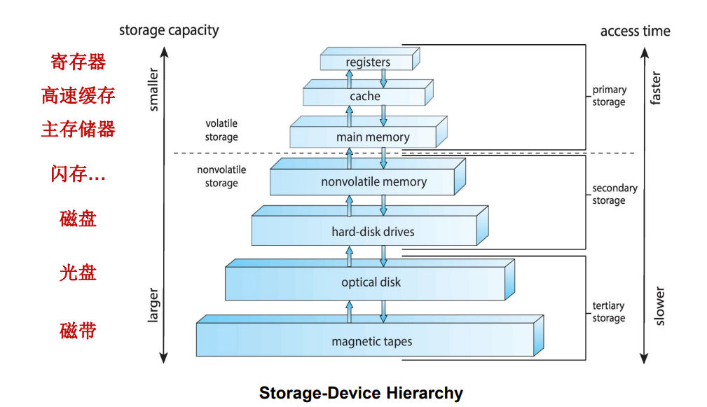

> 评分
>
> - 期末 50%
> - 作业 5%
> - 课堂练习，点名 5%
> - 实验报告 20%
> - 实验验收 20%
> - lab6 4% 额外平时分

## Introduction

### What Operating System Do

操作系统是作为计算机用户和计算机硬件的中介的程序。

计算机系统 Computer System 可以分成四个部分：
- Hardware，如 CPU, memory, I/O 设备
- Operating System，控制并协调硬件的使用
- Application programs，定义系统资源被使用的方式
- Users

从计算机系统组成的观点来看，操作系统是系统软件。

从用户的角度来看，操作系统是用户与计算机硬件之间的接口。操作系统提供：
- 命令级接口，如键盘或鼠标等命令。
- 程序级接口，即操作系统服务，供用户程序和其它程序调用。

从系统角度来看，操作系统是计算机系统资源的管理者。操作系统管理了全部的资源，处理冲突的请求，并执行程序，避免错误和对计算机的不当使用。

总的来说，操作系统是一组有效控制和管理计算机各种硬件和软件资源，合理地组织计算机的工作流程，以及方便用户的程序的集合。

### Computer System Organization

#### Linux 文件系统

- `home` 包含了除系统管理员外的所有用户的主目录
- `lib` 包含了系统使用的动态链接库(.so)和内核模块(modules)
- `mnt` 挂载的文件系统

#### Linux 内核映像

Linux 系统引导过程使用内核映像，放在 `/boot` 目录下。如：`vmlinux`。小的内核叫 `zImage`，大的叫 `bzImage`。

#### 内核构建

Linux 内核的编译采用 Kbuild 系统，而 Kbuild 基于 GNU make。

Kbuild 的 Makefile 并不直接被当做 Makefile 执行，而是从 `.config` 文件中提取信息，生成 Kbuild 完成内核编译所需的文件列表。

### Computer System Operation

#### 计算机启动

计算机系统启动过程中，程序执行顺序为：
- ROM 中的引导程序
- 硬盘引导程序
- 分区引导程序
- 操作系统的初始化程序

#### 中断

中断 Interrupt 指系统发生某个异步/同步事件后，处理机暂停正在执行的程序，转去执行处理该事件程序的过程。

陷入 trap 是软件生成的中断，它并不由错误或用户请求产生。

操作系统是通过中断来驱动的。

对中断进一步细分，有：
- 外部中断 Interrupt：外部设备发出的 I/O 请求，分为可屏蔽和不可屏蔽两类，由一些硬件设备产生，可在指令执行的任意时刻产生。
- 异常 Exception、陷入 Trap：由 CPU（正在执行的进程）产生，一条指令终止执行后 CPU 才发出中断。常见的异常有除零、溢出及页面异常(fault 出错)等。另一种情况是使用 `int` 指令(trap 陷入)，Linux 使用该指令来实现系统调用。

### Storage Structure

还有个叫持久内存 Persistent Memory 的玩意儿，可以作为第二主存，且非易失，速度、容量、成本均在 DRAM 和 SSD 之间。

### IO Structure

Stop Update

