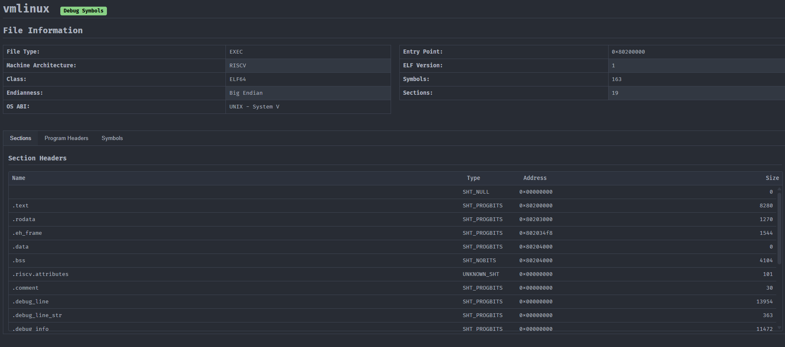
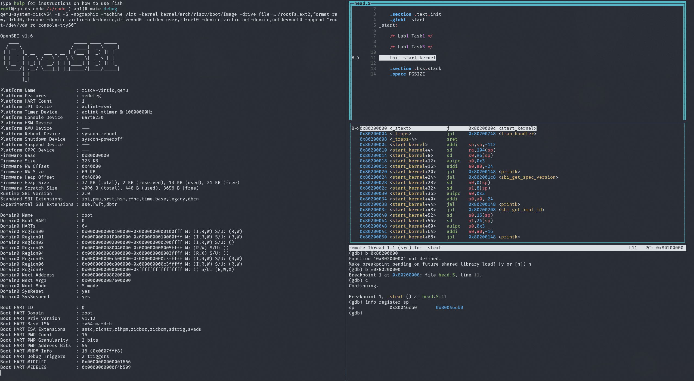
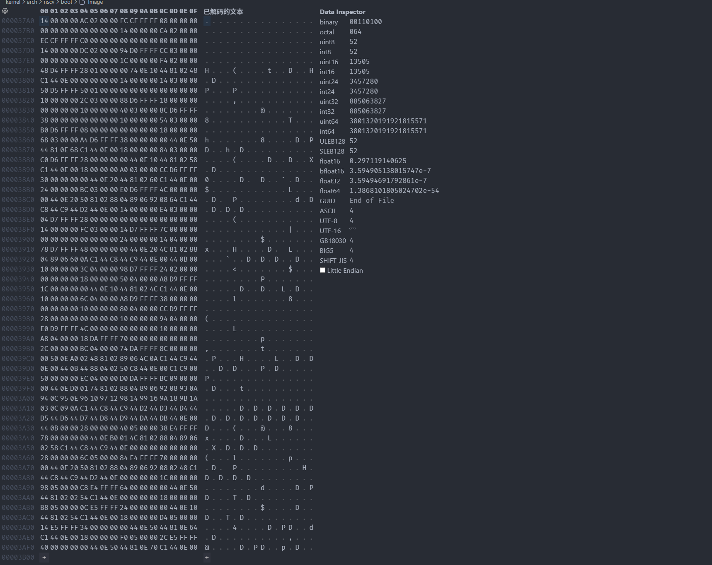
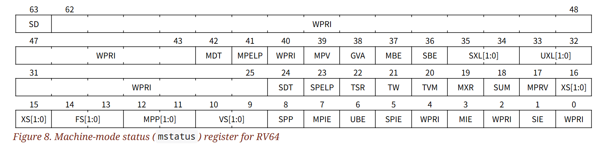
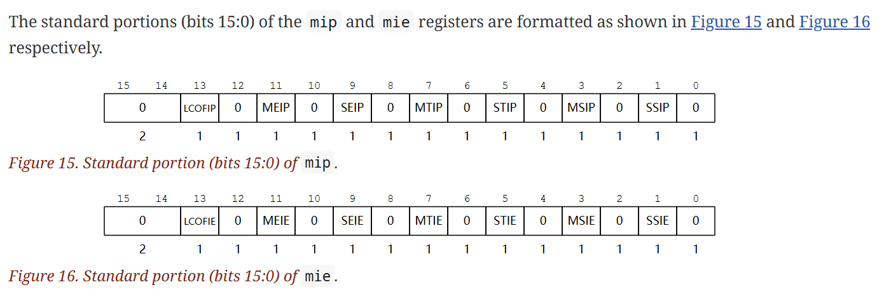
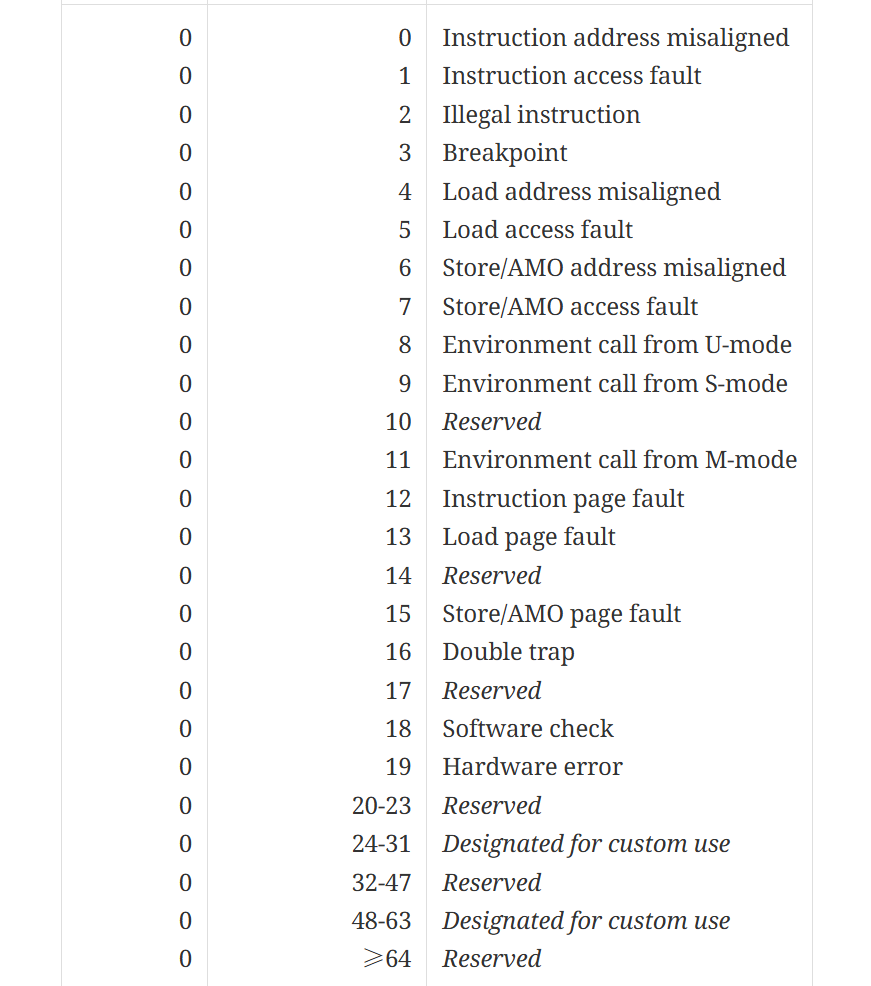
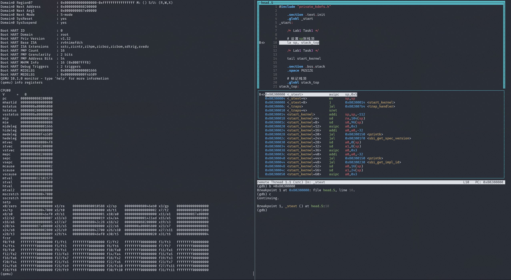
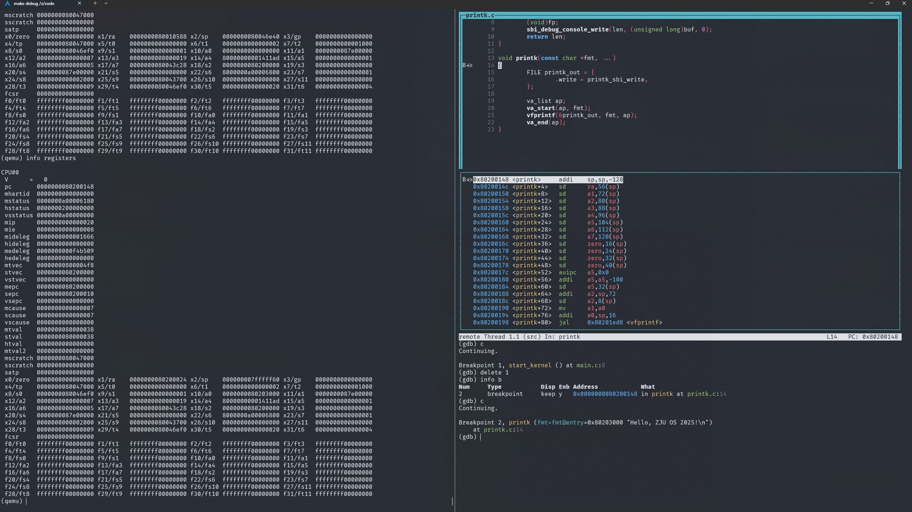
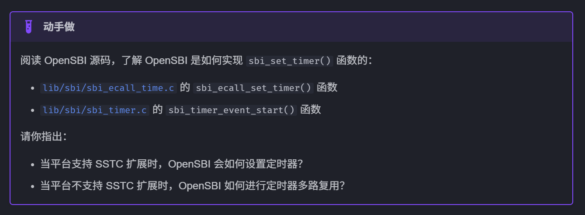

## 启动工作

### RISC-V 汇编与调用约定

#### 1. 每个函数的开头都操作了 `sp`，这是在干什么？

`sp` 是栈指针（stack pointer），用于指向当前栈顶。每个函数开始时，都会调整 `sp`，为该函数的局部变量和保存现场（如返回地址、保存的寄存器）分配空间。这样做可以保证每个函数有独立的栈帧，防止数据混乱。

#### 2. 为什么 `sp` 的差值总是 16 的倍数？

RISC-V ABI（应用二进制接口）规定，`sp` 必须保持 16 字节对齐。这是为了提高内存访问效率，并满足某些指令或硬件对齐要求。每次分配栈空间时，都会以 16 的倍数调整，确保对齐。

#### 3. 调用函数前后做了什么？

- **调用前**：保存当前函数需要保护的寄存器（如返回地址 `ra`、部分临时寄存器等），并分配栈空间。
- **调用后**：恢复被保存的寄存器，释放栈空间，返回到调用者。
- 这样做的目的是保证函数调用的现场不会被破坏，数据能正确传递和返回。

#### 下列伪指令对应什么真实指令

```riscv
la nop li mv j ret call tail
```

- 伪指令是编译器/汇编器提供的简化写法，实际会被翻译成一条或多条真实指令。
- 真实指令是 RISC-V 指令集架构中定义的标准指令，直接被 CPU 执行。

| 伪指令 | 全称/含义           | 对应真实指令         | 真实指令全称/含义                   | 调用实例（示例代码）                       |
|--------|---------------------|----------------------|--------------------------------------|-------------------------------------------|
| la     | load address        | auipc + addi         | auipc: 加载当前 PC，addi: 加偏移     | `la a0, var` 加载变量 var 的地址到 a0     |
| nop    | no operation        | addi x0, x0, 0       | addi: 0 加到 0，结果存到 x0，无效果  | `nop` 占位，无实际操作                    |
| li     | load immediate      | addi/lui/addiw       | 加载立即数到寄存器                   | `li t0, 100` 把 100 赋值给 t0             |
| mv     | move                | addi rd, rs, 0       | 把 rs 的值加 0 赋给 rd，相当于赋值    | `mv t1, t0` 把 t0 的值赋给 t1             |
| j      | jump                | jal x0, label        | 无条件跳转到 label                   | `j loop` 跳转到 loop 标签                 |
| ret    | return              | jalr x0, 0(ra)       | 跳转到 ra 寄存器指向的地址           | `ret` 从函数返回                          |
| call   | function call       | auipc + jalr         | 跳转到函数地址并保存返回地址         | `call foo` 调用 foo 函数                  |
| tail   | tail call           | auipc + jalr         | 跳转到函数地址，不保存返回地址       | `tail bar` 尾调用 bar 函数                |

`call` 伪指令起到了普适的调用函数作用，它跳转到函数地址，且保存了返回地址。而 `tail` 专门用于优化尾递归的函数，因为此时，尾部的调用已经把控制权交给下一个函数，当前函数的返回地址已经不需要保存了，这可以节省栈空间。

### 链接器脚本与内核内存布局

#### 编译器的基本流程

```sh
# 预处理 Preprocessing: 展开 #include 头文件，处理 #define 宏替换，删除注释，处理条件编译 #ifdef/#if/#endif
riscv64-linux-gnu-cpp main.c -o main.i
# 编译 Compilation: 将 C 语言翻译成 riscv 汇编代码
riscv64-linux-gnu-gcc -S main.i -o main.S
# 汇编 Assembling: 将汇编指令翻译成机器码，生成符号表、重定位信息。(ELF 格式，二进制)
riscv64-linux-gnu-as main.S -o main.o
riscv64-linux-gnu-cpp func.c -o func.i
riscv64-linux-gnu-gcc -S func.i -o func.S
riscv64-linux-gnu-as func.S -o func.o
# 链接 Linking: 将多个目标文件合并，解析和连接符号，进行重定位
riscv64-linux-gnu-ld main.o func.o -o main
```

#### Linux 内核链接脚本

```lds
OUTPUT_ARCH("riscv")

ENTRY(_start)

PHY_START    = 0x80000000;
PHY_SIZE     = (128 * 1024 * 1024);
PHY_END      = (PHY_START + PHY_SIZE);
PGSIZE       = 0x1000;
OPENSBI_SIZE = (0x200000);

MEMORY {
    ram  (wxa!ri): ORIGIN = PHY_START + OPENSBI_SIZE, LENGTH = PHY_SIZE - OPENSBI_SIZE
}

BASE_ADDR = PHY_START + OPENSBI_SIZE;

SECTIONS
{
    . = BASE_ADDR;

    _skernel = .;

    .text : ALIGN(0x1000) {
        _stext = .;

        *(.text.init)
        *(.text.entry)
        *(.text .text.*)

        _etext = .;
    } AT>ram

    .rodata : ALIGN(0x1000) {
        _srodata = .;

        *(.rodata .rodata.*)

        _erodata = .;
    } AT>ram

    .data : ALIGN(0x1000) {
        _sdata = .;

        *(.data .data.*)
        *(.got .got.*)

        _edata = .;

        . = ALIGN(0x1000);
    } AT>ram

    .bss : ALIGN(0x1000) {
        *(.bss.stack)
        . = ALIGN(0x1000);
        _sbss = .;

        *(.sbss .sbss.*)
        *(.bss .bss.*)

        _ebss = .;
    } AT>ram

    . = ALIGN(0x1000);
    _ekernel = .;
}
```

##### 1. 这个链接脚本描述的就是整个内核的内存布局。它从哪里开始，有多大？

- **内核起始地址**：`BASE_ADDR = PHY_START + OPENSBI_SIZE`，即物理地址 `0x80000000 + 0x200000 = 0x80200000`。
- **内核大小**：`PHY_SIZE = 128MB`，去掉 OPENSBI 占用的 `2MB`，实际可用内存为 `126MB`。
- **内存区域**：`MEMORY { ram ... }` 定义了内核可用的物理内存范围。

##### 2. 各个段（.text、.rodata、.data、.bss）分别存放什么数据？

- `.text`(Text Segment)：存放代码（指令），包括内核的所有函数和入口代码。
- `.rodata`(Read-Only Data Segment)：存放只读数据，比如常量字符串、只读数组等。
- `.data`(Data Segment)：存放已初始化的全局变量和静态变量。
- `.bss`(Block Started by Symbol Segment)：存放未初始化的全局变量和静态变量（启动时会被清零）。

> **为什么未初始化的全局变量放在 .bss？**
>
> - 在 C 语言和许多系统编程语言中，未初始化的全局变量和静态变量在程序启动时会被自动清零。
> - 链接器在生成可执行文件时，不会为 .bss 段分配实际的存储空间（文件体积不会变大），只是在可执行文件的头部描述 .bss 的大小，运行时由操作系统分配并清零。
> - 这样可以节省磁盘空间，并且初始化效率高。

##### 3. _skernel 这些符号是什么？你要如何在汇编和 C 代码中使用它们？

- `_skernel`、`_stext`、`_etext` 等是链接脚本定义的符号，表示各段的起始或结束地址。
- **在汇编中使用**：可以直接用这些符号作为地址，比如 `la t0, _skernel`。
- **在 C 代码中使用**：需要用 `extern` 声明为变量（通常是 `char*` 或 `uint8_t*`），如：

```c
extern char _skernel[];
extern char _etext[];
```

然后可以用它们获取内核各段的地址，实现内存管理、初始化等功能。

#### Image 怎么生成

`$(CROSS_COMPILE)objcopy -O binary <input> <output>` 从 ELF 格式的可执行文件中中直接把程序要运行的那部分指令和数据，原封不动拷贝出来，得到一个内存布局和运行时完全一致的二进制文件，称为内存镜像（memory dump）。

运行 `make` 构建内核。

```sh
root@zju-os-code /z/code (lab1)# make
make -C kernel clean
make[1]: Entering directory '/zju-os/code/kernel'
make -C lib clean
make[2]: Entering directory '/zju-os/code/kernel/lib'
rm -f *.o *.d
make[2]: Leaving directory '/zju-os/code/kernel/lib'
make -C arch/riscv clean
make[2]: Entering directory '/zju-os/code/kernel/arch/riscv'
make -C kernel clean
make[3]: Entering directory '/zju-os/code/kernel/arch/riscv/kernel'
rm -f *.o *.d
make[3]: Leaving directory '/zju-os/code/kernel/arch/riscv/kernel'
make[2]: Leaving directory '/zju-os/code/kernel/arch/riscv'
rm -rf vmlinux vmlinux.asm snprintf_test System.map arch/riscv/boot
# Clean finished!
make[1]: Leaving directory '/zju-os/code/kernel'
make \
        -C kernel \
        ARCH=riscv \
        CROSS_COMPILE=riscv64-linux-gnu- \
        defconfig
make[1]: Entering directory '/zju-os/code/kernel'
make[1]: Nothing to be done for 'defconfig'.
make[1]: Leaving directory '/zju-os/code/kernel'
bear -- make \
        -C kernel \
        ARCH=riscv \
        CROSS_COMPILE=riscv64-linux-gnu- \
        -j32
make[1]: Entering directory '/zju-os/code/kernel'
make -C lib all
make[2]: Entering directory '/zju-os/code/kernel/lib'
riscv64-linux-gnu-gcc -I/zju-os/code/kernel/include -march=rv64imafd_zicsr_zifencei -mabi=lp64 -mcmodel=medany -ffreestanding -fno-builtin -ffunction-sections -fdata-sections -nostartfiles -nostdlib -nostdinc -static -ggdb -Og -Wall -Wextra -fno-pie -MMD -std=gnu11 -lgcc -Wl,--nmagic -Wl,--gc-sections -c clock.c
riscv64-linux-gnu-gcc -I/zju-os/code/kernel/include -march=rv64imafd_zicsr_zifencei -mabi=lp64 -mcmodel=medany -ffreestanding -fno-builtin -ffunction-sections -fdata-sections -nostartfiles -nostdlib -nostdinc -static -ggdb -Og -Wall -Wextra -fno-pie -MMD -std=gnu11 -lgcc -Wl,--nmagic -Wl,--gc-sections -c memchr.c
riscv64-linux-gnu-gcc -I/zju-os/code/kernel/include -march=rv64imafd_zicsr_zifencei -mabi=lp64 -mcmodel=medany -ffreestanding -fno-builtin -ffunction-sections -fdata-sections -nostartfiles -nostdlib -nostdinc -static -ggdb -Og -Wall -Wextra -fno-pie -MMD -std=gnu11 -lgcc -Wl,--nmagic -Wl,--gc-sections -c memcpy.c
riscv64-linux-gnu-gcc -I/zju-os/code/kernel/include -march=rv64imafd_zicsr_zifencei -mabi=lp64 -mcmodel=medany -ffreestanding -fno-builtin -ffunction-sections -fdata-sections -nostartfiles -nostdlib -nostdinc -static -ggdb -Og -Wall -Wextra -fno-pie -MMD -std=gnu11 -lgcc -Wl,--nmagic -Wl,--gc-sections -c memmove.c
riscv64-linux-gnu-gcc -I/zju-os/code/kernel/include -march=rv64imafd_zicsr_zifencei -mabi=lp64 -mcmodel=medany -ffreestanding -fno-builtin -ffunction-sections -fdata-sections -nostartfiles -nostdlib -nostdinc -static -ggdb -Og -Wall -Wextra -fno-pie -MMD -std=gnu11 -lgcc -Wl,--nmagic -Wl,--gc-sections -c memset.c
riscv64-linux-gnu-gcc -I/zju-os/code/kernel/include -march=rv64imafd_zicsr_zifencei -mabi=lp64 -mcmodel=medany -ffreestanding -fno-builtin -ffunction-sections -fdata-sections -nostartfiles -nostdlib -nostdinc -static -ggdb -Og -Wall -Wextra -fno-pie -MMD -std=gnu11 -lgcc -Wl,--nmagic -Wl,--gc-sections -c rand.c
riscv64-linux-gnu-gcc -I/zju-os/code/kernel/include -march=rv64imafd_zicsr_zifencei -mabi=lp64 -mcmodel=medany -ffreestanding -fno-builtin -ffunction-sections -fdata-sections -nostartfiles -nostdlib -nostdinc -static -ggdb -Og -Wall -Wextra -fno-pie -MMD -std=gnu11 -lgcc -Wl,--nmagic -Wl,--gc-sections -c stdio_impl.c
riscv64-linux-gnu-gcc -I/zju-os/code/kernel/include -march=rv64imafd_zicsr_zifencei -mabi=lp64 -mcmodel=medany -ffreestanding -fno-builtin -ffunction-sections -fdata-sections -nostartfiles -nostdlib -nostdinc -static -ggdb -Og -Wall -Wextra -fno-pie -MMD -std=gnu11 -lgcc -Wl,--nmagic -Wl,--gc-sections -c strcmp.c
riscv64-linux-gnu-gcc -I/zju-os/code/kernel/include -march=rv64imafd_zicsr_zifencei -mabi=lp64 -mcmodel=medany -ffreestanding -fno-builtin -ffunction-sections -fdata-sections -nostartfiles -nostdlib -nostdinc -static -ggdb -Og -Wall -Wextra -fno-pie -MMD -std=gnu11 -lgcc -Wl,--nmagic -Wl,--gc-sections -c strlen.c
riscv64-linux-gnu-gcc -I/zju-os/code/kernel/include -march=rv64imafd_zicsr_zifencei -mabi=lp64 -mcmodel=medany -ffreestanding -fno-builtin -ffunction-sections -fdata-sections -nostartfiles -nostdlib -nostdinc -static -ggdb -Og -Wall -Wextra -fno-pie -MMD -std=gnu11 -lgcc -Wl,--nmagic -Wl,--gc-sections -c strnlen.c
riscv64-linux-gnu-gcc -I/zju-os/code/kernel/include -march=rv64imafd_zicsr_zifencei -mabi=lp64 -mcmodel=medany -ffreestanding -fno-builtin -ffunction-sections -fdata-sections -nostartfiles -nostdlib -nostdinc -static -ggdb -Og -Wall -Wextra -fno-pie -MMD -std=gnu11 -lgcc -Wl,--nmagic -Wl,--gc-sections -c vfprintf.c
riscv64-linux-gnu-gcc -I/zju-os/code/kernel/include -march=rv64imafd_zicsr_zifencei -mabi=lp64 -mcmodel=medany -ffreestanding -fno-builtin -ffunction-sections -fdata-sections -nostartfiles -nostdlib -nostdinc -static -ggdb -Og -Wall -Wextra -fno-pie -MMD -std=gnu11 -lgcc -Wl,--nmagic -Wl,--gc-sections -c vsnprintf.c
make[2]: Leaving directory '/zju-os/code/kernel/lib'
make -C arch/riscv all
make[2]: Entering directory '/zju-os/code/kernel/arch/riscv'
make -C kernel all
make[3]: Entering directory '/zju-os/code/kernel/arch/riscv/kernel'
riscv64-linux-gnu-gcc -I/zju-os/code/kernel/include -I/zju-os/code/kernel/arch/riscv/include -march=rv64imafd_zicsr_zifencei -mabi=lp64 -mcmodel=medany -ffreestanding -fno-builtin -ffunction-sections -fdata-sections -nostartfiles -nostdlib -nostdinc -static -ggdb -Og -Wall -Wextra -fno-pie -MMD -std=gnu11 -lgcc -Wl,--nmagic -Wl,--gc-sections -c main.c
riscv64-linux-gnu-gcc -I/zju-os/code/kernel/include -I/zju-os/code/kernel/arch/riscv/include -march=rv64imafd_zicsr_zifencei -mabi=lp64 -mcmodel=medany -ffreestanding -fno-builtin -ffunction-sections -fdata-sections -nostartfiles -nostdlib -nostdinc -static -ggdb -Og -Wall -Wextra -fno-pie -MMD -std=gnu11 -lgcc -Wl,--nmagic -Wl,--gc-sections -c printk.c
riscv64-linux-gnu-gcc -I/zju-os/code/kernel/include -I/zju-os/code/kernel/arch/riscv/include -march=rv64imafd_zicsr_zifencei -mabi=lp64 -mcmodel=medany -ffreestanding -fno-builtin -ffunction-sections -fdata-sections -nostartfiles -nostdlib -nostdinc -static -ggdb -Og -Wall -Wextra -fno-pie -MMD -std=gnu11 -lgcc -Wl,--nmagic -Wl,--gc-sections -c sbi.c
riscv64-linux-gnu-gcc -I/zju-os/code/kernel/include -I/zju-os/code/kernel/arch/riscv/include -march=rv64imafd_zicsr_zifencei -mabi=lp64 -mcmodel=medany -ffreestanding -fno-builtin -ffunction-sections -fdata-sections -nostartfiles -nostdlib -nostdinc -static -ggdb -Og -Wall -Wextra -fno-pie -MMD -std=gnu11 -lgcc -Wl,--nmagic -Wl,--gc-sections -c trap.c
riscv64-linux-gnu-gcc -I/zju-os/code/kernel/include -I/zju-os/code/kernel/arch/riscv/include -march=rv64imafd_zicsr_zifencei -mabi=lp64 -mcmodel=medany -ffreestanding -fno-builtin -ffunction-sections -fdata-sections -nostartfiles -nostdlib -nostdinc -static -ggdb -Og -Wall -Wextra -fno-pie -MMD -std=gnu11 -lgcc -Wl,--nmagic -Wl,--gc-sections -c entry.S
riscv64-linux-gnu-gcc -I/zju-os/code/kernel/include -I/zju-os/code/kernel/arch/riscv/include -march=rv64imafd_zicsr_zifencei -mabi=lp64 -mcmodel=medany -ffreestanding -fno-builtin -ffunction-sections -fdata-sections -nostartfiles -nostdlib -nostdinc -static -ggdb -Og -Wall -Wextra -fno-pie -MMD -std=gnu11 -lgcc -Wl,--nmagic -Wl,--gc-sections -c head.S
sbi.c: In function ‘sbi_ecall’:
sbi.c:32:34: warning: unused parameter ‘eid’ [-Wunused-parameter]
   32 | struct sbiret sbi_ecall(uint64_t eid, uint64_t fid, uint64_t arg0,
      |                         ~~~~~~~~~^~~
sbi.c:32:48: warning: unused parameter ‘fid’ [-Wunused-parameter]
   32 | struct sbiret sbi_ecall(uint64_t eid, uint64_t fid, uint64_t arg0,
      |                                       ~~~~~~~~~^~~
sbi.c:32:62: warning: unused parameter ‘arg0’ [-Wunused-parameter]
   32 | struct sbiret sbi_ecall(uint64_t eid, uint64_t fid, uint64_t arg0,
      |                                                     ~~~~~~~~~^~~~
sbi.c:33:34: warning: unused parameter ‘arg1’ [-Wunused-parameter]
   33 |                         uint64_t arg1, uint64_t arg2, uint64_t arg3,
      |                         ~~~~~~~~~^~~~
sbi.c:33:49: warning: unused parameter ‘arg2’ [-Wunused-parameter]
   33 |                         uint64_t arg1, uint64_t arg2, uint64_t arg3,
      |                                        ~~~~~~~~~^~~~
sbi.c:33:64: warning: unused parameter ‘arg3’ [-Wunused-parameter]
   33 |                         uint64_t arg1, uint64_t arg2, uint64_t arg3,
      |                                                       ~~~~~~~~~^~~~
sbi.c:34:34: warning: unused parameter ‘arg4’ [-Wunused-parameter]
   34 |                         uint64_t arg4, uint64_t arg5)
      |                         ~~~~~~~~~^~~~
sbi.c:34:49: warning: unused parameter ‘arg5’ [-Wunused-parameter]
   34 |                         uint64_t arg4, uint64_t arg5)
      |                                        ~~~~~~~~~^~~~
sbi.c: In function ‘sbi_debug_console_write’:
sbi.c:87:53: warning: unused parameter ‘num_bytes’ [-Wunused-parameter]
   87 | struct sbiret sbi_debug_console_write(unsigned long num_bytes,
      |                                       ~~~~~~~~~~~~~~^~~~~~~~~
sbi.c:88:53: warning: unused parameter ‘base_addr_lo’ [-Wunused-parameter]
   88 |                                       unsigned long base_addr_lo,
      |                                       ~~~~~~~~~~~~~~^~~~~~~~~~~~
sbi.c:89:53: warning: unused parameter ‘base_addr_hi’ [-Wunused-parameter]
   89 |                                       unsigned long base_addr_hi)
      |                                       ~~~~~~~~~~~~~~^~~~~~~~~~~~
sbi.c: In function ‘sbi_debug_console_read’:
sbi.c:94:52: warning: unused parameter ‘num_bytes’ [-Wunused-parameter]
   94 | struct sbiret sbi_debug_console_read(unsigned long num_bytes,
      |                                      ~~~~~~~~~~~~~~^~~~~~~~~
sbi.c:95:52: warning: unused parameter ‘base_addr_lo’ [-Wunused-parameter]
   95 |                                      unsigned long base_addr_lo,
      |                                      ~~~~~~~~~~~~~~^~~~~~~~~~~~
sbi.c:96:52: warning: unused parameter ‘base_addr_hi’ [-Wunused-parameter]
   96 |                                      unsigned long base_addr_hi)
      |                                      ~~~~~~~~~~~~~~^~~~~~~~~~~~
sbi.c: In function ‘sbi_debug_console_write_byte’:
sbi.c:101:52: warning: unused parameter ‘byte’ [-Wunused-parameter]
  101 | struct sbiret sbi_debug_console_write_byte(uint8_t byte)
      |                                            ~~~~~~~~^~~~
make[3]: Leaving directory '/zju-os/code/kernel/arch/riscv/kernel'
make[2]: Leaving directory '/zju-os/code/kernel/arch/riscv'
riscv64-linux-gnu-ld -T arch/riscv/kernel/vmlinux.lds \
        arch/riscv/kernel/*.o \
        lib/*.o \
        -o vmlinux
mkdir -p arch/riscv/boot
riscv64-linux-gnu-objcopy -O binary vmlinux arch/riscv/boot/Image
riscv64-linux-gnu-objdump -S vmlinux > vmlinux.asm
riscv64-linux-gnu-nm vmlinux > System.map
# Build finished!
make[1]: Leaving directory '/zju-os/code/kernel'
```

> 用 vscode 打开 `kernel/vmlinux`，查看它的内容
>
> 
>
> 或者使用 `readelf` 查看：
>
> ```txt
> root@zju-os-code /z/code (lab1) [1]# readelf -a ./kernel/vmlinux
> ELF Header:
>   Magic:   7f 45 4c 46 02 01 01 00 00 00 00 00 00 00 00 00
>   Class:                             ELF64
>   Data:                              2's complement, little endian
>   Version:                           1 (current)
>   OS/ABI:                            UNIX - System V
>   ABI Version:                       0
>   Type:                              EXEC (Executable file)
>   Machine:                           RISC-V
>   Version:                           0x1
>   Entry point address:               0x80200000
>   Start of program headers:          64 (bytes into file)
>   Start of section headers:          67368 (bytes into file)
>   Flags:                             0x0
>   Size of this header:               64 (bytes)
>   Size of program headers:           56 (bytes)
>   Number of program headers:         4
>   Size of section headers:           64 (bytes)
>   Number of section headers:         19
>   Section header string table index: 18
>
> Section Headers:
>   [Nr] Name              Type             Address           Offset
>        Size              EntSize          Flags  Link  Info  Align
>   [ 0]                   NULL             0000000000000000  00000000
>        0000000000000000  0000000000000000           0     0     0
>   [ 1] .text             PROGBITS         0000000080200000  00001000
>        0000000000002058  0000000000000000  AX       0     0     4096
>   [ 2] .rodata           PROGBITS         0000000080203000  00004000
>        00000000000004f6  0000000000000000   A       0     0     4096
>   [ 3] .eh_frame         PROGBITS         00000000802034f8  000044f8
>        0000000000000608  0000000000000000   A       0     0     8
>   [ 4] .data             PROGBITS         0000000080204000  00005000
>        0000000000000000  0000000000000000  WA       0     0     4096
>   [ 5] .bss              NOBITS           0000000080204000  00005000
>        0000000000001008  0000000000000000  WA       0     0     4096
>   [ 6] .riscv.attributes RISCV_ATTRIBUTE  0000000000000000  00005000
>        0000000000000065  0000000000000000           0     0     1
>   [ 7] .comment          PROGBITS         0000000000000000  00005065
>        000000000000001e  0000000000000001  MS       0     0     1
>   [ 8] .debug_line       PROGBITS         0000000000000000  00005083
>        0000000000003682  0000000000000000           0     0     1
>   [ 9] .debug_line_str   PROGBITS         0000000000000000  00008705
>        000000000000016b  0000000000000001  MS       0     0     1
>   [10] .debug_info       PROGBITS         0000000000000000  00008870
>        0000000000002cd0  0000000000000000           0     0     1
>   [11] .debug_abbrev     PROGBITS         0000000000000000  0000b540
>        0000000000001028  0000000000000000           0     0     1
>   [12] .debug_aranges    PROGBITS         0000000000000000  0000c570
>        00000000000005b0  0000000000000000           0     0     16
>   [13] .debug_str        PROGBITS         0000000000000000  0000cb20
>        00000000000005d5  0000000000000001  MS       0     0     1
>   [14] .debug_loclists   PROGBITS         0000000000000000  0000d0f5
>        0000000000001f54  0000000000000000           0     0     1
>   [15] .debug_rnglists   PROGBITS         0000000000000000  0000f049
>        00000000000002ec  0000000000000000           0     0     1
>   [16] .symtab           SYMTAB           0000000000000000  0000f338
>        0000000000000f48  0000000000000018          17   102     8
>   [17] .strtab           STRTAB           0000000000000000  00010280
>        00000000000003dd  0000000000000000           0     0     1
>   [18] .shstrtab         STRTAB           0000000000000000  0001065d
>        00000000000000c9  0000000000000000           0     0     1
> Key to Flags:
>   W (write), A (alloc), X (execute), M (merge), S (strings), I (info),
>   L (link order), O (extra OS processing required), G (group), T (TLS),
>   C (compressed), x (unknown), o (OS specific), E (exclude),
>   D (mbind), p (processor specific)
>
> There are no section groups in this file.
>
> Program Headers:
>   Type           Offset             VirtAddr           PhysAddr
>                  FileSiz            MemSiz              Flags  Align
>   RISCV_ATTRIBUT 0x0000000000005000 0x0000000000000000 0x0000000000000000
>                  0x0000000000000065 0x0000000000000000  R      0x1
>   LOAD           0x0000000000001000 0x0000000080200000 0x0000000080200000
>                  0x0000000000003b00 0x0000000000003b00  R E    0x1000
>   LOAD           0x0000000000005000 0x0000000080204000 0x0000000080204000
>                  0x0000000000000000 0x0000000000001008  RW     0x1000
>   GNU_STACK      0x0000000000000000 0x0000000000000000 0x0000000000000000
>                  0x0000000000000000 0x0000000000000000  RW     0x10
>
>  Section to Segment mapping:
>   Segment Sections...
>    00     .riscv.attributes
>    01     .text .rodata .eh_frame
>    02     .data .bss
>    03
>
> There is no dynamic section in this file.
>
> There are no relocations in this file.
>
> The decoding of unwind sections for machine type RISC-V is not currently supported.
>
> Symbol table '.symtab' contains 163 entries:
>    Num:    Value          Size Type    Bind   Vis      Ndx Name
>      0: 0000000000000000     0 NOTYPE  LOCAL  DEFAULT  UND
>      1: 0000000080200000     0 SECTION LOCAL  DEFAULT    1 .text
>      2: 0000000080203000     0 SECTION LOCAL  DEFAULT    2 .rodata
>      3: 00000000802034f8     0 SECTION LOCAL  DEFAULT    3 .eh_frame
>      4: 0000000080204000     0 SECTION LOCAL  DEFAULT    4 .data
>      5: 0000000080204000     0 SECTION LOCAL  DEFAULT    5 .bss
>      6: 0000000000000000     0 SECTION LOCAL  DEFAULT    6 .riscv.attributes
>      7: 0000000000000000     0 SECTION LOCAL  DEFAULT    7 .comment
>      8: 0000000000000000     0 SECTION LOCAL  DEFAULT    8 .debug_line
>      9: 0000000000000000     0 SECTION LOCAL  DEFAULT    9 .debug_line_str
>     10: 0000000000000000     0 SECTION LOCAL  DEFAULT   10 .debug_info
>     11: 0000000000000000     0 SECTION LOCAL  DEFAULT   11 .debug_abbrev
>     12: 0000000000000000     0 SECTION LOCAL  DEFAULT   12 .debug_aranges
>     13: 0000000000000000     0 SECTION LOCAL  DEFAULT   13 .debug_str
>     14: 0000000000000000     0 SECTION LOCAL  DEFAULT   14 .debug_loclists
>     15: 0000000000000000     0 SECTION LOCAL  DEFAULT   15 .debug_rnglists
>     16: 0000000000000000     0 FILE    LOCAL  DEFAULT  ABS head.o
>     17: 0000000080200000     0 NOTYPE  LOCAL  DEFAULT    1 $xrv64i2p1_m2p0_[...]
>     18: 0000000000000000     0 FILE    LOCAL  DEFAULT  ABS entry.o
>     19: 0000000080200004     0 NOTYPE  LOCAL  DEFAULT    1 $ xrv64i2p1_m2p0_[...]
>     20: 0000000000000000     0 FILE    LOCAL  DEFAULT  ABS main.c
>     21: 000000008020000c     0 NOTYPE  LOCAL  DEFAULT    1 $xrv64i2p1_m2p0_[...]
>     22: 0000000000000000     0 FILE    LOCAL  DEFAULT  ABS printk.c
>     23: 0000000080200118     0 NOTYPE  LOCAL  DEFAULT    1 $ xrv64i2p1_m2p0_[...]
>     24: 0000000080200118    48 FUNC    LOCAL  DEFAULT    1 printk_sbi_write
>     25: 0000000080200148     0 NOTYPE  LOCAL  DEFAULT    1 $xrv64i2p1_m2p0_[...]
>     26: 0000000000000000     0 FILE    LOCAL  DEFAULT  ABS sbi.c
>     27: 00000000802001a8     0 NOTYPE  LOCAL  DEFAULT    1 $ xrv64i2p1_m2p0_[...]
>     28: 00000000802001c8     0 NOTYPE  LOCAL  DEFAULT    1 $xrv64i2p1_m2p0_[...]
>     29: 0000000080200208     0 NOTYPE  LOCAL  DEFAULT    1 $ xrv64i2p1_m2p0_[...]
>     30: 0000000080200248     0 NOTYPE  LOCAL  DEFAULT    1 $xrv64i2p1_m2p0_[...]
>     31: 0000000080200288     0 NOTYPE  LOCAL  DEFAULT    1 $ xrv64i2p1_m2p0_[...]
>     32: 00000000802002c8     0 NOTYPE  LOCAL  DEFAULT    1 $xrv64i2p1_m2p0_[...]
>     33: 0000000080200308     0 NOTYPE  LOCAL  DEFAULT    1 $ xrv64i2p1_m2p0_[...]
>     34: 0000000080200348     0 NOTYPE  LOCAL  DEFAULT    1 $xrv64i2p1_m2p0_[...]
>     35: 0000000080200388     0 NOTYPE  LOCAL  DEFAULT    1 $ xrv64i2p1_m2p0_[...]
>     36: 00000000802003cc     0 NOTYPE  LOCAL  DEFAULT    1 $xrv64i2p1_m2p0_[...]
>     37: 000000008020040c     0 NOTYPE  LOCAL  DEFAULT    1 $ xrv64i2p1_m2p0_[...]
>     38: 000000008020044c     0 NOTYPE  LOCAL  DEFAULT    1 $xrv64i2p1_m2p0_[...]
>     39: 000000008020048c     0 NOTYPE  LOCAL  DEFAULT    1 $ xrv64i2p1_m2p0_[...]
>     40: 00000000802004d0     0 NOTYPE  LOCAL  DEFAULT    1 $xrv64i2p1_m2p0_[...]
>     41: 0000000080200514     0 NOTYPE  LOCAL  DEFAULT    1 $ xrv64i2p1_m2p0_[...]
>     42: 0000000080200558     0 NOTYPE  LOCAL  DEFAULT    1 $xrv64i2p1_m2p0_[...]
>     43: 0000000000000000     0 FILE    LOCAL  DEFAULT  ABS trap.c
>     44: 00000000802005a0     0 NOTYPE  LOCAL  DEFAULT    1 $ xrv64i2p1_m2p0_[...]
>     45: 00000000802005a0   416 FUNC    LOCAL  DEFAULT    1 scause_str
>     46: 0000000080200740     0 NOTYPE  LOCAL  DEFAULT    1 $xrv64i2p1_m2p0_[...]
>     47: 0000000080200744     0 NOTYPE  LOCAL  DEFAULT    1 $ xrv64i2p1_m2p0_[...]
>     48: 0000000080200748     0 NOTYPE  LOCAL  DEFAULT    1 $xrv64i2p1_m2p0_[...]
>     49: 0000000000000000     0 FILE    LOCAL  DEFAULT  ABS clock.c
>     50: 00000000802007a4     0 NOTYPE  LOCAL  DEFAULT    1 $ xrv64i2p1_m2p0_[...]
>     51: 0000000000000000     0 FILE    LOCAL  DEFAULT  ABS memchr.c
>     52: 00000000802007ac     0 NOTYPE  LOCAL  DEFAULT    1 $xrv64i2p1_m2p0_[...]
>     53: 0000000000000000     0 FILE    LOCAL  DEFAULT  ABS memcpy.c
>     54: 000000008020086c     0 NOTYPE  LOCAL  DEFAULT    1 $ xrv64i2p1_m2p0_[...]
>     55: 0000000000000000     0 FILE    LOCAL  DEFAULT  ABS memmove.c
>     56: 0000000080200c38     0 NOTYPE  LOCAL  DEFAULT    1 $xrv64i2p1_m2p0_[...]
>     57: 0000000000000000     0 FILE    LOCAL  DEFAULT  ABS memset.c
>     58: 0000000080200d60     0 NOTYPE  LOCAL  DEFAULT    1 $ xrv64i2p1_m2p0_[...]
>     59: 0000000000000000     0 FILE    LOCAL  DEFAULT  ABS rand.c
>     60: 0000000080200eb0     0 NOTYPE  LOCAL  DEFAULT    1 $xrv64i2p1_m2p0_[...]
>     61: 0000000080205000     8 OBJECT  LOCAL  DEFAULT    5 seed
>     62: 0000000080200ec8     0 NOTYPE  LOCAL  DEFAULT    1 $ xrv64i2p1_m2p0_[...]
>     63: 0000000000000000     0 FILE    LOCAL  DEFAULT  ABS stdio_impl.c
>     64: 0000000080200f00     0 NOTYPE  LOCAL  DEFAULT    1 $xrv64i2p1_m2p0_[...]
>     65: 0000000080200f08     0 NOTYPE  LOCAL  DEFAULT    1 $ xrv64i2p1_m2p0_[...]
>     66: 0000000080200f40     0 NOTYPE  LOCAL  DEFAULT    1 $xrv64i2p1_m2p0_[...]
>     67: 0000000080200f68     0 NOTYPE  LOCAL  DEFAULT    1 $ xrv64i2p1_m2p0_[...]
>     68: 0000000080200f98     0 NOTYPE  LOCAL  DEFAULT    1 $xrv64i2p1_m2p0_[...]
>     69: 0000000000000000     0 FILE    LOCAL  DEFAULT  ABS strcmp.c
>     70: 0000000080200fe4     0 NOTYPE  LOCAL  DEFAULT    1 $ xrv64i2p1_m2p0_[...]
>     71: 0000000000000000     0 FILE    LOCAL  DEFAULT  ABS strlen.c
>     72: 000000008020100c     0 NOTYPE  LOCAL  DEFAULT    1 $xrv64i2p1_m2p0_[...]
>     73: 0000000000000000     0 FILE    LOCAL  DEFAULT  ABS strnlen.c
>     74: 0000000080201088     0 NOTYPE  LOCAL  DEFAULT    1 $ xrv64i2p1_m2p0_[...]
>     75: 0000000000000000     0 FILE    LOCAL  DEFAULT  ABS vfprintf.c
>     76: 00000000802010d0     0 NOTYPE  LOCAL  DEFAULT    1 $xrv64i2p1_m2p0_[...]
>     77: 00000000802010d0   548 FUNC    LOCAL  DEFAULT    1 pop_arg
>     78: 00000000802012f4     0 NOTYPE  LOCAL  DEFAULT    1 $ xrv64i2p1_m2p0_[...]
>     79: 00000000802012f4    28 FUNC    LOCAL  DEFAULT    1 out
>     80: 0000000080201310     0 NOTYPE  LOCAL  DEFAULT    1 $xrv64i2p1_m2p0_[...]
>     81: 0000000080201310    56 FUNC    LOCAL  DEFAULT    1 fmt_x
>     82: 0000000080203350    16 OBJECT  LOCAL  DEFAULT    2 xdigits
>     83: 0000000080201348     0 NOTYPE  LOCAL  DEFAULT    1 $ xrv64i2p1_m2p0_[...]
>     84: 0000000080201348    40 FUNC    LOCAL  DEFAULT    1 fmt_o
>     85: 0000000080201370     0 NOTYPE  LOCAL  DEFAULT    1 $xrv64i2p1_m2p0_[...]
>     86: 0000000080201370    76 FUNC    LOCAL  DEFAULT    1 fmt_u
>     87: 00000000802013bc     0 NOTYPE  LOCAL  DEFAULT    1 $ xrv64i2p1_m2p0_[...]
>     88: 00000000802013bc   112 FUNC    LOCAL  DEFAULT    1 getint
>     89: 000000008020142c     0 NOTYPE  LOCAL  DEFAULT    1 $xrv64i2p1_m2p0_[...]
>     90: 000000008020142c   140 FUNC    LOCAL  DEFAULT    1 pad
>     91: 00000000802014b8     0 NOTYPE  LOCAL  DEFAULT    1 $ xrv64i2p1_m2p0_[...]
>     92: 00000000802014b8  2492 FUNC    LOCAL  DEFAULT    1 printf_core
>     93: 0000000080203360   406 OBJECT  LOCAL  DEFAULT    2 states
>     94: 0000000080201e74     0 NOTYPE  LOCAL  DEFAULT    1 $xrv64i2p1_m2p0_[...]
>     95: 0000000000000000     0 FILE    LOCAL  DEFAULT  ABS vsnprintf.c
>     96: 0000000080201eec     0 NOTYPE  LOCAL  DEFAULT    1 $ xrv64i2p1_m2p0_[...]
>     97: 0000000080201eec   112 FUNC    LOCAL  DEFAULT    1 snprintf_write
>     98: 0000000080201f5c     0 NOTYPE  LOCAL  DEFAULT    1 $xrv64i2p1_m2p0_[...]
>     99: 0000000080201fc0     0 NOTYPE  LOCAL  DEFAULT    1 $ xrv64i2p1_m2p0_[...]
>    100: 0000000080201fe4     0 NOTYPE  LOCAL  DEFAULT    1 $xrv64i2p1_m2p0_[...]
>    101: 0000000080202018     0 NOTYPE  LOCAL  DEFAULT    1 $ xrv64i2p1_m2p0_[...]
>    102: 0000000080201fc0    36 FUNC    GLOBAL DEFAULT    1 vsprintf
>    103: 000000008020048c     0 FUNC    GLOBAL DEFAULT    1 sbi_system_reset
>    104: 0000000080200c38   296 FUNC    GLOBAL DEFAULT    1 memmove
>    105: 0000000080200388    68 FUNC    GLOBAL DEFAULT    1 sbi_set_timer
>    106: 0000000080200248    64 FUNC    GLOBAL DEFAULT    1 sbi_get_impl_version
>    107: 0000000080201fe4    52 FUNC    GLOBAL DEFAULT    1 snprintf
>    108: 0000000080206000     0 NOTYPE  GLOBAL DEFAULT    5 _ekernel
>    109: 0000000080202058     0 NOTYPE  GLOBAL DEFAULT    1 _etext
>    110: 0000000080205000     0 NOTYPE  GLOBAL DEFAULT    5 _sbss
>    111: 00000000802003cc    64 FUNC    GLOBAL DEFAULT    1 sbi_debug_consol[...]
>    112: 000000008020086c   972 FUNC    GLOBAL DEFAULT    1 memcpy
>    113: 0000000080203000     0 NOTYPE  GLOBAL DEFAULT    2 _srodata
>    114: 0000000080201f5c   100 FUNC    GLOBAL DEFAULT    1 vsnprintf
>    115: 000000008020048c    68 FUNC    GLOBAL DEFAULT    1 sbi_hart_start
>    116: 0000000080204000     0 NOTYPE  GLOBAL DEFAULT    4 _sdata
>    117: 0000000000001000     0 NOTYPE  GLOBAL DEFAULT  ABS PGSIZE
>    118: 0000000080000000     0 NOTYPE  GLOBAL DEFAULT  ABS PHY_START
>    119: 0000000080200740     4 FUNC    GLOBAL DEFAULT    1 clock_set_next_event
>    120: 0000000080201088    72 FUNC    GLOBAL DEFAULT    1 strnlen
>    121: 0000000080200308    64 FUNC    GLOBAL DEFAULT    1 sbi_get_marchid
>    122: 0000000080205008     0 NOTYPE  GLOBAL DEFAULT    5 _ebss
>    123: 0000000080200748    92 FUNC    GLOBAL DEFAULT    1 trap_handler
>    124: 00000000802004d0    68 FUNC    GLOBAL DEFAULT    1 sbi_hart_stop
>    125: 0000000080200000     0 NOTYPE  GLOBAL DEFAULT  ABS BASE_ADDR
>    126: 0000000080200f08    56 FUNC    GLOBAL DEFAULT    1 fprintf
>    127: 00000000802007ac   192 FUNC    GLOBAL DEFAULT    1 memchr
>    128: 00000000802001c8    64 FUNC    GLOBAL DEFAULT    1 sbi_get_spec_version
>    129: 0000000080200208    64 FUNC    GLOBAL DEFAULT    1 sbi_get_impl_id
>    130: 0000000080200000     0 NOTYPE  GLOBAL DEFAULT    1 _start
>    131: 0000000088000000     0 NOTYPE  GLOBAL DEFAULT  ABS PHY_END
>    132: 0000000080200ec8    56 FUNC    GLOBAL DEFAULT    1 rand
>    133: 0000000000200000     0 NOTYPE  GLOBAL DEFAULT  ABS OPENSBI_SIZE
>    134: 000000008020044c    64 FUNC    GLOBAL DEFAULT    1 sbi_debug_consol[...]
>    135: 0000000080200148    96 FUNC    GLOBAL DEFAULT    1 printk
>    136: 00000000802001a8    32 FUNC    GLOBAL DEFAULT    1 sbi_ecall
>    137: 0000000080200d60   336 FUNC    GLOBAL DEFAULT    1 memset
>    138: 000000008020000c   268 FUNC    GLOBAL DEFAULT    1 start_kernel
>    139: 0000000080200eb0    24 FUNC    GLOBAL DEFAULT    1 srand
>    140: 0000000080200f68    48 FUNC    GLOBAL DEFAULT    1 putc
>    141: 0000000080200000     0 NOTYPE  GLOBAL DEFAULT    1 _skernel
>    142: 0000000080200fe4    40 FUNC    GLOBAL DEFAULT    1 strcmp
>    143: 0000000080202018    64 FUNC    GLOBAL DEFAULT    1 sprintf
>    144: 0000000008000000     0 NOTYPE  GLOBAL DEFAULT  ABS PHY_SIZE
>    145: 0000000080200558    72 FUNC    GLOBAL DEFAULT    1 sbi_hart_suspend
>    146: 0000000080200f68    48 FUNC    GLOBAL DEFAULT    1 fputc
>    147: 0000000080200514    68 FUNC    GLOBAL DEFAULT    1 sbi_hart_get_status
>    148: 0000000080200f40    40 FUNC    GLOBAL DEFAULT    1 fwrite
>    149: 00000000802002c8    64 FUNC    GLOBAL DEFAULT    1 sbi_get_mvendorid
>    150: 0000000080204000     0 NOTYPE  GLOBAL DEFAULT    4 _edata
>    151: 0000000080200288    64 FUNC    GLOBAL DEFAULT    1 sbi_probe_extension
>    152: 0000000080200f00     8 FUNC    GLOBAL DEFAULT    1 fileno
>    153: 000000008020040c    64 FUNC    GLOBAL DEFAULT    1 sbi_debug_consol[...]
>    154: 0000000080200348    64 FUNC    GLOBAL DEFAULT    1 sbi_get_mimpid
>    155: 0000000080200000     0 NOTYPE  GLOBAL DEFAULT    1 _stext
>    156: 000000008020100c   124 FUNC    GLOBAL DEFAULT    1 strlen
>    157: 00000000802007a4     8 FUNC    GLOBAL DEFAULT    1 clock
>    158: 0000000080200f98    76 FUNC    GLOBAL DEFAULT    1 fputs
>    159: 0000000080200744     4 FUNC    GLOBAL DEFAULT    1 clear_ssip
>    160: 0000000080200004     0 NOTYPE  GLOBAL DEFAULT    1 _traps
>    161: 0000000080201e74   120 FUNC    GLOBAL DEFAULT    1 vfprintf
>    162: 00000000802034f6     0 NOTYPE  GLOBAL DEFAULT    2 _erodata
>
> No version information found in this file.
> Attribute Section: riscv
> File Attributes
>   Tag_RISCV_stack_align: 16-bytes
  > Tag_RISCV_arch: "rv64i2p1_m2p0_a2p1_f2p2_d2p2_zicsr2p0_zifencei2p0_zmmul1p0_zaamo1p0_zalrsc1p0"
>   Tag_RISCV_priv_spec: 1
>   Tag_RISCV_priv_spec_minor: 11
> ```

> 
>
> gdb 在 `0x80200000` 设置断点，此时，`sp` 寄存器的值为 `0x80046eb0`，它属于区域 `Domain0 Region03`，该区域各个特权级的权限是：
> - M 机器模式: I, R, W
> - S 管理者模式/U 用户模式: R, W
>
> 
>
> 打开 `kernel/arch/riscv/boot/Image`，发现最下面的文件偏移地址为 `0x00003b00`。
>
> 查看 `System.map`，发现有
>
> ```txt
> 0000000080200000 T _skernel
> 0000000080205008 B _ebss
> ```
>
> 两者地址之差为 `0x00005008`。可以发现，`Image` 文件的大小小于这里的内核大小。这是因为，`.bss` 段存放的是未初始化的变量，所以 `Image` 中只需要记录这段的大小，而不需要存储实际内容，只要在内核启动时让加载器为它分配空间就行。
>
> 查阅 `vmlinux.lds` 中的代码：
>
> ```lds
>     .bss : ALIGN(0x1000) {
>         *(.bss.stack)
>         . = ALIGN(0x1000);
>         _sbss = .;
>
>         *(.sbss .sbss.*)
>         *(.bss .bss.*)
>
>         _ebss = .;
>     } AT>ram
> ```
>
> 我们可以发现栈在 `.bss` 段被定义。这是因为，栈空间其实本质上也是未初始化的内容，将栈空间的定义放在 `.bss` 段，可以减小 `Image` 的体积。`.data` 段存放的是已经初始化了的数据，将栈空间放在这里是不合适的。

### Task1:为 `start_kernel()` 准备运行环境

看起来，在 `tail start_kernel` 之前，`sp` 依旧指向 OpenSBI 保护的区域，无法使用。因此，我们只要让 `sp` 指向栈空间的底部。于是，我们在 `.bss.stack` 段的最下方定义符号 `stack_top`，然后在 `tail start_kernal` 之前设置 `la sp stack_top` 即可。

### C 内联汇编

下面是一段存在问题的 C 内联汇编：

```c
#include <stdint.h>

long wrong_function(long a, long b, long c, long d) {
  long out1, out2;
  __asm__ volatile(
      "mv a0, %[a]\n"
      "mv a1, %[b]\n"
      "mv a2, %[c]\n"
      "mv a3, %[d]\n"
      "ecall\n"
      "mv %[out1], a0\n"
      "mv %[out2], a1\n"
      : [out1] "=r"(out1), [out2] "=r"(out2)
      : [a] "r"(a), [b] "r"(b), [c] "r"(c), [d] "r"(d)
      : "memory");
  return out1 + out2;
}
```

它编译后为：

```riscv
wrong_function(long, long, long, long):
        addi    sp,sp,-64
        sd      ra,56(sp)
        sd      s0,48(sp)
        addi    s0,sp,64
        sd      a0,-40(s0)
        sd      a1,-48(s0)
        sd      a2,-56(s0)
        sd      a3,-64(s0)
        ld      a5,-40(s0)
        ld      a4,-48(s0)
        ld      a3,-56(s0)
        ld      a2,-64(s0)
        mv a0, a5
        mv a1, a4
        mv a2, a3
        mv a3, a2
        ecall
        mv a4, a0
        mv a5, a1

        sd      a4,-24(s0)
        sd      a5,-32(s0)
        ld      a4,-24(s0)
        ld      a5,-32(s0)
        add     a5,a4,a5
        mv      a0,a5
        ld      ra,56(sp)
        ld      s0,48(sp)
        addi    sp,sp,64
        jr      ra
```

由于我们没有在 clobber 中说明我们需要占用 `a0`,`a1`,`a2`,`a3`，可以看到，出现了寄存器冲突的情况：

```riscv
        mv a2, a3
        mv a3, a2
```

我们尝试在 clobber 中加入 `a0`,`a1`,`a2`,`a3`：

```c
//   : "memory");
        : "memory", "a0", "a1", "a2", "a3");
```

```riscv
wrong_function(long, long, long, long):
        addi    sp,sp,-64
        sd      ra,56(sp)
        sd      s0,48(sp)
        addi    s0,sp,64
        sd      a0,-40(s0)
        sd      a1,-48(s0)
        sd      a2,-56(s0)
        sd      a3,-64(s0)
        ld      a5,-40(s0)
        ld      a4,-48(s0)
        ld      a6,-56(s0)
        ld      a7,-64(s0)
        mv a0, a5
        mv a1, a4
        mv a2, a6
        mv a3, a7
        ecall
        mv a4, a0
        mv a5, a1

        sd      a4,-24(s0)
        sd      a5,-32(s0)
        ld      a4,-24(s0)
        ld      a5,-32(s0)
        add     a5,a4,a5
        mv      a0,a5
        ld      ra,56(sp)
        ld      s0,48(sp)
        addi    sp,sp,64
        jr      ra
```

可以看到，现在编译器尝试使用别的寄存器来存放传入参数的拷贝，问题得到解决。

### SBI 与 ECALL

- `ECALL` 指令的作用是向执行环境发起服务请求。当程序执行到 `ECALL` 时，处理器会触发一个异常，将控制权转交给更高特权级的环境，如操作系统内核或 SBI。
- 对于 risc-v，服务请求的参数传递由 risc-v 的 ABI 规范定义。
- SBI（Supervisor Binary Interface，超级用户二进制接口）是 RISC-V 架构下定义的一套标准接口，主要用于操作系统内核（Supervisor，即 S 模式）与底层固件（如 OpenSBI）之间的通信。SBI 为操作系统内核提供了一组服务，包括启动、关机、定时器管理、中断控制等，这些服务通常需要访问硬件或特权资源，但操作系统本身无法直接操作。SBI 的服务对象是运行在 S 模式下的操作系统内核，比如 Linux、FreeRTOS 等。它屏蔽了不同硬件平台的差异，使得操作系统可以通过统一的接口请求底层固件完成特权操作，从而提升了系统的可移植性和兼容性。对于用户态程序（U 模式），SBI 并不直接提供服务。
- 在本课程中，Supervisor 是操作系统内核，它运行在 RISC-V 的 S 特权级。SEE 则是底层固件环境，此为 OPENSBI，为 Supervisor 提供标准化的服务接口。
- SBI 调用通过拓展 ID（EID）和功能 ID（FID）被标识。EID 放入 `a7`，选择具体的拓展。FID 放入 `a6`，选择拓展下具体的功能。
- SBI 调用的参数由 `a0` 到 `a5` 传递，返回值通过 `a0`（错误码）和 `a1`（拓展返回值）返回。
- SBI 调用时，对于被规范定义为参数的部分，除了 `a0`,`a1` 用于返回，其它部分都会被 SBI 函数保留。而未被规范定义为参数的部分，SBI 函数有可能会修改。
- 当 SBI 调用返回的 error code(`a0`)为 `0` 时，说明函数调用成功。
- DEBUG Console Extension 为运行在 S 特权级的软件提供了通用的调试与系统启动早期阶段进行打印输出的机制。
- `sbi_debug_console_write()` 的函数接口如下：

```c
struct sbiret sbi_debug_console_write(
    // 要写入的字节数
    unsigned long num_bytes,
    // 输入内存物理地址的低 XLEN 位（低位地址）
    unsigned long base_addr_lo,
    // base_addr_hi：输入内存物理地址的高 XLEN 位（高位地址）
    unsigned long base_addr_hi);

struct sbiret {
  // 写入的字节数
  long value;
  // 可能的错误码
  long error;
};
```

### Task 2

- 完成 `sbi_ecall`：我们只需要按照 SBI 调用参数和返回值的约定，将寄存器和 C 变量联系起来就行：

```c
register uint64_t a0 asm("a0") = arg0;
register uint64_t a1 asm("a1") = arg1;
register uint64_t a2 asm("a2") = arg2;
register uint64_t a3 asm("a3") = arg3;
register uint64_t a4 asm("a4") = arg4;
register uint64_t a5 asm("a5") = arg5;
// a6 放 FID
register uint64_t a6 asm("a6") = fid;
// a7 放 EID
register uint64_t a7 asm("a7") = eid;
asm volatile("ecall"
             : "+r"(a0), "+r"(a1)
             : "r"(a2), "r"(a3), "r"(a4), "r"(a5), "r"(a6), "r"(a7)
             : "memory");
return (struct sbiret){
    .error = a0,
    .value = a1,
};
```

- 完成 `sbi_debug_console_*`：其实就是传递合适的参数，eid 和 fid 可以通过查阅手册获得，然后后面的参数顺次填写就行了。

```c
// write
return sbi_ecall(SBI_EXT_DEBUG_CONSOLE, SBI_DBCN_WRITE, num_bytes, base_addr_lo,
                 base_addr_hi, 0, 0, 0);
// read
return sbi_ecall(SBI_EXT_DEBUG_CONSOLE, SBI_DBCN_READ, num_bytes, base_addr_lo,
                 base_addr_hi, 0, 0, 0);
// write byte
return sbi_ecall(SBI_EXT_DEBUG_CONSOLE, SBI_DBCN_WRITE_BYTE, byte, 0, 0, 0, 0,
                 0);
```

## 时钟中断及其处理

### 特权级、中断与异常

- 特权级是处理器用来区分不同软件运行权限的机制。它可以限制某些敏感操作（如访问硬件、修改关键寄存器）只能由高特权级的软件执行，从而保护系统安全和稳定。通过特权级，操作系统可以防止用户程序直接操作硬件或破坏系统资源。

- 如果软件尝试执行当前特权级不允许的操作，处理器会触发异常（Exception），并将控制权转交给更高特权级的异常处理程序（通常是操作系统内核）。这样可以防止非法访问和系统崩溃，保证系统的可靠性。

- RISC-V 架构设计了三种主要特权级：M、U、S 模式。M（Machine）模式是最高特权级，通常用于固件或引导程序，负责底层硬件管理。S（Supervisor）模式用于操作系统内核，负责资源分配和管理。U（User）模式是最低特权级，供普通应用程序运行，受限于不能直接访问硬件和敏感资源。这样分层设计有助于系统安全、稳定和可扩展。

在 RISC-V 架构中，exception（异常）和 interrupt（中断）都是导致处理器控制权转移的事件，但它们有明显的区别：

- exception（异常）：是指在当前指令执行过程中，由于某种特殊或错误情况（如非法指令、访问越界、系统调用等）而触发的事件。异常是同步发生的，和指令执行紧密相关。
- interrupt（中断）：是指来自处理器外部的异步事件（如定时器到期、外部设备请求等），它可以在任何时刻打断当前指令流。中断通常用于响应硬件设备或定时事件。
- **trap（陷阱）**是一个总称，指的是由于异常或中断导致处理器跳转到专门的处理程序（trap handler）去处理这些事件的过程。也就是说，trap 包含了 exception 和 interrupt 两种情况。

举两个 trap 的例子：

- 程序执行到非法指令时，处理器会触发异常（exception），进入 trap handler 处理非法指令。
- 定时器到期时，处理器收到外部中断（interrupt），跳转到 trap handler 处理定时器事件。

### CSR 寄存器 Control and Status Registers

CSR（Control and Status Registers，控制与状态寄存器）是 RISC-V 架构中用于反映和控制处理器当前状态的一组特殊寄存器。它们可以用于管理特权级、异常处理、中断控制等功能。

- 读取、修改、写入 CSR 的指令定义在哪个扩展？
这些指令（如 csrrw, csrrs, csrrc, csrr, csrw 等）定义在 RISC-V 的 Zicsr 扩展（Control and Status Register Instructions）中。只有实现了 Zicsr 扩展的处理器才能支持这些 CSR 操作指令。

- S 模式的 CSR 能被 M 模式访问吗？反之呢？

M 模式（Machine mode）是最高特权级，可以访问所有 CSR，包括 S 模式（Supervisor mode）和 U 模式（User mode）的 CSR。
S 模式只能访问属于 S 模式及更低特权级（如 U 模式）的 CSR，不能访问 M 模式专属的 CSR。反之，M 模式可以访问 S 模式的 CSR，但 S 模式不能访问 M 模式的 CSR。

#### mstatus 寄存器

mstatus：机器状态寄存器，保存当前处理器的全局状态信息，包括全局中断使能、特权级切换、异常处理相关的标志等。它是异常和中断处理的核心寄存器之一。

xIE bit（如 SIE、MIE）表示对应特权级的中断使能位。当 xIE=1 时，允许该特权级响应外部中断；xIE=0 时，禁止该特权级响应中断。比如 SIE 控制 S 模式下的中断响应，MIE 控制 M 模式下的中断响应。

如果运行在 S 模式且 mstatus.SIE=0，mstatus.MIE=0 时，发生中断会进入 M 模式。因为 S 模式禁止了自身和 M 模式的中断响应，只有最高特权级（M 模式）能处理此类中断（强行由 M 模式处理）。

当从特权级 y 陷入到更高的特权级 x 时，mstatus 中的 xPIE 会保存当前 xIE 的值（表示异常返回后是否允许中断），xIE 会被清零（禁止中断），xPP 会记录原来的特权级 y（用于异常返回时恢复）。

执行 xRET 指令返回时，处理器会将特权级恢复为 xPP 记录的值，同时 xIE 恢复为 xPIE 的值（即异常发生前的中断使能状态），xPP 会被设置为最低特权级（通常是 U 模式），以防止错误的特权级恢复。这样可以保证异常处理安全和系统稳定。



#### mip, mie 寄存器

mip（Machine Interrupt Pending）寄存器用于记录各类中断的挂起状态，即哪些中断已经发生但尚未被处理。每一位对应一种中断类型，比如外部中断、定时器中断、软件中断等。操作系统或固件可以通过读取 mip 寄存器，判断当前有哪些中断等待响应。

mie（Machine Interrupt Enable）寄存器用于控制各类中断的使能状态。每一位对应一种中断类型，设置为 1 时允许该类型中断被响应，设置为 0 时则屏蔽该类型中断。mie 配合 mip 一起决定处理器是否会响应某个挂起的中断。

中断会在以下条件下陷入 M 模式：当发生中断时，如果当前特权级的中断使能位（如 SIE）被关闭，或者该中断只能由 M 模式处理（比如机器级中断），处理器会自动切换到 M 模式，由最高特权级的异常处理程序进行处理。

软件中断的优先级高于定时器中断，是因为 RISC-V 架构规定了中断优先级顺序。软件中断通常用于进程间通信或调度，属于系统级紧急事件，需要优先响应。而定时器中断主要用于周期性任务或时间片轮转，相对优先级较低。这样设计可以保证系统调度和管理的及时性与可靠性。


#### mtvec 寄存器

mtvec（Machine Trap-Vector Base Address）寄存器用于指定异常或中断发生时，处理器跳转到的入口地址。它决定了异常/中断处理程序的起始位置，是异常和中断响应机制的关键配置。

mtvec 的低两位被分配给 MODE 字段，是因为异常/中断处理有不同的跳转方式。RISC-V 规定低两位用于选择 mtvec 的工作模式：0 表示直接模式（所有异常/中断都跳转到同一个地址），1 表示向量模式（不同中断类型跳转到不同的处理入口）。之所以可以分配给 MODE 字段，是因为 BASE 默认最低两位为 0，并不在寄存器中被储存。

在向量中断模式下，发生中断后 PC 会被设置为 $mtvec_{BASE}+4\times interrupt_cause$，其中 $mtvec_{BASE}$ 是 mtvec 的高位部分，$interrupt_cuase$ 是中断原因编号。这样可以让不同类型的中断跳转到各自专属的处理函数入口，提高中断处理的灵活性和效率。

#### medeleg, mideleg 寄存器(Machine Trap Delegation Registers)

委派机制的作用是将部分异常或中断的处理权从最高特权级（M 模式）下放到次高特权级（S 模式），这样可以让操作系统内核直接处理常见的异常和中断，提高系统效率和灵活性，同时减少固件（如 OpenSBI）与内核之间的切换开销。

medeleg（Machine Exception Delegation）寄存器用于配置哪些异常类型可以被委派给 S 模式处理；mideleg（Machine Interrupt Delegation）寄存器用于配置哪些中断类型可以被委派给 S 模式处理。两者分别针对异常和中断实现委派功能。

当一个 trap 被委派到 S 模式后，相关 S 模式寄存器会被更新：

- scause：记录异常或中断的原因编号。
- stval：保存异常相关的附加信息（如出错地址）。
- sepc：保存异常发生时的程序计数器（PC）值。
- mstatus.SPP：记录异常前的 S 模式特权级。
- mstatus.SPIE：保存异常前 S 模式的中断使能状态。
- mstatus.SIE：异常发生时会被清零，禁止 S 模式响应中断，异常返回后恢复。

如果一个 trap 在 M 模式下发生，但它在 medeleg 中已被设置委派给 S 模式，那么该 trap 会直接在 S 模式下处理，由 S 模式的异常处理程序负责。

mideleg 中某一位被设置后，对应类型的中断会被委派给 S 模式处理，不会在 M 模式下触发。只有未被委派的中断才会在 M 模式下处理。



#### mepc, mcause, mtval 寄存器(Machine Exception Program Counter, Machine Cause, Machine Trap Value)

mepc（Machine Exception Program Counter）寄存器用于保存异常或中断发生时的程序计数器（PC）值。这样在异常处理结束后，可以通过 xRET 指令恢复到异常发生前的执行位置，保证程序的连续性。

mcause（Machine Cause）寄存器用于记录异常或中断的原因编号。它的最高位用于区分是中断还是异常：最高位为 1 表示中断，为 0 表示异常；其余位表示具体的中断或异常类型编号。

mtval（Machine Trap Value）寄存器用于保存异常相关的附加信息，比如出错的地址或非法指令值，方便异常处理程序进行诊断和处理。

mcause 寄存器中，中断和异常的区别在于最高位的取值：最高位为 1 时表示中断（如外部中断、定时器中断等），最高位为 0 时表示异常（如非法指令、访问错误等）。这种设计让处理器能够快速区分异常和中断，并选择合适的处理流程。

断点打在内核第一条指令处，用 QEMU 查看此时 CSR 寄存器的状态：



```sh
# MPIE = 1
# FS = 11
# MXR = 1
# MPRV = 1
# SD = 1
mstatus  8000000a00006080

# STIP = 1，说明转发给S模式的定时器中断等待处理
mip      0000000000000020

# MSIE 为 1
mie      0000000000000008

# Instruction Address misaligned
# Breakpoint
# Environment call from U-mode
# Instruction page fault
# Load page fault
# Store/AMO page fault
# Software check
# 以上异常被委派到 S 模式
medeleg  0000000000f4b509

# SSIE
# STIE
# SEIE
# 以上中断被委派到 S 模式
mideleg  0000000000001666

# 当前模式为 Direct 模式，进入 M 模式的trap会将地址设置为以前62位为BASE
mtvec    00000000800004f8

# 产生异常的 pc 地址
mepc     0000000080200000

# 产生中断的原因，此处10为保留值
mcause   0000000000000002

# 保存异常相关的附加信息
mtval    0000000032102573
```

在 QEMU 中，部分 S 模式寄存器并没有被展示，这是因为，它们是对应 M 模式寄存器的子集，这相当于只取了 M 模式寄存器的部分位放在 S 模式寄存器中展示给 S 模式，因此，为了节省打印空间，就没有重复打印这些 S 模式寄存器。



移除 Task1 做的工作进行调试后，发现进入 `start_kernel()` 后，mstatus 为 `0000000000000007`，sstatus 也是一样。这说明，发生了 Store/AMO page fault（存储/原子操作页错误）。前面我们的分析提到，这个异常被 medeleg 委派到了 S 模式，所以它被 S 模式的 trap handler 处理。在处理过程中，sp 被重新设置，从而让程序可以继续执行到 `printk()`。

### 特权指令

xRET 指令（如 mret、sret、uret）用于异常或中断处理结束后，从高特权级返回到原来的低特权级，恢复异常发生前的执行状态。

作用

- 恢复异常前的特权级和中断使能状态。
- 跳转回异常发生时的程序计数器（PC）。

执行后 CSR 的变化

- 特权级恢复：处理器特权级恢复为 xPP 字段记录的值（如 mstatus.MPP、sstatus.SPP）。
- 中断使能恢复：xIE 位恢复为 xPIE 的值（如 mstatus.MIE ← mstatus.MPIE）。
- xPP 清零：xPP 字段被清零（通常变为 U 模式）。

PC 的变化

- PC ← xepc：程序计数器（PC）被设置为 xepc（如 mepc、sepc），即异常发生时的地址，继续原来的执行流程。

### Zicsr 扩展

#### 标准 CSR 指令

| 指令      | 作用                   | 示例                          |
|-----------|------------------------|-------------------------------|
| csrrw     | 读写 CSR               | `csrrw t0, mstatus, t1`       |
| csrrs     | 读并置位 CSR           | `csrrs t0, mie, t1`           |
| csrrc     | 读并清零 CSR           | `csrrc t0, mip, t1`           |
| csrrwi    | 读写 CSR（立即数）     | `csrrwi t0, mstatus, 1`       |
| csrrsi    | 读并置位 CSR（立即数） | `csrrsi t0, mie, 1`           |
| csrrci    | 读并清零 CSR（立即数） | `csrrci t0, mip, 1`           |

#### CSR 伪指令

| 伪指令    | 作用                   | 示例                          |
|-----------|------------------------|-------------------------------|
| csrr      | 读 CSR                 | `csrr t0, mstatus`            |
| csrw      | 写 CSR                 | `csrw mstatus, t0`            |
| csrs      | 置位 CSR               | `csrs mie, t0`                |
| csrc      | 清零 CSR               | `csrc mie, t0`                |
| csrwi     | 写 CSR（立即数）       | `csrwi mstatus, 1`            |
| csrsi     | 置位 CSR（立即数）     | `csrsi mie, 1`                |
| csrci     | 清零 CSR（立即数）     | `csrci mie, 1`                |

---

#### 用法说明

- `csrrw rd, csr, rs1`：将 CSR 的值读到 rd，并用 rs1 的值写入 CSR。
- `csrrs rd, csr, rs1`：将 CSR 的值读到 rd，并用 rs1 的值对 CSR 进行按位或（置位）。
- `csrrc rd, csr, rs1`：将 CSR 的值读到 rd，并用 rs1 的值对 CSR 进行按位与非（清零）。
- 立即数版本（如 csrrwi）：rs1 用立即数替代。

- 伪指令是对标准指令的简化，方便书写和理解。

---

#### 示例代码

```riscv
csrr t0, mstatus      # 读 mstatus 到 t0
csrw mstatus, t0      # 写 t0 到 mstatus
csrs mie, t0          # 置位 mie 的 t0 位
csrc mie, t0          # 清零 mie 的 t0 位
csrwi mstatus, 1      # 用立即数 1 写 mstatus
```

很奇怪，其实我并没有在 `lib/sbi/sbi_ecall_time.c` 中找到 `sbi_ecall_set_timer()` 函数。但是，通过阅读 `sbi_timer_event_start()`，还是能看出来 OpenSBI 做了什么的。

当平台支持 SSTC 拓展时，OpenSBI 直接使用 `csr_write64`，将目标时间 `next_event` 赋给寄存器 `stimecmp`。当平台不支持 SSTC 拓展时，则调用机器设备的 `timer_event_start` 方法，让 M 模式定时器来设置中断时间，并且清理 mip 寄存器中的 stip 位，防止重复中断。



```c
// sbi_ecall_time.c

static int sbi_ecall_time_handler(unsigned long extid, unsigned long funcid,
                                  struct sbi_trap_regs *regs,
                                  struct sbi_ecall_return *out) {
  int ret = 0;

  if (funcid == SBI_EXT_TIME_SET_TIMER) {
#if __riscv_xlen == 32
    sbi_timer_event_start((((u64)regs->a1 << 32) | (u64)regs->a0));
#else
    sbi_timer_event_start((u64)regs->a0);
#endif
  } else
    ret = SBI_ENOTSUPP;

  return ret;
}

struct sbi_ecall_extension ecall_time;

static int sbi_ecall_time_register_extensions(void) {
  return sbi_ecall_register_extension(&ecall_time);
}

struct sbi_ecall_extension ecall_time = {
    .name = "time",
    .extid_start = SBI_EXT_TIME,
    .extid_end = SBI_EXT_TIME,
    .register_extensions = sbi_ecall_time_register_extensions,
    .handle = sbi_ecall_time_handler,
};
```

```c
// sbi_timer.c

void sbi_timer_event_start(u64 next_event) {
  sbi_pmu_ctr_incr_fw(SBI_PMU_FW_SET_TIMER);

  /**
   * Update the stimecmp directly if available. This allows
   * the older software to leverage sstc extension on newer hardware.
   */
  if (sbi_hart_has_extension(sbi_scratch_thishart_ptr(), SBI_HART_EXT_SSTC)) {
    csr_write64(CSR_STIMECMP, next_event);
  } else if (timer_dev && timer_dev->timer_event_start) {
    timer_dev->timer_event_start(next_event);
    csr_clear(CSR_MIP, MIP_STIP);
  }
  csr_set(CSR_MIE, MIP_MTIP);
}
```

