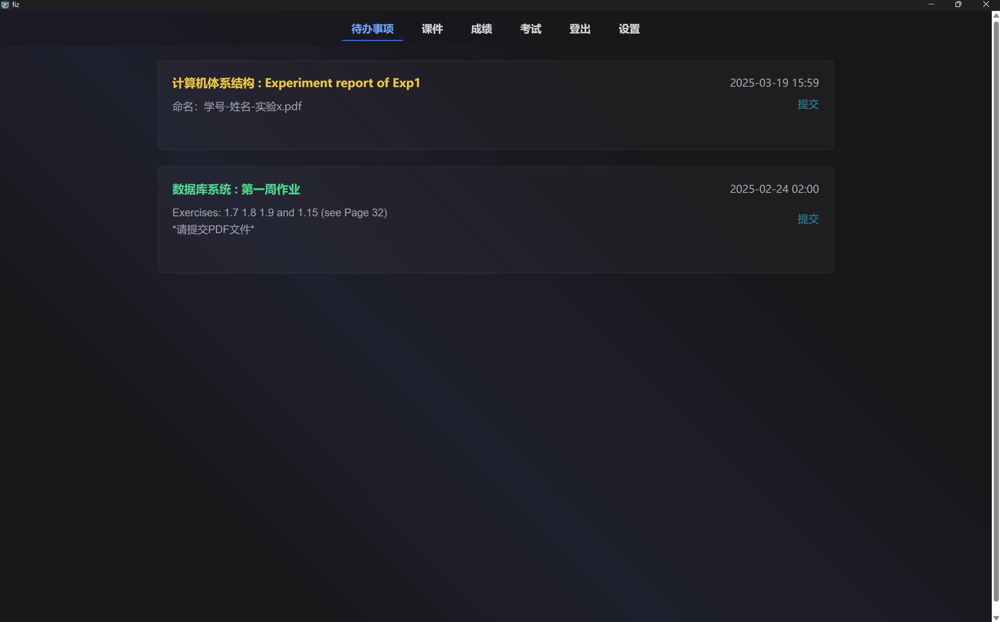
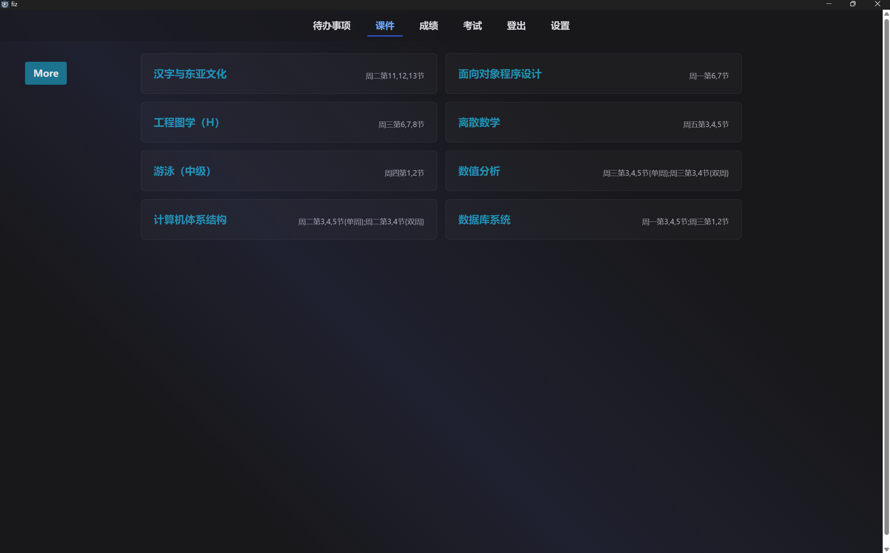
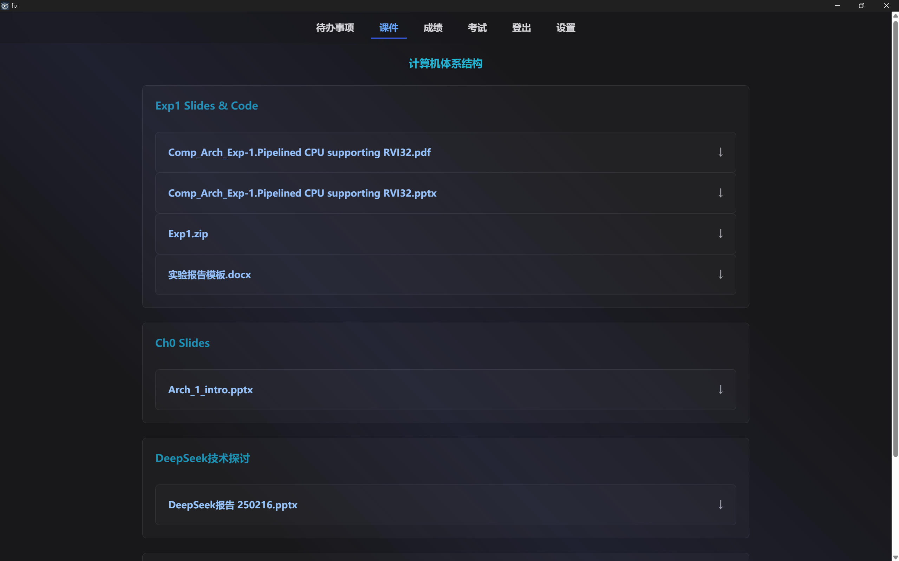
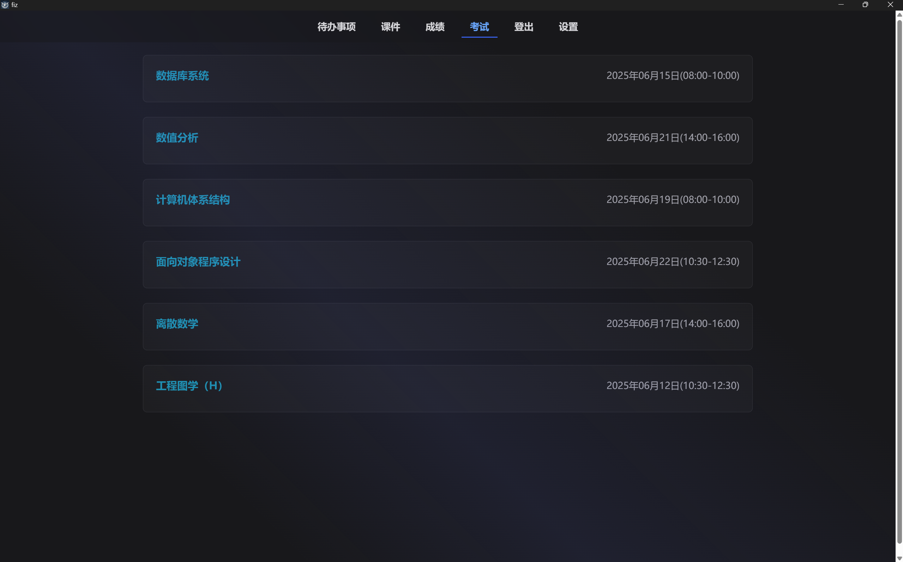

## 欢迎使用 [fiz](https://github.com/CrazySpottedDove/fiz)

* 你是否对雪灾浙大网页的性能感到绝望，想要舍弃雪灾浙大的冗余功能？
* 你是否觉得雪灾浙大的操作逻辑不符合直觉？
* 你是否需要电脑端集成高效的学校平台交互体验，又能下课件交作业，又能查成绩查考试？

O(∩_∩)O~~ 试试 **fiz** ！

>Fire in Zju，即雪灾浙大的第三方 => 火灾浙大

## 功能概览

### 查看并提交作业

### 查看与下载课件

对于`doc, xls, pdf, ppt`文件支持预览。
>更建议的是下载到本地（）

### 查看成绩

>与 ETA（三全育人平台） 同步
>
### 查看考试

>与浙大本科生教务网同步
>
## 安装

在 [Github Release](https://github.com/CrazySpottedDove/fiz/releases/latest) 中提供了不同平台的 windows 版本、macos 版本和 linux 版本。用户可以自行下载。
>fiz 没有电子签名，需要您信任
>
>对于 mac 用户，如果提示 fiz 已损坏，可以在终端运行命令`xattr -cr /path/to/fiz.app`
>
## 效率

* 资源本地化，提升加载速度
* 逻辑并发处理，减少用户点击数，提升体感速度

## 可能的问题

* 不完全同步学在浙大。打开应用时会同步一次信息，之后每五分钟刷新一次。
* 课件的预览暂时没能反映到活动完成度上。
* 本质上服务器和学在浙大的服务器是同一个，所以报错大概率是学在浙大出问题了
* 碍于通信方式，预览性能较差
* 第一次登录 fiz 后有数据本地化的过程，可能有小段时间内容未渲染，无需担忧。
* 课件默认下载目录在用户目录下，请自行在设置中修改，或者修改`YourUserPath/.fiz/.config/config.json`
