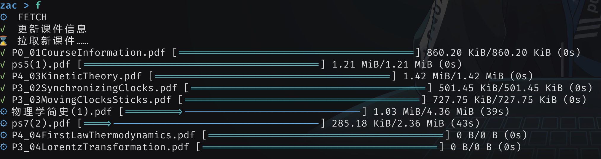
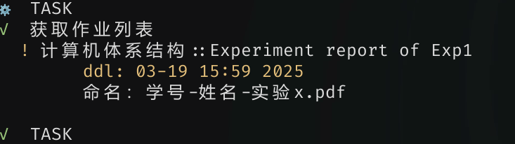

## 欢迎使用 [zac](https://github.com/CrazySpottedDove/zac)

* 你是否对雪灾浙大网页的性能感到绝望，想要舍弃雪灾浙大的冗余功能？
* 你是否对写完作业不能直接`submit .`，还要打开雪灾浙大寻找作业上传感到难受？
* 你是否需要一个工具帮你时刻盯着考试成绩？
* 你是否需要一个工具帮你批量下载课件，哪怕是找不到下载按钮的？
* 你是否想要尝试尝试命令行工具？

O(∩_∩)O~~ **zac** 可以满足以上全部需求！

>项目参考：[zju-learning-assistant](https://github.com/PeiPei233/zju-learning-assistant)

## 功能概览

### 拉取课件



### 查看作业



### 提交作业

### 查看成绩


### 持续查询成绩


## 安装与更新

### 下载

在 [Github Release](https://github.com/CrazySpottedDove/zac/releases/latest) 中提供了不同平台的 windows 版本、macos 版本和 linux 版本。用户可以自行下载(zac 没有电子签名，需要您信任)，并将它添加到白名单。

### 添加到环境变量(可选)

* 对于 windows 用户，可以 `win`+`s` 搜索环境变量，然后在 `高级 -> 环境变量 -> PATH` 中添加 zac 的文件路径。
* 对于类 Unix 系统用户，可以先修改文件名为 `zac` ，然后通过软链接的方式 `sudo ln -s /path/to/zac /usr/local/bin/zac` 将 zac 添加到环境变量。

> 添加到环境变量的好处是以后可以随时在终端中使用 `zac` 。如果你坚持不想这么做且是 windows 用户，那么直接把它当成双击打开的应用也是可以的。

### 更新

zac 内置了自更新功能，每当用户进行联网操作时，它会顺便检查有没有新版本并提示你。

用户可以方便地使用 `zac --update` 命令进行更新。

## 使用方法

第一次使用 `zac` 时，它会引导用户进行基本信息的配置。

用户可以使用 `zac -h` 来获取帮助。或者，当用户直接使用 `zac` 命令时，`zac` 将进入交互模式并直接给出帮助信息。

`zac` 拥有两种工作模式，一次性模式和交互模式。前者适用于单次操作，后者适用于一直挂着，执行多次操作。

### 一次性模式

当使用 `zac [--flag]` 时，`zac` 进入一次性模式，进行单次操作。

```bash
Usage: zac [OPTIONS]

Options:
  -f, --fetch    拉取课件
  -s, --submit   提交作业
  -u, --upgrade  更新课程列表，有新课时用
  -w, --which    选择需要拉取的课程
  -t, --task     查看作业
      --grade    查看所有成绩
  -g             查看本学期成绩
  -p, --polling  持续查询本学期成绩
  -c, --config   配置[用户，存储目录，是否 ppt 转 pdf，是否下载 mp4 文件]
      --update   执行更新
  -h, --help     Print help
  -V, --version  Print version
```

### 交互模式

当直接使用 `zac` 或双击时， `zac` 进入交互模式。

```bash
当前处于交互模式，直接输入子命令即可：
  fetch (f)     拉取课件
  submit (s)    提交作业
  upgrade (u)   更新课程列表，有新课时用
  which (w)     选择需要拉取的课程
  task (t)      查看作业
  grade         查看所有成绩
  g             查看本学期成绩
  polling (p)   持续查询本学期成绩
  config (c)    配置 [用户，存储目录，是否 ppt 转 pdf，是否下载 mp4 文件]
  update        执行更新
  version (v)   显示版本信息
  help (h)      显示此帮助信息
  Ctrl + C      退出 zac
```

## 效率与可靠性

* zac 力求用最少次数的联网操作完成任务，并将所有可以同时进行的操作并行化。因此，它的速度相比雪灾浙大会高上一些。

* zac 的所有命令与路径输入均实现了 `tab/→` 补全功能，力求输入体验流畅。

* zac 工具所有网络请求仅指向雪灾浙大和 Github，其中有关 Github 的网络请求只与更新有关，保证所有个人信息都储存在本地。

* zac 的作业上传功能已通过 3.15 GB zip 文件测试。
