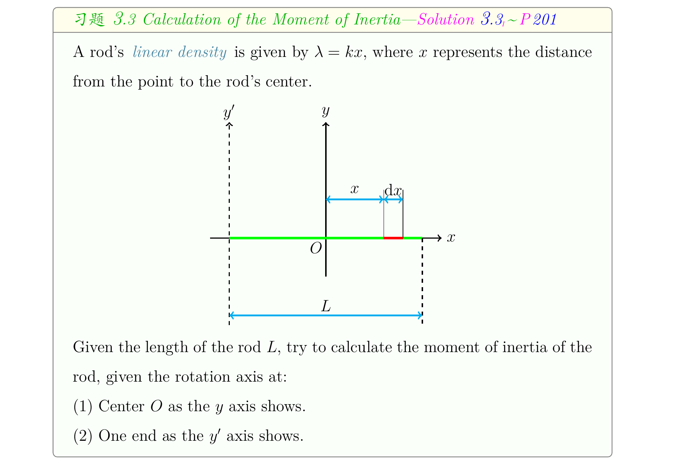

## 欢迎阅读 [ZJU-GPA](https://github.com/CrazySpottedDove/ZJU-G.P.A.)

* 英文好难，不想看 ppt?
* 资料好少，复习好难?
* 小测好杂，内容好广?

试试 ZJU-GPA!

## 介绍

ZJU-GPA 是一份中英混搭的、针对普通物理Ⅰ(H)的学习文档，拥有以下特点：

* 含中/英可交互图层，了解英文同时，可以方便查看中文含义
* 含来/回超链接卡片，不怕跳转之后翻不回去
* 分为正文-习题-证明-答案四部分，各取所需
* 大量使用 tikz 绘图，配图精美
* 提供亮色/暗色版本，各取所爱
* 涵盖全部课程，内容完整

## 预览

## [下载(click me!)](https://github.com/CrazySpottedDove/ZJU-G.P.A./releases/latest)

已知有交互图层效果的 pdf 阅读器有福昕、Adobe、Okular、evince。

如 pdf 阅读器无交互图层效果，请下载 stable 版本。
